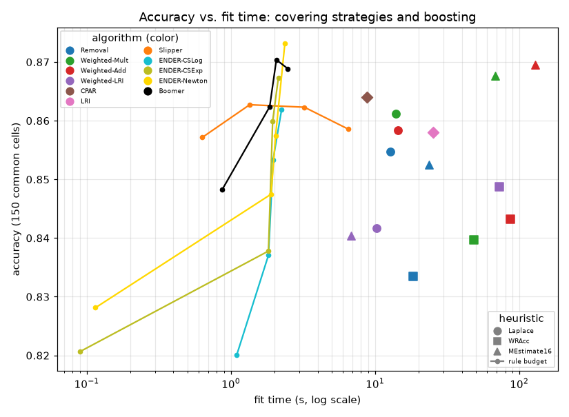

# Covering strategies and boosting

## Setup

**Full run**. Quick sanity check instead: `python demos/covering_boosting.py` with no arguments.

Covering strategies (plain `SeCo`, beam width 5) x heuristics
(`Laplace`, `WRAcc`, m-estimate m=16), plus `CPAR`/`LRI` as complete algorithms, on
molecular-biology_promoters, hepatitis, SPECT, heart-statlog, breast-cancer, heart-h, heart-c, colic, vote, dresses-sales, cylinder-bands, credit-approval, tic-tac-toe, credit-g, kr-vs-kp, sick, mushroom, adult (10-fold; 5-fold for `adult`, the
catalog's one "large" dataset here -- weighted covering and boosting
are no faster on it). Boosting (`Slipper`, `ENDER` x 3 configs,
`Boomer`) on the same datasets/folds, at rule-count budgets
[10, 20, 50, 100].

Each fit is capped at 300s; a time-out or an error counts
as a failure, not as the end of the run, and is excluded from every
mean it would otherwise enter (a "failures" column reports the count
instead).

Measures: accuracy, rule count, conditions per rule, fit time, and
overlap (mean rules covering a test row, pooled across every concept --
see the module docstring for why this isn't restricted to one
"positive" class).

## Section 1: covering strategies

| name | accuracy (own cells) | accuracy (150 common cells) | n_rules | conditions/rule | fit_time (s) | overlap | failures |
|---|--:|--:|--:|--:|--:|--:|--:|
| Removal+Laplace | 0.833 | 0.855 | 81.6 | 2.88 | 12.76 | 2.35 | 5 |
| Removal+WRAcc | 0.812 | 0.833 | 9.0 | 6.11 | 18.47 | 2.19 | 5 |
| Removal+MEstimate16 | 0.830 | 0.852 | 29.8 | 4.48 | 23.63 | 2.09 | 5 |
| Weighted-Mult+Laplace | 0.838 | 0.861 | 61.5 | 2.58 | 13.90 | 3.26 | 5 |
| Weighted-Mult+WRAcc | 0.823 | 0.840 | 35.7 | 6.07 | 48.47 | 10.06 | 15 |
| Weighted-Mult+MEstimate16 | 0.850 | 0.868 | 84.3 | 5.45 | 68.50 | 7.80 | 15 |
| Weighted-Add+Laplace | 0.834 | 0.858 | 48.9 | 2.61 | 14.45 | 2.86 | 4 |
| Weighted-Add+WRAcc | 0.843 | 0.843 | 32.4 | 5.24 | 86.55 | 11.57 | 25 |
| Weighted-Add+MEstimate16 | 0.853 | 0.870 | 61.6 | 5.44 | 128.47 | 8.18 | 15 |
| Weighted-LRI+Laplace | 0.818 | 0.842 | 24.2 | 3.03 | 10.20 | 2.18 | 1 |
| Weighted-LRI+WRAcc | 0.838 | 0.849 | 72.1 | 5.92 | 72.57 | 16.80 | 18 |
| Weighted-LRI+MEstimate16 | 0.814 | 0.840 | 20.2 | 2.53 | 6.83 | 1.59 | 0 |
| CPAR | 0.841 | 0.864 | 185.8 | 4.84 | 8.83 | 8.88 | 5 |
| LRI | 0.841 | 0.858 | 397.2 | 3.89 | 25.43 | 60.40 | 1 |

*Removal+Laplace missing 5 of 175 cells; Removal+WRAcc missing 5 of 175 cells; Removal+MEstimate16 missing 5 of 175 cells; Weighted-Mult+Laplace missing 5 of 175 cells; Weighted-Mult+WRAcc missing 15 of 175 cells; Weighted-Mult+MEstimate16 missing 15 of 175 cells; Weighted-Add+Laplace missing 4 of 175 cells; Weighted-Add+WRAcc missing 25 of 175 cells; Weighted-Add+MEstimate16 missing 15 of 175 cells; Weighted-LRI+Laplace missing 1 of 175 cells; Weighted-LRI+WRAcc missing 18 of 175 cells; CPAR missing 5 of 175 cells; LRI missing 1 of 175 cells (see the "failures" column). "own cells" is each name averaged over whatever (dataset, fold) cells it succeeded on; "150 common cells" restricts every name to the same cells, for a fair comparison.*

### Mean rank

| name | mean rank |
|---|--:|
| Weighted-Mult+MEstimate16 | 5.06 |
| Weighted-Add+MEstimate16 | 5.08 |
| LRI | 5.36 |
| CPAR | 5.72 |
| Weighted-Mult+Laplace | 6.72 |
| Removal+Laplace | 7.08 |
| Removal+MEstimate16 | 7.31 |
| Weighted-LRI+WRAcc | 7.42 |
| Weighted-Add+Laplace | 7.64 |
| Weighted-LRI+MEstimate16 | 8.39 |
| Weighted-LRI+Laplace | 9.00 |
| Weighted-Add+WRAcc | 9.44 |
| Removal+WRAcc | 10.14 |
| Weighted-Mult+WRAcc | 10.64 |

### Per-dataset results (mean across folds)

| dataset | learner | accuracy | n_rules | fit_time | overlap |
|---|---|---|---|---|---|
| SPECT | CPAR | 0.828 | 107.800 | 0.053 | 10.453 |
| SPECT | LRI | 0.808 | 399.800 | 0.261 | 49.585 |
| SPECT | Removal+Laplace | 0.824 | 49.300 | 1.400 | 3.862 |
| SPECT | Removal+MEstimate16 | 0.813 | 19.800 | 1.151 | 2.507 |
| SPECT | Removal+WRAcc | 0.794 | 9.600 | 0.420 | 2.698 |
| SPECT | Weighted-Add+Laplace | 0.850 | 35.300 | 2.216 | 3.788 |
| SPECT | Weighted-Add+MEstimate16 | 0.846 | 50.800 | 6.796 | 8.880 |
| SPECT | Weighted-Add+WRAcc | 0.846 | 29.400 | 2.953 | 8.182 |
| SPECT | Weighted-LRI+Laplace | 0.793 | 33.200 | 1.758 | 2.588 |
| SPECT | Weighted-LRI+MEstimate16 | 0.779 | 28.000 | 1.646 | 2.221 |
| SPECT | Weighted-LRI+WRAcc | 0.832 | 66.700 | 3.594 | 12.458 |
| SPECT | Weighted-Mult+Laplace | 0.846 | 48.100 | 3.425 | 4.815 |
| SPECT | Weighted-Mult+MEstimate16 | 0.839 | 71.700 | 5.214 | 9.484 |
| SPECT | Weighted-Mult+WRAcc | 0.790 | 49.000 | 2.392 | 10.866 |
| adult | CPAR | n/a | n/a | 300.625 | n/a |
| adult | LRI | 0.868 | 400.000 | 839.371 | 59.170 |
| adult | Removal+Laplace | n/a | n/a | 304.075 | n/a |
| adult | Removal+MEstimate16 | n/a | n/a | 300.293 | n/a |
| adult | Removal+WRAcc | n/a | n/a | 300.228 | n/a |
| adult | Weighted-Add+Laplace | 0.814 | 83.000 | 299.397 | 1.894 |
| adult | Weighted-Add+MEstimate16 | n/a | n/a | 300.289 | n/a |
| adult | Weighted-Add+WRAcc | n/a | n/a | 300.215 | n/a |
| adult | Weighted-LRI+Laplace | 0.803 | 27.500 | 221.794 | 0.686 |
| adult | Weighted-LRI+MEstimate16 | 0.803 | 19.600 | 118.425 | 0.256 |
| adult | Weighted-LRI+WRAcc | n/a | n/a | 300.214 | n/a |
| adult | Weighted-Mult+Laplace | n/a | n/a | 300.203 | n/a |
| adult | Weighted-Mult+MEstimate16 | n/a | n/a | 300.294 | n/a |
| adult | Weighted-Mult+WRAcc | n/a | n/a | 300.205 | n/a |
| breast-cancer | CPAR | 0.734 | 216.100 | 0.107 | 10.753 |
| breast-cancer | LRI | 0.713 | 394.800 | 0.201 | 60.983 |
| breast-cancer | Removal+Laplace | 0.671 | 85.300 | 1.855 | 1.739 |
| breast-cancer | Removal+MEstimate16 | 0.683 | 32.000 | 3.526 | 1.894 |
| breast-cancer | Removal+WRAcc | 0.717 | 8.900 | 1.891 | 2.376 |
| breast-cancer | Weighted-Add+Laplace | 0.717 | 58.400 | 2.337 | 2.232 |
| breast-cancer | Weighted-Add+MEstimate16 | 0.745 | 100.400 | 24.054 | 10.365 |
| breast-cancer | Weighted-Add+WRAcc | 0.734 | 55.300 | 27.995 | 19.774 |
| breast-cancer | Weighted-LRI+Laplace | 0.692 | 26.300 | 2.100 | 1.284 |
| breast-cancer | Weighted-LRI+MEstimate16 | 0.685 | 21.300 | 1.299 | 0.669 |
| breast-cancer | Weighted-LRI+WRAcc | 0.727 | 96.300 | 20.057 | 22.568 |
| breast-cancer | Weighted-Mult+Laplace | 0.720 | 70.500 | 2.299 | 2.264 |
| breast-cancer | Weighted-Mult+MEstimate16 | 0.734 | 115.100 | 16.466 | 9.249 |
| breast-cancer | Weighted-Mult+WRAcc | 0.720 | 40.200 | 8.876 | 11.670 |
| colic | CPAR | 0.840 | 157.000 | 0.095 | 9.913 |
| colic | LRI | 0.854 | 400.000 | 0.382 | 63.645 |
| colic | Removal+Laplace | 0.829 | 79.200 | 3.565 | 3.234 |
| colic | Removal+MEstimate16 | 0.845 | 26.000 | 6.643 | 2.862 |
| colic | Removal+WRAcc | 0.864 | 10.400 | 3.369 | 2.244 |
| colic | Weighted-Add+Laplace | 0.818 | 70.500 | 7.027 | 4.244 |
| colic | Weighted-Add+MEstimate16 | 0.867 | 71.800 | 88.635 | 11.575 |
| colic | Weighted-Add+WRAcc | 0.837 | 30.500 | 79.301 | 9.076 |
| colic | Weighted-LRI+Laplace | 0.807 | 32.900 | 4.866 | 2.609 |
| colic | Weighted-LRI+MEstimate16 | 0.805 | 21.900 | 3.612 | 1.426 |
| colic | Weighted-LRI+WRAcc | 0.851 | 80.400 | 32.840 | 15.165 |
| colic | Weighted-Mult+Laplace | 0.815 | 70.800 | 5.391 | 3.603 |
| colic | Weighted-Mult+MEstimate16 | 0.837 | 91.300 | 44.283 | 8.248 |
| colic | Weighted-Mult+WRAcc | 0.837 | 42.900 | 24.142 | 9.025 |
| credit-approval | CPAR | 0.852 | 367.500 | 0.177 | 15.558 |
| credit-approval | LRI | 0.870 | 398.700 | 0.332 | 58.554 |
| credit-approval | Removal+Laplace | 0.825 | 120.000 | 4.770 | 2.441 |
| credit-approval | Removal+MEstimate16 | 0.854 | 34.500 | 15.694 | 2.564 |
| credit-approval | Removal+WRAcc | 0.836 | 9.000 | 4.282 | 2.354 |
| credit-approval | Weighted-Add+Laplace | 0.848 | 69.200 | 5.809 | 5.072 |
| credit-approval | Weighted-Add+MEstimate16 | 0.865 | 78.800 | 906.000 | 15.029 |
| credit-approval | Weighted-Add+WRAcc | 0.858 | 43.700 | 121.362 | 18.648 |
| credit-approval | Weighted-LRI+Laplace | 0.759 | 31.200 | 4.225 | 3.441 |
| credit-approval | Weighted-LRI+MEstimate16 | 0.793 | 17.800 | 4.053 | 1.430 |
| credit-approval | Weighted-LRI+WRAcc | 0.864 | 90.700 | 51.730 | 20.629 |
| credit-approval | Weighted-Mult+Laplace | 0.838 | 81.400 | 4.762 | 4.162 |
| credit-approval | Weighted-Mult+MEstimate16 | 0.861 | 134.900 | 95.312 | 12.814 |
| credit-approval | Weighted-Mult+WRAcc | 0.851 | 44.400 | 29.004 | 13.501 |
| credit-g | CPAR | 0.744 | 523.300 | 0.420 | 10.598 |
| credit-g | LRI | 0.762 | 400.000 | 1.742 | 58.365 |
| credit-g | Removal+Laplace | 0.744 | 232.100 | 12.252 | 2.266 |
| credit-g | Removal+MEstimate16 | 0.730 | 76.400 | 29.203 | 1.822 |
| credit-g | Removal+WRAcc | 0.717 | 13.000 | 9.019 | 2.980 |
| credit-g | Weighted-Add+Laplace | 0.736 | 102.300 | 7.150 | 2.178 |
| credit-g | Weighted-Add+MEstimate16 | 0.751 | 158.600 | 83.097 | 7.454 |
| credit-g | Weighted-Add+WRAcc | 0.712 | 117.200 | 139.698 | 37.609 |
| credit-g | Weighted-LRI+Laplace | 0.727 | 25.300 | 3.542 | 0.744 |
| credit-g | Weighted-LRI+MEstimate16 | 0.740 | 21.100 | 4.625 | 0.524 |
| credit-g | Weighted-LRI+WRAcc | 0.703 | 100.000 | 72.578 | 21.492 |
| credit-g | Weighted-Mult+Laplace | 0.752 | 133.500 | 7.275 | 2.538 |
| credit-g | Weighted-Mult+MEstimate16 | 0.751 | 190.200 | 84.535 | 6.251 |
| credit-g | Weighted-Mult+WRAcc | 0.708 | 52.200 | 40.694 | 13.960 |
| cylinder-bands | CPAR | 0.770 | 284.800 | 1.602 | 10.919 |
| cylinder-bands | LRI | 0.822 | 399.400 | 2.068 | 56.189 |
| cylinder-bands | Removal+Laplace | 0.748 | 155.500 | 13.507 | 1.665 |
| cylinder-bands | Removal+MEstimate16 | 0.744 | 49.900 | 112.345 | 1.554 |
| cylinder-bands | Removal+WRAcc | 0.737 | 9.000 | 104.283 | 2.224 |
| cylinder-bands | Weighted-Add+Laplace | 0.717 | 75.500 | 9.343 | 1.354 |
| cylinder-bands | Weighted-Add+MEstimate16 | n/a | n/a | 300.268 | n/a |
| cylinder-bands | Weighted-Add+WRAcc | n/a | n/a | 300.217 | n/a |
| cylinder-bands | Weighted-LRI+Laplace | 0.659 | 21.600 | 7.607 | 0.746 |
| cylinder-bands | Weighted-LRI+MEstimate16 | 0.659 | 17.400 | 5.587 | 0.417 |
| cylinder-bands | Weighted-LRI+WRAcc | n/a | n/a | 300.207 | n/a |
| cylinder-bands | Weighted-Mult+Laplace | 0.722 | 88.900 | 6.673 | 1.441 |
| cylinder-bands | Weighted-Mult+MEstimate16 | n/a | n/a | 300.293 | n/a |
| cylinder-bands | Weighted-Mult+WRAcc | n/a | n/a | 300.212 | n/a |
| dresses-sales | CPAR | 0.570 | 659.000 | 0.869 | 12.954 |
| dresses-sales | LRI | 0.588 | 394.500 | 1.304 | 58.566 |
| dresses-sales | Removal+Laplace | 0.596 | 226.300 | 12.722 | 1.562 |
| dresses-sales | Removal+MEstimate16 | 0.576 | 71.000 | 53.479 | 1.656 |
| dresses-sales | Removal+WRAcc | 0.562 | 12.200 | 29.831 | 2.860 |
| dresses-sales | Weighted-Add+Laplace | 0.586 | 80.300 | 3.223 | 0.654 |
| dresses-sales | Weighted-Add+MEstimate16 | 0.602 | 139.700 | 190.854 | 4.834 |
| dresses-sales | Weighted-Add+WRAcc | n/a | n/a | 300.225 | n/a |
| dresses-sales | Weighted-LRI+Laplace | 0.622 | 28.200 | 6.318 | 0.562 |
| dresses-sales | Weighted-LRI+MEstimate16 | 0.580 | 27.000 | 3.456 | 0.330 |
| dresses-sales | Weighted-LRI+WRAcc | 0.609 | 99.429 | 284.959 | 22.089 |
| dresses-sales | Weighted-Mult+Laplace | 0.614 | 87.000 | 3.350 | 0.744 |
| dresses-sales | Weighted-Mult+MEstimate16 | 0.592 | 165.800 | 191.498 | 4.940 |
| dresses-sales | Weighted-Mult+WRAcc | 0.566 | 49.400 | 145.689 | 12.902 |
| heart-c | CPAR | 0.805 | 141.900 | 0.068 | 10.361 |
| heart-c | LRI | 0.802 | 399.100 | 0.222 | 59.445 |
| heart-c | Removal+Laplace | 0.812 | 58.600 | 1.845 | 2.562 |
| heart-c | Removal+MEstimate16 | 0.782 | 20.700 | 3.715 | 2.062 |
| heart-c | Removal+WRAcc | 0.766 | 8.300 | 1.909 | 2.098 |
| heart-c | Weighted-Add+Laplace | 0.796 | 51.200 | 4.083 | 3.772 |
| heart-c | Weighted-Add+MEstimate16 | 0.806 | 68.700 | 46.571 | 14.313 |
| heart-c | Weighted-Add+WRAcc | 0.769 | 27.600 | 38.070 | 10.923 |
| heart-c | Weighted-LRI+Laplace | 0.779 | 25.200 | 2.779 | 2.580 |
| heart-c | Weighted-LRI+MEstimate16 | 0.795 | 20.100 | 2.388 | 1.656 |
| heart-c | Weighted-LRI+WRAcc | 0.799 | 88.400 | 21.840 | 20.674 |
| heart-c | Weighted-Mult+Laplace | 0.802 | 66.300 | 3.587 | 3.951 |
| heart-c | Weighted-Mult+MEstimate16 | 0.800 | 82.600 | 22.937 | 10.704 |
| heart-c | Weighted-Mult+WRAcc | 0.789 | 33.500 | 9.957 | 12.574 |
| heart-h | CPAR | 0.810 | 166.800 | 0.083 | 10.742 |
| heart-h | LRI | 0.813 | 395.600 | 0.222 | 56.469 |
| heart-h | Removal+Laplace | 0.789 | 58.400 | 2.007 | 2.221 |
| heart-h | Removal+MEstimate16 | 0.826 | 21.100 | 4.749 | 1.967 |
| heart-h | Removal+WRAcc | 0.785 | 7.900 | 2.211 | 1.928 |
| heart-h | Weighted-Add+Laplace | 0.789 | 34.700 | 2.450 | 2.518 |
| heart-h | Weighted-Add+MEstimate16 | 0.796 | 56.300 | 58.549 | 11.328 |
| heart-h | Weighted-Add+WRAcc | 0.775 | 29.900 | 64.907 | 13.784 |
| heart-h | Weighted-LRI+Laplace | 0.799 | 25.100 | 4.026 | 2.573 |
| heart-h | Weighted-LRI+MEstimate16 | 0.803 | 17.600 | 1.570 | 1.429 |
| heart-h | Weighted-LRI+WRAcc | 0.813 | 83.300 | 29.675 | 19.097 |
| heart-h | Weighted-Mult+Laplace | 0.789 | 36.100 | 1.601 | 2.321 |
| heart-h | Weighted-Mult+MEstimate16 | 0.803 | 78.200 | 28.443 | 10.122 |
| heart-h | Weighted-Mult+WRAcc | 0.762 | 36.300 | 12.717 | 12.830 |
| heart-statlog | CPAR | 0.822 | 126.400 | 0.066 | 9.448 |
| heart-statlog | LRI | 0.756 | 399.700 | 0.230 | 59.959 |
| heart-statlog | Removal+Laplace | 0.785 | 50.400 | 1.673 | 2.452 |
| heart-statlog | Removal+MEstimate16 | 0.781 | 18.500 | 3.858 | 2.052 |
| heart-statlog | Removal+WRAcc | 0.781 | 8.400 | 2.132 | 2.163 |
| heart-statlog | Weighted-Add+Laplace | 0.800 | 52.000 | 3.646 | 3.867 |
| heart-statlog | Weighted-Add+MEstimate16 | 0.800 | 61.600 | 63.917 | 12.796 |
| heart-statlog | Weighted-Add+WRAcc | 0.781 | 33.400 | 38.917 | 13.059 |
| heart-statlog | Weighted-LRI+Laplace | 0.781 | 26.900 | 3.049 | 2.844 |
| heart-statlog | Weighted-LRI+MEstimate16 | 0.793 | 22.600 | 2.748 | 1.904 |
| heart-statlog | Weighted-LRI+WRAcc | 0.804 | 88.600 | 24.786 | 21.041 |
| heart-statlog | Weighted-Mult+Laplace | 0.804 | 62.500 | 3.172 | 3.893 |
| heart-statlog | Weighted-Mult+MEstimate16 | 0.804 | 72.900 | 25.693 | 10.507 |
| heart-statlog | Weighted-Mult+WRAcc | 0.744 | 33.400 | 10.365 | 12.407 |
| hepatitis | CPAR | 0.807 | 69.700 | 0.031 | 8.433 |
| hepatitis | LRI | 0.809 | 399.000 | 0.218 | 68.167 |
| hepatitis | Removal+Laplace | 0.814 | 24.500 | 0.536 | 2.583 |
| hepatitis | Removal+MEstimate16 | 0.762 | 14.300 | 1.122 | 2.595 |
| hepatitis | Removal+WRAcc | 0.813 | 7.800 | 1.066 | 2.595 |
| hepatitis | Weighted-Add+Laplace | 0.826 | 23.600 | 2.416 | 3.775 |
| hepatitis | Weighted-Add+MEstimate16 | 0.832 | 38.300 | 21.855 | 10.107 |
| hepatitis | Weighted-Add+WRAcc | 0.813 | 25.200 | 13.208 | 11.883 |
| hepatitis | Weighted-LRI+Laplace | 0.852 | 20.800 | 1.754 | 3.881 |
| hepatitis | Weighted-LRI+MEstimate16 | 0.833 | 17.100 | 1.712 | 2.385 |
| hepatitis | Weighted-LRI+WRAcc | 0.839 | 63.100 | 8.738 | 15.903 |
| hepatitis | Weighted-Mult+Laplace | 0.846 | 29.300 | 2.116 | 4.188 |
| hepatitis | Weighted-Mult+MEstimate16 | 0.819 | 45.800 | 7.646 | 8.858 |
| hepatitis | Weighted-Mult+WRAcc | 0.806 | 30.700 | 4.798 | 10.407 |
| kr-vs-kp | CPAR | 0.993 | 50.600 | 0.106 | 3.751 |
| kr-vs-kp | LRI | 0.991 | 399.700 | 2.270 | 62.610 |
| kr-vs-kp | Removal+Laplace | 0.993 | 68.600 | 2.598 | 2.155 |
| kr-vs-kp | Removal+MEstimate16 | 0.992 | 32.300 | 4.451 | 1.731 |
| kr-vs-kp | Removal+WRAcc | 0.947 | 7.500 | 1.242 | 1.621 |
| kr-vs-kp | Weighted-Add+Laplace | 0.970 | 26.500 | 3.265 | 1.572 |
| kr-vs-kp | Weighted-Add+MEstimate16 | 0.985 | 26.200 | 27.772 | 2.573 |
| kr-vs-kp | Weighted-Add+WRAcc | 0.925 | 10.100 | 26.121 | 4.153 |
| kr-vs-kp | Weighted-LRI+Laplace | 0.923 | 11.900 | 1.827 | 1.230 |
| kr-vs-kp | Weighted-LRI+MEstimate16 | 0.861 | 16.600 | 2.000 | 1.121 |
| kr-vs-kp | Weighted-LRI+WRAcc | 0.959 | 35.000 | 14.848 | 9.196 |
| kr-vs-kp | Weighted-Mult+Laplace | 0.984 | 44.300 | 3.228 | 1.863 |
| kr-vs-kp | Weighted-Mult+MEstimate16 | 0.994 | 56.500 | 38.116 | 4.243 |
| kr-vs-kp | Weighted-Mult+WRAcc | 0.922 | 18.000 | 6.945 | 8.095 |
| molecular-biology_promoters | CPAR | 0.804 | 31.500 | 0.023 | 5.273 |
| molecular-biology_promoters | LRI | 0.775 | 395.000 | 0.220 | 65.525 |
| molecular-biology_promoters | Removal+Laplace | 0.821 | 11.900 | 1.330 | 1.608 |
| molecular-biology_promoters | Removal+MEstimate16 | 0.794 | 6.900 | 1.395 | 1.468 |
| molecular-biology_promoters | Removal+WRAcc | 0.749 | 5.100 | 2.022 | 1.187 |
| molecular-biology_promoters | Weighted-Add+Laplace | 0.850 | 21.800 | 16.097 | 3.316 |
| molecular-biology_promoters | Weighted-Add+MEstimate16 | 0.841 | 19.800 | 17.655 | 5.131 |
| molecular-biology_promoters | Weighted-Add+WRAcc | 0.859 | 16.400 | 15.650 | 5.450 |
| molecular-biology_promoters | Weighted-LRI+Laplace | 0.868 | 25.200 | 10.188 | 4.026 |
| molecular-biology_promoters | Weighted-LRI+MEstimate16 | 0.851 | 27.200 | 9.466 | 4.905 |
| molecular-biology_promoters | Weighted-LRI+WRAcc | 0.785 | 74.200 | 42.101 | 21.005 |
| molecular-biology_promoters | Weighted-Mult+Laplace | 0.822 | 42.500 | 15.226 | 5.314 |
| molecular-biology_promoters | Weighted-Mult+MEstimate16 | 0.841 | 25.900 | 6.787 | 6.260 |
| molecular-biology_promoters | Weighted-Mult+WRAcc | 0.850 | 21.700 | 10.546 | 6.438 |
| mushroom | CPAR | 1.000 | 21.300 | 0.180 | 5.137 |
| mushroom | LRI | 1.000 | 386.900 | 10.780 | 67.679 |
| mushroom | Removal+Laplace | 1.000 | 23.000 | 0.971 | 1.546 |
| mushroom | Removal+MEstimate16 | 1.000 | 18.600 | 1.101 | 1.625 |
| mushroom | Removal+WRAcc | 1.000 | 4.500 | 3.465 | 1.053 |
| mushroom | Weighted-Add+Laplace | 0.990 | 15.100 | 5.456 | 0.937 |
| mushroom | Weighted-Add+MEstimate16 | 0.990 | 19.000 | 21.196 | 2.732 |
| mushroom | Weighted-Add+WRAcc | 0.998 | 4.900 | 65.941 | 2.025 |
| mushroom | Weighted-LRI+Laplace | 0.957 | 9.000 | 2.758 | 0.847 |
| mushroom | Weighted-LRI+MEstimate16 | 0.957 | 9.000 | 4.030 | 0.847 |
| mushroom | Weighted-LRI+WRAcc | 0.999 | 31.600 | 149.013 | 11.528 |
| mushroom | Weighted-Mult+Laplace | 0.998 | 25.100 | 5.831 | 1.674 |
| mushroom | Weighted-Mult+MEstimate16 | 1.000 | 28.200 | 29.956 | 4.047 |
| mushroom | Weighted-Mult+WRAcc | 0.998 | 8.300 | 40.866 | 3.314 |
| sick | CPAR | 0.984 | 143.600 | 0.351 | 7.300 |
| sick | LRI | 0.986 | 389.400 | 4.372 | 67.815 |
| sick | Removal+Laplace | 0.979 | 86.900 | 9.475 | 2.704 |
| sick | Removal+MEstimate16 | 0.980 | 30.100 | 20.104 | 2.865 |
| sick | Removal+WRAcc | 0.972 | 10.600 | 5.453 | 2.171 |
| sick | Weighted-Add+Laplace | 0.979 | 39.400 | 24.047 | 3.081 |
| sick | Weighted-Add+MEstimate16 | 0.981 | 44.200 | 232.828 | 6.308 |
| sick | Weighted-Add+WRAcc | 0.976 | 20.000 | 125.053 | 8.301 |
| sick | Weighted-LRI+Laplace | 0.974 | 23.100 | 8.417 | 2.184 |
| sick | Weighted-LRI+MEstimate16 | 0.980 | 17.300 | 9.221 | 0.674 |
| sick | Weighted-LRI+WRAcc | 0.968 | 60.900 | 58.237 | 10.402 |
| sick | Weighted-Mult+Laplace | 0.980 | 66.900 | 20.781 | 4.713 |
| sick | Weighted-Mult+MEstimate16 | 0.976 | 97.600 | 145.628 | 9.385 |
| sick | Weighted-Mult+WRAcc | 0.957 | 41.500 | 48.052 | 9.822 |
| tic-tac-toe | CPAR | 0.983 | 57.200 | 0.043 | 2.942 |
| tic-tac-toe | LRI | 0.976 | 400.000 | 0.304 | 52.881 |
| tic-tac-toe | Removal+Laplace | 0.983 | 28.600 | 0.539 | 1.304 |
| tic-tac-toe | Removal+MEstimate16 | 0.990 | 20.900 | 0.706 | 1.300 |
| tic-tac-toe | Removal+WRAcc | 0.812 | 12.300 | 0.453 | 2.397 |
| tic-tac-toe | Weighted-Add+Laplace | 0.969 | 52.600 | 3.029 | 2.732 |
| tic-tac-toe | Weighted-Add+MEstimate16 | 0.979 | 35.300 | 5.206 | 2.504 |
| tic-tac-toe | Weighted-Add+WRAcc | 0.839 | 32.400 | 3.296 | 6.489 |
| tic-tac-toe | Weighted-LRI+Laplace | 0.974 | 26.200 | 1.533 | 1.585 |
| tic-tac-toe | Weighted-LRI+MEstimate16 | 0.975 | 24.500 | 2.246 | 1.595 |
| tic-tac-toe | Weighted-LRI+WRAcc | 0.836 | 60.000 | 3.398 | 15.478 |
| tic-tac-toe | Weighted-Mult+Laplace | 0.974 | 57.100 | 3.096 | 2.779 |
| tic-tac-toe | Weighted-Mult+MEstimate16 | 0.997 | 51.000 | 4.386 | 2.873 |
| tic-tac-toe | Weighted-Mult+WRAcc | 0.909 | 38.800 | 1.773 | 6.635 |
| vote | CPAR | 0.954 | 34.600 | 0.020 | 6.485 |
| vote | LRI | 0.954 | 400.000 | 0.255 | 60.891 |
| vote | Removal+Laplace | 0.952 | 28.100 | 0.301 | 4.058 |
| vote | Removal+MEstimate16 | 0.954 | 13.600 | 0.154 | 3.089 |
| vote | Removal+WRAcc | 0.947 | 8.300 | 0.061 | 2.311 |
| vote | Weighted-Add+Laplace | 0.938 | 19.800 | 1.512 | 3.708 |
| vote | Weighted-Add+MEstimate16 | 0.959 | 16.600 | 2.824 | 4.921 |
| vote | Weighted-Add+WRAcc | 0.924 | 9.600 | 1.625 | 4.155 |
| vote | Weighted-LRI+Laplace | 0.938 | 18.100 | 0.898 | 3.966 |
| vote | Weighted-LRI+MEstimate16 | 0.957 | 17.900 | 0.674 | 4.249 |
| vote | Weighted-LRI+WRAcc | 0.952 | 43.500 | 1.266 | 11.731 |
| vote | Weighted-Mult+Laplace | 0.947 | 34.800 | 1.391 | 5.226 |
| vote | Weighted-Mult+MEstimate16 | 0.959 | 41.400 | 1.394 | 6.862 |
| vote | Weighted-Mult+WRAcc | 0.952 | 31.200 | 1.038 | 6.472 |

## Section 2: boosting

| family | budget | accuracy (own cells) | accuracy (150 common cells) | n_rules (actual) | fit_time (s) | failures |
|---|--:|--:|--:|--:|--:|--:|
| Slipper | 10 | 0.833 | 0.857 | 7.6 | 0.63 | 0 |
| Slipper | 20 | 0.838 | 0.863 | 13.7 | 1.35 | 0 |
| Slipper | 50 | 0.840 | 0.862 | 28.4 | 3.24 | 0 |
| Slipper | 100 | 0.838 | 0.859 | 47.1 | 6.54 | 0 |
| ENDER-CSLog | 10 | 0.791 | 0.820 | 9.6 | 1.10 | 0 |
| ENDER-CSLog | 20 | 0.814 | 0.837 | 17.4 | 1.83 | 1 |
| ENDER-CSLog | 50 | 0.833 | 0.853 | 41.9 | 1.96 | 1 |
| ENDER-CSLog | 100 | 0.842 | 0.862 | 82.9 | 2.25 | 1 |
| ENDER-CSExp | 10 | 0.792 | 0.821 | 9.9 | 0.09 | 0 |
| ENDER-CSExp | 20 | 0.812 | 0.838 | 18.3 | 1.82 | 1 |
| ENDER-CSExp | 50 | 0.838 | 0.860 | 43.6 | 1.95 | 1 |
| ENDER-CSExp | 100 | 0.847 | 0.867 | 84.4 | 2.14 | 1 |
| ENDER-Newton | 10 | 0.802 | 0.828 | 9.5 | 0.12 | 0 |
| ENDER-Newton | 20 | 0.821 | 0.847 | 17.1 | 1.90 | 1 |
| ENDER-Newton | 50 | 0.836 | 0.857 | 40.0 | 2.04 | 1 |
| ENDER-Newton | 100 | 0.852 | 0.873 | 76.0 | 2.37 | 1 |
| Boomer | 10 | 0.826 | 0.848 | 9.1 | 0.87 | 0 |
| Boomer | 20 | 0.843 | 0.862 | 16.6 | 1.86 | 1 |
| Boomer | 50 | 0.850 | 0.870 | 35.2 | 2.07 | 1 |
| Boomer | 100 | 0.849 | 0.869 | 60.2 | 2.48 | 1 |

*ENDER-CSLog@20 missing 1 of 175 cells; ENDER-CSLog@50 missing 1 of 175 cells; ENDER-CSLog@100 missing 1 of 175 cells; ENDER-CSExp@20 missing 1 of 175 cells; ENDER-CSExp@50 missing 1 of 175 cells; ENDER-CSExp@100 missing 1 of 175 cells; ENDER-Newton@20 missing 1 of 175 cells; ENDER-Newton@50 missing 1 of 175 cells; ENDER-Newton@100 missing 1 of 175 cells; Boomer@20 missing 1 of 175 cells; Boomer@50 missing 1 of 175 cells; Boomer@100 missing 1 of 175 cells. "own cells" is each name averaged over whatever (dataset, fold) cells it succeeded on; "150 common cells" is the same cell subset section 1's summary table uses, so the two tables' accuracy columns are directly comparable (see the "failures" column).*

### Per-dataset results (mean across folds)

| dataset | learner | accuracy | n_rules | fit_time |
|---|---|---|---|---|
| SPECT | Boomer@10 | 0.828 | 9.200 | 0.006 |
| SPECT | Boomer@100 | 0.835 | 46.700 | 0.028 |
| SPECT | Boomer@20 | 0.839 | 14.800 | 0.009 |
| SPECT | Boomer@50 | 0.835 | 28.800 | 0.016 |
| SPECT | ENDER-CSExp@10 | 0.794 | 9.700 | 0.004 |
| SPECT | ENDER-CSExp@100 | 0.850 | 53.900 | 0.021 |
| SPECT | ENDER-CSExp@20 | 0.794 | 16.200 | 0.006 |
| SPECT | ENDER-CSExp@50 | 0.832 | 32.200 | 0.013 |
| SPECT | ENDER-CSLog@10 | 0.794 | 9.600 | 0.005 |
| SPECT | ENDER-CSLog@100 | 0.843 | 62.300 | 0.027 |
| SPECT | ENDER-CSLog@20 | 0.794 | 15.900 | 0.008 |
| SPECT | ENDER-CSLog@50 | 0.843 | 33.100 | 0.015 |
| SPECT | ENDER-Newton@10 | 0.794 | 10.300 | 0.006 |
| SPECT | ENDER-Newton@100 | 0.850 | 68.100 | 0.040 |
| SPECT | ENDER-Newton@20 | 0.794 | 17.600 | 0.008 |
| SPECT | ENDER-Newton@50 | 0.839 | 38.100 | 0.016 |
| SPECT | Slipper@10 | 0.846 | 6.000 | 0.054 |
| SPECT | Slipper@100 | 0.816 | 43.700 | 0.504 |
| SPECT | Slipper@20 | 0.827 | 11.300 | 0.114 |
| SPECT | Slipper@50 | 0.824 | 26.000 | 0.245 |
| adult | Boomer@10 | 0.833 | 11.000 | 28.707 |
| adult | Boomer@100 | 0.866 | 99.500 | 80.300 |
| adult | Boomer@20 | 0.855 | 20.750 | 62.903 |
| adult | Boomer@50 | 0.862 | 49.750 | 68.567 |
| adult | ENDER-CSExp@10 | 0.761 | 10.800 | 1.552 |
| adult | ENDER-CSExp@100 | 0.857 | 99.250 | 69.366 |
| adult | ENDER-CSExp@20 | 0.808 | 20.750 | 62.013 |
| adult | ENDER-CSExp@50 | 0.847 | 50.000 | 65.090 |
| adult | ENDER-CSLog@10 | 0.761 | 10.600 | 36.752 |
| adult | ENDER-CSLog@100 | 0.856 | 95.750 | 70.443 |
| adult | ENDER-CSLog@20 | 0.819 | 20.000 | 62.364 |
| adult | ENDER-CSLog@50 | 0.846 | 47.000 | 64.800 |
| adult | ENDER-Newton@10 | 0.783 | 10.400 | 2.275 |
| adult | ENDER-Newton@100 | 0.859 | 96.000 | 76.337 |
| adult | ENDER-Newton@20 | 0.802 | 19.500 | 64.574 |
| adult | ENDER-Newton@50 | 0.850 | 47.750 | 67.484 |
| adult | Slipper@10 | 0.854 | 7.200 | 15.937 |
| adult | Slipper@100 | 0.866 | 69.800 | 177.435 |
| adult | Slipper@20 | 0.861 | 14.200 | 35.869 |
| adult | Slipper@50 | 0.867 | 36.200 | 86.587 |
| breast-cancer | Boomer@10 | 0.724 | 9.800 | 0.011 |
| breast-cancer | Boomer@100 | 0.682 | 57.700 | 0.038 |
| breast-cancer | Boomer@20 | 0.714 | 16.500 | 0.011 |
| breast-cancer | Boomer@50 | 0.699 | 34.600 | 0.021 |
| breast-cancer | ENDER-CSExp@10 | 0.703 | 11.000 | 0.006 |
| breast-cancer | ENDER-CSExp@100 | 0.727 | 97.400 | 0.033 |
| breast-cancer | ENDER-CSExp@20 | 0.707 | 20.900 | 0.008 |
| breast-cancer | ENDER-CSExp@50 | 0.745 | 50.000 | 0.018 |
| breast-cancer | ENDER-CSLog@10 | 0.703 | 11.000 | 0.007 |
| breast-cancer | ENDER-CSLog@100 | 0.728 | 97.500 | 0.040 |
| breast-cancer | ENDER-CSLog@20 | 0.710 | 20.700 | 0.008 |
| breast-cancer | ENDER-CSLog@50 | 0.731 | 49.800 | 0.023 |
| breast-cancer | ENDER-Newton@10 | 0.713 | 10.700 | 0.007 |
| breast-cancer | ENDER-Newton@100 | 0.720 | 87.600 | 0.049 |
| breast-cancer | ENDER-Newton@20 | 0.720 | 19.800 | 0.010 |
| breast-cancer | ENDER-Newton@50 | 0.724 | 46.200 | 0.023 |
| breast-cancer | Slipper@10 | 0.727 | 7.300 | 0.050 |
| breast-cancer | Slipper@100 | 0.703 | 47.600 | 0.455 |
| breast-cancer | Slipper@20 | 0.720 | 13.900 | 0.090 |
| breast-cancer | Slipper@50 | 0.696 | 29.400 | 0.232 |
| colic | Boomer@10 | 0.856 | 8.300 | 0.008 |
| colic | Boomer@100 | 0.845 | 73.000 | 0.068 |
| colic | Boomer@20 | 0.856 | 17.200 | 0.017 |
| colic | Boomer@50 | 0.851 | 39.400 | 0.034 |
| colic | ENDER-CSExp@10 | 0.802 | 9.300 | 0.008 |
| colic | ENDER-CSExp@100 | 0.845 | 89.800 | 0.041 |
| colic | ENDER-CSExp@20 | 0.842 | 17.300 | 0.011 |
| colic | ENDER-CSExp@50 | 0.842 | 44.700 | 0.022 |
| colic | ENDER-CSLog@10 | 0.810 | 8.600 | 0.009 |
| colic | ENDER-CSLog@100 | 0.848 | 87.800 | 0.050 |
| colic | ENDER-CSLog@20 | 0.842 | 15.800 | 0.011 |
| colic | ENDER-CSLog@50 | 0.845 | 42.500 | 0.023 |
| colic | ENDER-Newton@10 | 0.840 | 8.500 | 0.009 |
| colic | ENDER-Newton@100 | 0.851 | 85.100 | 0.056 |
| colic | ENDER-Newton@20 | 0.853 | 17.000 | 0.014 |
| colic | ENDER-Newton@50 | 0.851 | 43.300 | 0.030 |
| colic | Slipper@10 | 0.832 | 7.700 | 0.117 |
| colic | Slipper@100 | 0.802 | 47.200 | 1.083 |
| colic | Slipper@20 | 0.829 | 13.900 | 0.239 |
| colic | Slipper@50 | 0.821 | 28.400 | 0.564 |
| credit-approval | Boomer@10 | 0.861 | 9.900 | 0.014 |
| credit-approval | Boomer@100 | 0.864 | 75.600 | 0.120 |
| credit-approval | Boomer@20 | 0.868 | 18.700 | 0.025 |
| credit-approval | Boomer@50 | 0.867 | 43.300 | 0.079 |
| credit-approval | ENDER-CSExp@10 | 0.848 | 10.900 | 0.008 |
| credit-approval | ENDER-CSExp@100 | 0.867 | 98.000 | 0.088 |
| credit-approval | ENDER-CSExp@20 | 0.858 | 20.700 | 0.016 |
| credit-approval | ENDER-CSExp@50 | 0.868 | 49.400 | 0.041 |
| credit-approval | ENDER-CSLog@10 | 0.845 | 10.400 | 0.013 |
| credit-approval | ENDER-CSLog@100 | 0.864 | 95.100 | 0.084 |
| credit-approval | ENDER-CSLog@20 | 0.857 | 19.900 | 0.018 |
| credit-approval | ENDER-CSLog@50 | 0.865 | 47.100 | 0.037 |
| credit-approval | ENDER-Newton@10 | 0.852 | 10.700 | 0.011 |
| credit-approval | ENDER-Newton@100 | 0.865 | 92.800 | 0.103 |
| credit-approval | ENDER-Newton@20 | 0.859 | 20.300 | 0.024 |
| credit-approval | ENDER-Newton@50 | 0.864 | 47.800 | 0.067 |
| credit-approval | Slipper@10 | 0.846 | 7.400 | 0.147 |
| credit-approval | Slipper@100 | 0.861 | 48.100 | 1.291 |
| credit-approval | Slipper@20 | 0.849 | 14.200 | 0.281 |
| credit-approval | Slipper@50 | 0.861 | 29.700 | 0.718 |
| credit-g | Boomer@10 | 0.732 | 11.000 | 0.028 |
| credit-g | Boomer@100 | 0.757 | 91.200 | 0.212 |
| credit-g | Boomer@20 | 0.740 | 20.800 | 0.048 |
| credit-g | Boomer@50 | 0.744 | 49.200 | 0.116 |
| credit-g | ENDER-CSExp@10 | 0.700 | 11.000 | 0.017 |
| credit-g | ENDER-CSExp@100 | 0.747 | 100.900 | 0.122 |
| credit-g | ENDER-CSExp@20 | 0.700 | 21.000 | 0.025 |
| credit-g | ENDER-CSExp@50 | 0.728 | 51.000 | 0.061 |
| credit-g | ENDER-CSLog@10 | 0.700 | 11.000 | 0.021 |
| credit-g | ENDER-CSLog@100 | 0.744 | 100.800 | 0.159 |
| credit-g | ENDER-CSLog@20 | 0.701 | 21.000 | 0.034 |
| credit-g | ENDER-CSLog@50 | 0.732 | 51.000 | 0.075 |
| credit-g | ENDER-Newton@10 | 0.701 | 11.000 | 0.028 |
| credit-g | ENDER-Newton@100 | 0.753 | 100.000 | 0.200 |
| credit-g | ENDER-Newton@20 | 0.723 | 21.000 | 0.055 |
| credit-g | ENDER-Newton@50 | 0.741 | 50.900 | 0.119 |
| credit-g | Slipper@10 | 0.732 | 7.600 | 0.257 |
| credit-g | Slipper@100 | 0.734 | 60.100 | 2.331 |
| credit-g | Slipper@20 | 0.735 | 14.400 | 0.522 |
| credit-g | Slipper@50 | 0.744 | 33.700 | 1.260 |
| cylinder-bands | Boomer@10 | 0.696 | 10.200 | 0.026 |
| cylinder-bands | Boomer@100 | 0.804 | 81.000 | 0.274 |
| cylinder-bands | Boomer@20 | 0.750 | 19.200 | 0.044 |
| cylinder-bands | Boomer@50 | 0.781 | 42.600 | 0.135 |
| cylinder-bands | ENDER-CSExp@10 | 0.585 | 11.000 | 0.024 |
| cylinder-bands | ENDER-CSExp@100 | 0.756 | 100.800 | 0.191 |
| cylinder-bands | ENDER-CSExp@20 | 0.654 | 21.000 | 0.033 |
| cylinder-bands | ENDER-CSExp@50 | 0.717 | 50.900 | 0.083 |
| cylinder-bands | ENDER-CSLog@10 | 0.589 | 11.000 | 0.026 |
| cylinder-bands | ENDER-CSLog@100 | 0.757 | 101.000 | 0.187 |
| cylinder-bands | ENDER-CSLog@20 | 0.683 | 21.000 | 0.039 |
| cylinder-bands | ENDER-CSLog@50 | 0.752 | 51.000 | 0.092 |
| cylinder-bands | ENDER-Newton@10 | 0.626 | 10.000 | 0.025 |
| cylinder-bands | ENDER-Newton@100 | 0.774 | 91.100 | 0.197 |
| cylinder-bands | ENDER-Newton@20 | 0.631 | 18.700 | 0.039 |
| cylinder-bands | ENDER-Newton@50 | 0.722 | 46.500 | 0.114 |
| cylinder-bands | Slipper@10 | 0.694 | 9.500 | 0.308 |
| cylinder-bands | Slipper@100 | 0.761 | 61.600 | 3.845 |
| cylinder-bands | Slipper@20 | 0.706 | 17.400 | 0.733 |
| cylinder-bands | Slipper@50 | 0.746 | 37.600 | 1.939 |
| dresses-sales | Boomer@10 | 0.620 | 10.600 | 0.030 |
| dresses-sales | Boomer@100 | 0.594 | 69.200 | 0.136 |
| dresses-sales | Boomer@20 | 0.634 | 19.800 | 0.049 |
| dresses-sales | Boomer@50 | 0.608 | 41.700 | 0.086 |
| dresses-sales | ENDER-CSExp@10 | 0.582 | 10.900 | 0.016 |
| dresses-sales | ENDER-CSExp@100 | 0.630 | 99.300 | 0.090 |
| dresses-sales | ENDER-CSExp@20 | 0.590 | 20.700 | 0.021 |
| dresses-sales | ENDER-CSExp@50 | 0.628 | 50.200 | 0.047 |
| dresses-sales | ENDER-CSLog@10 | 0.580 | 10.900 | 0.018 |
| dresses-sales | ENDER-CSLog@100 | 0.624 | 100.000 | 0.114 |
| dresses-sales | ENDER-CSLog@20 | 0.594 | 20.800 | 0.022 |
| dresses-sales | ENDER-CSLog@50 | 0.612 | 50.500 | 0.055 |
| dresses-sales | ENDER-Newton@10 | 0.602 | 11.000 | 0.019 |
| dresses-sales | ENDER-Newton@100 | 0.614 | 90.700 | 0.120 |
| dresses-sales | ENDER-Newton@20 | 0.616 | 20.700 | 0.028 |
| dresses-sales | ENDER-Newton@50 | 0.618 | 48.800 | 0.066 |
| dresses-sales | Slipper@10 | 0.592 | 8.600 | 0.184 |
| dresses-sales | Slipper@100 | 0.584 | 52.800 | 1.563 |
| dresses-sales | Slipper@20 | 0.588 | 16.200 | 0.349 |
| dresses-sales | Slipper@50 | 0.594 | 35.000 | 0.845 |
| heart-c | Boomer@10 | 0.815 | 10.800 | 0.008 |
| heart-c | Boomer@100 | 0.805 | 71.700 | 0.045 |
| heart-c | Boomer@20 | 0.809 | 20.000 | 0.010 |
| heart-c | Boomer@50 | 0.809 | 42.400 | 0.023 |
| heart-c | ENDER-CSExp@10 | 0.792 | 11.000 | 0.006 |
| heart-c | ENDER-CSExp@100 | 0.835 | 98.400 | 0.033 |
| heart-c | ENDER-CSExp@20 | 0.806 | 20.600 | 0.007 |
| heart-c | ENDER-CSExp@50 | 0.822 | 49.800 | 0.018 |
| heart-c | ENDER-CSLog@10 | 0.779 | 10.900 | 0.007 |
| heart-c | ENDER-CSLog@100 | 0.829 | 98.600 | 0.043 |
| heart-c | ENDER-CSLog@20 | 0.815 | 20.500 | 0.009 |
| heart-c | ENDER-CSLog@50 | 0.809 | 49.600 | 0.018 |
| heart-c | ENDER-Newton@10 | 0.799 | 10.800 | 0.007 |
| heart-c | ENDER-Newton@100 | 0.832 | 94.000 | 0.043 |
| heart-c | ENDER-Newton@20 | 0.815 | 20.000 | 0.010 |
| heart-c | ENDER-Newton@50 | 0.819 | 48.900 | 0.022 |
| heart-c | Slipper@10 | 0.786 | 7.500 | 0.069 |
| heart-c | Slipper@100 | 0.753 | 48.400 | 0.751 |
| heart-c | Slipper@20 | 0.792 | 13.500 | 0.134 |
| heart-c | Slipper@50 | 0.799 | 28.400 | 0.381 |
| heart-h | Boomer@10 | 0.796 | 9.000 | 0.008 |
| heart-h | Boomer@100 | 0.799 | 50.900 | 0.037 |
| heart-h | Boomer@20 | 0.806 | 17.000 | 0.010 |
| heart-h | Boomer@50 | 0.806 | 31.400 | 0.020 |
| heart-h | ENDER-CSExp@10 | 0.782 | 10.900 | 0.005 |
| heart-h | ENDER-CSExp@100 | 0.830 | 94.100 | 0.034 |
| heart-h | ENDER-CSExp@20 | 0.823 | 20.000 | 0.008 |
| heart-h | ENDER-CSExp@50 | 0.830 | 48.000 | 0.019 |
| heart-h | ENDER-CSLog@10 | 0.768 | 10.800 | 0.006 |
| heart-h | ENDER-CSLog@100 | 0.827 | 94.000 | 0.042 |
| heart-h | ENDER-CSLog@20 | 0.817 | 19.700 | 0.008 |
| heart-h | ENDER-CSLog@50 | 0.827 | 47.400 | 0.020 |
| heart-h | ENDER-Newton@10 | 0.789 | 10.600 | 0.007 |
| heart-h | ENDER-Newton@100 | 0.816 | 86.300 | 0.042 |
| heart-h | ENDER-Newton@20 | 0.799 | 19.700 | 0.013 |
| heart-h | ENDER-Newton@50 | 0.816 | 46.700 | 0.021 |
| heart-h | Slipper@10 | 0.786 | 7.400 | 0.071 |
| heart-h | Slipper@100 | 0.793 | 41.200 | 0.629 |
| heart-h | Slipper@20 | 0.789 | 14.300 | 0.132 |
| heart-h | Slipper@50 | 0.782 | 25.800 | 0.313 |
| heart-statlog | Boomer@10 | 0.804 | 10.400 | 0.009 |
| heart-statlog | Boomer@100 | 0.778 | 67.700 | 0.049 |
| heart-statlog | Boomer@20 | 0.796 | 19.800 | 0.011 |
| heart-statlog | Boomer@50 | 0.807 | 42.000 | 0.025 |
| heart-statlog | ENDER-CSExp@10 | 0.796 | 11.000 | 0.006 |
| heart-statlog | ENDER-CSExp@100 | 0.837 | 98.000 | 0.036 |
| heart-statlog | ENDER-CSExp@20 | 0.837 | 20.900 | 0.009 |
| heart-statlog | ENDER-CSExp@50 | 0.841 | 50.300 | 0.018 |
| heart-statlog | ENDER-CSLog@10 | 0.815 | 10.900 | 0.009 |
| heart-statlog | ENDER-CSLog@100 | 0.841 | 98.400 | 0.043 |
| heart-statlog | ENDER-CSLog@20 | 0.848 | 20.700 | 0.010 |
| heart-statlog | ENDER-CSLog@50 | 0.841 | 50.300 | 0.021 |
| heart-statlog | ENDER-Newton@10 | 0.796 | 10.900 | 0.007 |
| heart-statlog | ENDER-Newton@100 | 0.844 | 93.700 | 0.042 |
| heart-statlog | ENDER-Newton@20 | 0.833 | 20.600 | 0.015 |
| heart-statlog | ENDER-Newton@50 | 0.830 | 49.100 | 0.023 |
| heart-statlog | Slipper@10 | 0.793 | 7.500 | 0.071 |
| heart-statlog | Slipper@100 | 0.789 | 45.400 | 0.786 |
| heart-statlog | Slipper@20 | 0.819 | 13.500 | 0.161 |
| heart-statlog | Slipper@50 | 0.793 | 28.200 | 0.387 |
| hepatitis | Boomer@10 | 0.814 | 8.500 | 0.006 |
| hepatitis | Boomer@100 | 0.815 | 45.100 | 0.028 |
| hepatitis | Boomer@20 | 0.840 | 15.100 | 0.008 |
| hepatitis | Boomer@50 | 0.833 | 30.300 | 0.015 |
| hepatitis | ENDER-CSExp@10 | 0.794 | 10.200 | 0.006 |
| hepatitis | ENDER-CSExp@100 | 0.827 | 81.500 | 0.023 |
| hepatitis | ENDER-CSExp@20 | 0.794 | 18.700 | 0.007 |
| hepatitis | ENDER-CSExp@50 | 0.820 | 43.300 | 0.013 |
| hepatitis | ENDER-CSLog@10 | 0.794 | 10.500 | 0.004 |
| hepatitis | ENDER-CSLog@100 | 0.828 | 85.300 | 0.027 |
| hepatitis | ENDER-CSLog@20 | 0.800 | 19.200 | 0.006 |
| hepatitis | ENDER-CSLog@50 | 0.801 | 45.600 | 0.017 |
| hepatitis | ENDER-Newton@10 | 0.813 | 10.400 | 0.006 |
| hepatitis | ENDER-Newton@100 | 0.820 | 73.700 | 0.026 |
| hepatitis | ENDER-Newton@20 | 0.826 | 19.100 | 0.007 |
| hepatitis | ENDER-Newton@50 | 0.814 | 41.400 | 0.015 |
| hepatitis | Slipper@10 | 0.820 | 7.600 | 0.057 |
| hepatitis | Slipper@100 | 0.827 | 37.800 | 0.570 |
| hepatitis | Slipper@20 | 0.827 | 12.800 | 0.130 |
| hepatitis | Slipper@50 | 0.821 | 24.500 | 0.294 |
| kr-vs-kp | Boomer@10 | 0.936 | 6.000 | 0.020 |
| kr-vs-kp | Boomer@100 | 0.994 | 33.800 | 0.211 |
| kr-vs-kp | Boomer@20 | 0.941 | 11.100 | 0.044 |
| kr-vs-kp | Boomer@50 | 0.967 | 20.200 | 0.105 |
| kr-vs-kp | ENDER-CSExp@10 | 0.904 | 6.200 | 0.014 |
| kr-vs-kp | ENDER-CSExp@100 | 0.968 | 63.300 | 0.189 |
| kr-vs-kp | ENDER-CSExp@20 | 0.922 | 11.700 | 0.031 |
| kr-vs-kp | ENDER-CSExp@50 | 0.958 | 30.600 | 0.077 |
| kr-vs-kp | ENDER-CSLog@10 | 0.904 | 5.800 | 0.025 |
| kr-vs-kp | ENDER-CSLog@100 | 0.957 | 45.300 | 0.190 |
| kr-vs-kp | ENDER-CSLog@20 | 0.904 | 7.800 | 0.034 |
| kr-vs-kp | ENDER-CSLog@50 | 0.942 | 19.300 | 0.087 |
| kr-vs-kp | ENDER-Newton@10 | 0.904 | 4.200 | 0.021 |
| kr-vs-kp | ENDER-Newton@100 | 0.943 | 26.000 | 0.178 |
| kr-vs-kp | ENDER-Newton@20 | 0.904 | 6.500 | 0.039 |
| kr-vs-kp | ENDER-Newton@50 | 0.941 | 16.500 | 0.098 |
| kr-vs-kp | Slipper@10 | 0.969 | 7.600 | 0.126 |
| kr-vs-kp | Slipper@100 | 0.996 | 51.600 | 1.248 |
| kr-vs-kp | Slipper@20 | 0.977 | 14.600 | 0.241 |
| kr-vs-kp | Slipper@50 | 0.992 | 31.500 | 0.625 |
| molecular-biology_promoters | Boomer@10 | 0.841 | 9.200 | 0.007 |
| molecular-biology_promoters | Boomer@100 | 0.935 | 51.500 | 0.042 |
| molecular-biology_promoters | Boomer@20 | 0.879 | 16.800 | 0.010 |
| molecular-biology_promoters | Boomer@50 | 0.916 | 33.200 | 0.022 |
| molecular-biology_promoters | ENDER-CSExp@10 | 0.859 | 10.000 | 0.009 |
| molecular-biology_promoters | ENDER-CSExp@100 | 0.917 | 86.400 | 0.028 |
| molecular-biology_promoters | ENDER-CSExp@20 | 0.871 | 18.900 | 0.008 |
| molecular-biology_promoters | ENDER-CSExp@50 | 0.888 | 45.600 | 0.017 |
| molecular-biology_promoters | ENDER-CSLog@10 | 0.859 | 10.100 | 0.010 |
| molecular-biology_promoters | ENDER-CSLog@100 | 0.916 | 87.800 | 0.034 |
| molecular-biology_promoters | ENDER-CSLog@20 | 0.880 | 19.100 | 0.008 |
| molecular-biology_promoters | ENDER-CSLog@50 | 0.897 | 46.200 | 0.023 |
| molecular-biology_promoters | ENDER-Newton@10 | 0.811 | 10.400 | 0.008 |
| molecular-biology_promoters | ENDER-Newton@100 | 0.907 | 82.800 | 0.039 |
| molecular-biology_promoters | ENDER-Newton@20 | 0.877 | 19.500 | 0.012 |
| molecular-biology_promoters | ENDER-Newton@50 | 0.878 | 44.200 | 0.021 |
| molecular-biology_promoters | Slipper@10 | 0.812 | 7.300 | 0.428 |
| molecular-biology_promoters | Slipper@100 | 0.897 | 48.000 | 2.129 |
| molecular-biology_promoters | Slipper@20 | 0.866 | 12.500 | 0.451 |
| molecular-biology_promoters | Slipper@50 | 0.897 | 27.400 | 1.078 |
| mushroom | Boomer@10 | 0.989 | 6.700 | 0.623 |
| mushroom | Boomer@100 | 1.000 | 25.000 | 1.480 |
| mushroom | Boomer@20 | 0.989 | 10.400 | 0.677 |
| mushroom | Boomer@50 | 1.000 | 16.300 | 0.966 |
| mushroom | ENDER-CSExp@10 | 0.986 | 9.400 | 0.582 |
| mushroom | ENDER-CSExp@100 | 1.000 | 51.900 | 1.391 |
| mushroom | ENDER-CSExp@20 | 0.993 | 15.100 | 0.626 |
| mushroom | ENDER-CSExp@50 | 0.999 | 30.700 | 0.945 |
| mushroom | ENDER-CSLog@10 | 0.985 | 7.200 | 0.578 |
| mushroom | ENDER-CSLog@100 | 0.999 | 40.900 | 2.571 |
| mushroom | ENDER-CSLog@20 | 0.985 | 11.300 | 0.456 |
| mushroom | ENDER-CSLog@50 | 0.995 | 25.500 | 1.246 |
| mushroom | ENDER-Newton@10 | 0.962 | 6.100 | 0.616 |
| mushroom | ENDER-Newton@100 | 0.999 | 25.700 | 1.672 |
| mushroom | ENDER-Newton@20 | 0.989 | 10.000 | 0.622 |
| mushroom | ENDER-Newton@50 | 0.990 | 18.400 | 1.118 |
| mushroom | Slipper@10 | 1.000 | 7.600 | 0.727 |
| mushroom | Slipper@100 | 1.000 | 18.900 | 4.048 |
| mushroom | Slipper@20 | 1.000 | 10.500 | 1.180 |
| mushroom | Slipper@50 | 1.000 | 14.700 | 2.241 |
| sick | Boomer@10 | 0.981 | 9.400 | 0.106 |
| sick | Boomer@100 | 0.983 | 58.100 | 0.433 |
| sick | Boomer@20 | 0.980 | 16.700 | 0.088 |
| sick | Boomer@50 | 0.982 | 35.400 | 0.213 |
| sick | ENDER-CSExp@10 | 0.939 | 9.800 | 0.079 |
| sick | ENDER-CSExp@100 | 0.980 | 84.000 | 0.305 |
| sick | ENDER-CSExp@20 | 0.950 | 18.300 | 0.063 |
| sick | ENDER-CSExp@50 | 0.980 | 43.700 | 0.147 |
| sick | ENDER-CSLog@10 | 0.939 | 10.000 | 0.070 |
| sick | ENDER-CSLog@100 | 0.981 | 87.800 | 0.398 |
| sick | ENDER-CSLog@20 | 0.975 | 17.900 | 0.067 |
| sick | ENDER-CSLog@50 | 0.981 | 42.400 | 0.170 |
| sick | ENDER-Newton@10 | 0.979 | 10.100 | 0.088 |
| sick | ENDER-Newton@100 | 0.983 | 76.800 | 0.415 |
| sick | ENDER-Newton@20 | 0.980 | 17.800 | 0.097 |
| sick | ENDER-Newton@50 | 0.982 | 41.100 | 0.211 |
| sick | Slipper@10 | 0.978 | 7.000 | 0.361 |
| sick | Slipper@100 | 0.983 | 54.400 | 3.504 |
| sick | Slipper@20 | 0.980 | 13.500 | 0.737 |
| sick | Slipper@50 | 0.981 | 30.200 | 1.734 |
| tic-tac-toe | Boomer@10 | 0.791 | 9.000 | 0.010 |
| tic-tac-toe | Boomer@100 | 0.984 | 62.700 | 0.073 |
| tic-tac-toe | Boomer@20 | 0.924 | 15.600 | 0.018 |
| tic-tac-toe | Boomer@50 | 0.983 | 34.000 | 0.039 |
| tic-tac-toe | ENDER-CSExp@10 | 0.659 | 9.200 | 0.007 |
| tic-tac-toe | ENDER-CSExp@100 | 0.820 | 89.700 | 0.066 |
| tic-tac-toe | ENDER-CSExp@20 | 0.715 | 17.900 | 0.011 |
| tic-tac-toe | ENDER-CSExp@50 | 0.789 | 45.100 | 0.030 |
| tic-tac-toe | ENDER-CSLog@10 | 0.653 | 8.900 | 0.017 |
| tic-tac-toe | ENDER-CSLog@100 | 0.770 | 83.300 | 0.087 |
| tic-tac-toe | ENDER-CSLog@20 | 0.673 | 16.400 | 0.016 |
| tic-tac-toe | ENDER-CSLog@50 | 0.738 | 42.000 | 0.038 |
| tic-tac-toe | ENDER-Newton@10 | 0.729 | 8.800 | 0.009 |
| tic-tac-toe | ENDER-Newton@100 | 0.952 | 60.400 | 0.075 |
| tic-tac-toe | ENDER-Newton@20 | 0.786 | 13.700 | 0.017 |
| tic-tac-toe | ENDER-Newton@50 | 0.819 | 29.500 | 0.036 |
| tic-tac-toe | Slipper@10 | 0.977 | 9.000 | 0.075 |
| tic-tac-toe | Slipper@100 | 0.985 | 59.100 | 0.715 |
| tic-tac-toe | Slipper@20 | 0.983 | 15.000 | 0.142 |
| tic-tac-toe | Slipper@50 | 0.977 | 31.100 | 0.354 |
| vote | Boomer@10 | 0.957 | 6.100 | 0.006 |
| vote | Boomer@100 | 0.959 | 46.600 | 0.035 |
| vote | Boomer@20 | 0.954 | 11.200 | 0.008 |
| vote | Boomer@50 | 0.956 | 27.400 | 0.016 |
| vote | ENDER-CSExp@10 | 0.952 | 5.600 | 0.003 |
| vote | ENDER-CSExp@100 | 0.959 | 42.300 | 0.023 |
| vote | ENDER-CSExp@20 | 0.954 | 10.500 | 0.005 |
| vote | ENDER-CSExp@50 | 0.956 | 23.000 | 0.013 |
| vote | ENDER-CSLog@10 | 0.952 | 4.700 | 0.007 |
| vote | ENDER-CSLog@100 | 0.954 | 37.900 | 0.029 |
| vote | ENDER-CSLog@20 | 0.954 | 7.900 | 0.007 |
| vote | ENDER-CSLog@50 | 0.954 | 17.600 | 0.017 |
| vote | ENDER-Newton@10 | 0.940 | 6.000 | 0.004 |
| vote | ENDER-Newton@100 | 0.961 | 48.800 | 0.029 |
| vote | ENDER-Newton@20 | 0.952 | 8.100 | 0.006 |
| vote | ENDER-Newton@50 | 0.954 | 19.900 | 0.015 |
| vote | Slipper@10 | 0.954 | 6.200 | 0.030 |
| vote | Slipper@100 | 0.940 | 23.900 | 0.245 |
| vote | Slipper@20 | 0.947 | 10.900 | 0.074 |
| vote | Slipper@50 | 0.947 | 18.000 | 0.141 |

## Comparative discussion

Section 1's best covering-strategy point is `Weighted-Add+MEstimate16` (mean accuracy 0.870 over the cells every section-1 config completed). Section 2's best boosting point is `ENDER-Newton@100` (0.852, same restriction). Boosting and weighted covering aren't as separate as they might look. `AdaBoostReweighting` (Slipper's mechanism, and `WeightedCovering`'s rule-weight-assigning option, which plain `SeCo` itself refuses to build into an unweighted set) and `ENDER`'s `ExponentialLoss` configuration are the *same* thing by a classical result (Friedman, Hastie & Tibshirani 2000): AdaBoost **is** gradient boosting on the exponential loss. `ExponentialLoss` here literally defines its per-example quantity as ``w = exp(-y f)`` -- AdaBoost's reweighting formula -- and fits each rule's weight with the identical closed form `AdaBoostReweighting.confidence` uses. At budget 100, `Slipper@100` scores 0.837 and `ENDER-CSExp@100` scores 0.847 -- close, as expected from the theory below. What actually distinguishes the two families: section 1's *other* reweighting schemes (`MultiplicativeReweighting`'s ``gamma**k``, `AdditiveReweighting`'s ``1/(k+1)``, `LRIReweighting`'s ``1 + e**3``) are hand-designed update rules with no loss function behind them, so they can't generalize the way `ENDER`'s pluggable-loss framework does (logistic, exponential, sigmoid, five weight-fitting methods). And weighted covering uses its weights only to steer training -- it still predicts with a heuristic score over an *unweighted* rule set -- while boosting bakes the fitted weight into the model itself (`LinearRuleModel`, summed at predict time): there the weight is part of the answer, not just how training got there.

## Accuracy vs. fit time

Every point here is on the same accuracy basis as the tables above (the 150 common cells), against mean fit time on a log scale, since it spans sub-second boosting fits to multi-minute (and timed-out) covering fits. Color is the algorithm family -- the four covering strategies, `CPAR`/`LRI`, and the five boosting families; for section 1, marker shape is the heuristic, so a covering strategy's three heuristic variants show up as same-color points of different shapes. A boosting family's four rule-count budgets (10/20/50/100) are connected by a line, tracing out that family's own accuracy-vs-cost curve rather than four unrelated points. `Boomer` and `ENDER-Newton`'s lines nearly overlap at the top right -- both reach similarly high accuracy at a similar cost, a real finding (the two are closely related mechanisms; see the comparative discussion above), not a plotting artifact.

