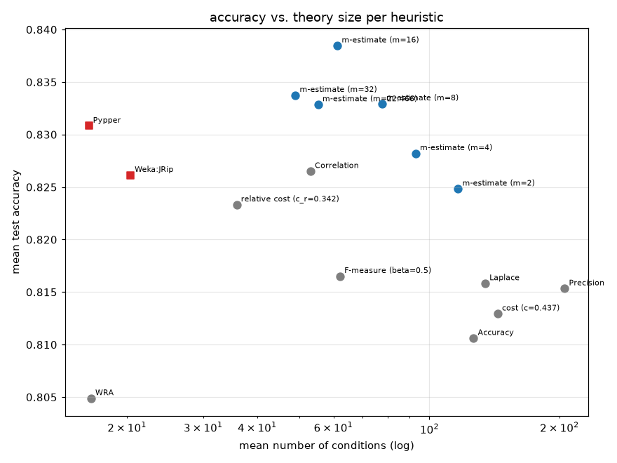
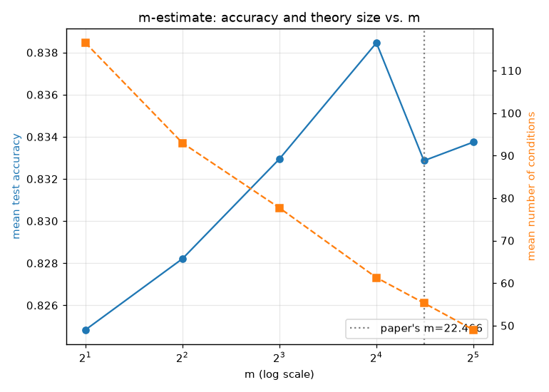

# Rule learning heuristics in separate-and-conquer (after Janssen & Fürnkranz)

## Setup

**Full run** (36 datasets, 10-fold). Quick sanity check instead: `python demos/heuristic_comparison.py` with no arguments.

Rule learning heuristics compared inside one plain separate-and-conquer
learner, after Janssen & Fürnkranz (Machine Learning, 2010). The learner
follows the paper's Algorithms 1 and 2: greedy top-down search that
refines until no refinement is left and returns the best rule
encountered (`BeamSearch(beam_width=1)`), no stopping criterion and no
pruning; covering stops once a new rule covers no more positives than
negatives; multi-class problems use ordered class binarization (least
frequent class first, the largest class as the default rule).

Heuristics: the paper's standard ones (Precision, Laplace, Accuracy,
WRA, Correlation), its tuned parametrized ones (cost c=0.437, relative
cost c_r=0.342, F-measure beta=0.5, m-estimate m=22.466), and an
m-estimate sweep over m in {2, 4, 8, 16, 32}.
Benchmarks: Weka's JRip and pyrulearn's Pypper, both with their own
pruning, and both also use ordered class binarization. What each
heuristic prefers is visualized by its coverage-space isometrics in the
companion demo, [heuristic_isometrics](heuristic_isometrics_report.md).

Datasets: 36 of the paper's datasets that are in
`pyrulearn.experiments.catalog` (20 binary,
16 multi-class). Numeric attributes are discretized per
training fold (`build_dataspec(max_intervals=8)`) instead
of the paper's tests at every midpoint. Each fit is capped at
600s; a timeout counts as a failure.

Measures: test accuracy, number of rules and conditions, fit time.

## Summary by learner (mean across every dataset and fold)

| learner | accuracy | n_rules | n_conditions | conds/rule | fit_time (s) | wins | mean rank | failures |
|---|--:|--:|--:|--:|--:|--:|--:|--:|
| m-estimate (m=16) | 0.838 | 17.3 | 61.3 | 3.29 | 0.70 | 4.3 | 6.06 | 0 |
| m-estimate (m=32) | 0.834 | 13.1 | 49.0 | 3.58 | 0.75 | 2.3 | 6.81 | 0 |
| m-estimate (m=8) | 0.833 | 22.6 | 77.7 | 3.12 | 0.61 | 1.1 | 7.64 | 0 |
| m-estimate (m=22.466) | 0.833 | 15.1 | 55.3 | 3.42 | 0.70 | 1.3 | 7.07 | 0 |
| Pypper | 0.831 | 6.2 | 16.3 | 2.37 | 0.51 | 9.2 | 6.85 | 0 |
| m-estimate (m=4) | 0.828 | 28.6 | 93.0 | 2.95 | 0.55 | 1.4 | 8.03 | 0 |
| Correlation | 0.827 | 14.7 | 53.1 | 3.29 | 0.53 | 3.1 | 7.92 | 0 |
| Weka:JRip | 0.826 | 7.7 | 20.4 | 2.42 | 0.68 | 5.2 | 7.72 | 0 |
| m-estimate (m=2) | 0.825 | 36.1 | 116.5 | 2.85 | 0.59 | 1.4 | 8.54 | 0 |
| relative cost (c_r=0.342) | 0.823 | 9.6 | 35.8 | 3.39 | 0.71 | 1.0 | 8.68 | 0 |
| F-measure (beta=0.5) | 0.817 | 19.7 | 62.2 | 2.92 | 0.61 | 1.1 | 9.57 | 0 |
| Laplace | 0.816 | 43.9 | 134.6 | 2.70 | 0.65 | 0.4 | 10.28 | 0 |
| Precision | 0.815 | 68.0 | 205.5 | 2.67 | 1.06 | 1.1 | 10.49 | 0 |
| cost (c=0.437) | 0.813 | 44.6 | 143.9 | 2.63 | 0.75 | 1.1 | 10.22 | 0 |
| Accuracy | 0.811 | 39.2 | 126.5 | 2.62 | 0.75 | 0.1 | 10.61 | 0 |
| WRA | 0.805 | 4.7 | 16.5 | 3.33 | 0.60 | 2.0 | 9.53 | 0 |

`wins` -- datasets where a learner's mean accuracy was (tied-for-)best, a tie split evenly; `mean rank` -- average accuracy rank across datasets, failures tied for last.

## Per-dataset results, per learner (mean across folds)

| dataset | learner | accuracy | n_rules | n_conditions | fit_time |
|---|---|---|---|---|---|
| anneal | Accuracy | 0.950 | 17.300 | 32.200 | 0.161 |
| anneal | Correlation | 0.945 | 12.900 | 24.600 | 0.152 |
| anneal | F-measure (beta=0.5) | 0.972 | 17.500 | 37.000 | 0.205 |
| anneal | Laplace | 0.963 | 22.100 | 55.600 | 0.220 |
| anneal | Precision | 0.963 | 26.800 | 73.000 | 0.300 |
| anneal | Pypper | 0.941 | 9.900 | 23.500 | 0.432 |
| anneal | WRA | 0.915 | 6.500 | 16.600 | 0.126 |
| anneal | Weka:JRip | 0.895 | 7.800 | 13.600 | 0.589 |
| anneal | cost (c=0.437) | 0.944 | 17.700 | 32.200 | 0.166 |
| anneal | m-estimate (m=16) | 0.968 | 15.500 | 32.600 | 0.187 |
| anneal | m-estimate (m=2) | 0.970 | 21.800 | 50.900 | 0.270 |
| anneal | m-estimate (m=22.466) | 0.962 | 14.100 | 29.500 | 0.187 |
| anneal | m-estimate (m=32) | 0.953 | 13.100 | 23.300 | 0.165 |
| anneal | m-estimate (m=4) | 0.977 | 20.300 | 46.100 | 0.226 |
| anneal | m-estimate (m=8) | 0.967 | 18.100 | 37.700 | 0.204 |
| anneal | relative cost (c_r=0.342) | 0.933 | 8.900 | 20.400 | 0.125 |
| audiology | Accuracy | 0.810 | 40.400 | 85.100 | 0.415 |
| audiology | Correlation | 0.841 | 34.000 | 72.500 | 0.474 |
| audiology | F-measure (beta=0.5) | 0.775 | 42.300 | 85.500 | 0.284 |
| audiology | Laplace | 0.743 | 55.000 | 105.200 | 0.369 |
| audiology | Precision | 0.752 | 67.000 | 130.300 | 0.428 |
| audiology | Pypper | 0.753 | 10.500 | 16.000 | 0.385 |
| audiology | WRA | 0.828 | 23.200 | 59.100 | 0.742 |
| audiology | Weka:JRip | 0.748 | 14.700 | 26.200 | 0.449 |
| audiology | cost (c=0.437) | 0.792 | 44.000 | 93.300 | 0.309 |
| audiology | m-estimate (m=16) | 0.832 | 31.800 | 70.000 | 0.361 |
| audiology | m-estimate (m=2) | 0.779 | 44.600 | 88.200 | 0.330 |
| audiology | m-estimate (m=22.466) | 0.836 | 29.100 | 68.000 | 0.448 |
| audiology | m-estimate (m=32) | 0.850 | 27.700 | 63.900 | 0.597 |
| audiology | m-estimate (m=4) | 0.797 | 39.000 | 82.700 | 0.277 |
| audiology | m-estimate (m=8) | 0.806 | 34.900 | 75.400 | 0.251 |
| audiology | relative cost (c_r=0.342) | 0.827 | 24.300 | 62.100 | 0.741 |
| balance-scale | Accuracy | 0.758 | 67.600 | 246.000 | 0.203 |
| balance-scale | Correlation | 0.776 | 17.500 | 60.600 | 0.083 |
| balance-scale | F-measure (beta=0.5) | 0.771 | 19.100 | 61.400 | 0.088 |
| balance-scale | Laplace | 0.784 | 96.900 | 338.900 | 0.303 |
| balance-scale | Precision | 0.773 | 125.400 | 425.500 | 0.378 |
| balance-scale | Pypper | 0.763 | 6.800 | 21.800 | 0.136 |
| balance-scale | WRA | 0.729 | 3.800 | 10.700 | 0.034 |
| balance-scale | Weka:JRip | 0.763 | 7.400 | 23.800 | 0.360 |
| balance-scale | cost (c=0.437) | 0.776 | 76.500 | 277.700 | 0.236 |
| balance-scale | m-estimate (m=16) | 0.795 | 12.000 | 45.000 | 0.079 |
| balance-scale | m-estimate (m=2) | 0.736 | 88.700 | 370.800 | 0.304 |
| balance-scale | m-estimate (m=22.466) | 0.792 | 11.200 | 42.300 | 0.080 |
| balance-scale | m-estimate (m=32) | 0.800 | 9.800 | 35.200 | 0.067 |
| balance-scale | m-estimate (m=4) | 0.763 | 35.600 | 114.400 | 0.126 |
| balance-scale | m-estimate (m=8) | 0.779 | 24.000 | 82.700 | 0.120 |
| balance-scale | relative cost (c_r=0.342) | 0.758 | 7.000 | 20.900 | 0.054 |
| breast-cancer | Accuracy | 0.724 | 10.900 | 27.200 | 0.075 |
| breast-cancer | Correlation | 0.675 | 3.300 | 35.900 | 0.162 |
| breast-cancer | F-measure (beta=0.5) | 0.675 | 8.400 | 38.300 | 0.157 |
| breast-cancer | Laplace | 0.706 | 22.700 | 58.400 | 0.117 |
| breast-cancer | Precision | 0.688 | 36.300 | 95.100 | 0.183 |
| breast-cancer | Pypper | 0.748 | 1.000 | 2.000 | 0.054 |
| breast-cancer | WRA | 0.685 | 1.200 | 6.100 | 0.073 |
| breast-cancer | Weka:JRip | 0.714 | 1.300 | 2.500 | 0.356 |
| breast-cancer | cost (c=0.437) | 0.713 | 14.800 | 34.900 | 0.085 |
| breast-cancer | m-estimate (m=16) | 0.633 | 8.900 | 41.300 | 0.161 |
| breast-cancer | m-estimate (m=2) | 0.702 | 24.400 | 69.800 | 0.145 |
| breast-cancer | m-estimate (m=22.466) | 0.632 | 8.900 | 43.100 | 0.172 |
| breast-cancer | m-estimate (m=32) | 0.665 | 6.500 | 35.600 | 0.153 |
| breast-cancer | m-estimate (m=4) | 0.678 | 21.900 | 70.000 | 0.173 |
| breast-cancer | m-estimate (m=8) | 0.678 | 15.800 | 68.200 | 0.189 |
| breast-cancer | relative cost (c_r=0.342) | 0.668 | 10.700 | 38.700 | 0.136 |
| breast-w | Accuracy | 0.944 | 10.600 | 18.500 | 0.151 |
| breast-w | Correlation | 0.944 | 9.300 | 17.100 | 0.142 |
| breast-w | F-measure (beta=0.5) | 0.940 | 15.600 | 30.600 | 0.247 |
| breast-w | Laplace | 0.949 | 22.900 | 36.200 | 0.214 |
| breast-w | Precision | 0.946 | 42.900 | 69.200 | 0.390 |
| breast-w | Pypper | 0.940 | 4.200 | 12.000 | 0.401 |
| breast-w | WRA | 0.938 | 2.500 | 12.200 | 0.307 |
| breast-w | Weka:JRip | 0.948 | 5.100 | 12.900 | 0.559 |
| breast-w | cost (c=0.437) | 0.951 | 11.700 | 19.700 | 0.160 |
| breast-w | m-estimate (m=16) | 0.950 | 14.100 | 32.300 | 0.207 |
| breast-w | m-estimate (m=2) | 0.954 | 20.300 | 34.000 | 0.197 |
| breast-w | m-estimate (m=22.466) | 0.950 | 11.000 | 30.300 | 0.286 |
| breast-w | m-estimate (m=32) | 0.949 | 8.600 | 27.400 | 0.366 |
| breast-w | m-estimate (m=4) | 0.950 | 17.100 | 32.300 | 0.186 |
| breast-w | m-estimate (m=8) | 0.953 | 15.600 | 32.000 | 0.176 |
| breast-w | relative cost (c_r=0.342) | 0.936 | 3.200 | 19.700 | 0.262 |
| colic | Accuracy | 0.802 | 24.700 | 61.000 | 0.361 |
| colic | Correlation | 0.837 | 13.700 | 42.000 | 0.307 |
| colic | F-measure (beta=0.5) | 0.823 | 15.900 | 44.200 | 0.389 |
| colic | Laplace | 0.764 | 37.800 | 98.300 | 0.507 |
| colic | Precision | 0.769 | 61.700 | 158.200 | 0.878 |
| colic | Pypper | 0.851 | 1.800 | 4.000 | 0.204 |
| colic | WRA | 0.837 | 1.400 | 3.500 | 0.122 |
| colic | Weka:JRip | 0.845 | 3.400 | 8.400 | 0.448 |
| colic | cost (c=0.437) | 0.791 | 26.800 | 64.200 | 0.365 |
| colic | m-estimate (m=16) | 0.791 | 10.600 | 39.300 | 0.416 |
| colic | m-estimate (m=2) | 0.761 | 28.400 | 84.500 | 0.459 |
| colic | m-estimate (m=22.466) | 0.805 | 8.500 | 35.300 | 0.432 |
| colic | m-estimate (m=32) | 0.816 | 7.000 | 30.200 | 0.440 |
| colic | m-estimate (m=4) | 0.772 | 22.800 | 72.700 | 0.451 |
| colic | m-estimate (m=8) | 0.745 | 13.800 | 50.400 | 0.439 |
| colic | relative cost (c_r=0.342) | 0.832 | 5.400 | 21.400 | 0.306 |
| credit-approval | Accuracy | 0.823 | 17.700 | 44.300 | 0.299 |
| credit-approval | Correlation | 0.819 | 14.100 | 43.400 | 0.341 |
| credit-approval | F-measure (beta=0.5) | 0.817 | 22.800 | 82.400 | 0.792 |
| credit-approval | Laplace | 0.801 | 49.700 | 144.300 | 0.630 |
| credit-approval | Precision | 0.803 | 97.100 | 273.000 | 1.243 |
| credit-approval | Pypper | 0.839 | 3.800 | 11.000 | 0.402 |
| credit-approval | WRA | 0.836 | 1.000 | 3.400 | 0.166 |
| credit-approval | Weka:JRip | 0.848 | 4.200 | 10.100 | 0.524 |
| credit-approval | cost (c=0.437) | 0.830 | 21.200 | 54.100 | 0.340 |
| credit-approval | m-estimate (m=16) | 0.835 | 14.700 | 81.600 | 0.885 |
| credit-approval | m-estimate (m=2) | 0.825 | 41.800 | 131.500 | 0.601 |
| credit-approval | m-estimate (m=22.466) | 0.833 | 9.100 | 49.500 | 0.795 |
| credit-approval | m-estimate (m=32) | 0.836 | 7.600 | 39.500 | 0.716 |
| credit-approval | m-estimate (m=4) | 0.825 | 37.200 | 130.500 | 0.662 |
| credit-approval | m-estimate (m=8) | 0.816 | 24.800 | 101.000 | 0.902 |
| credit-approval | relative cost (c_r=0.342) | 0.854 | 2.400 | 9.800 | 0.333 |
| credit-g | Accuracy | 0.677 | 140.600 | 459.700 | 2.340 |
| credit-g | Correlation | 0.691 | 29.800 | 184.100 | 1.389 |
| credit-g | F-measure (beta=0.5) | 0.656 | 34.200 | 182.400 | 1.845 |
| credit-g | Laplace | 0.692 | 135.100 | 435.400 | 2.271 |
| credit-g | Precision | 0.694 | 193.000 | 619.100 | 3.405 |
| credit-g | Pypper | 0.720 | 2.500 | 8.900 | 0.514 |
| credit-g | WRA | 0.690 | 1.200 | 9.200 | 0.302 |
| credit-g | Weka:JRip | 0.718 | 3.900 | 15.900 | 0.636 |
| credit-g | cost (c=0.437) | 0.679 | 160.000 | 514.900 | 2.573 |
| credit-g | m-estimate (m=16) | 0.670 | 43.900 | 247.100 | 2.452 |
| credit-g | m-estimate (m=2) | 0.713 | 99.800 | 337.100 | 1.863 |
| credit-g | m-estimate (m=22.466) | 0.666 | 37.600 | 235.600 | 2.436 |
| credit-g | m-estimate (m=32) | 0.674 | 31.000 | 212.600 | 2.670 |
| credit-g | m-estimate (m=4) | 0.685 | 79.100 | 290.800 | 1.548 |
| credit-g | m-estimate (m=8) | 0.666 | 60.500 | 260.400 | 1.726 |
| credit-g | relative cost (c_r=0.342) | 0.683 | 18.300 | 120.200 | 1.813 |
| diabetes | Accuracy | 0.745 | 23.100 | 64.400 | 0.516 |
| diabetes | Correlation | 0.745 | 6.100 | 35.600 | 0.413 |
| diabetes | F-measure (beta=0.5) | 0.730 | 7.000 | 34.100 | 0.492 |
| diabetes | Laplace | 0.725 | 59.700 | 219.400 | 1.272 |
| diabetes | Precision | 0.721 | 101.700 | 375.000 | 2.111 |
| diabetes | Pypper | 0.755 | 3.500 | 11.900 | 0.682 |
| diabetes | WRA | 0.733 | 1.100 | 2.600 | 0.167 |
| diabetes | Weka:JRip | 0.725 | 3.900 | 12.400 | 0.871 |
| diabetes | cost (c=0.437) | 0.746 | 29.500 | 85.700 | 0.597 |
| diabetes | m-estimate (m=16) | 0.753 | 15.100 | 79.700 | 0.860 |
| diabetes | m-estimate (m=2) | 0.715 | 53.800 | 232.300 | 1.493 |
| diabetes | m-estimate (m=22.466) | 0.728 | 10.300 | 52.400 | 0.677 |
| diabetes | m-estimate (m=32) | 0.736 | 8.600 | 44.400 | 0.644 |
| diabetes | m-estimate (m=4) | 0.712 | 38.400 | 172.100 | 1.233 |
| diabetes | m-estimate (m=8) | 0.737 | 24.500 | 115.700 | 1.113 |
| diabetes | relative cost (c_r=0.342) | 0.738 | 6.700 | 23.400 | 0.415 |
| glass | Accuracy | 0.640 | 27.000 | 73.200 | 0.257 |
| glass | Correlation | 0.635 | 20.700 | 62.900 | 0.296 |
| glass | F-measure (beta=0.5) | 0.659 | 28.000 | 81.000 | 0.299 |
| glass | Laplace | 0.650 | 33.700 | 91.900 | 0.286 |
| glass | Precision | 0.670 | 50.000 | 139.700 | 0.387 |
| glass | Pypper | 0.683 | 6.100 | 14.300 | 0.249 |
| glass | WRA | 0.697 | 4.700 | 20.000 | 0.262 |
| glass | Weka:JRip | 0.668 | 6.600 | 16.100 | 0.364 |
| glass | cost (c=0.437) | 0.622 | 30.200 | 81.300 | 0.273 |
| glass | m-estimate (m=16) | 0.720 | 17.900 | 58.000 | 0.281 |
| glass | m-estimate (m=2) | 0.669 | 30.200 | 85.700 | 0.274 |
| glass | m-estimate (m=22.466) | 0.650 | 14.900 | 51.000 | 0.303 |
| glass | m-estimate (m=32) | 0.645 | 12.300 | 44.200 | 0.304 |
| glass | m-estimate (m=4) | 0.674 | 25.400 | 74.700 | 0.282 |
| glass | m-estimate (m=8) | 0.701 | 22.600 | 70.900 | 0.305 |
| glass | relative cost (c_r=0.342) | 0.683 | 13.600 | 47.300 | 0.315 |
| hayes-roth | Accuracy | 0.762 | 6.600 | 10.100 | 0.021 |
| hayes-roth | Correlation | 0.844 | 6.200 | 9.400 | 0.024 |
| hayes-roth | F-measure (beta=0.5) | 0.825 | 7.500 | 12.700 | 0.023 |
| hayes-roth | Laplace | 0.838 | 9.400 | 18.900 | 0.026 |
| hayes-roth | Precision | 0.838 | 11.800 | 24.800 | 0.033 |
| hayes-roth | Pypper | 0.844 | 6.100 | 9.600 | 0.083 |
| hayes-roth | WRA | 0.750 | 5.000 | 6.100 | 0.023 |
| hayes-roth | Weka:JRip | 0.831 | 5.800 | 8.500 | 0.544 |
| hayes-roth | cost (c=0.437) | 0.844 | 8.200 | 15.100 | 0.027 |
| hayes-roth | m-estimate (m=16) | 0.844 | 7.100 | 11.500 | 0.025 |
| hayes-roth | m-estimate (m=2) | 0.850 | 8.900 | 17.000 | 0.027 |
| hayes-roth | m-estimate (m=22.466) | 0.838 | 6.800 | 10.900 | 0.027 |
| hayes-roth | m-estimate (m=32) | 0.838 | 6.600 | 10.300 | 0.027 |
| hayes-roth | m-estimate (m=4) | 0.856 | 7.900 | 14.000 | 0.024 |
| hayes-roth | m-estimate (m=8) | 0.863 | 7.600 | 12.800 | 0.024 |
| hayes-roth | relative cost (c_r=0.342) | 0.844 | 6.800 | 10.600 | 0.025 |
| heart-c | Accuracy | 0.716 | 22.400 | 65.600 | 0.197 |
| heart-c | Correlation | 0.723 | 10.800 | 45.100 | 0.172 |
| heart-c | F-measure (beta=0.5) | 0.756 | 15.900 | 53.600 | 0.212 |
| heart-c | Laplace | 0.763 | 34.500 | 97.200 | 0.251 |
| heart-c | Precision | 0.750 | 59.500 | 154.200 | 0.411 |
| heart-c | Pypper | 0.815 | 3.000 | 7.600 | 0.143 |
| heart-c | WRA | 0.740 | 2.400 | 9.700 | 0.113 |
| heart-c | Weka:JRip | 0.792 | 3.600 | 8.600 | 0.392 |
| heart-c | cost (c=0.437) | 0.763 | 28.300 | 80.800 | 0.247 |
| heart-c | m-estimate (m=16) | 0.776 | 13.300 | 56.100 | 0.263 |
| heart-c | m-estimate (m=2) | 0.772 | 27.100 | 80.900 | 0.223 |
| heart-c | m-estimate (m=22.466) | 0.763 | 9.100 | 38.500 | 0.238 |
| heart-c | m-estimate (m=32) | 0.780 | 8.600 | 38.400 | 0.227 |
| heart-c | m-estimate (m=4) | 0.763 | 22.300 | 71.200 | 0.220 |
| heart-c | m-estimate (m=8) | 0.750 | 17.600 | 64.800 | 0.260 |
| heart-c | relative cost (c_r=0.342) | 0.739 | 7.600 | 26.300 | 0.194 |
| heart-h | Accuracy | 0.769 | 19.600 | 57.700 | 0.347 |
| heart-h | Correlation | 0.731 | 10.000 | 39.800 | 0.385 |
| heart-h | F-measure (beta=0.5) | 0.769 | 13.300 | 53.000 | 0.502 |
| heart-h | Laplace | 0.752 | 31.400 | 83.200 | 0.413 |
| heart-h | Precision | 0.758 | 46.700 | 119.200 | 0.639 |
| heart-h | Pypper | 0.786 | 1.900 | 3.600 | 0.226 |
| heart-h | WRA | 0.759 | 1.700 | 6.500 | 0.245 |
| heart-h | Weka:JRip | 0.796 | 2.000 | 3.300 | 0.731 |
| heart-h | cost (c=0.437) | 0.755 | 22.600 | 65.600 | 0.397 |
| heart-h | m-estimate (m=16) | 0.772 | 9.900 | 37.000 | 0.490 |
| heart-h | m-estimate (m=2) | 0.758 | 24.800 | 70.600 | 0.395 |
| heart-h | m-estimate (m=22.466) | 0.776 | 7.000 | 26.800 | 0.443 |
| heart-h | m-estimate (m=32) | 0.786 | 4.900 | 25.700 | 0.411 |
| heart-h | m-estimate (m=4) | 0.769 | 18.400 | 59.000 | 0.435 |
| heart-h | m-estimate (m=8) | 0.786 | 12.800 | 48.200 | 0.472 |
| heart-h | relative cost (c_r=0.342) | 0.779 | 4.700 | 16.900 | 0.325 |
| heart-statlog | Accuracy | 0.733 | 18.200 | 50.000 | 0.283 |
| heart-statlog | Correlation | 0.767 | 10.800 | 39.300 | 0.318 |
| heart-statlog | F-measure (beta=0.5) | 0.756 | 14.600 | 45.800 | 0.372 |
| heart-statlog | Laplace | 0.741 | 30.000 | 82.100 | 0.359 |
| heart-statlog | Precision | 0.722 | 54.200 | 139.200 | 0.711 |
| heart-statlog | Pypper | 0.785 | 2.400 | 6.100 | 0.242 |
| heart-statlog | WRA | 0.759 | 2.300 | 9.000 | 0.220 |
| heart-statlog | Weka:JRip | 0.789 | 4.300 | 10.400 | 0.721 |
| heart-statlog | cost (c=0.437) | 0.737 | 23.500 | 63.900 | 0.340 |
| heart-statlog | m-estimate (m=16) | 0.737 | 11.600 | 45.500 | 0.397 |
| heart-statlog | m-estimate (m=2) | 0.733 | 23.900 | 68.200 | 0.363 |
| heart-statlog | m-estimate (m=22.466) | 0.741 | 10.000 | 40.500 | 0.391 |
| heart-statlog | m-estimate (m=32) | 0.763 | 8.000 | 34.500 | 0.363 |
| heart-statlog | m-estimate (m=4) | 0.759 | 20.200 | 64.900 | 0.387 |
| heart-statlog | m-estimate (m=8) | 0.737 | 15.500 | 54.300 | 0.489 |
| heart-statlog | relative cost (c_r=0.342) | 0.763 | 8.300 | 30.000 | 0.333 |
| hepatitis | Accuracy | 0.758 | 11.700 | 28.700 | 0.088 |
| hepatitis | Correlation | 0.738 | 6.700 | 20.000 | 0.082 |
| hepatitis | F-measure (beta=0.5) | 0.732 | 8.500 | 22.900 | 0.077 |
| hepatitis | Laplace | 0.738 | 12.600 | 27.500 | 0.078 |
| hepatitis | Precision | 0.732 | 18.200 | 39.600 | 0.115 |
| hepatitis | Pypper | 0.794 | 1.700 | 3.400 | 0.068 |
| hepatitis | WRA | 0.767 | 1.200 | 4.900 | 0.044 |
| hepatitis | Weka:JRip | 0.787 | 2.100 | 4.000 | 0.334 |
| hepatitis | cost (c=0.437) | 0.758 | 11.900 | 27.000 | 0.084 |
| hepatitis | m-estimate (m=16) | 0.778 | 5.600 | 16.500 | 0.097 |
| hepatitis | m-estimate (m=2) | 0.776 | 9.800 | 24.500 | 0.064 |
| hepatitis | m-estimate (m=22.466) | 0.784 | 5.400 | 16.800 | 0.076 |
| hepatitis | m-estimate (m=32) | 0.782 | 4.400 | 13.900 | 0.078 |
| hepatitis | m-estimate (m=4) | 0.764 | 8.100 | 21.600 | 0.085 |
| hepatitis | m-estimate (m=8) | 0.783 | 6.200 | 17.700 | 0.092 |
| hepatitis | relative cost (c_r=0.342) | 0.783 | 3.600 | 11.800 | 0.062 |
| hypothyroid | Accuracy | 0.990 | 13.400 | 35.700 | 0.412 |
| hypothyroid | Correlation | 0.989 | 8.800 | 24.500 | 0.377 |
| hypothyroid | F-measure (beta=0.5) | 0.988 | 13.900 | 42.900 | 0.493 |
| hypothyroid | Laplace | 0.983 | 33.200 | 107.400 | 0.678 |
| hypothyroid | Precision | 0.983 | 82.700 | 267.900 | 1.687 |
| hypothyroid | Pypper | 0.993 | 3.300 | 8.900 | 0.565 |
| hypothyroid | WRA | 0.971 | 2.100 | 7.700 | 0.256 |
| hypothyroid | Weka:JRip | 0.992 | 3.400 | 8.900 | 1.282 |
| hypothyroid | cost (c=0.437) | 0.988 | 17.000 | 48.200 | 0.497 |
| hypothyroid | m-estimate (m=16) | 0.991 | 10.900 | 39.200 | 0.676 |
| hypothyroid | m-estimate (m=2) | 0.987 | 23.000 | 81.000 | 0.565 |
| hypothyroid | m-estimate (m=22.466) | 0.990 | 10.500 | 40.200 | 0.667 |
| hypothyroid | m-estimate (m=32) | 0.989 | 8.300 | 31.400 | 0.569 |
| hypothyroid | m-estimate (m=4) | 0.989 | 18.800 | 71.000 | 0.582 |
| hypothyroid | m-estimate (m=8) | 0.988 | 14.100 | 52.900 | 0.759 |
| hypothyroid | relative cost (c_r=0.342) | 0.992 | 3.800 | 12.500 | 0.332 |
| ionosphere | Accuracy | 0.863 | 14.100 | 24.400 | 0.954 |
| ionosphere | Correlation | 0.875 | 10.200 | 18.800 | 0.813 |
| ionosphere | F-measure (beta=0.5) | 0.909 | 13.000 | 24.000 | 1.940 |
| ionosphere | Laplace | 0.915 | 15.700 | 25.900 | 0.668 |
| ionosphere | Precision | 0.923 | 19.400 | 33.000 | 0.877 |
| ionosphere | Pypper | 0.895 | 3.800 | 6.000 | 0.770 |
| ionosphere | WRA | 0.892 | 2.000 | 2.300 | 2.775 |
| ionosphere | Weka:JRip | 0.869 | 5.800 | 10.000 | 1.178 |
| ionosphere | cost (c=0.437) | 0.889 | 14.600 | 25.400 | 0.924 |
| ionosphere | m-estimate (m=16) | 0.906 | 9.800 | 20.200 | 2.279 |
| ionosphere | m-estimate (m=2) | 0.920 | 14.500 | 24.300 | 0.667 |
| ionosphere | m-estimate (m=22.466) | 0.903 | 9.200 | 20.700 | 2.385 |
| ionosphere | m-estimate (m=32) | 0.892 | 7.600 | 24.600 | 3.348 |
| ionosphere | m-estimate (m=4) | 0.920 | 12.800 | 22.600 | 0.610 |
| ionosphere | m-estimate (m=8) | 0.923 | 11.200 | 20.900 | 0.585 |
| ionosphere | relative cost (c_r=0.342) | 0.872 | 4.600 | 11.800 | 3.684 |
| iris | Accuracy | 0.920 | 4.400 | 9.100 | 0.014 |
| iris | Correlation | 0.933 | 3.700 | 8.900 | 0.017 |
| iris | F-measure (beta=0.5) | 0.920 | 4.800 | 10.300 | 0.016 |
| iris | Laplace | 0.920 | 7.100 | 13.600 | 0.029 |
| iris | Precision | 0.920 | 10.900 | 18.800 | 0.031 |
| iris | Pypper | 0.933 | 2.000 | 2.800 | 0.026 |
| iris | WRA | 0.933 | 2.300 | 3.900 | 0.022 |
| iris | Weka:JRip | 0.953 | 2.500 | 3.900 | 0.309 |
| iris | cost (c=0.437) | 0.920 | 4.600 | 9.600 | 0.016 |
| iris | m-estimate (m=16) | 0.927 | 3.800 | 8.100 | 0.021 |
| iris | m-estimate (m=2) | 0.927 | 5.600 | 11.100 | 0.020 |
| iris | m-estimate (m=22.466) | 0.927 | 3.700 | 8.000 | 0.021 |
| iris | m-estimate (m=32) | 0.927 | 3.700 | 7.900 | 0.022 |
| iris | m-estimate (m=4) | 0.927 | 5.100 | 11.100 | 0.018 |
| iris | m-estimate (m=8) | 0.920 | 3.800 | 7.700 | 0.021 |
| iris | relative cost (c_r=0.342) | 0.927 | 3.700 | 8.000 | 0.023 |
| kr-vs-kp | Accuracy | 0.969 | 41.200 | 192.300 | 0.580 |
| kr-vs-kp | Correlation | 0.982 | 9.700 | 27.000 | 0.195 |
| kr-vs-kp | F-measure (beta=0.5) | 0.981 | 13.400 | 43.700 | 0.270 |
| kr-vs-kp | Laplace | 0.993 | 40.700 | 139.600 | 0.417 |
| kr-vs-kp | Precision | 0.992 | 67.800 | 224.900 | 0.712 |
| kr-vs-kp | Pypper | 0.991 | 13.600 | 44.000 | 0.799 |
| kr-vs-kp | WRA | 0.943 | 3.000 | 8.100 | 0.148 |
| kr-vs-kp | Weka:JRip | 0.993 | 14.600 | 46.200 | 0.896 |
| kr-vs-kp | cost (c=0.437) | 0.967 | 51.100 | 235.400 | 0.693 |
| kr-vs-kp | m-estimate (m=16) | 0.995 | 21.500 | 67.300 | 0.336 |
| kr-vs-kp | m-estimate (m=2) | 0.993 | 32.100 | 108.500 | 0.357 |
| kr-vs-kp | m-estimate (m=22.466) | 0.994 | 20.000 | 64.600 | 0.329 |
| kr-vs-kp | m-estimate (m=32) | 0.995 | 17.600 | 67.600 | 0.362 |
| kr-vs-kp | m-estimate (m=4) | 0.993 | 29.500 | 98.800 | 0.392 |
| kr-vs-kp | m-estimate (m=8) | 0.993 | 26.700 | 95.900 | 0.335 |
| kr-vs-kp | relative cost (c_r=0.342) | 0.952 | 6.000 | 20.000 | 0.169 |
| lymph | Accuracy | 0.802 | 12.700 | 27.100 | 0.091 |
| lymph | Correlation | 0.865 | 8.500 | 21.300 | 0.069 |
| lymph | F-measure (beta=0.5) | 0.845 | 11.100 | 26.200 | 0.067 |
| lymph | Laplace | 0.750 | 20.100 | 42.400 | 0.090 |
| lymph | Precision | 0.778 | 29.300 | 62.400 | 0.130 |
| lymph | Pypper | 0.736 | 2.700 | 5.800 | 0.075 |
| lymph | WRA | 0.844 | 5.200 | 17.600 | 0.114 |
| lymph | Weka:JRip | 0.825 | 4.100 | 8.200 | 0.318 |
| lymph | cost (c=0.437) | 0.837 | 14.900 | 34.400 | 0.077 |
| lymph | m-estimate (m=16) | 0.846 | 8.900 | 22.700 | 0.077 |
| lymph | m-estimate (m=2) | 0.783 | 16.200 | 33.400 | 0.077 |
| lymph | m-estimate (m=22.466) | 0.832 | 8.300 | 21.500 | 0.097 |
| lymph | m-estimate (m=32) | 0.839 | 7.500 | 20.300 | 0.098 |
| lymph | m-estimate (m=4) | 0.785 | 13.800 | 30.600 | 0.080 |
| lymph | m-estimate (m=8) | 0.784 | 9.900 | 24.400 | 0.063 |
| lymph | relative cost (c_r=0.342) | 0.851 | 6.700 | 18.300 | 0.085 |
| molecular-biology_promoters | Accuracy | 0.834 | 4.100 | 9.700 | 0.282 |
| molecular-biology_promoters | Correlation | 0.813 | 3.200 | 9.700 | 0.248 |
| molecular-biology_promoters | F-measure (beta=0.5) | 0.786 | 5.400 | 12.000 | 0.290 |
| molecular-biology_promoters | Laplace | 0.735 | 6.700 | 13.000 | 0.321 |
| molecular-biology_promoters | Precision | 0.774 | 13.900 | 27.500 | 0.644 |
| molecular-biology_promoters | Pypper | 0.832 | 2.100 | 3.800 | 0.440 |
| molecular-biology_promoters | WRA | 0.805 | 2.300 | 9.000 | 0.286 |
| molecular-biology_promoters | Weka:JRip | 0.775 | 2.500 | 5.400 | 0.770 |
| molecular-biology_promoters | cost (c=0.437) | 0.784 | 5.200 | 12.300 | 0.282 |
| molecular-biology_promoters | m-estimate (m=16) | 0.850 | 4.100 | 10.400 | 0.250 |
| molecular-biology_promoters | m-estimate (m=2) | 0.726 | 6.200 | 12.300 | 0.276 |
| molecular-biology_promoters | m-estimate (m=22.466) | 0.823 | 3.700 | 10.600 | 0.243 |
| molecular-biology_promoters | m-estimate (m=32) | 0.841 | 3.600 | 10.600 | 0.243 |
| molecular-biology_promoters | m-estimate (m=4) | 0.831 | 5.300 | 11.500 | 0.270 |
| molecular-biology_promoters | m-estimate (m=8) | 0.793 | 4.600 | 10.700 | 0.255 |
| molecular-biology_promoters | relative cost (c_r=0.342) | 0.802 | 3.000 | 9.500 | 0.266 |
| monks-problems-1 | Accuracy | 0.805 | 1.600 | 2.200 | 0.005 |
| monks-problems-1 | Correlation | 0.770 | 1.400 | 1.800 | 0.006 |
| monks-problems-1 | F-measure (beta=0.5) | 0.808 | 2.400 | 5.300 | 0.011 |
| monks-problems-1 | Laplace | 1.000 | 10.600 | 33.000 | 0.028 |
| monks-problems-1 | Precision | 0.998 | 17.300 | 53.300 | 0.043 |
| monks-problems-1 | Pypper | 0.953 | 3.600 | 10.200 | 0.055 |
| monks-problems-1 | WRA | 0.770 | 1.400 | 1.800 | 0.007 |
| monks-problems-1 | Weka:JRip | 0.930 | 3.700 | 10.400 | 0.351 |
| monks-problems-1 | cost (c=0.437) | 0.846 | 3.300 | 7.800 | 0.009 |
| monks-problems-1 | m-estimate (m=16) | 0.928 | 6.900 | 22.000 | 0.028 |
| monks-problems-1 | m-estimate (m=2) | 1.000 | 11.200 | 36.600 | 0.030 |
| monks-problems-1 | m-estimate (m=22.466) | 0.925 | 5.400 | 19.000 | 0.021 |
| monks-problems-1 | m-estimate (m=32) | 0.882 | 3.800 | 11.600 | 0.015 |
| monks-problems-1 | m-estimate (m=4) | 1.000 | 11.000 | 36.000 | 0.029 |
| monks-problems-1 | m-estimate (m=8) | 0.988 | 10.200 | 34.400 | 0.026 |
| monks-problems-1 | relative cost (c_r=0.342) | 0.889 | 5.000 | 14.800 | 0.016 |
| monks-problems-2 | Accuracy | 0.659 | 90.300 | 513.500 | 0.244 |
| monks-problems-2 | Correlation | 0.872 | 8.500 | 54.800 | 0.047 |
| monks-problems-2 | F-measure (beta=0.5) | 0.672 | 0.900 | 3.900 | 0.010 |
| monks-problems-2 | Laplace | 0.672 | 84.600 | 491.300 | 0.266 |
| monks-problems-2 | Precision | 0.631 | 127.300 | 741.500 | 0.420 |
| monks-problems-2 | Pypper | 0.704 | 2.300 | 13.300 | 0.059 |
| monks-problems-2 | WRA | 0.657 | 0.900 | 3.600 | 0.010 |
| monks-problems-2 | Weka:JRip | 0.806 | 7.600 | 44.600 | 0.340 |
| monks-problems-2 | cost (c=0.437) | 0.684 | 105.200 | 615.800 | 0.295 |
| monks-problems-2 | m-estimate (m=16) | 0.829 | 14.300 | 84.900 | 0.066 |
| monks-problems-2 | m-estimate (m=2) | 0.742 | 58.600 | 357.500 | 0.208 |
| monks-problems-2 | m-estimate (m=22.466) | 0.770 | 11.800 | 69.800 | 0.067 |
| monks-problems-2 | m-estimate (m=32) | 0.804 | 9.300 | 55.600 | 0.049 |
| monks-problems-2 | m-estimate (m=4) | 0.749 | 34.600 | 207.400 | 0.132 |
| monks-problems-2 | m-estimate (m=8) | 0.812 | 21.800 | 132.100 | 0.093 |
| monks-problems-2 | relative cost (c_r=0.342) | 0.646 | 18.000 | 97.100 | 0.070 |
| monks-problems-3 | Accuracy | 0.959 | 2.300 | 3.600 | 0.010 |
| monks-problems-3 | Correlation | 0.957 | 2.400 | 5.400 | 0.011 |
| monks-problems-3 | F-measure (beta=0.5) | 0.964 | 2.800 | 5.700 | 0.010 |
| monks-problems-3 | Laplace | 0.957 | 6.500 | 13.900 | 0.016 |
| monks-problems-3 | Precision | 0.971 | 9.300 | 18.900 | 0.022 |
| monks-problems-3 | Pypper | 0.989 | 3.000 | 5.000 | 0.030 |
| monks-problems-3 | WRA | 0.964 | 2.000 | 2.000 | 0.009 |
| monks-problems-3 | Weka:JRip | 0.989 | 3.000 | 5.000 | 0.358 |
| monks-problems-3 | cost (c=0.437) | 0.960 | 2.200 | 3.200 | 0.008 |
| monks-problems-3 | m-estimate (m=16) | 0.989 | 3.000 | 5.000 | 0.014 |
| monks-problems-3 | m-estimate (m=2) | 0.975 | 5.900 | 13.300 | 0.016 |
| monks-problems-3 | m-estimate (m=22.466) | 0.989 | 3.000 | 5.000 | 0.012 |
| monks-problems-3 | m-estimate (m=32) | 0.989 | 3.000 | 5.000 | 0.011 |
| monks-problems-3 | m-estimate (m=4) | 0.984 | 4.500 | 9.300 | 0.015 |
| monks-problems-3 | m-estimate (m=8) | 0.986 | 3.200 | 6.000 | 0.009 |
| monks-problems-3 | relative cost (c_r=0.342) | 0.964 | 2.000 | 2.000 | 0.008 |
| mushroom | Accuracy | 1.000 | 7.800 | 13.600 | 0.295 |
| mushroom | Correlation | 1.000 | 6.900 | 10.900 | 0.278 |
| mushroom | F-measure (beta=0.5) | 1.000 | 10.900 | 12.900 | 0.323 |
| mushroom | Laplace | 1.000 | 10.900 | 12.900 | 0.316 |
| mushroom | Precision | 1.000 | 15.000 | 18.000 | 0.450 |
| mushroom | Pypper | 1.000 | 5.200 | 10.600 | 0.912 |
| mushroom | WRA | 1.000 | 3.000 | 11.100 | 0.382 |
| mushroom | Weka:JRip | 1.000 | 6.000 | 10.100 | 3.229 |
| mushroom | cost (c=0.437) | 1.000 | 7.800 | 13.600 | 0.304 |
| mushroom | m-estimate (m=16) | 1.000 | 10.900 | 12.900 | 0.330 |
| mushroom | m-estimate (m=2) | 1.000 | 10.900 | 12.900 | 0.329 |
| mushroom | m-estimate (m=22.466) | 1.000 | 10.900 | 12.900 | 0.320 |
| mushroom | m-estimate (m=32) | 1.000 | 10.900 | 12.900 | 0.355 |
| mushroom | m-estimate (m=4) | 1.000 | 10.900 | 12.900 | 0.325 |
| mushroom | m-estimate (m=8) | 1.000 | 10.900 | 12.900 | 0.326 |
| mushroom | relative cost (c_r=0.342) | 0.999 | 4.000 | 12.100 | 0.860 |
| primary-tumor | Accuracy | 0.339 | 73.300 | 264.200 | 0.533 |
| primary-tumor | Correlation | 0.404 | 59.700 | 295.700 | 0.627 |
| primary-tumor | F-measure (beta=0.5) | 0.395 | 67.900 | 279.900 | 0.581 |
| primary-tumor | Laplace | 0.348 | 89.300 | 351.500 | 0.660 |
| primary-tumor | Precision | 0.360 | 117.200 | 455.900 | 0.780 |
| primary-tumor | Pypper | 0.393 | 7.300 | 20.500 | 0.371 |
| primary-tumor | WRA | 0.419 | 9.900 | 40.200 | 0.296 |
| primary-tumor | Weka:JRip | 0.360 | 6.400 | 21.900 | 0.652 |
| primary-tumor | cost (c=0.437) | 0.327 | 76.200 | 273.300 | 0.484 |
| primary-tumor | m-estimate (m=16) | 0.419 | 39.500 | 179.300 | 0.503 |
| primary-tumor | m-estimate (m=2) | 0.380 | 77.800 | 323.100 | 0.638 |
| primary-tumor | m-estimate (m=22.466) | 0.440 | 34.600 | 151.800 | 0.456 |
| primary-tumor | m-estimate (m=32) | 0.413 | 28.300 | 127.000 | 0.431 |
| primary-tumor | m-estimate (m=4) | 0.366 | 62.800 | 269.500 | 0.588 |
| primary-tumor | m-estimate (m=8) | 0.410 | 49.100 | 215.500 | 0.526 |
| primary-tumor | relative cost (c_r=0.342) | 0.431 | 20.300 | 84.800 | 0.364 |
| segment | Accuracy | 0.903 | 164.400 | 560.400 | 4.734 |
| segment | Correlation | 0.953 | 26.500 | 104.900 | 1.998 |
| segment | F-measure (beta=0.5) | 0.940 | 39.600 | 144.800 | 2.573 |
| segment | Laplace | 0.938 | 90.900 | 298.900 | 2.542 |
| segment | Precision | 0.932 | 170.100 | 536.400 | 4.671 |
| segment | Pypper | 0.947 | 14.500 | 45.600 | 1.824 |
| segment | WRA | 0.907 | 7.800 | 29.800 | 1.790 |
| segment | Weka:JRip | 0.950 | 20.200 | 58.800 | 1.486 |
| segment | cost (c=0.437) | 0.903 | 173.500 | 588.300 | 4.874 |
| segment | m-estimate (m=16) | 0.939 | 38.700 | 138.500 | 2.674 |
| segment | m-estimate (m=2) | 0.942 | 70.500 | 234.400 | 2.224 |
| segment | m-estimate (m=22.466) | 0.943 | 35.900 | 133.000 | 2.524 |
| segment | m-estimate (m=32) | 0.940 | 31.500 | 114.400 | 2.568 |
| segment | m-estimate (m=4) | 0.939 | 57.900 | 203.400 | 2.008 |
| segment | m-estimate (m=8) | 0.937 | 49.400 | 181.800 | 2.009 |
| segment | relative cost (c_r=0.342) | 0.916 | 17.900 | 63.700 | 3.050 |
| solar-flare | Accuracy | 0.742 | 20.200 | 47.900 | 0.164 |
| solar-flare | Correlation | 0.745 | 5.200 | 13.800 | 0.210 |
| solar-flare | F-measure (beta=0.5) | 0.716 | 12.000 | 48.900 | 0.265 |
| solar-flare | Laplace | 0.744 | 43.400 | 136.400 | 0.317 |
| solar-flare | Precision | 0.745 | 67.900 | 215.400 | 0.477 |
| solar-flare | Pypper | 0.748 | 4.900 | 8.300 | 0.242 |
| solar-flare | WRA | 0.735 | 3.000 | 4.200 | 0.147 |
| solar-flare | Weka:JRip | 0.712 | 6.500 | 16.900 | 0.512 |
| solar-flare | cost (c=0.437) | 0.738 | 20.700 | 48.700 | 0.169 |
| solar-flare | m-estimate (m=16) | 0.732 | 10.900 | 38.400 | 0.257 |
| solar-flare | m-estimate (m=2) | 0.735 | 38.300 | 141.300 | 0.371 |
| solar-flare | m-estimate (m=22.466) | 0.733 | 9.400 | 34.500 | 0.247 |
| solar-flare | m-estimate (m=32) | 0.736 | 7.300 | 29.800 | 0.240 |
| solar-flare | m-estimate (m=4) | 0.727 | 28.000 | 112.900 | 0.359 |
| solar-flare | m-estimate (m=8) | 0.732 | 19.900 | 70.800 | 0.321 |
| solar-flare | relative cost (c_r=0.342) | 0.730 | 3.000 | 5.800 | 0.142 |
| sonar | Accuracy | 0.726 | 14.800 | 31.400 | 2.823 |
| sonar | Correlation | 0.726 | 8.300 | 22.600 | 2.598 |
| sonar | F-measure (beta=0.5) | 0.740 | 11.800 | 26.700 | 1.603 |
| sonar | Laplace | 0.649 | 25.300 | 42.700 | 1.869 |
| sonar | Precision | 0.610 | 49.400 | 87.300 | 3.921 |
| sonar | Pypper | 0.774 | 2.800 | 5.600 | 1.106 |
| sonar | WRA | 0.756 | 3.500 | 24.700 | 6.072 |
| sonar | Weka:JRip | 0.726 | 4.700 | 10.100 | 0.733 |
| sonar | cost (c=0.437) | 0.663 | 18.500 | 36.300 | 2.365 |
| sonar | m-estimate (m=16) | 0.745 | 8.600 | 22.600 | 1.076 |
| sonar | m-estimate (m=2) | 0.678 | 19.500 | 33.600 | 1.556 |
| sonar | m-estimate (m=22.466) | 0.730 | 7.800 | 21.700 | 1.045 |
| sonar | m-estimate (m=32) | 0.688 | 6.300 | 20.900 | 1.911 |
| sonar | m-estimate (m=4) | 0.653 | 14.000 | 26.400 | 1.237 |
| sonar | m-estimate (m=8) | 0.750 | 11.400 | 24.500 | 1.134 |
| sonar | relative cost (c_r=0.342) | 0.746 | 5.800 | 29.500 | 2.565 |
| soybean | Accuracy | 0.901 | 55.000 | 124.300 | 0.679 |
| soybean | Correlation | 0.931 | 33.400 | 73.400 | 0.398 |
| soybean | F-measure (beta=0.5) | 0.914 | 46.600 | 101.300 | 0.539 |
| soybean | Laplace | 0.898 | 62.600 | 142.500 | 0.483 |
| soybean | Precision | 0.884 | 96.400 | 213.700 | 0.761 |
| soybean | Pypper | 0.909 | 23.900 | 45.900 | 0.697 |
| soybean | WRA | 0.939 | 20.500 | 52.700 | 0.526 |
| soybean | Weka:JRip | 0.778 | 25.500 | 46.000 | 0.607 |
| soybean | cost (c=0.437) | 0.898 | 60.100 | 139.100 | 0.654 |
| soybean | m-estimate (m=16) | 0.930 | 37.500 | 81.300 | 0.499 |
| soybean | m-estimate (m=2) | 0.908 | 52.700 | 119.700 | 0.467 |
| soybean | m-estimate (m=22.466) | 0.928 | 34.900 | 73.900 | 0.506 |
| soybean | m-estimate (m=32) | 0.921 | 32.900 | 71.400 | 0.558 |
| soybean | m-estimate (m=4) | 0.920 | 47.800 | 108.700 | 0.441 |
| soybean | m-estimate (m=8) | 0.909 | 42.700 | 95.600 | 0.483 |
| soybean | relative cost (c_r=0.342) | 0.933 | 26.400 | 64.700 | 0.545 |
| tic-tac-toe | Accuracy | 0.875 | 76.800 | 320.900 | 0.428 |
| tic-tac-toe | Correlation | 0.888 | 12.800 | 62.700 | 0.107 |
| tic-tac-toe | F-measure (beta=0.5) | 0.825 | 10.800 | 38.600 | 0.072 |
| tic-tac-toe | Laplace | 0.970 | 20.900 | 78.000 | 0.110 |
| tic-tac-toe | Precision | 0.974 | 25.500 | 95.300 | 0.136 |
| tic-tac-toe | Pypper | 0.962 | 7.500 | 23.100 | 0.175 |
| tic-tac-toe | WRA | 0.690 | 1.500 | 3.000 | 0.029 |
| tic-tac-toe | Weka:JRip | 0.981 | 8.400 | 26.600 | 0.416 |
| tic-tac-toe | cost (c=0.437) | 0.860 | 94.600 | 393.400 | 0.537 |
| tic-tac-toe | m-estimate (m=16) | 0.973 | 11.400 | 40.500 | 0.081 |
| tic-tac-toe | m-estimate (m=2) | 0.965 | 15.600 | 60.700 | 0.097 |
| tic-tac-toe | m-estimate (m=22.466) | 0.976 | 10.200 | 34.800 | 0.071 |
| tic-tac-toe | m-estimate (m=32) | 0.975 | 9.900 | 33.000 | 0.074 |
| tic-tac-toe | m-estimate (m=4) | 0.970 | 15.000 | 59.200 | 0.088 |
| tic-tac-toe | m-estimate (m=8) | 0.967 | 13.500 | 49.500 | 0.088 |
| tic-tac-toe | relative cost (c_r=0.342) | 0.925 | 8.100 | 25.200 | 0.062 |
| vehicle | Accuracy | 0.668 | 157.300 | 499.200 | 4.790 |
| vehicle | Correlation | 0.705 | 26.300 | 125.600 | 3.011 |
| vehicle | F-measure (beta=0.5) | 0.706 | 43.200 | 168.500 | 3.891 |
| vehicle | Laplace | 0.707 | 137.000 | 411.800 | 2.835 |
| vehicle | Precision | 0.724 | 219.600 | 633.100 | 4.419 |
| vehicle | Pypper | 0.682 | 11.800 | 32.900 | 1.286 |
| vehicle | WRA | 0.600 | 5.400 | 31.500 | 1.991 |
| vehicle | Weka:JRip | 0.685 | 13.900 | 38.400 | 0.781 |
| vehicle | cost (c=0.437) | 0.669 | 179.200 | 556.100 | 4.373 |
| vehicle | m-estimate (m=16) | 0.725 | 37.800 | 169.000 | 5.536 |
| vehicle | m-estimate (m=2) | 0.715 | 102.200 | 325.900 | 2.551 |
| vehicle | m-estimate (m=22.466) | 0.699 | 31.300 | 174.100 | 5.474 |
| vehicle | m-estimate (m=32) | 0.695 | 24.600 | 137.700 | 4.902 |
| vehicle | m-estimate (m=4) | 0.715 | 81.200 | 278.100 | 3.057 |
| vehicle | m-estimate (m=8) | 0.703 | 60.100 | 272.600 | 4.941 |
| vehicle | relative cost (c_r=0.342) | 0.707 | 16.800 | 93.500 | 3.881 |
| vote | Accuracy | 0.945 | 3.700 | 10.700 | 0.011 |
| vote | Correlation | 0.938 | 3.400 | 10.200 | 0.011 |
| vote | F-measure (beta=0.5) | 0.947 | 4.600 | 13.800 | 0.018 |
| vote | Laplace | 0.940 | 10.400 | 38.500 | 0.032 |
| vote | Precision | 0.942 | 17.600 | 63.000 | 0.050 |
| vote | Pypper | 0.952 | 1.700 | 3.300 | 0.033 |
| vote | WRA | 0.940 | 2.700 | 8.500 | 0.012 |
| vote | Weka:JRip | 0.954 | 3.100 | 7.600 | 0.319 |
| vote | cost (c=0.437) | 0.945 | 3.700 | 10.700 | 0.014 |
| vote | m-estimate (m=16) | 0.936 | 5.600 | 18.300 | 0.021 |
| vote | m-estimate (m=2) | 0.940 | 8.500 | 31.100 | 0.031 |
| vote | m-estimate (m=22.466) | 0.949 | 4.900 | 16.300 | 0.031 |
| vote | m-estimate (m=32) | 0.947 | 4.900 | 16.000 | 0.020 |
| vote | m-estimate (m=4) | 0.938 | 6.500 | 24.600 | 0.030 |
| vote | m-estimate (m=8) | 0.940 | 5.100 | 17.400 | 0.020 |
| vote | relative cost (c_r=0.342) | 0.938 | 2.900 | 9.200 | 0.012 |
| vowel | Accuracy | 0.801 | 181.800 | 508.300 | 4.174 |
| vowel | Correlation | 0.816 | 72.000 | 262.700 | 3.411 |
| vowel | F-measure (beta=0.5) | 0.823 | 108.700 | 333.800 | 2.884 |
| vowel | Laplace | 0.801 | 195.300 | 528.200 | 4.224 |
| vowel | Precision | 0.791 | 277.400 | 749.700 | 6.051 |
| vowel | Pypper | 0.697 | 33.100 | 123.400 | 4.362 |
| vowel | WRA | 0.621 | 23.300 | 132.300 | 3.578 |
| vowel | Weka:JRip | 0.761 | 49.400 | 162.800 | 1.585 |
| vowel | cost (c=0.437) | 0.799 | 212.700 | 585.400 | 4.321 |
| vowel | m-estimate (m=16) | 0.801 | 93.000 | 303.900 | 3.417 |
| vowel | m-estimate (m=2) | 0.811 | 165.400 | 458.100 | 3.586 |
| vowel | m-estimate (m=22.466) | 0.812 | 82.700 | 282.300 | 3.530 |
| vowel | m-estimate (m=32) | 0.798 | 72.400 | 261.800 | 3.808 |
| vowel | m-estimate (m=4) | 0.820 | 142.500 | 406.200 | 3.150 |
| vowel | m-estimate (m=8) | 0.811 | 117.300 | 350.500 | 2.996 |
| vowel | relative cost (c_r=0.342) | 0.721 | 45.900 | 202.900 | 4.056 |
| wine | Accuracy | 0.950 | 4.200 | 8.400 | 0.045 |
| wine | Correlation | 0.950 | 4.300 | 8.600 | 0.043 |
| wine | F-measure (beta=0.5) | 0.927 | 5.700 | 10.200 | 0.050 |
| wine | Laplace | 0.922 | 6.700 | 11.300 | 0.060 |
| wine | Precision | 0.922 | 11.100 | 19.100 | 0.094 |
| wine | Pypper | 0.921 | 2.700 | 4.100 | 0.101 |
| wine | WRA | 0.966 | 3.500 | 7.300 | 0.048 |
| wine | Weka:JRip | 0.944 | 2.700 | 5.100 | 0.365 |
| wine | cost (c=0.437) | 0.967 | 4.800 | 9.400 | 0.046 |
| wine | m-estimate (m=16) | 0.944 | 5.700 | 10.000 | 0.049 |
| wine | m-estimate (m=2) | 0.922 | 6.400 | 11.000 | 0.063 |
| wine | m-estimate (m=22.466) | 0.944 | 5.100 | 9.300 | 0.052 |
| wine | m-estimate (m=32) | 0.944 | 4.900 | 9.000 | 0.043 |
| wine | m-estimate (m=4) | 0.916 | 6.200 | 10.700 | 0.054 |
| wine | m-estimate (m=8) | 0.944 | 5.900 | 10.300 | 0.057 |
| wine | relative cost (c_r=0.342) | 0.950 | 4.000 | 8.200 | 0.054 |
| zoo | Accuracy | 0.920 | 9.800 | 22.800 | 0.020 |
| zoo | Correlation | 0.930 | 7.700 | 16.700 | 0.014 |
| zoo | F-measure (beta=0.5) | 0.930 | 8.800 | 19.500 | 0.018 |
| zoo | Laplace | 0.920 | 9.400 | 21.100 | 0.020 |
| zoo | Precision | 0.920 | 12.400 | 27.900 | 0.025 |
| zoo | Pypper | 0.881 | 5.400 | 8.000 | 0.044 |
| zoo | WRA | 0.960 | 6.200 | 13.200 | 0.015 |
| zoo | Weka:JRip | 0.890 | 5.800 | 9.200 | 0.292 |
| zoo | cost (c=0.437) | 0.920 | 9.800 | 22.800 | 0.019 |
| zoo | m-estimate (m=16) | 0.930 | 8.200 | 18.400 | 0.016 |
| zoo | m-estimate (m=2) | 0.930 | 8.700 | 19.400 | 0.016 |
| zoo | m-estimate (m=22.466) | 0.920 | 7.700 | 16.700 | 0.017 |
| zoo | m-estimate (m=32) | 0.930 | 7.500 | 16.200 | 0.016 |
| zoo | m-estimate (m=4) | 0.930 | 8.500 | 19.200 | 0.021 |
| zoo | m-estimate (m=8) | 0.930 | 8.300 | 18.600 | 0.015 |
| zoo | relative cost (c_r=0.342) | 0.930 | 7.900 | 17.300 | 0.016 |

