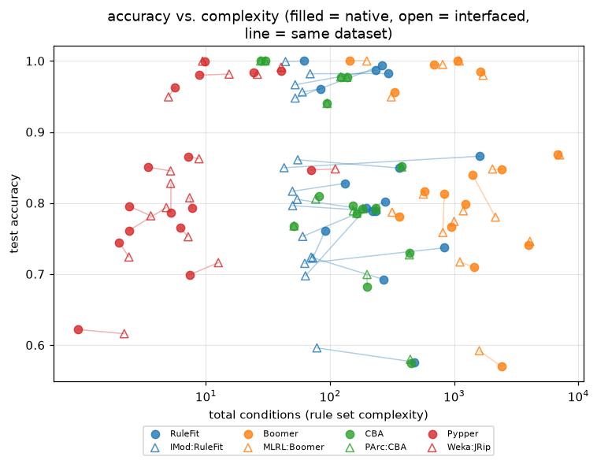
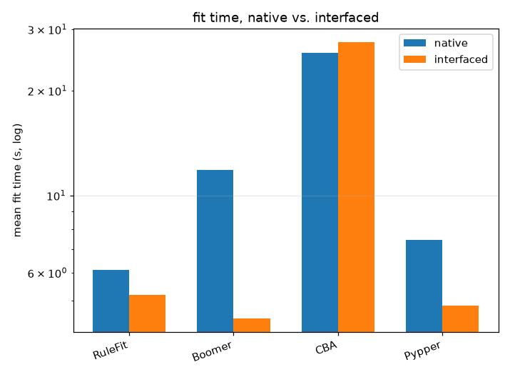

# Native rule learners vs. their external references

## Setup

**Full run** (16 datasets). Quick sanity check instead: `python demos/native_vs_interfaced.py` with no arguments.

Four native rule learners against the external reference implementations
they are modeled on, on 15 small/medium and
1 large binary datasets from `pyrulearn.experiments.catalog`.
Two more pairs are covered by their own demos instead: Slipper vs.
IMod:Slipper (`ripper_comparison.py`'s own preliminary check), and PyLORD
vs. the reference JavaLord (`demos/seco_learners_comparison.py`). A
fifth pair, OptimalRuleBoosting vs. RKD:RuleBoosting, is checked
separately below instead of in the main comparison -- see "Why optimal
rule boosting isn't in the main comparison". Across 2 small datasets (3-fold), OptimalRuleBoosting and RKD:RuleBoosting agreed closely on accuracy (mean 0.898 vs. 0.899, 0.001 apart; mean fit time 34.38s vs. 7.80s) -- but neither's exhaustive search scales to the main comparison's wider, one-hot-encoded feature counts within the 300s cap, a limit of the exhaustive-search approach itself rather than of either implementation, so the pair is checked here instead of in the main table below.

- **RuleFit** -- A sparse (L1) logistic regression over a random forest's leaves (100 trees, depth 4) -- the candidate pool native RuleFit doesn't yet grow itself (see the module docstring). Its own sparsity knob is a plain regularization strength (`C`, optionally `cv`-selected by predictive score) with no cap on the final rule count -- unlike IMod:RuleFit (right), it ends up keeping noticeably more, smaller rules for similar accuracy (measured: 70.8 rules/268.7 conditions vs. 25.3/59.6, mean). Neither a smaller fixed `C` nor `cv=` reproduces IMod:RuleFit's rule count reliably across datasets (tested: `cv=5` went from 67->28 rules on one dataset but 29->39, the wrong way, on another) -- it's a different sparsity *mechanism*, not a mismatched default, so left unmatched here.
  **IMod:RuleFit** -- imodels' RuleFit: gradient-boosted trees as the rule pool, then a sparse regression over their leaves, deliberately capped at `max_rules=30` -- it searches the regularization path for the sparsest fit under that ceiling (`get_best_alpha_under_max_rules`), rather than picking strength by predictive score alone.
- **Boomer** -- ENDER configured as BOOMER's single-label case: logistic loss, L2-regularized Newton steps, up to 1,000 rules.
  **MLRL:Boomer** -- The reference BOOMER implementation (`mlrl-boomer`), with its instance/feature sampling turned off to match native Boomer's full-data search (see PAIRS above).
- **CBA** -- Classification Based on Associations: mine class association rules (here capped at max_len=3, see ROADMAP.md), sort by precedence, select by database coverage (CBA-CB, "M1").
  **PArc:CBA** -- The reference CBA implementation (`pyarc`), mining with Borgelt's `fim`; its defaults mirror the native CBA's.
- **Pypper** -- IREP* growth-and-pruning plus `ReplaceReviseOptimization`, run per class -- a re-implementation of RIPPER, not a port.
  **Weka:JRip** -- Weka's reference RIPPER implementation, via a subprocess (`pyrulearn.interfaces.weka.WekaJRip`); also compared at a larger scale, and against wittgenstein's RIPPER too, in `demos/ripper_comparison.py`.

Protocol: 5-fold stratified cross-validation (3-fold for the large adult) (`pyrulearn.experiments.runner.run_cv`), one
`DataSpec` per training fold (`build_dataspec(max_intervals=8)`),
the test fold binarized against that same `DataSpec`. Each fit is capped
at 300s; a time-out or an error counts as a failure (and
as last in the ranking), not as the end of the run -- CBA/PArc:CBA's
itemset mining is the likeliest to hit this on wider data.

Measures: test accuracy, number of rules and conditions, fit time.

## Why optimal rule boosting isn't in the main comparison

Across 2 small datasets (3-fold), OptimalRuleBoosting and RKD:RuleBoosting agreed closely on accuracy (mean 0.898 vs. 0.899, 0.001 apart; mean fit time 34.38s vs. 7.80s) -- but neither's exhaustive search scales to the main comparison's wider, one-hot-encoded feature counts within the 300s cap, a limit of the exhaustive-search approach itself rather than of either implementation, so the pair is checked here instead of in the main table below.

| learner | accuracy | fit_time |
|---|---|---|
| OptimalRuleBoosting | 0.898 | 34.381 |
| RKD:RuleBoosting | 0.899 | 7.801 |

## Native vs. interfaced, pair by pair (mean across the 15 small/medium datasets and their folds)

| pair | learner | accuracy | n_rules | n_conditions | fit_time (s) | failures |
|---|---|--:|--:|--:|--:|--:|
| RuleFit | RuleFit | 0.836 | 70.8 | 268.7 | 1.90 | 0 |
| RuleFit | IMod:RuleFit | 0.823 | 25.3 | 59.6 | 2.66 | 0 |
| Boomer | Boomer | 0.839 | 234.1 | 1313.5 | 6.96 | 1 |
| Boomer | MLRL:Boomer | 0.835 | 229.8 | 1264.1 | 2.47 | 0 |
| CBA | CBA | 0.832 | 63.6 | 182.7 | 26.72 | 0 |
| CBA | PArc:CBA | 0.832 | 63.4 | 182.1 | 16.61 | 0 |
| Pypper | Pypper | 0.840 | 3.4 | 8.9 | 0.42 | 0 |
| Pypper | Weka:JRip | 0.842 | 4.0 | 10.4 | 0.87 | 0 |

## Summary by learner (mean rank across the same datasets)

| learner | accuracy | n_rules | n_conditions | fit_time (s) | wins | mean rank | failures |
|---|--:|--:|--:|--:|--:|--:|--:|
| Boomer | 0.839 | 234.1 | 1313.5 | 6.96 | 3.0 | 3.63 | 1 |
| Weka:JRip | 0.842 | 4.0 | 10.4 | 0.87 | 2.5 | 3.83 | 0 |
| Pypper | 0.840 | 3.4 | 8.9 | 0.42 | 5.0 | 4.27 | 0 |
| RuleFit | 0.836 | 70.8 | 268.7 | 1.90 | 0.7 | 4.30 | 0 |
| MLRL:Boomer | 0.835 | 229.8 | 1264.1 | 2.47 | 1.9 | 4.50 | 0 |
| CBA | 0.832 | 63.6 | 182.7 | 26.72 | 0.5 | 5.10 | 0 |
| IMod:RuleFit | 0.823 | 25.3 | 59.6 | 2.66 | 1.0 | 5.17 | 0 |
| PArc:CBA | 0.832 | 63.4 | 182.1 | 16.61 | 0.5 | 5.20 | 0 |

Sorted by mean rank. `wins` -- datasets where a learner's mean accuracy was (tied-for-)best, a tie split evenly; `mean rank` -- average accuracy rank across datasets, failures tied for last.

## The large dataset: adult

3-fold cross-validation, same 300s cap. `folds` counts the folds that finished; the other columns are means over those folds only.

| learner | folds | accuracy | n_rules | n_conditions | fit_time (s) |
|---|--:|--:|--:|--:|--:|
| Boomer | 3/3 | 0.868 | 751.0 | 6818.3 | 133.49 |
| CBA | 0/3 | -- | -- | -- | -- |
| IMod:RuleFit | 3/3 | 0.850 | 26.0 | 42.7 | 68.16 |
| MLRL:Boomer | 3/3 | 0.868 | 754.3 | 7067.3 | 53.73 |
| PArc:CBA | 0/3 | -- | -- | -- | -- |
| Pypper | 3/3 | 0.847 | 12.7 | 70.3 | 183.39 |
| RuleFit | 3/3 | 0.866 | 405.3 | 1612.0 | 111.18 |
| Weka:JRip | 3/3 | 0.848 | 19.3 | 110.3 | 103.65 |

## Per-dataset results, per learner (mean across folds)

| dataset | learner | accuracy | n_rules | n_conditions | fit_time |
|---|---|---|---|---|---|
| SPECT | Boomer | 0.816 | 128.200 | 581.000 | 0.258 |
| SPECT | CBA | 0.809 | 33.800 | 81.800 | 1.203 |
| SPECT | IMod:RuleFit | 0.817 | 21.200 | 49.800 | 1.417 |
| SPECT | MLRL:Boomer | 0.813 | 127.200 | 564.600 | 1.344 |
| SPECT | PArc:CBA | 0.805 | 31.800 | 76.600 | 0.355 |
| SPECT | Pypper | 0.787 | 1.000 | 5.200 | 0.064 |
| SPECT | RuleFit | 0.828 | 35.200 | 132.800 | 0.616 |
| SPECT | Weka:JRip | 0.828 | 1.000 | 5.200 | 0.318 |
| breast-cancer | Boomer | 0.710 | 263.800 | 1445.800 | 0.390 |
| breast-cancer | CBA | 0.682 | 69.200 | 199.600 | 2.729 |
| breast-cancer | IMod:RuleFit | 0.724 | 27.200 | 70.400 | 1.493 |
| breast-cancer | MLRL:Boomer | 0.717 | 230.000 | 1112.600 | 1.303 |
| breast-cancer | PArc:CBA | 0.699 | 68.800 | 198.600 | 1.285 |
| breast-cancer | Pypper | 0.745 | 1.200 | 2.000 | 0.067 |
| breast-cancer | RuleFit | 0.692 | 68.800 | 269.200 | 0.702 |
| breast-cancer | Weka:JRip | 0.724 | 1.200 | 2.400 | 0.325 |
| colic | Boomer | 0.840 | 290.200 | 1406.400 | 0.715 |
| colic | CBA | 0.793 | 79.000 | 232.400 | 41.165 |
| colic | IMod:RuleFit | 0.753 | 28.600 | 60.200 | 1.540 |
| colic | MLRL:Boomer | 0.780 | 337.800 | 2150.200 | 2.064 |
| colic | PArc:CBA | 0.791 | 80.000 | 235.400 | 20.188 |
| colic | Pypper | 0.851 | 1.600 | 3.400 | 0.296 |
| colic | RuleFit | 0.802 | 73.800 | 277.200 | 0.956 |
| colic | Weka:JRip | 0.845 | 2.600 | 5.200 | 0.481 |
| credit-approval | Boomer | 0.848 | 374.400 | 2420.400 | 1.104 |
| credit-approval | CBA | 0.852 | 130.200 | 379.600 | 19.664 |
| credit-approval | IMod:RuleFit | 0.861 | 24.200 | 55.000 | 1.665 |
| credit-approval | MLRL:Boomer | 0.848 | 343.400 | 2035.000 | 2.095 |
| credit-approval | PArc:CBA | 0.851 | 129.400 | 377.400 | 9.840 |
| credit-approval | Pypper | 0.865 | 2.800 | 7.200 | 0.388 |
| credit-approval | RuleFit | 0.849 | 92.800 | 362.000 | 1.327 |
| credit-approval | Weka:JRip | 0.862 | 4.200 | 8.800 | 0.547 |
| credit-g | Boomer | 0.741 | 571.000 | 3992.800 | 1.878 |
| credit-g | CBA | 0.730 | 147.000 | 436.400 | 55.611 |
| credit-g | IMod:RuleFit | 0.715 | 26.200 | 62.600 | 2.240 |
| credit-g | MLRL:Boomer | 0.746 | 583.200 | 4072.400 | 2.854 |
| credit-g | PArc:CBA | 0.727 | 146.800 | 435.800 | 35.439 |
| credit-g | Pypper | 0.699 | 2.400 | 7.400 | 0.475 |
| credit-g | RuleFit | 0.737 | 211.800 | 834.600 | 1.677 |
| credit-g | Weka:JRip | 0.716 | 3.400 | 12.600 | 0.681 |
| dresses-sales | Boomer | 0.570 | 359.200 | 2398.600 | 1.131 |
| dresses-sales | CBA | 0.574 | 155.200 | 448.400 | 102.299 |
| dresses-sales | IMod:RuleFit | 0.596 | 28.200 | 78.400 | 1.827 |
| dresses-sales | MLRL:Boomer | 0.592 | 291.400 | 1593.800 | 2.252 |
| dresses-sales | PArc:CBA | 0.580 | 153.200 | 442.800 | 37.991 |
| dresses-sales | Pypper | 0.622 | 1.200 | 1.400 | 0.339 |
| dresses-sales | RuleFit | 0.576 | 125.600 | 480.200 | 0.965 |
| dresses-sales | Weka:JRip | 0.616 | 1.600 | 2.200 | 0.641 |
| heart-c | Boomer | 0.799 | 240.800 | 1231.800 | 0.391 |
| heart-c | CBA | 0.792 | 62.200 | 182.400 | 6.088 |
| heart-c | IMod:RuleFit | 0.805 | 26.600 | 54.400 | 1.103 |
| heart-c | MLRL:Boomer | 0.789 | 239.800 | 1185.000 | 1.603 |
| heart-c | PArc:CBA | 0.792 | 62.800 | 184.200 | 2.882 |
| heart-c | Pypper | 0.766 | 2.400 | 6.200 | 0.106 |
| heart-c | RuleFit | 0.789 | 61.400 | 232.800 | 0.702 |
| heart-c | Weka:JRip | 0.752 | 3.200 | 7.200 | 0.372 |
| heart-h | Boomer | 0.813 | 167.600 | 832.000 | 0.333 |
| heart-h | CBA | 0.786 | 59.400 | 164.000 | 3.822 |
| heart-h | IMod:RuleFit | 0.697 | 26.000 | 63.400 | 1.054 |
| heart-h | MLRL:Boomer | 0.758 | 165.200 | 810.800 | 1.483 |
| heart-h | PArc:CBA | 0.786 | 59.400 | 164.000 | 1.839 |
| heart-h | Pypper | 0.796 | 1.600 | 2.400 | 0.085 |
| heart-h | RuleFit | 0.793 | 53.800 | 195.000 | 0.615 |
| heart-h | Weka:JRip | 0.782 | 2.200 | 3.600 | 0.387 |
| heart-statlog | Boomer | 0.767 | 198.400 | 952.000 | 0.374 |
| heart-statlog | CBA | 0.796 | 52.200 | 152.800 | 6.384 |
| heart-statlog | IMod:RuleFit | 0.796 | 24.200 | 50.000 | 1.539 |
| heart-statlog | MLRL:Boomer | 0.774 | 211.600 | 998.000 | 1.459 |
| heart-statlog | PArc:CBA | 0.789 | 52.600 | 154.000 | 3.641 |
| heart-statlog | Pypper | 0.793 | 3.600 | 7.800 | 0.205 |
| heart-statlog | RuleFit | 0.789 | 57.800 | 220.000 | 0.817 |
| heart-statlog | Weka:JRip | 0.807 | 3.400 | 7.400 | 0.353 |
| hepatitis | Boomer | 0.781 | 94.000 | 361.800 | 0.266 |
| hepatitis | CBA | 0.768 | 18.800 | 51.200 | 10.019 |
| hepatitis | IMod:RuleFit | 0.723 | 30.600 | 72.600 | 1.575 |
| hepatitis | MLRL:Boomer | 0.787 | 84.400 | 316.400 | 1.320 |
| hepatitis | PArc:CBA | 0.768 | 18.800 | 51.200 | 3.511 |
| hepatitis | Pypper | 0.761 | 1.800 | 2.400 | 0.077 |
| hepatitis | RuleFit | 0.761 | 28.800 | 91.600 | 0.552 |
| hepatitis | Weka:JRip | 0.794 | 2.200 | 4.800 | 0.342 |
| kr-vs-kp | Boomer | 0.995 | 121.400 | 684.200 | 2.066 |
| kr-vs-kp | CBA | 0.977 | 41.800 | 122.000 | 3.878 |
| kr-vs-kp | IMod:RuleFit | 0.967 | 19.200 | 52.400 | 2.682 |
| kr-vs-kp | MLRL:Boomer | 0.995 | 145.400 | 807.800 | 2.269 |
| kr-vs-kp | PArc:CBA | 0.977 | 41.800 | 122.000 | 2.185 |
| kr-vs-kp | Pypper | 0.986 | 11.800 | 40.200 | 1.069 |
| kr-vs-kp | RuleFit | 0.987 | 61.400 | 231.600 | 3.627 |
| kr-vs-kp | Weka:JRip | 0.991 | 13.400 | 40.400 | 0.954 |
| mushroom | Boomer | 1.000 | 41.250 | 143.500 | 89.970 |
| mushroom | CBA | 1.000 | 9.200 | 27.600 | 102.732 |
| mushroom | IMod:RuleFit | 0.999 | 20.600 | 43.800 | 13.500 |
| mushroom | MLRL:Boomer | 1.000 | 59.000 | 197.800 | 8.865 |
| mushroom | PArc:CBA | 1.000 | 9.200 | 27.600 | 113.339 |
| mushroom | Pypper | 1.000 | 6.600 | 9.800 | 2.071 |
| mushroom | RuleFit | 1.000 | 16.800 | 61.400 | 8.347 |
| mushroom | Weka:JRip | 1.000 | 6.000 | 9.400 | 5.397 |
| sick | Boomer | 0.985 | 277.000 | 1628.200 | 4.546 |
| sick | CBA | 0.977 | 52.000 | 138.000 | 42.733 |
| sick | IMod:RuleFit | 0.982 | 28.600 | 69.200 | 5.069 |
| sick | MLRL:Boomer | 0.980 | 282.000 | 1706.800 | 5.197 |
| sick | PArc:CBA | 0.977 | 51.600 | 136.800 | 15.811 |
| sick | Pypper | 0.980 | 2.800 | 8.800 | 0.728 |
| sick | RuleFit | 0.982 | 77.000 | 296.200 | 4.880 |
| sick | Weka:JRip | 0.981 | 4.800 | 15.400 | 1.451 |
| tic-tac-toe | Boomer | 1.000 | 245.800 | 1059.800 | 0.656 |
| tic-tac-toe | CBA | 1.000 | 10.000 | 30.000 | 1.942 |
| tic-tac-toe | IMod:RuleFit | 0.948 | 20.400 | 52.400 | 1.732 |
| tic-tac-toe | MLRL:Boomer | 1.000 | 254.800 | 1098.200 | 1.550 |
| tic-tac-toe | PArc:CBA | 1.000 | 10.000 | 30.000 | 0.664 |
| tic-tac-toe | Pypper | 0.983 | 8.000 | 24.200 | 0.233 |
| tic-tac-toe | RuleFit | 0.994 | 68.800 | 262.400 | 1.689 |
| tic-tac-toe | Weka:JRip | 0.981 | 8.400 | 26.000 | 0.471 |
| vote | Boomer | 0.956 | 99.800 | 329.800 | 0.367 |
| vote | CBA | 0.940 | 34.400 | 94.600 | 0.487 |
| vote | IMod:RuleFit | 0.956 | 27.000 | 59.800 | 1.512 |
| vote | MLRL:Boomer | 0.949 | 91.400 | 311.600 | 1.424 |
| vote | PArc:CBA | 0.940 | 34.400 | 94.600 | 0.153 |
| vote | Pypper | 0.963 | 2.600 | 5.600 | 0.061 |
| vote | RuleFit | 0.961 | 28.400 | 84.200 | 1.080 |
| vote | Weka:JRip | 0.949 | 2.200 | 5.000 | 0.299 |

