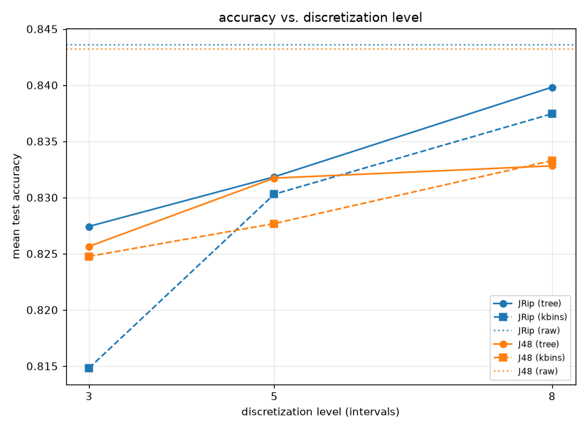

# Numeric attributes: intrinsic handling vs. discretization (JRip / J48)

## Setup

**Full run** (27 small and medium-sized datasets, all attributes numeric, 10-fold). For a quick sanity check instead (5 small datasets, 3-fold): `python demos/numeric_discretization.py` with no arguments -- its output isn't checked in (see `numeric_discretization_quick_report.md` after running it).

Weka's JRip and J48 compared across seven data preparations per dataset: `raw`
(Weka's own intrinsic numeric thresholding), our own decision-tree-based
discretization (`build_dataspec`/`tree_thresholds`) and `sklearn.preprocessing.
KBinsDiscretizer` (`strategy='quantile'`, unsupervised), each of the
latter two at 3, 5, 8 intervals. Both discretizers
are fit on the training fold only, per fold; the test fold is binarized
against that same fold's thresholds.

Measures: test accuracy, rule count, condition count, and (for the discretized
preps) the number of binary features that discretization produced. Fit time
is recorded but secondary here -- every fit is a single bounded Weka
subprocess call regardless of preparation. Each fit is capped at
120s; a timeout or an exception is recorded as a failure, not
fatal to the run.

Missing values: in the discretized preps a missing value makes both a
threshold feature and its negation false (e.g. neither `plas>=154.5` nor
`plas<154.5`), so a rule never covers it through that attribute. Weka's
own `raw` handling differs, which can hurt the discretized preps on
datasets with many missing values -- here mainly `diabetes` (376 of 768
rows with a missing value; `breast-w` has 16 of 699).

## Binary features produced per discretization level

| prep | mean binary features |
|---|--:|
| tree@3 | 91.5 |
| tree@5 | 164.0 |
| tree@8 | 271.8 |
| kbins@3 | 69.7 |
| kbins@5 | 136.3 |
| kbins@8 | 231.6 |

## Summary by variant (mean across every dataset and fold)

| variant | accuracy | n_rules | conds/rule | fit_time (s) | wins | mean rank |
|---|--:|--:|--:|--:|--:|--:|
| JRip:raw | 0.844 | 7.46 | 2.61 | 0.61 | 1.0 | 5.00 |
| J48:raw | 0.843 | 40.68 | 6.27 | 0.50 | 6.0 | 5.76 |
| JRip:tree@8 | 0.840 | 7.37 | 2.85 | 1.41 | 3.0 | 6.15 |
| J48:tree@8 | 0.833 | 38.00 | 7.31 | 1.31 | 3.0 | 6.91 |
| J48:kbins@8 | 0.833 | 42.97 | 6.99 | 1.19 | 4.0 | 6.93 |
| JRip:kbins@8 | 0.837 | 7.75 | 3.09 | 1.27 | 1.0 | 7.17 |
| J48:tree@5 | 0.832 | 30.54 | 6.49 | 0.98 | 2.0 | 7.35 |
| JRip:tree@5 | 0.832 | 6.94 | 2.82 | 1.03 | 0.0 | 7.56 |
| JRip:kbins@5 | 0.830 | 7.03 | 3.03 | 0.96 | 0.0 | 7.93 |
| JRip:tree@3 | 0.827 | 6.10 | 2.75 | 0.78 | 1.0 | 8.19 |
| J48:tree@3 | 0.826 | 23.26 | 5.42 | 0.75 | 2.0 | 8.22 |
| J48:kbins@5 | 0.828 | 36.57 | 6.04 | 0.88 | 0.0 | 8.24 |
| J48:kbins@3 | 0.825 | 27.54 | 4.84 | 0.64 | 2.0 | 9.13 |
| JRip:kbins@3 | 0.815 | 6.10 | 3.21 | 0.68 | 2.0 | 10.48 |

`wins` -- datasets where a variant's mean accuracy was (tied-for-)best, a tie split evenly; `mean rank` -- average accuracy rank across datasets, failures tied for last.

## Per-dataset results, per variant (mean across folds)

| dataset | algorithm | prep | accuracy | n_rules | n_conditions | conds_per_rule | fit_time |
|---|---|---|---|---|---|---|---|
| analcatdata_authorship | J48 | kbins@3 | 0.924 | 26.200 | 145.900 | 5.549 | 1.062 |
| analcatdata_authorship | J48 | kbins@5 | 0.906 | 25.500 | 140.200 | 5.490 | 1.666 |
| analcatdata_authorship | J48 | kbins@8 | 0.936 | 25.300 | 148.700 | 5.870 | 2.592 |
| analcatdata_authorship | J48 | raw | 0.951 | 20.200 | 97.500 | 4.819 | 0.595 |
| analcatdata_authorship | J48 | tree@3 | 0.935 | 20.600 | 107.000 | 5.160 | 1.311 |
| analcatdata_authorship | J48 | tree@5 | 0.935 | 19.700 | 100.600 | 5.088 | 1.910 |
| analcatdata_authorship | J48 | tree@8 | 0.945 | 18.300 | 91.400 | 4.981 | 2.823 |
| analcatdata_authorship | JRip | kbins@3 | 0.927 | 11.200 | 31.500 | 2.811 | 1.178 |
| analcatdata_authorship | JRip | kbins@5 | 0.935 | 10.000 | 25.400 | 2.551 | 1.876 |
| analcatdata_authorship | JRip | kbins@8 | 0.933 | 8.700 | 21.100 | 2.422 | 2.619 |
| analcatdata_authorship | JRip | raw | 0.947 | 9.800 | 18.700 | 1.909 | 0.782 |
| analcatdata_authorship | JRip | tree@3 | 0.951 | 10.800 | 21.600 | 2.000 | 1.374 |
| analcatdata_authorship | JRip | tree@5 | 0.936 | 10.100 | 19.800 | 1.963 | 2.001 |
| analcatdata_authorship | JRip | tree@8 | 0.937 | 10.000 | 19.700 | 1.968 | 3.049 |
| balance-scale | J48 | kbins@3 | 0.782 | 24.400 | 128.100 | 5.243 | 0.406 |
| balance-scale | J48 | kbins@5 | 0.793 | 24.000 | 134.700 | 5.524 | 0.427 |
| balance-scale | J48 | kbins@8 | 0.789 | 34.500 | 223.900 | 6.435 | 0.441 |
| balance-scale | J48 | raw | 0.782 | 42.900 | 278.000 | 6.454 | 0.370 |
| balance-scale | J48 | tree@3 | 0.776 | 40.200 | 309.300 | 7.680 | 0.487 |
| balance-scale | J48 | tree@5 | 0.776 | 40.200 | 309.300 | 7.680 | 0.468 |
| balance-scale | J48 | tree@8 | 0.776 | 40.200 | 309.300 | 7.680 | 0.483 |
| balance-scale | JRip | kbins@3 | 0.787 | 8.100 | 25.600 | 3.133 | 0.426 |
| balance-scale | JRip | kbins@5 | 0.800 | 7.400 | 21.900 | 2.913 | 0.433 |
| balance-scale | JRip | kbins@8 | 0.827 | 9.500 | 30.600 | 3.205 | 0.478 |
| balance-scale | JRip | raw | 0.794 | 10.000 | 29.900 | 2.984 | 0.425 |
| balance-scale | JRip | tree@3 | 0.763 | 7.400 | 23.800 | 3.212 | 0.486 |
| balance-scale | JRip | tree@5 | 0.763 | 7.400 | 23.800 | 3.212 | 0.479 |
| balance-scale | JRip | tree@8 | 0.763 | 7.400 | 23.800 | 3.212 | 0.487 |
| banknote-authentication | J48 | kbins@3 | 0.944 | 15.100 | 74.300 | 4.907 | 0.455 |
| banknote-authentication | J48 | kbins@5 | 0.985 | 20.100 | 99.400 | 4.929 | 0.547 |
| banknote-authentication | J48 | kbins@8 | 0.993 | 17.700 | 88.800 | 4.962 | 0.614 |
| banknote-authentication | J48 | raw | 0.987 | 15.600 | 71.000 | 4.524 | 0.429 |
| banknote-authentication | J48 | tree@3 | 0.913 | 4.900 | 12.400 | 2.493 | 0.470 |
| banknote-authentication | J48 | tree@5 | 0.970 | 9.400 | 33.500 | 3.491 | 0.522 |
| banknote-authentication | J48 | tree@8 | 0.987 | 11.300 | 44.300 | 3.881 | 0.607 |
| banknote-authentication | JRip | kbins@3 | 0.937 | 5.400 | 16.800 | 3.087 | 0.518 |
| banknote-authentication | JRip | kbins@5 | 0.983 | 7.700 | 23.800 | 3.093 | 0.597 |
| banknote-authentication | JRip | kbins@8 | 0.991 | 8.300 | 24.400 | 2.946 | 0.676 |
| banknote-authentication | JRip | raw | 0.980 | 7.100 | 16.000 | 2.261 | 0.488 |
| banknote-authentication | JRip | tree@3 | 0.910 | 2.400 | 5.200 | 2.150 | 0.466 |
| banknote-authentication | JRip | tree@5 | 0.972 | 4.700 | 10.400 | 2.185 | 0.562 |
| banknote-authentication | JRip | tree@8 | 0.989 | 5.300 | 12.000 | 2.256 | 0.661 |
| blood-transfusion-service-center | J48 | kbins@3 | 0.778 | 4.000 | 9.000 | 2.250 | 0.412 |
| blood-transfusion-service-center | J48 | kbins@5 | 0.770 | 6.100 | 20.900 | 3.368 | 0.449 |
| blood-transfusion-service-center | J48 | kbins@8 | 0.783 | 6.500 | 24.300 | 3.547 | 0.515 |
| blood-transfusion-service-center | J48 | raw | 0.790 | 6.800 | 26.900 | 3.558 | 0.369 |
| blood-transfusion-service-center | J48 | tree@3 | 0.793 | 5.000 | 14.000 | 2.800 | 0.413 |
| blood-transfusion-service-center | J48 | tree@5 | 0.794 | 5.400 | 16.200 | 2.954 | 0.452 |
| blood-transfusion-service-center | J48 | tree@8 | 0.787 | 6.600 | 22.300 | 3.299 | 0.525 |
| blood-transfusion-service-center | JRip | kbins@3 | 0.766 | 1.000 | 3.100 | 3.100 | 0.429 |
| blood-transfusion-service-center | JRip | kbins@5 | 0.774 | 1.200 | 3.700 | 3.050 | 0.464 |
| blood-transfusion-service-center | JRip | kbins@8 | 0.785 | 1.200 | 4.100 | 3.350 | 0.536 |
| blood-transfusion-service-center | JRip | raw | 0.783 | 1.900 | 5.200 | 2.750 | 0.404 |
| blood-transfusion-service-center | JRip | tree@3 | 0.793 | 2.000 | 5.100 | 2.550 | 0.443 |
| blood-transfusion-service-center | JRip | tree@5 | 0.790 | 2.100 | 5.400 | 2.550 | 0.464 |
| blood-transfusion-service-center | JRip | tree@8 | 0.791 | 2.000 | 5.100 | 2.550 | 0.540 |
| breast-w | J48 | kbins@3 | 0.934 | 11.500 | 45.100 | 3.856 | 0.378 |
| breast-w | J48 | kbins@5 | 0.944 | 8.600 | 29.400 | 3.407 | 0.442 |
| breast-w | J48 | kbins@8 | 0.941 | 10.300 | 39.800 | 3.837 | 0.492 |
| breast-w | J48 | raw | 0.930 | 12.200 | 52.100 | 4.159 | 0.388 |
| breast-w | J48 | tree@3 | 0.926 | 12.400 | 61.900 | 4.765 | 0.744 |
| breast-w | J48 | tree@5 | 0.926 | 12.400 | 61.900 | 4.765 | 0.715 |
| breast-w | J48 | tree@8 | 0.926 | 12.400 | 61.900 | 4.765 | 0.717 |
| breast-w | JRip | kbins@3 | 0.961 | 3.600 | 8.700 | 2.385 | 0.398 |
| breast-w | JRip | kbins@5 | 0.949 | 4.200 | 8.600 | 1.992 | 0.450 |
| breast-w | JRip | kbins@8 | 0.951 | 4.400 | 9.200 | 2.085 | 0.493 |
| breast-w | JRip | raw | 0.954 | 5.000 | 10.100 | 1.955 | 0.409 |
| breast-w | JRip | tree@3 | 0.948 | 5.100 | 12.900 | 2.531 | 0.781 |
| breast-w | JRip | tree@5 | 0.948 | 5.100 | 12.900 | 2.531 | 0.750 |
| breast-w | JRip | tree@8 | 0.948 | 5.100 | 12.900 | 2.531 | 0.745 |
| climate-model-simulation-crashes | J48 | kbins@3 | 0.898 | 14.800 | 82.900 | 5.567 | 0.477 |
| climate-model-simulation-crashes | J48 | kbins@5 | 0.919 | 15.200 | 89.300 | 5.781 | 0.606 |
| climate-model-simulation-crashes | J48 | kbins@8 | 0.902 | 15.700 | 101.100 | 6.303 | 0.805 |
| climate-model-simulation-crashes | J48 | raw | 0.919 | 12.100 | 59.600 | 4.912 | 0.402 |
| climate-model-simulation-crashes | J48 | tree@3 | 0.937 | 8.800 | 31.800 | 3.544 | 0.503 |
| climate-model-simulation-crashes | J48 | tree@5 | 0.931 | 10.000 | 42.200 | 4.058 | 0.623 |
| climate-model-simulation-crashes | J48 | tree@8 | 0.933 | 10.600 | 45.800 | 4.244 | 0.807 |
| climate-model-simulation-crashes | JRip | kbins@3 | 0.919 | 2.600 | 10.600 | 4.067 | 0.505 |
| climate-model-simulation-crashes | JRip | kbins@5 | 0.941 | 2.600 | 9.300 | 3.533 | 0.662 |
| climate-model-simulation-crashes | JRip | kbins@8 | 0.909 | 2.900 | 11.400 | 3.975 | 0.803 |
| climate-model-simulation-crashes | JRip | raw | 0.931 | 2.000 | 6.600 | 3.283 | 0.484 |
| climate-model-simulation-crashes | JRip | tree@3 | 0.915 | 2.500 | 7.500 | 2.953 | 0.506 |
| climate-model-simulation-crashes | JRip | tree@5 | 0.939 | 2.700 | 8.400 | 3.100 | 0.642 |
| climate-model-simulation-crashes | JRip | tree@8 | 0.948 | 2.700 | 8.100 | 3.017 | 0.816 |
| diabetes | J48 | kbins@3 | 0.645 | 22.700 | 138.800 | 6.010 | 0.488 |
| diabetes | J48 | kbins@5 | 0.553 | 57.300 | 512.200 | 8.929 | 0.602 |
| diabetes | J48 | kbins@8 | 0.539 | 52.500 | 564.400 | 10.549 | 0.725 |
| diabetes | J48 | raw | 0.699 | 16.100 | 83.000 | 5.098 | 0.387 |
| diabetes | J48 | tree@3 | 0.581 | 27.800 | 190.100 | 6.729 | 0.483 |
| diabetes | J48 | tree@5 | 0.594 | 36.200 | 310.600 | 8.515 | 0.605 |
| diabetes | J48 | tree@8 | 0.566 | 43.000 | 438.700 | 10.118 | 0.736 |
| diabetes | JRip | kbins@3 | 0.763 | 1.900 | 5.900 | 2.883 | 0.439 |
| diabetes | JRip | kbins@5 | 0.753 | 3.100 | 9.300 | 2.917 | 0.569 |
| diabetes | JRip | kbins@8 | 0.755 | 3.500 | 11.200 | 3.067 | 0.660 |
| diabetes | JRip | raw | 0.756 | 2.600 | 6.400 | 2.383 | 0.447 |
| diabetes | JRip | tree@3 | 0.740 | 3.100 | 8.900 | 2.858 | 0.488 |
| diabetes | JRip | tree@5 | 0.719 | 4.000 | 13.500 | 3.277 | 0.584 |
| diabetes | JRip | tree@8 | 0.725 | 3.900 | 12.400 | 3.133 | 0.697 |
| ecoli | J48 | kbins@3 | 0.809 | 12.300 | 50.600 | 4.103 | 0.383 |
| ecoli | J48 | kbins@5 | 0.807 | 15.600 | 69.700 | 4.413 | 0.441 |
| ecoli | J48 | kbins@8 | 0.828 | 13.900 | 59.300 | 4.143 | 0.474 |
| ecoli | J48 | raw | 0.807 | 18.800 | 95.200 | 4.959 | 0.366 |
| ecoli | J48 | tree@3 | 0.801 | 11.700 | 46.600 | 3.946 | 0.414 |
| ecoli | J48 | tree@5 | 0.816 | 14.000 | 63.900 | 4.438 | 0.441 |
| ecoli | J48 | tree@8 | 0.801 | 15.600 | 75.300 | 4.780 | 0.487 |
| ecoli | JRip | kbins@3 | 0.795 | 5.500 | 14.100 | 2.550 | 0.399 |
| ecoli | JRip | kbins@5 | 0.809 | 7.700 | 20.100 | 2.609 | 0.459 |
| ecoli | JRip | kbins@8 | 0.825 | 6.000 | 14.400 | 2.363 | 0.511 |
| ecoli | JRip | raw | 0.816 | 8.100 | 17.000 | 2.126 | 0.423 |
| ecoli | JRip | tree@3 | 0.828 | 6.700 | 14.500 | 2.167 | 0.395 |
| ecoli | JRip | tree@5 | 0.816 | 7.500 | 16.400 | 2.188 | 0.453 |
| ecoli | JRip | tree@8 | 0.834 | 7.200 | 16.200 | 2.258 | 0.492 |
| glass | J48 | kbins@3 | 0.691 | 21.900 | 109.400 | 4.988 | 0.401 |
| glass | J48 | kbins@5 | 0.673 | 28.000 | 176.100 | 6.239 | 0.451 |
| glass | J48 | kbins@8 | 0.758 | 26.100 | 169.300 | 6.432 | 0.505 |
| glass | J48 | raw | 0.665 | 23.600 | 140.900 | 5.930 | 0.391 |
| glass | J48 | tree@3 | 0.678 | 14.400 | 71.000 | 4.898 | 0.422 |
| glass | J48 | tree@5 | 0.664 | 20.000 | 116.500 | 5.789 | 0.470 |
| glass | J48 | tree@8 | 0.678 | 22.700 | 141.200 | 6.170 | 0.531 |
| glass | JRip | kbins@3 | 0.612 | 5.500 | 18.000 | 3.265 | 0.370 |
| glass | JRip | kbins@5 | 0.697 | 7.400 | 21.900 | 2.940 | 0.453 |
| glass | JRip | kbins@8 | 0.630 | 8.300 | 22.100 | 2.682 | 0.487 |
| glass | JRip | raw | 0.664 | 6.700 | 15.100 | 2.230 | 0.384 |
| glass | JRip | tree@3 | 0.659 | 6.600 | 17.400 | 2.661 | 0.390 |
| glass | JRip | tree@5 | 0.660 | 6.400 | 15.400 | 2.405 | 0.429 |
| glass | JRip | tree@8 | 0.668 | 6.600 | 16.100 | 2.434 | 0.505 |
| ionosphere | J48 | kbins@3 | 0.874 | 19.200 | 94.300 | 4.895 | 0.503 |
| ionosphere | J48 | kbins@5 | 0.883 | 16.600 | 93.200 | 5.565 | 0.679 |
| ionosphere | J48 | kbins@8 | 0.883 | 16.400 | 86.400 | 5.216 | 0.876 |
| ionosphere | J48 | raw | 0.892 | 13.200 | 70.900 | 5.330 | 0.405 |
| ionosphere | J48 | tree@3 | 0.923 | 10.100 | 52.400 | 5.010 | 0.529 |
| ionosphere | J48 | tree@5 | 0.920 | 9.600 | 49.500 | 5.017 | 0.666 |
| ionosphere | J48 | tree@8 | 0.937 | 8.200 | 37.200 | 4.476 | 0.932 |
| ionosphere | JRip | kbins@3 | 0.877 | 6.200 | 14.100 | 2.248 | 0.514 |
| ionosphere | JRip | kbins@5 | 0.883 | 6.200 | 12.000 | 1.933 | 0.715 |
| ionosphere | JRip | kbins@8 | 0.857 | 5.800 | 11.400 | 1.869 | 0.895 |
| ionosphere | JRip | raw | 0.886 | 4.000 | 5.700 | 1.380 | 0.436 |
| ionosphere | JRip | tree@3 | 0.897 | 4.700 | 6.500 | 1.343 | 0.503 |
| ionosphere | JRip | tree@5 | 0.863 | 4.700 | 7.500 | 1.522 | 0.669 |
| ionosphere | JRip | tree@8 | 0.869 | 5.800 | 10.000 | 1.629 | 0.910 |
| iris | J48 | kbins@3 | 0.933 | 4.600 | 12.200 | 2.573 | 0.327 |
| iris | J48 | kbins@5 | 0.907 | 8.000 | 28.400 | 3.451 | 0.366 |
| iris | J48 | kbins@8 | 0.960 | 4.100 | 9.300 | 2.233 | 0.382 |
| iris | J48 | raw | 0.927 | 4.500 | 11.600 | 2.522 | 0.334 |
| iris | J48 | tree@3 | 0.920 | 3.000 | 5.000 | 1.667 | 0.336 |
| iris | J48 | tree@5 | 0.933 | 3.800 | 8.200 | 2.133 | 0.376 |
| iris | J48 | tree@8 | 0.940 | 4.700 | 12.900 | 2.627 | 0.378 |
| iris | JRip | kbins@3 | 0.920 | 2.600 | 4.200 | 1.583 | 0.356 |
| iris | JRip | kbins@5 | 0.920 | 4.000 | 8.300 | 2.085 | 0.373 |
| iris | JRip | kbins@8 | 0.953 | 2.700 | 3.900 | 1.442 | 0.418 |
| iris | JRip | raw | 0.927 | 2.600 | 4.300 | 1.683 | 0.338 |
| iris | JRip | tree@3 | 0.920 | 2.100 | 3.100 | 1.450 | 0.364 |
| iris | JRip | tree@5 | 0.913 | 2.700 | 3.200 | 1.142 | 0.359 |
| iris | JRip | tree@8 | 0.953 | 2.500 | 3.900 | 1.567 | 0.401 |
| kc1 | J48 | kbins@3 | 0.845 | 1.000 | 0.000 | 0.000 | 0.644 |
| kc1 | J48 | kbins@5 | 0.840 | 11.700 | 59.900 | 4.524 | 0.947 |
| kc1 | J48 | kbins@8 | 0.851 | 17.700 | 125.900 | 6.749 | 1.285 |
| kc1 | J48 | raw | 0.845 | 55.400 | 520.000 | 9.108 | 0.523 |
| kc1 | J48 | tree@3 | 0.854 | 18.700 | 129.700 | 6.722 | 0.802 |
| kc1 | J48 | tree@5 | 0.839 | 32.800 | 268.900 | 7.648 | 1.207 |
| kc1 | J48 | tree@8 | 0.849 | 51.100 | 553.600 | 10.723 | 1.751 |
| kc1 | JRip | kbins@3 | 0.845 | 0.000 | 0.000 | n/a | 0.608 |
| kc1 | JRip | kbins@5 | 0.842 | 1.200 | 4.100 | 3.300 | 0.950 |
| kc1 | JRip | kbins@8 | 0.849 | 1.900 | 6.800 | 3.483 | 1.310 |
| kc1 | JRip | raw | 0.847 | 2.300 | 6.900 | 2.842 | 0.628 |
| kc1 | JRip | tree@3 | 0.851 | 2.400 | 7.800 | 3.083 | 0.855 |
| kc1 | JRip | tree@5 | 0.848 | 2.900 | 10.500 | 3.433 | 1.219 |
| kc1 | JRip | tree@8 | 0.852 | 3.000 | 11.200 | 3.600 | 1.744 |
| kc2 | J48 | kbins@3 | 0.812 | 9.000 | 40.200 | 4.139 | 0.470 |
| kc2 | J48 | kbins@5 | 0.822 | 7.200 | 28.200 | 3.219 | 0.617 |
| kc2 | J48 | kbins@8 | 0.808 | 14.600 | 95.700 | 5.605 | 0.770 |
| kc2 | J48 | raw | 0.824 | 18.900 | 106.900 | 5.210 | 0.433 |
| kc2 | J48 | tree@3 | 0.837 | 11.300 | 57.000 | 4.645 | 0.579 |
| kc2 | J48 | tree@5 | 0.841 | 15.300 | 102.400 | 5.859 | 0.707 |
| kc2 | J48 | tree@8 | 0.841 | 20.300 | 155.900 | 7.245 | 0.931 |
| kc2 | JRip | kbins@3 | 0.820 | 1.100 | 4.100 | 3.800 | 0.467 |
| kc2 | JRip | kbins@5 | 0.826 | 1.300 | 2.400 | 1.750 | 0.628 |
| kc2 | JRip | kbins@8 | 0.826 | 1.600 | 4.000 | 2.333 | 0.774 |
| kc2 | JRip | raw | 0.824 | 1.600 | 3.100 | 1.833 | 0.465 |
| kc2 | JRip | tree@3 | 0.831 | 2.100 | 5.900 | 2.458 | 0.547 |
| kc2 | JRip | tree@5 | 0.822 | 1.900 | 4.000 | 1.833 | 0.722 |
| kc2 | JRip | tree@8 | 0.829 | 2.400 | 6.000 | 2.275 | 0.918 |
| mfeat-morphological | J48 | kbins@3 | 0.660 | 13.000 | 55.700 | 4.280 | 0.587 |
| mfeat-morphological | J48 | kbins@5 | 0.657 | 24.100 | 147.600 | 6.126 | 0.724 |
| mfeat-morphological | J48 | kbins@8 | 0.698 | 32.000 | 219.500 | 6.841 | 0.858 |
| mfeat-morphological | J48 | raw | 0.723 | 80.100 | 704.300 | 8.790 | 0.555 |
| mfeat-morphological | J48 | tree@3 | 0.673 | 16.800 | 81.700 | 4.831 | 0.757 |
| mfeat-morphological | J48 | tree@5 | 0.668 | 22.100 | 123.800 | 5.563 | 0.840 |
| mfeat-morphological | J48 | tree@8 | 0.695 | 28.000 | 177.600 | 6.289 | 0.910 |
| mfeat-morphological | JRip | kbins@3 | 0.565 | 9.100 | 22.800 | 2.503 | 0.669 |
| mfeat-morphological | JRip | kbins@5 | 0.567 | 10.600 | 28.900 | 2.703 | 0.791 |
| mfeat-morphological | JRip | kbins@8 | 0.681 | 16.400 | 44.400 | 2.696 | 0.975 |
| mfeat-morphological | JRip | raw | 0.696 | 20.400 | 48.700 | 2.384 | 0.744 |
| mfeat-morphological | JRip | tree@3 | 0.619 | 10.900 | 24.600 | 2.272 | 0.820 |
| mfeat-morphological | JRip | tree@5 | 0.579 | 12.000 | 31.700 | 2.631 | 0.923 |
| mfeat-morphological | JRip | tree@8 | 0.657 | 14.800 | 39.800 | 2.675 | 1.056 |
| pc1 | J48 | kbins@3 | 0.931 | 1.000 | 0.000 | 0.000 | 0.577 |
| pc1 | J48 | kbins@5 | 0.931 | 1.000 | 0.000 | 0.000 | 0.818 |
| pc1 | J48 | kbins@8 | 0.934 | 3.500 | 7.700 | 1.855 | 1.103 |
| pc1 | J48 | raw | 0.936 | 11.600 | 49.400 | 3.895 | 0.484 |
| pc1 | J48 | tree@3 | 0.928 | 4.800 | 12.800 | 2.475 | 0.651 |
| pc1 | J48 | tree@5 | 0.928 | 6.400 | 20.700 | 3.128 | 0.917 |
| pc1 | J48 | tree@8 | 0.931 | 7.300 | 26.100 | 3.272 | 1.253 |
| pc1 | JRip | kbins@3 | 0.931 | 0.000 | 0.000 | n/a | 0.605 |
| pc1 | JRip | kbins@5 | 0.931 | 0.000 | 0.000 | n/a | 0.862 |
| pc1 | JRip | kbins@8 | 0.928 | 0.400 | 2.000 | 5.000 | 1.121 |
| pc1 | JRip | raw | 0.936 | 2.200 | 5.900 | 2.733 | 0.538 |
| pc1 | JRip | tree@3 | 0.930 | 1.800 | 5.000 | 2.700 | 0.645 |
| pc1 | JRip | tree@5 | 0.931 | 2.400 | 6.800 | 2.850 | 0.927 |
| pc1 | JRip | tree@8 | 0.930 | 2.600 | 7.400 | 2.745 | 1.267 |
| pc3 | J48 | kbins@3 | 0.894 | 7.800 | 62.100 | 2.461 | 0.877 |
| pc3 | J48 | kbins@5 | 0.888 | 35.900 | 380.800 | 10.345 | 1.331 |
| pc3 | J48 | kbins@8 | 0.880 | 40.400 | 444.600 | 10.688 | 1.949 |
| pc3 | J48 | raw | 0.869 | 37.500 | 343.000 | 8.249 | 0.567 |
| pc3 | J48 | tree@3 | 0.885 | 24.800 | 193.000 | 7.284 | 1.156 |
| pc3 | J48 | tree@5 | 0.891 | 39.600 | 426.000 | 10.400 | 1.676 |
| pc3 | J48 | tree@8 | 0.880 | 53.500 | 698.000 | 13.103 | 2.442 |
| pc3 | JRip | kbins@3 | 0.891 | 0.500 | 2.600 | 5.200 | 0.919 |
| pc3 | JRip | kbins@5 | 0.886 | 1.800 | 8.000 | 4.427 | 1.374 |
| pc3 | JRip | kbins@8 | 0.891 | 2.500 | 11.500 | 4.533 | 2.028 |
| pc3 | JRip | raw | 0.894 | 1.900 | 7.600 | 4.120 | 0.660 |
| pc3 | JRip | tree@3 | 0.881 | 2.900 | 12.800 | 4.537 | 1.122 |
| pc3 | JRip | tree@5 | 0.883 | 3.300 | 13.700 | 4.142 | 1.676 |
| pc3 | JRip | tree@8 | 0.882 | 2.700 | 11.600 | 4.175 | 2.489 |
| pc4 | J48 | kbins@3 | 0.881 | 42.600 | 420.300 | 9.755 | 0.840 |
| pc4 | J48 | kbins@5 | 0.892 | 31.200 | 312.700 | 9.881 | 1.185 |
| pc4 | J48 | kbins@8 | 0.883 | 59.500 | 888.200 | 14.889 | 1.820 |
| pc4 | J48 | raw | 0.893 | 39.100 | 378.900 | 9.161 | 0.557 |
| pc4 | J48 | tree@3 | 0.887 | 34.000 | 348.400 | 10.028 | 1.059 |
| pc4 | J48 | tree@5 | 0.897 | 49.900 | 731.200 | 14.364 | 1.469 |
| pc4 | J48 | tree@8 | 0.873 | 57.000 | 1008.700 | 17.381 | 2.292 |
| pc4 | JRip | kbins@3 | 0.871 | 3.000 | 13.800 | 4.487 | 0.855 |
| pc4 | JRip | kbins@5 | 0.884 | 2.600 | 12.100 | 4.568 | 1.288 |
| pc4 | JRip | kbins@8 | 0.882 | 4.900 | 25.600 | 5.203 | 1.916 |
| pc4 | JRip | raw | 0.892 | 3.400 | 14.100 | 4.125 | 0.668 |
| pc4 | JRip | tree@3 | 0.891 | 3.500 | 14.800 | 4.142 | 1.052 |
| pc4 | JRip | tree@5 | 0.890 | 4.500 | 22.300 | 4.942 | 1.574 |
| pc4 | JRip | tree@8 | 0.885 | 4.200 | 19.700 | 4.650 | 2.306 |
| phoneme | J48 | kbins@3 | 0.814 | 25.100 | 129.100 | 5.096 | 0.808 |
| phoneme | J48 | kbins@5 | 0.842 | 88.500 | 741.500 | 8.319 | 1.271 |
| phoneme | J48 | kbins@8 | 0.861 | 155.800 | 1579.100 | 10.132 | 1.766 |
| phoneme | J48 | raw | 0.869 | 116.000 | 1046.100 | 9.001 | 0.814 |
| phoneme | J48 | tree@3 | 0.805 | 28.200 | 154.100 | 5.456 | 0.886 |
| phoneme | J48 | tree@5 | 0.825 | 60.300 | 438.200 | 7.194 | 1.224 |
| phoneme | J48 | tree@8 | 0.854 | 116.200 | 1057.500 | 9.048 | 1.655 |
| phoneme | JRip | kbins@3 | 0.815 | 7.900 | 33.200 | 4.173 | 1.052 |
| phoneme | JRip | kbins@5 | 0.833 | 14.200 | 73.900 | 5.158 | 1.733 |
| phoneme | JRip | kbins@8 | 0.847 | 20.500 | 107.900 | 5.241 | 2.429 |
| phoneme | JRip | raw | 0.853 | 17.700 | 79.300 | 4.443 | 1.296 |
| phoneme | JRip | tree@3 | 0.802 | 7.800 | 33.200 | 4.224 | 1.004 |
| phoneme | JRip | tree@5 | 0.822 | 12.100 | 59.400 | 4.904 | 1.458 |
| phoneme | JRip | tree@8 | 0.838 | 16.700 | 86.500 | 5.174 | 2.282 |
| qsar-biodeg | J48 | kbins@3 | 0.814 | 51.500 | 382.600 | 7.391 | 0.981 |
| qsar-biodeg | J48 | kbins@5 | 0.833 | 54.700 | 449.500 | 8.185 | 1.333 |
| qsar-biodeg | J48 | kbins@8 | 0.824 | 54.000 | 557.200 | 10.262 | 1.902 |
| qsar-biodeg | J48 | raw | 0.829 | 56.700 | 490.900 | 8.668 | 0.757 |
| qsar-biodeg | J48 | tree@3 | 0.826 | 48.100 | 474.500 | 9.773 | 1.567 |
| qsar-biodeg | J48 | tree@5 | 0.833 | 52.100 | 545.000 | 10.454 | 2.178 |
| qsar-biodeg | J48 | tree@8 | 0.842 | 45.600 | 452.600 | 9.839 | 2.872 |
| qsar-biodeg | JRip | kbins@3 | 0.812 | 6.700 | 27.300 | 4.058 | 0.906 |
| qsar-biodeg | JRip | kbins@5 | 0.834 | 6.400 | 25.700 | 4.032 | 1.566 |
| qsar-biodeg | JRip | kbins@8 | 0.827 | 7.800 | 32.900 | 4.194 | 2.070 |
| qsar-biodeg | JRip | raw | 0.833 | 5.800 | 20.000 | 3.440 | 0.776 |
| qsar-biodeg | JRip | tree@3 | 0.828 | 6.100 | 24.500 | 3.992 | 1.649 |
| qsar-biodeg | JRip | tree@5 | 0.840 | 6.800 | 26.700 | 3.896 | 2.165 |
| qsar-biodeg | JRip | tree@8 | 0.816 | 7.000 | 27.300 | 3.860 | 2.847 |
| segment | J48 | kbins@3 | 0.919 | 54.500 | 372.300 | 6.811 | 2.200 |
| segment | J48 | kbins@5 | 0.935 | 60.700 | 494.300 | 8.113 | 3.482 |
| segment | J48 | kbins@8 | 0.945 | 53.800 | 512.500 | 9.480 | 4.781 |
| segment | J48 | raw | 0.966 | 40.900 | 319.000 | 7.768 | 1.266 |
| segment | J48 | tree@3 | 0.905 | 36.500 | 310.000 | 8.405 | 2.426 |
| segment | J48 | tree@5 | 0.949 | 34.700 | 284.000 | 8.144 | 3.363 |
| segment | J48 | tree@8 | 0.954 | 41.300 | 389.400 | 9.371 | 4.753 |
| segment | JRip | kbins@3 | 0.908 | 22.800 | 80.700 | 3.544 | 2.466 |
| segment | JRip | kbins@5 | 0.919 | 24.000 | 80.200 | 3.309 | 3.717 |
| segment | JRip | kbins@8 | 0.944 | 22.600 | 65.100 | 2.879 | 5.059 |
| segment | JRip | raw | 0.951 | 18.100 | 52.100 | 2.887 | 1.716 |
| segment | JRip | tree@3 | 0.897 | 15.600 | 43.000 | 2.715 | 2.696 |
| segment | JRip | tree@5 | 0.943 | 19.300 | 55.800 | 2.865 | 3.656 |
| segment | JRip | tree@8 | 0.950 | 20.200 | 58.800 | 2.883 | 5.440 |
| sonar | J48 | kbins@3 | 0.793 | 18.100 | 89.100 | 4.897 | 0.464 |
| sonar | J48 | kbins@5 | 0.756 | 18.900 | 107.000 | 5.619 | 0.650 |
| sonar | J48 | kbins@8 | 0.721 | 18.000 | 94.600 | 5.249 | 0.974 |
| sonar | J48 | raw | 0.769 | 14.700 | 68.600 | 4.664 | 0.349 |
| sonar | J48 | tree@3 | 0.707 | 16.700 | 93.600 | 5.496 | 0.520 |
| sonar | J48 | tree@5 | 0.698 | 19.000 | 132.000 | 6.829 | 0.741 |
| sonar | J48 | tree@8 | 0.701 | 18.100 | 119.800 | 6.503 | 0.958 |
| sonar | JRip | kbins@3 | 0.702 | 4.100 | 9.900 | 2.383 | 0.619 |
| sonar | JRip | kbins@5 | 0.756 | 4.300 | 9.300 | 2.062 | 0.718 |
| sonar | JRip | kbins@8 | 0.725 | 4.200 | 9.200 | 2.141 | 1.057 |
| sonar | JRip | raw | 0.736 | 3.200 | 6.700 | 2.120 | 0.383 |
| sonar | JRip | tree@3 | 0.736 | 4.800 | 11.700 | 2.468 | 0.532 |
| sonar | JRip | tree@5 | 0.731 | 4.700 | 10.500 | 2.205 | 0.888 |
| sonar | JRip | tree@8 | 0.726 | 4.700 | 10.100 | 2.148 | 1.200 |
| steel-plates-fault | J48 | kbins@3 | 0.664 | 206.400 | 1990.200 | 9.630 | 0.977 |
| steel-plates-fault | J48 | kbins@5 | 0.708 | 198.200 | 2219.100 | 11.180 | 1.371 |
| steel-plates-fault | J48 | kbins@8 | 0.721 | 193.400 | 2332.100 | 12.014 | 1.870 |
| steel-plates-fault | J48 | raw | 0.750 | 162.000 | 1923.900 | 11.868 | 0.598 |
| steel-plates-fault | J48 | tree@3 | 0.712 | 127.800 | 1360.400 | 10.622 | 0.956 |
| steel-plates-fault | J48 | tree@5 | 0.733 | 156.400 | 1979.800 | 12.636 | 1.424 |
| steel-plates-fault | J48 | tree@8 | 0.706 | 178.900 | 2551.800 | 14.228 | 1.991 |
| steel-plates-fault | JRip | kbins@3 | 0.672 | 26.200 | 126.400 | 4.824 | 0.996 |
| steel-plates-fault | JRip | kbins@5 | 0.690 | 23.300 | 101.700 | 4.354 | 1.589 |
| steel-plates-fault | JRip | kbins@8 | 0.715 | 24.100 | 97.100 | 4.009 | 2.151 |
| steel-plates-fault | JRip | raw | 0.720 | 21.300 | 70.400 | 3.295 | 0.945 |
| steel-plates-fault | JRip | tree@3 | 0.702 | 22.400 | 94.500 | 4.221 | 1.092 |
| steel-plates-fault | JRip | tree@5 | 0.739 | 23.400 | 91.900 | 3.921 | 1.610 |
| steel-plates-fault | JRip | tree@8 | 0.733 | 24.500 | 95.500 | 3.877 | 2.305 |
| vehicle | J48 | kbins@3 | 0.674 | 61.600 | 489.900 | 7.901 | 0.529 |
| vehicle | J48 | kbins@5 | 0.685 | 87.600 | 861.800 | 9.786 | 0.717 |
| vehicle | J48 | kbins@8 | 0.701 | 91.700 | 964.300 | 10.459 | 0.994 |
| vehicle | J48 | raw | 0.731 | 68.400 | 549.200 | 7.971 | 0.379 |
| vehicle | J48 | tree@3 | 0.690 | 48.700 | 344.600 | 7.020 | 0.516 |
| vehicle | J48 | tree@5 | 0.673 | 66.400 | 612.200 | 9.134 | 0.702 |
| vehicle | J48 | tree@8 | 0.684 | 83.600 | 933.400 | 11.089 | 0.888 |
| vehicle | JRip | kbins@3 | 0.647 | 9.500 | 25.800 | 2.683 | 0.503 |
| vehicle | JRip | kbins@5 | 0.645 | 12.600 | 34.700 | 2.738 | 0.718 |
| vehicle | JRip | kbins@8 | 0.681 | 14.500 | 40.500 | 2.788 | 1.014 |
| vehicle | JRip | raw | 0.700 | 15.000 | 38.400 | 2.554 | 0.515 |
| vehicle | JRip | tree@3 | 0.628 | 10.300 | 30.800 | 2.977 | 0.515 |
| vehicle | JRip | tree@5 | 0.686 | 12.600 | 34.000 | 2.683 | 0.733 |
| vehicle | JRip | tree@8 | 0.685 | 13.900 | 38.400 | 2.754 | 0.967 |
| wdbc | J48 | kbins@3 | 0.954 | 9.200 | 34.100 | 3.672 | 0.475 |
| wdbc | J48 | kbins@5 | 0.938 | 13.300 | 57.300 | 4.281 | 0.651 |
| wdbc | J48 | kbins@8 | 0.940 | 13.500 | 58.600 | 4.305 | 1.022 |
| wdbc | J48 | raw | 0.939 | 11.300 | 45.900 | 4.019 | 0.367 |
| wdbc | J48 | tree@3 | 0.956 | 11.800 | 50.200 | 4.203 | 0.494 |
| wdbc | J48 | tree@5 | 0.954 | 11.600 | 52.000 | 4.388 | 0.668 |
| wdbc | J48 | tree@8 | 0.954 | 10.900 | 45.400 | 4.115 | 0.932 |
| wdbc | JRip | kbins@3 | 0.940 | 4.400 | 10.300 | 2.296 | 0.487 |
| wdbc | JRip | kbins@5 | 0.933 | 5.300 | 13.000 | 2.417 | 0.678 |
| wdbc | JRip | kbins@8 | 0.953 | 5.100 | 11.900 | 2.352 | 1.028 |
| wdbc | JRip | raw | 0.949 | 3.600 | 7.300 | 2.012 | 0.394 |
| wdbc | JRip | tree@3 | 0.953 | 4.600 | 10.500 | 2.282 | 0.486 |
| wdbc | JRip | tree@5 | 0.939 | 4.800 | 10.800 | 2.252 | 0.638 |
| wdbc | JRip | tree@8 | 0.946 | 4.800 | 10.700 | 2.225 | 1.039 |
| wilt | J48 | kbins@3 | 0.961 | 10.900 | 58.000 | 5.214 | 0.594 |
| wilt | J48 | kbins@5 | 0.977 | 12.700 | 58.900 | 4.550 | 0.759 |
| wilt | J48 | kbins@8 | 0.983 | 23.100 | 146.000 | 6.289 | 1.227 |
| wilt | J48 | raw | 0.981 | 27.100 | 162.500 | 5.938 | 0.524 |
| wilt | J48 | tree@3 | 0.969 | 3.400 | 6.600 | 1.900 | 0.626 |
| wilt | J48 | tree@5 | 0.970 | 7.100 | 28.500 | 3.807 | 0.906 |
| wilt | J48 | tree@8 | 0.974 | 7.400 | 28.900 | 3.733 | 1.124 |
| wilt | JRip | kbins@3 | 0.959 | 3.300 | 12.600 | 3.700 | 0.670 |
| wilt | JRip | kbins@5 | 0.975 | 3.800 | 12.000 | 3.150 | 0.899 |
| wilt | JRip | kbins@8 | 0.980 | 5.100 | 16.100 | 3.075 | 1.354 |
| wilt | JRip | raw | 0.982 | 7.000 | 17.700 | 2.494 | 0.698 |
| wilt | JRip | tree@3 | 0.970 | 1.100 | 2.300 | 2.050 | 0.665 |
| wilt | JRip | tree@5 | 0.971 | 1.900 | 6.000 | 2.967 | 0.839 |
| wilt | JRip | tree@8 | 0.974 | 2.200 | 6.100 | 2.767 | 1.216 |
| wine | J48 | kbins@3 | 0.944 | 7.100 | 22.500 | 3.052 | 0.370 |
| wine | J48 | kbins@5 | 0.933 | 6.000 | 16.600 | 2.716 | 0.430 |
| wine | J48 | kbins@8 | 0.904 | 7.000 | 23.500 | 3.238 | 0.471 |
| wine | J48 | raw | 0.931 | 5.100 | 12.500 | 2.447 | 0.321 |
| wine | J48 | tree@3 | 0.892 | 5.800 | 15.700 | 2.647 | 0.365 |
| wine | J48 | tree@5 | 0.921 | 6.300 | 19.100 | 2.930 | 0.422 |
| wine | J48 | tree@8 | 0.916 | 6.500 | 19.900 | 2.987 | 0.487 |
| wine | JRip | kbins@3 | 0.909 | 3.100 | 6.800 | 2.200 | 0.390 |
| wine | JRip | kbins@5 | 0.892 | 3.400 | 6.100 | 1.813 | 0.417 |
| wine | JRip | kbins@8 | 0.904 | 3.000 | 5.700 | 1.925 | 0.470 |
| wine | JRip | raw | 0.955 | 2.900 | 5.400 | 1.875 | 0.359 |
| wine | JRip | tree@3 | 0.905 | 2.900 | 5.700 | 1.917 | 0.378 |
| wine | JRip | tree@5 | 0.922 | 2.800 | 5.300 | 1.908 | 0.426 |
| wine | JRip | tree@8 | 0.944 | 2.700 | 5.100 | 1.883 | 0.487 |
| yeast | J48 | kbins@3 | 0.494 | 48.200 | 314.700 | 6.491 | 0.609 |
| yeast | J48 | kbins@5 | 0.573 | 110.700 | 1014.400 | 9.146 | 0.832 |
| yeast | J48 | kbins@8 | 0.533 | 159.200 | 1785.800 | 11.207 | 0.979 |
| yeast | J48 | raw | 0.565 | 167.500 | 1734.700 | 10.343 | 0.589 |
| yeast | J48 | tree@3 | 0.585 | 31.600 | 195.900 | 6.149 | 0.649 |
| yeast | J48 | tree@5 | 0.578 | 63.800 | 559.200 | 8.693 | 0.846 |
| yeast | J48 | tree@8 | 0.555 | 106.600 | 1233.800 | 11.459 | 1.026 |
| yeast | JRip | kbins@3 | 0.448 | 9.300 | 39.000 | 4.170 | 0.657 |
| yeast | JRip | kbins@5 | 0.561 | 13.400 | 47.700 | 3.560 | 0.858 |
| yeast | JRip | kbins@8 | 0.559 | 13.300 | 44.900 | 3.353 | 1.000 |
| yeast | JRip | raw | 0.573 | 15.200 | 38.400 | 2.512 | 0.734 |
| yeast | JRip | tree@3 | 0.594 | 12.100 | 29.300 | 2.412 | 0.715 |
| yeast | JRip | tree@5 | 0.594 | 14.600 | 38.000 | 2.592 | 0.911 |
| yeast | JRip | tree@8 | 0.603 | 14.000 | 36.900 | 2.615 | 1.085 |

