# Data representations: same rules, different speed

**Full run.** Quick sanity check instead: `python demos/representations.py`.

pyrulearn's learners never look at the data directly. They ask it two things -- which examples a rule covers (`coverage(rule)`) and which features an example has (`features_of(row)`) -- so the data can be stored in any structure that answers these questions. Four such representations are implemented:

- **Boolean** -- a packed bit matrix, one bit per example and feature. Covering a rule is a bitwise AND over the rows, whatever the density.
- **NList** -- LORD's vertical index (Huynh, Fürnkranz & Beck, 2023): examples are inserted into a prefix tree of their true features, and each feature keeps the list of tree nodes it occurs in (its N-list). Covering a rule intersects these lists; the work grows with how often the features are true, not with the number of examples.
- **PrePostNList** -- the N-list plus pre/post-order codes of the tree nodes, a second way to find which nodes are compatible with the rule so far.
- **Sparse** -- `scipy` sparse matrices: per-feature example lists without the prefix tree.

All four must lead to exactly the same rules, so the only thing that differs is time. This demo measures that time for four learners -- CN2, PFossil, Pypper and PyLORD, each with its default settings -- and checks the rules and the test-set predictions against the Boolean version at every point. Each fit runs in a separate process and is capped at 300s; after a time-out, the larger points of that curve are skipped.

**Equality check:** at 80 points where Boolean and at least one other representation finished, 80 gave identical rules and predictions for every representation.

## 1. Training-set size

Training sets of doubling size, drawn from one shuffled pool of the `adult` dataset (48,842 examples, 14 attributes, 8 of them nominal), each evaluated on the same 20% test set. Numeric attributes are discretized per training set (`max_intervals=8`). Two encodings: **with negation** (pyrulearn's default -- every test comes with its negation, so exactly half the features are true in every example) and **without negation** (positive tests only, far sparser). The first is the Boolean matrix's best case and the vertical representations' worst; the second is where they should gain.

At the largest training set: with negation 278 binary features, density 0.493; without negation 140 binary features, density 0.136 (density = share of features that are true).

One pair of plots per learner: left with a logarithmic time axis (ratios -- a constant factor between two representations is a constant gap), right with a linear one (absolute seconds saved).

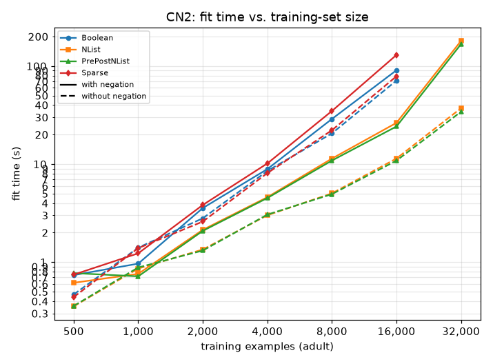 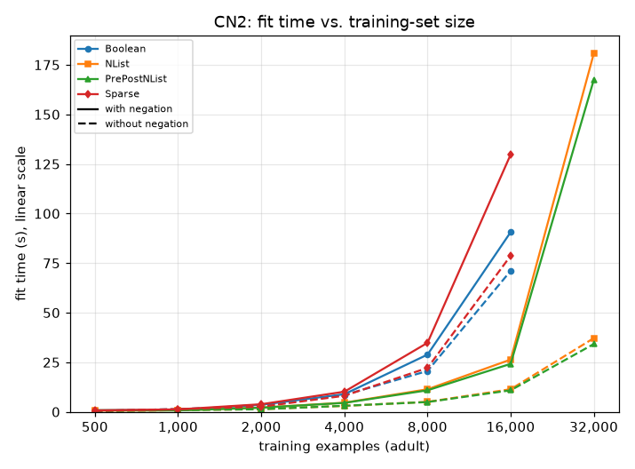

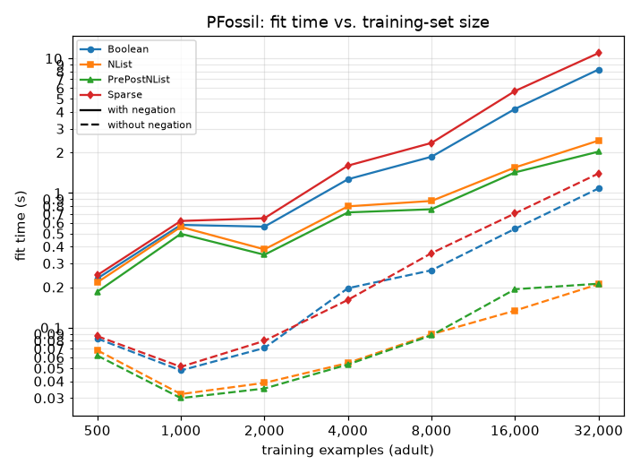 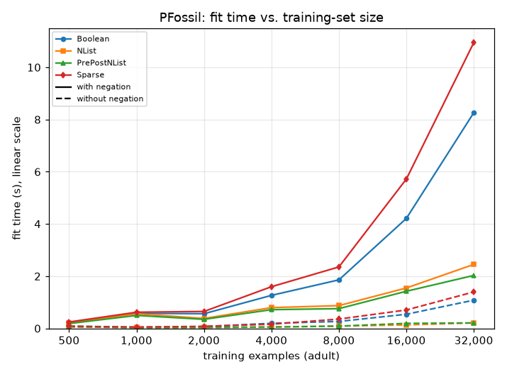

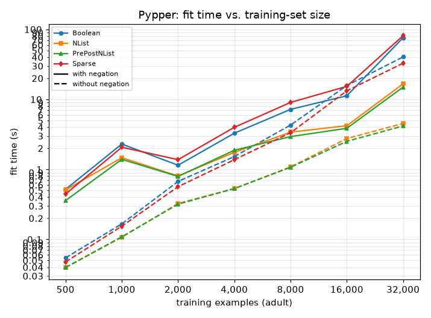 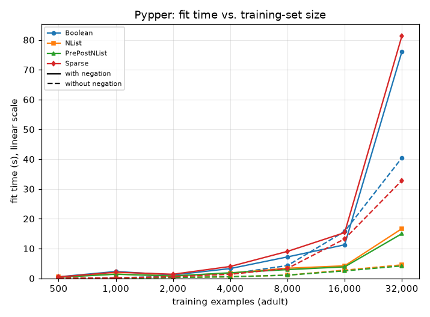

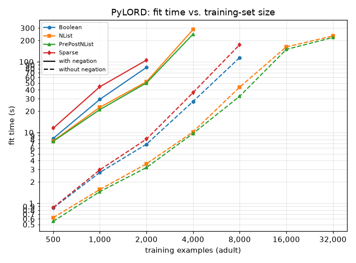 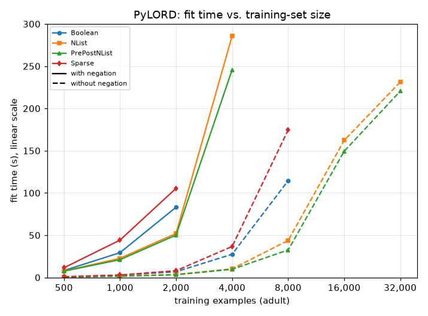

Fit time in seconds, with negation:

| learner | representation | n=500 | n=1000 | n=2000 | n=4000 | n=8000 | n=16000 | n=32000 |
|---|---|--:|--:|--:|--:|--:|--:|--:|
| CN2 | Boolean | 0.74 | 0.97 | 3.56 | 8.90 | 28.87 | 90.65 | time-out |
| CN2 | NList | 0.62 | 0.76 | 2.14 | 4.60 | 11.39 | 26.36 | 180.77 |
| CN2 | PrePostNList | 0.77 | 0.72 | 2.09 | 4.51 | 10.87 | 24.21 | 167.49 |
| CN2 | Sparse | 0.75 | 1.23 | 3.83 | 10.16 | 34.81 | 129.80 | time-out |
| PFossil | Boolean | 0.23 | 0.58 | 0.56 | 1.27 | 1.86 | 4.21 | 8.26 |
| PFossil | NList | 0.22 | 0.56 | 0.38 | 0.80 | 0.87 | 1.55 | 2.45 |
| PFossil | PrePostNList | 0.18 | 0.50 | 0.35 | 0.72 | 0.76 | 1.42 | 2.03 |
| PFossil | Sparse | 0.25 | 0.62 | 0.65 | 1.60 | 2.35 | 5.72 | 10.95 |
| Pypper | Boolean | 0.52 | 2.30 | 1.15 | 3.29 | 7.20 | 11.26 | 76.03 |
| Pypper | NList | 0.51 | 1.47 | 0.80 | 1.75 | 3.40 | 4.20 | 16.67 |
| Pypper | PrePostNList | 0.36 | 1.39 | 0.79 | 1.87 | 2.94 | 3.86 | 14.99 |
| Pypper | Sparse | 0.44 | 2.07 | 1.38 | 3.99 | 9.05 | 15.35 | 81.30 |
| PyLORD | Boolean | 8.24 | 29.39 | 83.13 | time-out |  |  |  |
| PyLORD | NList | 7.60 | 22.71 | 52.11 | 285.76 | time-out |  |  |
| PyLORD | PrePostNList | 7.49 | 21.05 | 50.16 | 245.79 | time-out |  |  |
| PyLORD | Sparse | 11.51 | 44.27 | 105.52 | time-out |  |  |  |

Without negation:

| learner | representation | n=500 | n=1000 | n=2000 | n=4000 | n=8000 | n=16000 | n=32000 |
|---|---|--:|--:|--:|--:|--:|--:|--:|
| CN2 | Boolean | 0.47 | 1.41 | 2.80 | 8.52 | 20.60 | 71.13 | time-out |
| CN2 | NList | 0.35 | 0.86 | 1.35 | 3.01 | 5.03 | 11.41 | 37.18 |
| CN2 | PrePostNList | 0.36 | 0.88 | 1.31 | 3.06 | 4.94 | 10.86 | 34.22 |
| CN2 | Sparse | 0.44 | 1.39 | 2.60 | 8.10 | 22.16 | 78.73 | time-out |
| PFossil | Boolean | 0.08 | 0.05 | 0.07 | 0.20 | 0.27 | 0.54 | 1.08 |
| PFossil | NList | 0.07 | 0.03 | 0.04 | 0.05 | 0.09 | 0.13 | 0.21 |
| PFossil | PrePostNList | 0.06 | 0.03 | 0.04 | 0.05 | 0.09 | 0.19 | 0.21 |
| PFossil | Sparse | 0.09 | 0.05 | 0.08 | 0.16 | 0.36 | 0.71 | 1.40 |
| Pypper | Boolean | 0.05 | 0.17 | 0.67 | 1.52 | 4.30 | 15.77 | 40.43 |
| Pypper | NList | 0.04 | 0.11 | 0.33 | 0.53 | 1.08 | 2.75 | 4.53 |
| Pypper | PrePostNList | 0.04 | 0.11 | 0.32 | 0.53 | 1.07 | 2.51 | 4.18 |
| Pypper | Sparse | 0.05 | 0.15 | 0.57 | 1.37 | 3.34 | 13.24 | 32.84 |
| PyLORD | Boolean | 0.86 | 2.72 | 6.81 | 27.47 | 114.55 | time-out |  |
| PyLORD | NList | 0.63 | 1.56 | 3.60 | 10.21 | 43.81 | 162.28 | 231.30 |
| PyLORD | PrePostNList | 0.55 | 1.46 | 3.19 | 9.68 | 32.57 | 149.39 | 220.47 |
| PyLORD | Sparse | 0.87 | 2.96 | 8.05 | 36.66 | 174.61 | time-out |  |

Building a vertical index is paid once per fit, on top of the fit itself:

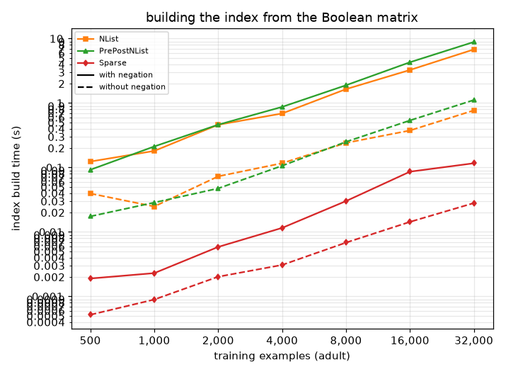

## 2. Density

Synthetic data, 1000 training and 1000 test examples with 500 features: 4 of them carry a fixed learnable concept (true with probability 0.4, class = f0 and not f1, 5% label noise); every other feature is noise, true with the probability on the x-axis. Size and feature count stay fixed, so this isolates density.

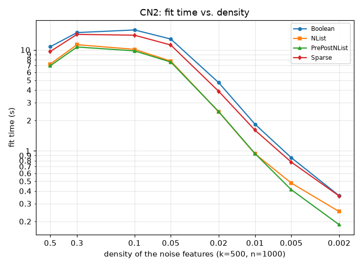

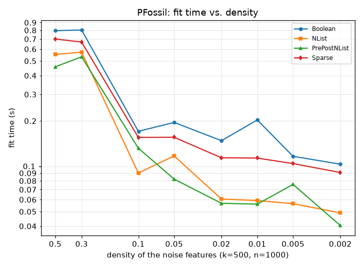

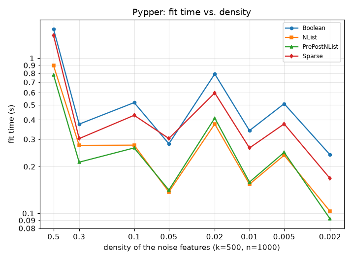

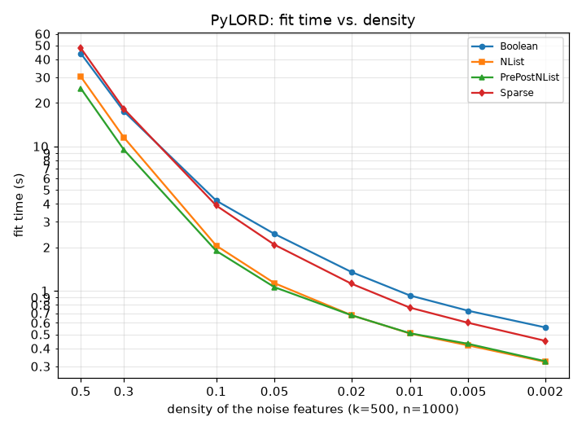

The pure data operation, 800 `coverage()` calls for random rules of 1-4 conditions, without any search around it:

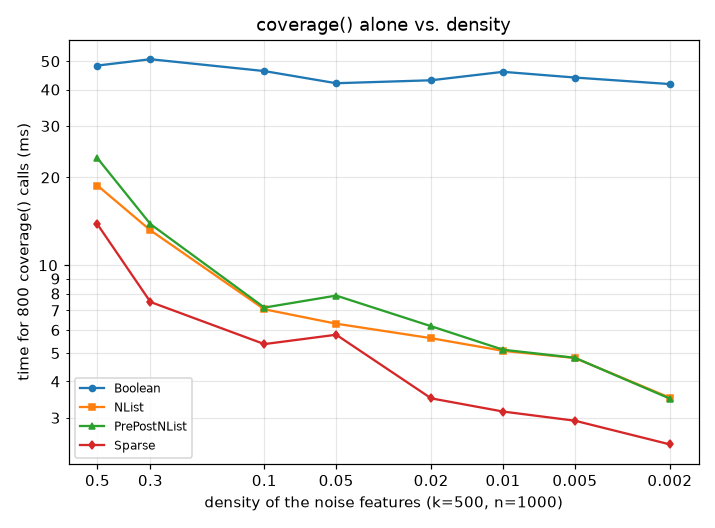

Fit time in seconds:

| learner | representation | p=0.5 | p=0.3 | p=0.1 | p=0.05 | p=0.02 | p=0.01 | p=0.005 | p=0.002 |
|---|---|--:|--:|--:|--:|--:|--:|--:|--:|
| CN2 | Boolean | 10.74 | 14.82 | 15.74 | 12.80 | 4.73 | 1.83 | 0.86 | 0.36 |
| CN2 | NList | 7.24 | 11.25 | 10.12 | 7.73 | 2.43 | 0.93 | 0.48 | 0.25 |
| CN2 | PrePostNList | 6.96 | 10.67 | 9.77 | 7.57 | 2.44 | 0.94 | 0.41 | 0.19 |
| CN2 | Sparse | 9.64 | 14.23 | 13.96 | 11.17 | 3.88 | 1.60 | 0.77 | 0.36 |
| PFossil | Boolean | 0.80 | 0.80 | 0.17 | 0.20 | 0.15 | 0.20 | 0.12 | 0.10 |
| PFossil | NList | 0.55 | 0.57 | 0.09 | 0.12 | 0.06 | 0.06 | 0.06 | 0.05 |
| PFossil | PrePostNList | 0.46 | 0.53 | 0.13 | 0.08 | 0.06 | 0.06 | 0.08 | 0.04 |
| PFossil | Sparse | 0.70 | 0.67 | 0.16 | 0.16 | 0.11 | 0.11 | 0.10 | 0.09 |
| Pypper | Boolean | 1.54 | 0.38 | 0.52 | 0.28 | 0.79 | 0.34 | 0.51 | 0.24 |
| Pypper | NList | 0.89 | 0.27 | 0.28 | 0.14 | 0.38 | 0.15 | 0.24 | 0.10 |
| Pypper | PrePostNList | 0.78 | 0.21 | 0.26 | 0.14 | 0.41 | 0.16 | 0.25 | 0.09 |
| Pypper | Sparse | 1.40 | 0.30 | 0.43 | 0.30 | 0.60 | 0.26 | 0.38 | 0.17 |
| PyLORD | Boolean | 43.91 | 17.45 | 4.21 | 2.47 | 1.35 | 0.93 | 0.73 | 0.56 |
| PyLORD | NList | 30.30 | 11.53 | 2.05 | 1.13 | 0.68 | 0.51 | 0.42 | 0.32 |
| PyLORD | PrePostNList | 25.13 | 9.48 | 1.89 | 1.06 | 0.68 | 0.51 | 0.43 | 0.33 |
| PyLORD | Sparse | 47.74 | 18.18 | 3.89 | 2.08 | 1.12 | 0.76 | 0.60 | 0.45 |

## Summary: fit time relative to Boolean

Mean of (fit time / Boolean fit time) over all points of both parts where the Boolean fit took at least 0.05s; below 100% is faster than Boolean.

| representation | CN2 | PFossil | Pypper | PyLORD | all |
|---|--:|--:|--:|--:|--:|
| NList | 55% | 52% | 49% | 59% | 53% |
| PrePostNList | 54% | 49% | 46% | 55% | 51% |
| Sparse | 102% | 104% | 93% | 109% | 102% |

