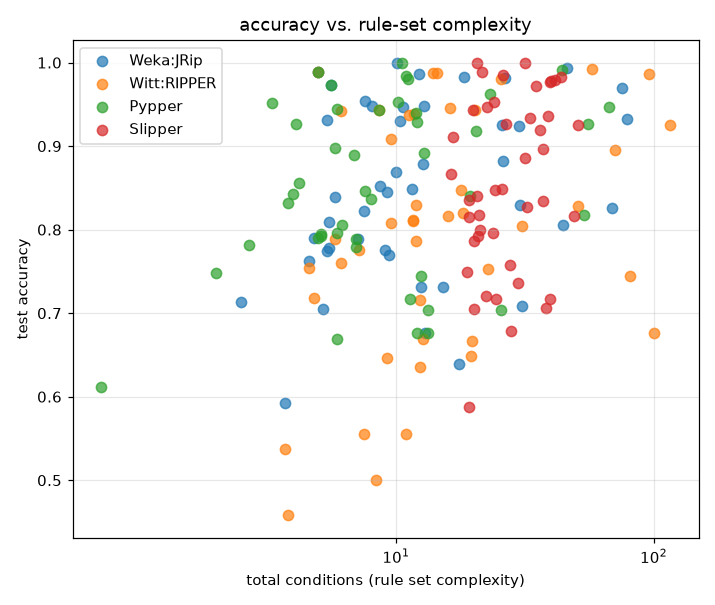
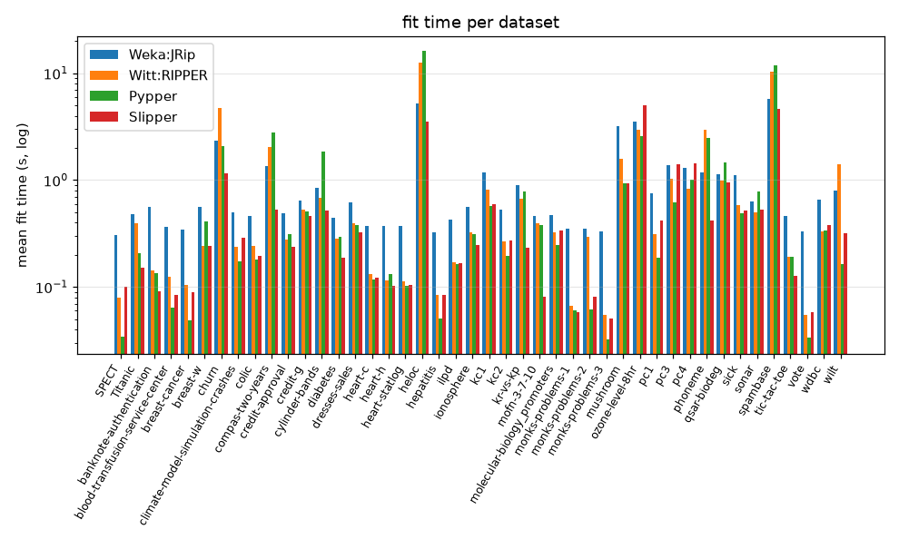

# RIPPER-family comparison: Weka:JRip / Witt:RIPPER / Pypper / Slipper

## Setup

**Full run** (44 binary datasets). For a quick sanity check instead (10 small datasets, 3-fold, well under a minute): `python demos/ripper_comparison.py` with no arguments -- its output isn't checked in (see `ripper_comparison_quick_report.md` after running it).

Four RIPPER-family rule learners -- Weka:JRip, Witt:RIPPER,
Pypper, Slipper -- compared on 44 binary datasets from
`pyrulearn.experiments.catalog`.

A fifth, IMod:Slipper (`imodels`' SlipperClassifier), is checked
separately first against the native Slipper on a handful of small,
low-feature-count datasets, then left out of the main comparison below --
see "Why IMod:Slipper isn't in the main comparison". Across 4 datasets (3-fold), IMod:Slipper was no more accurate than Slipper (mean accuracy 0.690 vs. 0.804) while taking 22x as long per fit (3.54s vs. 0.16s, mean) -- not worth its cost at the scale of the main comparison below.

Protocol: `10`-fold stratified cross-validation
(`pyrulearn.experiments.runner.run_cv`), one `DataSpec` per training fold
(`build_dataspec(max_intervals=6)`), the test fold binarized
against that same `DataSpec` -- every learner sees the identical
Boolean feature matrix per fold, so differences reflect the algorithms,
not the data preparation. Each fit is capped at 180s; a
timeout or an exception is recorded as a failure, not fatal to the run.

Measures: test accuracy, rule count, total condition count, fit time
(seconds, JVM startup included for Weka:JRip). Witt:RIPPER auto-dispatches
one-vs-rest for multi-class (see the module docstring); every other
learner handles multi-class natively.

## Why IMod:Slipper isn't in the main comparison

Across 4 datasets (3-fold), IMod:Slipper was no more accurate than Slipper (mean accuracy 0.690 vs. 0.804) while taking 22x as long per fit (3.54s vs. 0.16s, mean) -- not worth its cost at the scale of the main comparison below.

| learner | accuracy | fit_time |
|---|---|---|
| IMod:Slipper | 0.690 | 3.542 |
| Slipper | 0.804 | 0.161 |

## Summary by learner (mean across every dataset and fold)

| learner | accuracy | n_rules | conds/rule | fit_time (s) | wins | mean rank |
|---|--:|--:|--:|--:|--:|--:|
| Slipper | 0.855 | 13.56 | 2.11 | 0.63 | 17.2 | 2.09 |
| Weka:JRip | 0.849 | 5.16 | 3.01 | 1.02 | 14.2 | 2.15 |
| Pypper | 0.850 | 3.90 | 2.97 | 1.18 | 8.2 | 2.42 |
| Witt:RIPPER | 0.796 | 6.43 | 3.13 | 1.16 | 4.2 | 3.34 |

`wins` -- datasets where a learner's mean accuracy was (tied-for-)best, a tie split evenly (`pyrulearn.experiments.stats.win_counts`); `mean rank` -- average accuracy rank across datasets, failures tied for last (`stats.mean_rank`).

## Per-dataset results, per learner (mean across folds)

| dataset | learner | accuracy | n_rules | n_conditions | conds_per_rule | fit_time |
|---|---|---|---|---|---|---|
| SPECT | Pypper | 0.790 | 0.900 | 5.000 | 5.556 | 0.035 |
| SPECT | Slipper | 0.827 | 11.300 | 32.200 | 2.832 | 0.101 |
| SPECT | Weka:JRip | 0.809 | 1.000 | 5.500 | 5.500 | 0.307 |
| SPECT | Witt:RIPPER | 0.787 | 1.600 | 12.000 | 7.450 | 0.079 |
| Titanic | Pypper | 0.792 | 2.200 | 5.100 | 2.317 | 0.206 |
| Titanic | Slipper | 0.796 | 13.100 | 23.800 | 1.800 | 0.151 |
| Titanic | Weka:JRip | 0.789 | 3.200 | 7.100 | 2.183 | 0.485 |
| Titanic | Witt:RIPPER | 0.752 | 6.000 | 22.800 | 3.287 | 0.392 |
| banknote-authentication | Pypper | 0.984 | 4.600 | 10.900 | 2.365 | 0.134 |
| banknote-authentication | Slipper | 0.985 | 12.900 | 26.100 | 2.021 | 0.090 |
| banknote-authentication | Weka:JRip | 0.987 | 5.200 | 12.300 | 2.360 | 0.560 |
| banknote-authentication | Witt:RIPPER | 0.988 | 5.800 | 14.400 | 2.443 | 0.143 |
| blood-transfusion-service-center | Pypper | 0.795 | 1.900 | 5.100 | 2.700 | 0.065 |
| blood-transfusion-service-center | Slipper | 0.786 | 11.600 | 20.100 | 1.722 | 0.085 |
| blood-transfusion-service-center | Weka:JRip | 0.790 | 1.900 | 4.800 | 2.550 | 0.366 |
| blood-transfusion-service-center | Witt:RIPPER | 0.646 | 3.900 | 9.200 | 2.420 | 0.125 |
| breast-cancer | Pypper | 0.748 | 1.000 | 2.000 | 2.000 | 0.049 |
| breast-cancer | Slipper | 0.720 | 13.900 | 22.300 | 1.607 | 0.090 |
| breast-cancer | Weka:JRip | 0.714 | 1.300 | 2.500 | 1.900 | 0.343 |
| breast-cancer | Witt:RIPPER | 0.537 | 1.500 | 3.700 | 2.717 | 0.104 |
| breast-w | Pypper | 0.940 | 4.200 | 12.000 | 2.853 | 0.413 |
| breast-w | Slipper | 0.943 | 14.700 | 20.000 | 1.362 | 0.241 |
| breast-w | Weka:JRip | 0.948 | 5.100 | 12.900 | 2.531 | 0.561 |
| breast-w | Witt:RIPPER | 0.943 | 4.600 | 8.600 | 1.852 | 0.243 |
| churn | Pypper | 0.918 | 6.900 | 20.400 | 2.961 | 2.073 |
| churn | Slipper | 0.919 | 15.900 | 36.200 | 2.272 | 1.161 |
| churn | Weka:JRip | 0.924 | 10.100 | 30.100 | 2.952 | 2.355 |
| churn | Witt:RIPPER | 0.895 | 12.700 | 70.800 | 5.554 | 4.725 |
| climate-model-simulation-crashes | Pypper | 0.944 | 1.800 | 5.900 | 3.300 | 0.174 |
| climate-model-simulation-crashes | Slipper | 0.933 | 13.900 | 33.300 | 2.403 | 0.291 |
| climate-model-simulation-crashes | Weka:JRip | 0.948 | 2.700 | 8.100 | 3.042 | 0.495 |
| climate-model-simulation-crashes | Witt:RIPPER | 0.937 | 3.500 | 11.200 | 3.213 | 0.237 |
| colic | Pypper | 0.856 | 1.800 | 4.200 | 2.267 | 0.180 |
| colic | Slipper | 0.818 | 13.900 | 21.000 | 1.508 | 0.197 |
| colic | Weka:JRip | 0.845 | 3.900 | 9.200 | 2.290 | 0.461 |
| colic | Witt:RIPPER | 0.810 | 3.900 | 11.700 | 2.992 | 0.242 |
| compas-two-years | Pypper | 0.676 | 3.900 | 12.100 | 3.053 | 2.773 |
| compas-two-years | Slipper | 0.679 | 13.500 | 28.100 | 2.071 | 0.529 |
| compas-two-years | Weka:JRip | 0.677 | 4.900 | 13.000 | 2.612 | 1.356 |
| compas-two-years | Witt:RIPPER | 0.648 | 4.900 | 19.500 | 3.549 | 2.054 |
| credit-approval | Pypper | 0.836 | 3.200 | 8.000 | 2.178 | 0.313 |
| credit-approval | Slipper | 0.848 | 13.300 | 24.200 | 1.816 | 0.235 |
| credit-approval | Weka:JRip | 0.852 | 4.000 | 8.700 | 2.108 | 0.490 |
| credit-approval | Witt:RIPPER | 0.848 | 6.300 | 17.900 | 2.815 | 0.278 |
| credit-g | Pypper | 0.717 | 2.800 | 11.300 | 3.867 | 0.505 |
| credit-g | Slipper | 0.736 | 14.800 | 29.800 | 2.011 | 0.462 |
| credit-g | Weka:JRip | 0.731 | 4.000 | 15.300 | 3.735 | 0.645 |
| credit-g | Witt:RIPPER | 0.716 | 2.700 | 12.400 | 4.600 | 0.532 |
| cylinder-bands | Pypper | 0.676 | 4.200 | 13.300 | 3.239 | 1.836 |
| cylinder-bands | Slipper | 0.706 | 17.400 | 20.100 | 1.156 | 0.515 |
| cylinder-bands | Weka:JRip | 0.639 | 6.600 | 17.600 | 2.629 | 0.842 |
| cylinder-bands | Witt:RIPPER | 0.635 | 5.100 | 12.400 | 2.436 | 0.678 |
| diabetes | Pypper | 0.745 | 3.700 | 12.500 | 3.268 | 0.296 |
| diabetes | Slipper | 0.758 | 13.300 | 27.700 | 2.081 | 0.188 |
| diabetes | Weka:JRip | 0.732 | 3.800 | 12.500 | 3.203 | 0.445 |
| diabetes | Witt:RIPPER | 0.667 | 5.800 | 19.800 | 3.372 | 0.281 |
| dresses-sales | Pypper | 0.612 | 1.100 | 1.200 | 1.111 | 0.377 |
| dresses-sales | Slipper | 0.588 | 16.200 | 19.200 | 1.184 | 0.324 |
| dresses-sales | Weka:JRip | 0.592 | 2.100 | 3.700 | 1.683 | 0.620 |
| dresses-sales | Witt:RIPPER | 0.458 | 1.300 | 3.800 | 3.200 | 0.394 |
| heart-c | Pypper | 0.806 | 2.600 | 6.200 | 2.350 | 0.118 |
| heart-c | Slipper | 0.792 | 13.200 | 20.900 | 1.572 | 0.122 |
| heart-c | Weka:JRip | 0.776 | 3.600 | 9.100 | 2.428 | 0.375 |
| heart-c | Witt:RIPPER | 0.812 | 4.200 | 11.700 | 2.817 | 0.132 |
| heart-h | Pypper | 0.789 | 2.800 | 7.000 | 2.400 | 0.132 |
| heart-h | Slipper | 0.799 | 14.200 | 21.200 | 1.494 | 0.102 |
| heart-h | Weka:JRip | 0.779 | 2.400 | 5.500 | 2.075 | 0.372 |
| heart-h | Witt:RIPPER | 0.500 | 3.400 | 8.400 | 2.497 | 0.114 |
| heart-statlog | Pypper | 0.796 | 2.400 | 5.900 | 2.400 | 0.103 |
| heart-statlog | Slipper | 0.815 | 13.400 | 19.300 | 1.436 | 0.105 |
| heart-statlog | Weka:JRip | 0.822 | 3.400 | 7.500 | 2.177 | 0.374 |
| heart-statlog | Witt:RIPPER | 0.807 | 3.600 | 9.600 | 2.642 | 0.113 |
| heloc | Pypper | 0.704 | 7.200 | 25.700 | 3.526 | 16.247 |
| heloc | Slipper | 0.706 | 14.600 | 38.100 | 2.605 | 3.526 |
| heloc | Weka:JRip | 0.709 | 8.100 | 30.900 | 3.725 | 5.201 |
| heloc | Witt:RIPPER | 0.676 | 15.400 | 100.000 | 6.471 | 12.601 |
| hepatitis | Pypper | 0.781 | 1.700 | 2.700 | 1.533 | 0.051 |
| hepatitis | Slipper | 0.840 | 13.100 | 20.600 | 1.583 | 0.084 |
| hepatitis | Weka:JRip | 0.763 | 2.100 | 4.600 | 2.083 | 0.326 |
| hepatitis | Witt:RIPPER | 0.789 | 2.600 | 5.800 | 2.150 | 0.085 |
| ilpd | Pypper | 0.669 | 1.700 | 5.900 | 3.389 | 0.165 |
| ilpd | Slipper | 0.717 | 12.500 | 24.500 | 1.961 | 0.168 |
| ilpd | Weka:JRip | 0.705 | 1.600 | 5.200 | 3.300 | 0.431 |
| ilpd | Witt:RIPPER | 0.556 | 2.700 | 7.500 | 2.800 | 0.169 |
| ionosphere | Pypper | 0.897 | 3.800 | 5.800 | 1.500 | 0.314 |
| ionosphere | Slipper | 0.912 | 14.400 | 16.700 | 1.160 | 0.249 |
| ionosphere | Weka:JRip | 0.869 | 5.800 | 10.000 | 1.614 | 0.566 |
| ionosphere | Witt:RIPPER | 0.909 | 5.700 | 9.600 | 1.687 | 0.322 |
| kc1 | Pypper | 0.846 | 2.100 | 7.600 | 3.483 | 0.575 |
| kc1 | Slipper | 0.848 | 13.300 | 25.900 | 1.937 | 0.592 |
| kc1 | Weka:JRip | 0.848 | 3.000 | 11.500 | 3.517 | 1.173 |
| kc1 | Witt:RIPPER | 0.555 | 3.000 | 10.900 | 3.517 | 0.813 |
| kc2 | Pypper | 0.843 | 1.600 | 4.000 | 2.333 | 0.194 |
| kc2 | Slipper | 0.835 | 13.300 | 19.200 | 1.449 | 0.274 |
| kc2 | Weka:JRip | 0.839 | 2.300 | 5.800 | 2.417 | 0.532 |
| kc2 | Witt:RIPPER | 0.760 | 2.700 | 6.100 | 2.267 | 0.268 |
| kr-vs-kp | Pypper | 0.991 | 13.600 | 44.000 | 3.237 | 0.780 |
| kr-vs-kp | Slipper | 0.977 | 14.600 | 39.700 | 2.717 | 0.231 |
| kr-vs-kp | Weka:JRip | 0.993 | 14.600 | 46.200 | 3.158 | 0.894 |
| kr-vs-kp | Witt:RIPPER | 0.993 | 17.500 | 57.800 | 3.300 | 0.663 |
| mofn-3-7-10 | Pypper | 0.947 | 14.000 | 67.000 | 4.720 | 0.383 |
| mofn-3-7-10 | Slipper | 0.979 | 14.100 | 41.300 | 2.923 | 0.082 |
| mofn-3-7-10 | Weka:JRip | 0.970 | 15.600 | 75.200 | 4.813 | 0.460 |
| mofn-3-7-10 | Witt:RIPPER | 0.986 | 19.300 | 95.600 | 4.949 | 0.392 |
| molecular-biology_promoters | Pypper | 0.832 | 2.100 | 3.800 | 1.800 | 0.248 |
| molecular-biology_promoters | Slipper | 0.866 | 12.500 | 16.300 | 1.289 | 0.336 |
| molecular-biology_promoters | Weka:JRip | 0.775 | 2.500 | 5.400 | 2.150 | 0.471 |
| molecular-biology_promoters | Witt:RIPPER | 0.755 | 2.300 | 4.600 | 2.000 | 0.323 |
| monks-problems-1 | Pypper | 0.953 | 3.600 | 10.200 | 2.733 | 0.061 |
| monks-problems-1 | Slipper | 1.000 | 12.800 | 31.600 | 2.391 | 0.058 |
| monks-problems-1 | Weka:JRip | 0.930 | 3.700 | 10.400 | 2.452 | 0.351 |
| monks-problems-1 | Witt:RIPPER | 0.946 | 4.600 | 16.200 | 3.372 | 0.066 |
| monks-problems-2 | Pypper | 0.704 | 2.300 | 13.300 | 5.883 | 0.061 |
| monks-problems-2 | Slipper | 0.717 | 12.900 | 39.800 | 3.086 | 0.081 |
| monks-problems-2 | Weka:JRip | 0.806 | 7.600 | 44.600 | 5.816 | 0.349 |
| monks-problems-2 | Witt:RIPPER | 0.829 | 14.200 | 50.700 | 3.527 | 0.297 |
| monks-problems-3 | Pypper | 0.989 | 3.000 | 5.000 | 1.667 | 0.032 |
| monks-problems-3 | Slipper | 0.989 | 10.400 | 21.500 | 2.066 | 0.051 |
| monks-problems-3 | Weka:JRip | 0.989 | 3.000 | 5.000 | 1.667 | 0.332 |
| monks-problems-3 | Witt:RIPPER | 0.989 | 3.000 | 5.000 | 1.667 | 0.055 |
| mushroom | Pypper | 1.000 | 5.200 | 10.600 | 2.053 | 0.933 |
| mushroom | Slipper | 1.000 | 10.500 | 20.600 | 1.959 | 0.941 |
| mushroom | Weka:JRip | 1.000 | 6.000 | 10.100 | 1.706 | 3.201 |
| mushroom | Witt:RIPPER | 0.987 | 6.900 | 13.900 | 2.013 | 1.573 |
| ozone-level-8hr | Pypper | 0.929 | 2.900 | 12.100 | 4.283 | 2.582 |
| ozone-level-8hr | Slipper | 0.936 | 13.800 | 38.800 | 2.822 | 5.064 |
| ozone-level-8hr | Weka:JRip | 0.926 | 5.800 | 25.900 | 4.399 | 3.547 |
| ozone-level-8hr | Witt:RIPPER | 0.817 | 5.900 | 16.000 | 2.740 | 2.984 |
| pc1 | Pypper | 0.926 | 1.500 | 4.100 | 2.650 | 0.189 |
| pc1 | Slipper | 0.926 | 13.600 | 26.700 | 1.956 | 0.418 |
| pc1 | Weka:JRip | 0.931 | 1.900 | 5.400 | 2.800 | 0.753 |
| pc1 | Witt:RIPPER | 0.718 | 1.800 | 4.800 | 2.700 | 0.313 |
| pc3 | Pypper | 0.890 | 1.700 | 6.900 | 4.111 | 0.616 |
| pc3 | Slipper | 0.886 | 13.000 | 31.700 | 2.416 | 1.416 |
| pc3 | Weka:JRip | 0.879 | 3.000 | 12.700 | 4.208 | 1.372 |
| pc3 | Witt:RIPPER | 0.669 | 3.900 | 12.800 | 3.237 | 1.039 |
| pc4 | Pypper | 0.892 | 2.900 | 12.900 | 4.325 | 1.002 |
| pc4 | Slipper | 0.897 | 12.500 | 37.400 | 3.004 | 1.431 |
| pc4 | Weka:JRip | 0.883 | 5.200 | 26.000 | 4.893 | 1.304 |
| pc4 | Witt:RIPPER | 0.829 | 5.200 | 12.000 | 2.279 | 0.825 |
| phoneme | Pypper | 0.817 | 10.000 | 53.500 | 5.244 | 2.481 |
| phoneme | Slipper | 0.816 | 14.300 | 49.000 | 3.420 | 0.419 |
| phoneme | Weka:JRip | 0.826 | 12.900 | 68.700 | 5.324 | 1.182 |
| phoneme | Witt:RIPPER | 0.745 | 15.800 | 81.000 | 5.182 | 2.974 |
| qsar-biodeg | Pypper | 0.841 | 5.100 | 19.400 | 3.898 | 1.468 |
| qsar-biodeg | Slipper | 0.834 | 14.100 | 37.100 | 2.638 | 0.943 |
| qsar-biodeg | Weka:JRip | 0.829 | 7.500 | 30.200 | 4.003 | 1.128 |
| qsar-biodeg | Witt:RIPPER | 0.805 | 10.300 | 30.900 | 3.016 | 0.998 |
| sick | Pypper | 0.981 | 3.400 | 11.100 | 3.207 | 0.488 |
| sick | Slipper | 0.978 | 13.800 | 40.000 | 2.901 | 0.524 |
| sick | Weka:JRip | 0.983 | 5.300 | 18.400 | 3.398 | 1.106 |
| sick | Witt:RIPPER | 0.820 | 7.000 | 18.200 | 2.557 | 0.589 |
| sonar | Pypper | 0.779 | 3.500 | 7.000 | 1.998 | 0.782 |
| sonar | Slipper | 0.749 | 15.200 | 18.800 | 1.235 | 0.527 |
| sonar | Weka:JRip | 0.770 | 4.500 | 9.400 | 2.095 | 0.626 |
| sonar | Witt:RIPPER | 0.775 | 3.200 | 7.200 | 2.280 | 0.500 |
| spambase | Pypper | 0.927 | 12.000 | 55.900 | 4.581 | 11.884 |
| spambase | Slipper | 0.925 | 15.100 | 50.800 | 3.362 | 4.644 |
| spambase | Weka:JRip | 0.932 | 17.400 | 78.600 | 4.509 | 5.747 |
| spambase | Witt:RIPPER | 0.926 | 24.100 | 115.900 | 4.798 | 10.350 |
| tic-tac-toe | Pypper | 0.962 | 7.500 | 23.100 | 3.071 | 0.190 |
| tic-tac-toe | Slipper | 0.983 | 15.000 | 43.900 | 2.926 | 0.126 |
| tic-tac-toe | Weka:JRip | 0.981 | 8.400 | 26.600 | 3.142 | 0.461 |
| tic-tac-toe | Witt:RIPPER | 0.980 | 8.400 | 25.700 | 3.057 | 0.192 |
| vote | Pypper | 0.952 | 1.700 | 3.300 | 1.650 | 0.034 |
| vote | Slipper | 0.947 | 10.900 | 22.600 | 2.073 | 0.058 |
| vote | Weka:JRip | 0.954 | 3.100 | 7.600 | 2.250 | 0.329 |
| vote | Witt:RIPPER | 0.943 | 3.000 | 6.100 | 2.033 | 0.055 |
| wdbc | Pypper | 0.944 | 3.800 | 8.600 | 2.282 | 0.336 |
| wdbc | Slipper | 0.952 | 13.800 | 24.100 | 1.746 | 0.381 |
| wdbc | Weka:JRip | 0.947 | 4.800 | 10.700 | 2.222 | 0.656 |
| wdbc | Witt:RIPPER | 0.938 | 4.900 | 11.800 | 2.370 | 0.334 |
| wilt | Pypper | 0.973 | 1.900 | 5.600 | 2.850 | 0.165 |
| wilt | Slipper | 0.972 | 12.200 | 34.900 | 2.856 | 0.316 |
| wilt | Weka:JRip | 0.973 | 2.100 | 5.600 | 2.683 | 0.796 |
| wilt | Witt:RIPPER | 0.943 | 8.600 | 20.300 | 2.041 | 1.396 |

