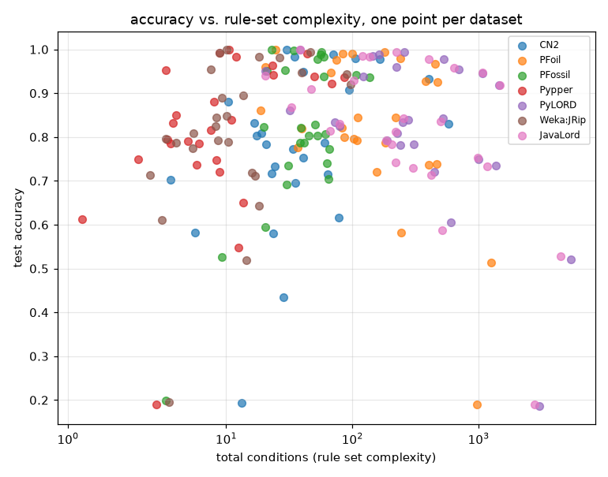
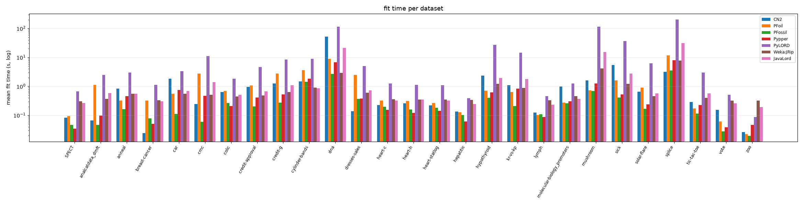
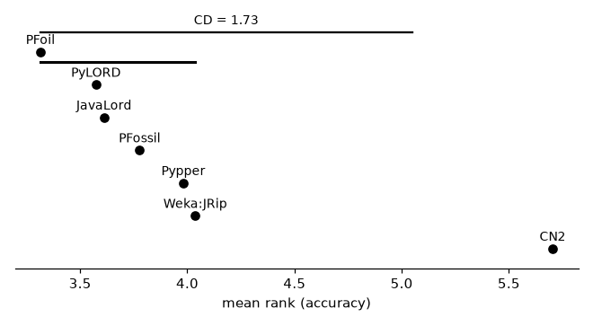

# Separate-and-conquer rule learners compared

## Setup

**Full run** (29 datasets). Quick sanity check instead: `python demos/seco_learners_comparison.py` with no arguments.

pyrulearn's separate-and-conquer rule learners compared with each other
and with two external baselines, on 18 binary and
11 multi-class datasets from `pyrulearn.experiments.catalog`.
All of them learn one rule at a time and remove the examples it covers;
they differ in how a rule is searched for, when it stops, and whether and
how the rule set is pruned. Every learner runs with its default settings,
including its default way of handling several classes.

The datasets have mostly symbolic attributes (at least half nominal), the
kind these learners were designed for -- numeric attributes and their
discretization are the topic of the numeric-discretization demo. Artificial
concepts (the monks problems, m-of-n, Hayes-Roth, LED) and datasets with
many classes (left for the multi-class demo) are not included.

- **CN2** -- Beam search (width 5) with the Laplace estimate; CN2's likelihood-ratio significance test stops rules that aren't significant. Learns rules for every class (one-vs-rest rule set).
- **PFoil** -- FOIL: greedy search that adds the condition with the highest FOIL gain; Quinlan's encoding-length restriction stops rules that cost more bits than the examples they explain. Rules for every class.
- **PFossil** -- FOSSIL: hill climbing on the correlation between rule and class; rules below a correlation of 0.3 are dropped. Rules for every class.
- **Pypper** -- pyrulearn's RIPPER: grow on two thirds of the data, prune on the rest (IREP*), then optimize the rule set (replace/revise). Rules for the classes from least to most frequent, the most frequent one as default.
- **PyLORD** -- A simplified LORD: for every training example, the best rule covering it (greedy m-estimate search, then pruning); a test example is classified by the best rule that covers it. Many overlapping rules.
- **Weka:JRip** -- Weka's RIPPER, run as a subprocess on the same binarized data. Fit time includes the JVM start.
- **JavaLord** -- The reference LORD implementation (Java), run as a subprocess on the same binarized data.

AQR, the AQ baseline CN2 was designed to improve on, was checked
separately and left out -- see "Why AQR isn't in the main comparison".
Across 4 small datasets (3-fold), AQR was less accurate than CN2 (mean accuracy 0.704 vs. 0.751), learned rules 7.4x as long (17.6 vs. 2.4 conditions per rule; 495 vs. 23 conditions in total), and took 20x as long per fit (5.5s vs. 0.28s, mean) -- requiring every rule to be consistent overfits noisy data, and on larger datasets with numeric attributes the fit times would dominate the whole comparison.

Protocol: 10-fold stratified cross-validation (5-fold for the large adult, connect-4)
(`pyrulearn.experiments.runner.run_cv`), one `DataSpec` per training fold
(`build_dataspec(max_intervals=8)`), the test fold binarized
against that same `DataSpec` -- every learner sees the identical Boolean
feature matrix per fold. Each fit is capped at 300s; a
time-out or an error counts as a failure (and as last in the ranking),
not as the end of the run. The cap is deliberately kept for the large
datasets too: which learners scale to tens of thousands of examples is
part of the result (a single CN2 fit on adult takes about 20 minutes).

Measures: test accuracy, number of rules and conditions, fit time.

## Why AQR isn't in the main comparison

Across 4 small datasets (3-fold), AQR was less accurate than CN2 (mean accuracy 0.704 vs. 0.751), learned rules 7.4x as long (17.6 vs. 2.4 conditions per rule; 495 vs. 23 conditions in total), and took 20x as long per fit (5.5s vs. 0.28s, mean) -- requiring every rule to be consistent overfits noisy data, and on larger datasets with numeric attributes the fit times would dominate the whole comparison.

| dataset | learner | accuracy | n_rules | n_conditions | conds_per_rule | fit_time |
|---|---|---|---|---|---|---|
| breast-cancer | AQR | 0.577 | 27.333 | 489.000 | 17.700 | 2.493 |
| breast-cancer | CN2 | 0.703 | 3.333 | 8.333 | 2.467 | 0.402 |
| credit-approval | AQR | 0.759 | 37.000 | 1157.333 | 31.347 | 16.696 |
| credit-approval | CN2 | 0.790 | 16.333 | 46.000 | 2.839 | 0.523 |
| heart-statlog | AQR | 0.674 | 17.000 | 277.000 | 16.075 | 2.494 |
| heart-statlog | CN2 | 0.704 | 8.000 | 19.333 | 2.407 | 0.115 |
| hepatitis | AQR | 0.807 | 10.333 | 56.333 | 5.411 | 0.478 |
| hepatitis | CN2 | 0.807 | 9.000 | 16.667 | 1.852 | 0.096 |

## Summary by learner (mean across the 27 datasets and their folds)

Without the two large datasets (adult, connect-4), where most learners hit the time cap -- see the section on them below. On these 27 datasets every learner has a result for (almost) every fold, so the means compare like with like.

| learner | accuracy | n_rules | n_conditions | conds/rule | fit_time (s) | wins | mean rank | failures |
|---|--:|--:|--:|--:|--:|--:|--:|--:|
| PFoil | 0.825 | 56.9 | 243.9 | 3.62 | 1.59 | 4.2 | 3.31 | 0 |
| PyLORD | 0.827 | 133.2 | 693.4 | 4.00 | 21.54 | 2.2 | 3.57 | 1 |
| JavaLord | 0.818 | 129.2 | 618.0 | 3.70 | 3.17 | 4.2 | 3.61 | 0 |
| PFossil | 0.818 | 13.1 | 47.1 | 4.05 | 0.46 | 6.0 | 3.78 | 0 |
| Pypper | 0.813 | 4.9 | 16.2 | 2.76 | 0.91 | 7.0 | 3.98 | 0 |
| Weka:JRip | 0.810 | 5.6 | 18.7 | 2.82 | 1.03 | 3.0 | 4.04 | 0 |
| CN2 | 0.775 | 23.1 | 75.3 | 2.59 | 2.84 | 0.2 | 5.70 | 0 |

Sorted by mean rank. `wins` -- datasets where a learner's mean accuracy was (tied-for-)best, a tie split evenly; `mean rank` -- average accuracy rank across datasets, failures tied for last. Means over successful fits only; `failures` counts the fits that timed out or raised.

### Small datasets only (17, fewer than 1,000 examples)

`SPECT`, `analcatdata_dmft`, `anneal`, `breast-cancer`, `colic`, `credit-approval`, `cylinder-bands`, `dresses-sales`, `heart-c`, `heart-h`, `heart-statlog`, `hepatitis`, `lymph`, `molecular-biology_promoters`, `tic-tac-toe`, `vote`, `zoo`

| learner | accuracy | n_rules | n_conditions | conds/rule | fit_time (s) | wins | mean rank | failures |
|---|--:|--:|--:|--:|--:|--:|--:|--:|
| PFoil | 0.795 | 44.2 | 153.4 | 3.10 | 0.67 | 3.0 | 3.24 | 0 |
| PyLORD | 0.797 | 92.5 | 400.0 | 3.46 | 2.17 | 1.0 | 3.53 | 0 |
| JavaLord | 0.783 | 87.3 | 356.9 | 3.22 | 0.43 | 3.0 | 3.82 | 0 |
| PFossil | 0.782 | 11.9 | 39.4 | 3.93 | 0.22 | 4.0 | 4.00 | 0 |
| Weka:JRip | 0.773 | 3.7 | 8.7 | 2.37 | 0.43 | 2.0 | 4.00 | 0 |
| Pypper | 0.774 | 3.1 | 7.5 | 2.38 | 0.27 | 4.0 | 4.21 | 0 |
| CN2 | 0.763 | 12.1 | 27.7 | 2.26 | 0.39 | 0.0 | 5.21 | 0 |

### Medium datasets only (10, 1,000 to 10,000 examples)

`car`, `cmc`, `credit-g`, `dna`, `hypothyroid`, `kr-vs-kp`, `mushroom`, `sick`, `solar-flare`, `splice`

| learner | accuracy | n_rules | n_conditions | conds/rule | fit_time (s) | wins | mean rank | failures |
|---|--:|--:|--:|--:|--:|--:|--:|--:|
| JavaLord | 0.879 | 200.6 | 1061.8 | 4.53 | 7.82 | 1.2 | 3.25 | 0 |
| PFossil | 0.878 | 15.3 | 60.1 | 4.25 | 0.85 | 2.0 | 3.40 | 0 |
| PFoil | 0.877 | 78.5 | 397.8 | 4.51 | 3.15 | 1.2 | 3.45 | 0 |
| Pypper | 0.878 | 7.9 | 30.9 | 3.38 | 2.00 | 3.0 | 3.60 | 0 |
| PyLORD | 0.878 | 203.1 | 1197.3 | 4.93 | 54.46 | 1.2 | 3.65 | 1 |
| Weka:JRip | 0.873 | 8.8 | 35.8 | 3.58 | 2.04 | 1.0 | 4.10 | 0 |
| CN2 | 0.797 | 41.6 | 156.4 | 3.14 | 7.01 | 0.2 | 6.55 | 0 |

## Mean accuracy by target type

| learner | binary | multi-class |
|---|--:|--:|
| PFoil | 0.840 | 0.801 |
| PyLORD | 0.843 | 0.799 |
| JavaLord | 0.833 | 0.794 |
| PFossil | 0.827 | 0.802 |
| Pypper | 0.830 | 0.783 |
| Weka:JRip | 0.826 | 0.784 |
| CN2 | 0.807 | 0.722 |

## The large datasets: adult, connect-4

5-fold cross-validation, with the same 300s cap per fit as everywhere else -- which learners get through tens of thousands of examples at all is the result here. `folds` counts the folds that finished; accuracy, size and fit time are means over those folds only.

| dataset | learner | folds | accuracy | n_rules | n_conditions | fit_time (s) |
|---|---|--:|--:|--:|--:|--:|
| adult | CN2 | 0/5 | -- | -- | -- | -- |
| adult | JavaLord | 0/5 | -- | -- | -- | -- |
| adult | PFoil | 0/5 | -- | -- | -- | -- |
| adult | PFossil | 5/5 | 0.822 | 9.2 | 56.6 | 27.1 |
| adult | PyLORD | 0/5 | -- | -- | -- | -- |
| adult | Pypper | 3/5 | 0.841 | 11.0 | 62.0 | 184.8 |
| adult | Weka:JRip | 5/5 | 0.849 | 22.8 | 138.0 | 53.4 |
| connect-4 | CN2 | 0/5 | -- | -- | -- | -- |
| connect-4 | JavaLord | 0/5 | -- | -- | -- | -- |
| connect-4 | PFoil | 0/5 | -- | -- | -- | -- |
| connect-4 | PFossil | 5/5 | 0.658 | 0.0 | 0.0 | 23.1 |
| connect-4 | PyLORD | 0/5 | -- | -- | -- | -- |
| connect-4 | Pypper | 0/5 | -- | -- | -- | -- |
| connect-4 | Weka:JRip | 1/5 | 0.763 | 75.0 | 613.0 | 260.8 |

## Per-dataset results, per learner (mean across folds)

| dataset | learner | accuracy | n_rules | n_conditions | fit_time |
|---|---|---|---|---|---|
| SPECT | CN2 | 0.809 | 8.300 | 19.000 | 0.082 |
| SPECT | JavaLord | 0.843 | 60.900 | 253.900 | 0.264 |
| SPECT | PFoil | 0.821 | 25.800 | 82.100 | 0.096 |
| SPECT | PFossil | 0.787 | 9.700 | 41.100 | 0.047 |
| SPECT | PyLORD | 0.839 | 61.700 | 276.200 | 0.673 |
| SPECT | Pypper | 0.790 | 0.900 | 5.000 | 0.035 |
| SPECT | Weka:JRip | 0.809 | 1.000 | 5.500 | 0.306 |
| analcatdata_dmft | CN2 | 0.193 | 6.000 | 13.200 | 0.067 |
| analcatdata_dmft | JavaLord | 0.191 | 470.800 | 2781.400 | 0.593 |
| analcatdata_dmft | PFoil | 0.191 | 253.700 | 973.800 | 1.120 |
| analcatdata_dmft | PFossil | 0.200 | 0.300 | 3.300 | 0.047 |
| analcatdata_dmft | PyLORD | 0.186 | 480.700 | 3038.000 | 2.477 |
| analcatdata_dmft | Pypper | 0.189 | 1.000 | 2.800 | 0.097 |
| analcatdata_dmft | Weka:JRip | 0.194 | 1.000 | 3.500 | 0.372 |
| anneal | CN2 | 0.988 | 34.500 | 70.400 | 0.835 |
| anneal | JavaLord | 0.909 | 30.700 | 47.100 | 0.552 |
| anneal | PFoil | 0.975 | 26.900 | 74.500 | 0.320 |
| anneal | PFossil | 0.998 | 19.600 | 34.500 | 0.165 |
| anneal | PyLORD | 0.985 | 47.900 | 145.200 | 3.023 |
| anneal | Pypper | 0.941 | 9.900 | 23.500 | 0.460 |
| anneal | Weka:JRip | 0.895 | 7.800 | 13.600 | 0.554 |
| breast-cancer | CN2 | 0.703 | 1.600 | 3.600 | 0.025 |
| breast-cancer | JavaLord | 0.714 | 92.700 | 417.900 | 0.304 |
| breast-cancer | PFoil | 0.720 | 43.200 | 156.800 | 0.321 |
| breast-cancer | PFossil | 0.693 | 7.400 | 30.000 | 0.079 |
| breast-cancer | PyLORD | 0.720 | 93.900 | 447.100 | 1.116 |
| breast-cancer | Pypper | 0.748 | 1.000 | 2.000 | 0.051 |
| breast-cancer | Weka:JRip | 0.714 | 1.300 | 2.500 | 0.334 |
| car | CN2 | 0.933 | 78.200 | 400.900 | 1.819 |
| car | JavaLord | 0.958 | 104.100 | 637.100 | 0.695 |
| car | PFoil | 0.967 | 75.400 | 449.100 | 0.557 |
| car | PFossil | 0.939 | 16.200 | 59.100 | 0.110 |
| car | PyLORD | 0.954 | 106.200 | 697.200 | 3.368 |
| car | Pypper | 0.936 | 17.100 | 86.400 | 0.742 |
| car | Weka:JRip | 0.943 | 18.200 | 90.100 | 0.561 |
| cmc | CN2 | 0.434 | 10.300 | 28.400 | 0.244 |
| cmc | JavaLord | 0.528 | 651.900 | 4472.500 | 1.396 |
| cmc | PFoil | 0.514 | 211.000 | 1266.900 | 2.805 |
| cmc | PFossil | 0.526 | 2.100 | 9.200 | 0.060 |
| cmc | PyLORD | 0.521 | 662.700 | 5357.800 | 10.965 |
| cmc | Pypper | 0.548 | 4.100 | 12.600 | 0.469 |
| cmc | Weka:JRip | 0.519 | 3.600 | 14.500 | 0.517 |
| colic | CN2 | 0.753 | 16.200 | 41.000 | 0.634 |
| colic | JavaLord | 0.783 | 74.500 | 205.900 | 0.511 |
| colic | PFoil | 0.845 | 38.500 | 110.000 | 0.699 |
| colic | PFossil | 0.829 | 19.800 | 50.700 | 0.270 |
| colic | PyLORD | 0.834 | 85.000 | 250.700 | 1.833 |
| colic | Pypper | 0.851 | 1.800 | 4.000 | 0.208 |
| colic | Weka:JRip | 0.845 | 3.400 | 8.400 | 0.446 |
| credit-approval | CN2 | 0.787 | 19.800 | 59.800 | 0.945 |
| credit-approval | JavaLord | 0.836 | 126.500 | 499.100 | 0.672 |
| credit-approval | PFoil | 0.845 | 57.500 | 220.200 | 1.080 |
| credit-approval | PFossil | 0.822 | 8.800 | 38.900 | 0.205 |
| credit-approval | PyLORD | 0.842 | 127.800 | 525.700 | 4.673 |
| credit-approval | Pypper | 0.839 | 3.800 | 11.000 | 0.408 |
| credit-approval | Weka:JRip | 0.848 | 4.200 | 10.100 | 0.483 |
| credit-g | CN2 | 0.716 | 22.800 | 63.400 | 1.268 |
| credit-g | JavaLord | 0.752 | 258.000 | 985.100 | 1.105 |
| credit-g | PFoil | 0.738 | 98.400 | 464.600 | 2.751 |
| credit-g | PFossil | 0.735 | 3.600 | 31.100 | 0.277 |
| credit-g | PyLORD | 0.750 | 260.200 | 1003.900 | 8.443 |
| credit-g | Pypper | 0.720 | 2.500 | 8.900 | 0.522 |
| credit-g | Weka:JRip | 0.718 | 3.900 | 15.900 | 0.641 |
| cylinder-bands | CN2 | 0.694 | 25.100 | 35.200 | 1.497 |
| cylinder-bands | JavaLord | 0.730 | 129.500 | 303.100 | 0.853 |
| cylinder-bands | PFoil | 0.787 | 49.600 | 183.000 | 3.597 |
| cylinder-bands | PFossil | 0.704 | 9.400 | 64.400 | 1.435 |
| cylinder-bands | PyLORD | 0.783 | 128.200 | 306.100 | 8.882 |
| cylinder-bands | Pypper | 0.650 | 4.300 | 13.600 | 1.827 |
| cylinder-bands | Weka:JRip | 0.643 | 6.900 | 18.100 | 0.914 |
| dna | CN2 | 0.830 | 127.000 | 574.500 | 52.487 |
| dna | JavaLord | 0.918 | 323.000 | 1471.800 | 21.471 |
| dna | PFoil | 0.925 | 89.000 | 469.400 | 9.008 |
| dna | PFossil | 0.937 | 27.800 | 137.400 | 2.717 |
| dna | PyLORD | 0.918 | 320.800 | 1463.300 | 116.638 |
| dna | Pypper | 0.922 | 13.200 | 68.200 | 6.815 |
| dna | Weka:JRip | 0.920 | 17.300 | 97.400 | 2.916 |
| dresses-sales | CN2 | 0.582 | 3.200 | 5.700 | 0.138 |
| dresses-sales | JavaLord | 0.588 | 171.300 | 514.300 | 0.731 |
| dresses-sales | PFoil | 0.582 | 67.100 | 243.200 | 2.474 |
| dresses-sales | PFossil | 0.594 | 2.200 | 20.400 | 0.372 |
| dresses-sales | PyLORD | 0.606 | 190.300 | 607.500 | 5.044 |
| dresses-sales | Pypper | 0.612 | 1.100 | 1.200 | 0.380 |
| dresses-sales | Weka:JRip | 0.610 | 1.900 | 3.100 | 0.602 |
| heart-c | CN2 | 0.716 | 9.100 | 22.900 | 0.227 |
| heart-c | JavaLord | 0.812 | 62.300 | 219.100 | 0.323 |
| heart-c | PFoil | 0.796 | 30.200 | 102.300 | 0.320 |
| heart-c | PFossil | 0.773 | 17.400 | 65.800 | 0.197 |
| heart-c | PyLORD | 0.809 | 63.400 | 225.800 | 1.245 |
| heart-c | Pypper | 0.815 | 3.000 | 7.600 | 0.153 |
| heart-c | Weka:JRip | 0.792 | 3.600 | 8.600 | 0.364 |
| heart-h | CN2 | 0.772 | 14.200 | 33.800 | 0.258 |
| heart-h | JavaLord | 0.741 | 60.800 | 218.800 | 0.347 |
| heart-h | PFoil | 0.793 | 34.600 | 108.700 | 0.317 |
| heart-h | PFossil | 0.803 | 17.000 | 53.200 | 0.160 |
| heart-h | PyLORD | 0.782 | 62.600 | 241.300 | 1.127 |
| heart-h | Pypper | 0.786 | 1.900 | 3.600 | 0.122 |
| heart-h | Weka:JRip | 0.796 | 2.000 | 3.300 | 0.354 |
| heart-statlog | CN2 | 0.733 | 9.400 | 24.200 | 0.222 |
| heart-statlog | JavaLord | 0.793 | 54.100 | 185.400 | 0.321 |
| heart-statlog | PFoil | 0.800 | 26.500 | 86.700 | 0.270 |
| heart-statlog | PFossil | 0.807 | 17.800 | 60.900 | 0.181 |
| heart-statlog | PyLORD | 0.793 | 54.000 | 188.200 | 1.095 |
| heart-statlog | Pypper | 0.785 | 2.400 | 6.100 | 0.143 |
| heart-statlog | Weka:JRip | 0.789 | 4.300 | 10.400 | 0.354 |
| hepatitis | CN2 | 0.832 | 8.500 | 16.800 | 0.133 |
| hepatitis | JavaLord | 0.814 | 28.200 | 66.600 | 0.249 |
| hepatitis | PFoil | 0.776 | 17.100 | 37.000 | 0.129 |
| hepatitis | PFossil | 0.787 | 15.000 | 38.600 | 0.102 |
| hepatitis | PyLORD | 0.834 | 29.800 | 73.000 | 0.387 |
| hepatitis | Pypper | 0.794 | 1.700 | 3.400 | 0.062 |
| hepatitis | Weka:JRip | 0.787 | 2.100 | 4.000 | 0.344 |
| hypothyroid | CN2 | 0.980 | 35.800 | 106.200 | 2.360 |
| hypothyroid | JavaLord | 0.983 | 38.000 | 137.400 | 1.953 |
| hypothyroid | PFoil | 0.990 | 31.500 | 100.200 | 0.715 |
| hypothyroid | PFossil | 0.989 | 21.500 | 55.800 | 0.397 |
| hypothyroid | PyLORD | 0.988 | 47.700 | 162.800 | 27.344 |
| hypothyroid | Pypper | 0.993 | 3.300 | 8.900 | 0.617 |
| hypothyroid | Weka:JRip | 0.992 | 3.400 | 8.900 | 1.237 |
| kr-vs-kp | CN2 | 0.908 | 30.800 | 93.800 | 1.089 |
| kr-vs-kp | JavaLord | 0.994 | 47.500 | 224.600 | 1.799 |
| kr-vs-kp | PFoil | 0.993 | 40.800 | 178.800 | 0.637 |
| kr-vs-kp | PFossil | 0.994 | 14.500 | 56.700 | 0.211 |
| kr-vs-kp | PyLORD | 0.994 | 49.700 | 259.400 | 14.497 |
| kr-vs-kp | Pypper | 0.991 | 13.600 | 44.000 | 0.830 |
| kr-vs-kp | Weka:JRip | 0.993 | 14.600 | 46.200 | 0.890 |
| lymph | CN2 | 0.784 | 9.300 | 20.700 | 0.124 |
| lymph | JavaLord | 0.831 | 28.900 | 79.400 | 0.232 |
| lymph | PFoil | 0.819 | 16.000 | 39.600 | 0.104 |
| lymph | PFossil | 0.804 | 16.300 | 45.200 | 0.108 |
| lymph | PyLORD | 0.824 | 28.700 | 79.600 | 0.455 |
| lymph | Pypper | 0.736 | 2.700 | 5.800 | 0.087 |
| lymph | Weka:JRip | 0.825 | 4.100 | 8.200 | 0.335 |
| molecular-biology_promoters | CN2 | 0.803 | 9.300 | 17.500 | 0.977 |
| molecular-biology_promoters | JavaLord | 0.868 | 16.900 | 33.000 | 0.365 |
| molecular-biology_promoters | PFoil | 0.861 | 9.000 | 18.600 | 0.275 |
| molecular-biology_promoters | PFossil | 0.823 | 7.400 | 19.700 | 0.261 |
| molecular-biology_promoters | PyLORD | 0.860 | 16.400 | 31.900 | 1.244 |
| molecular-biology_promoters | Pypper | 0.832 | 2.100 | 3.800 | 0.309 |
| molecular-biology_promoters | Weka:JRip | 0.775 | 2.500 | 5.400 | 0.465 |
| mushroom | CN2 | 1.000 | 23.000 | 30.000 | 1.601 |
| mushroom | JavaLord | 1.000 | 23.000 | 38.700 | 15.330 |
| mushroom | PFoil | 1.000 | 11.500 | 24.700 | 0.722 |
| mushroom | PFossil | 1.000 | 12.300 | 23.000 | 0.700 |
| mushroom | PyLORD | 1.000 | 23.000 | 38.700 | 116.254 |
| mushroom | Pypper | 1.000 | 5.200 | 10.600 | 1.247 |
| mushroom | Weka:JRip | 1.000 | 6.000 | 10.100 | 4.147 |
| sick | CN2 | 0.977 | 53.400 | 165.100 | 5.437 |
| sick | JavaLord | 0.979 | 96.200 | 402.400 | 2.752 |
| sick | PFoil | 0.980 | 63.500 | 241.200 | 1.623 |
| sick | PFossil | 0.983 | 16.400 | 59.400 | 0.409 |
| sick | PyLORD | 0.978 | 103.900 | 531.400 | 36.515 |
| sick | Pypper | 0.982 | 3.500 | 11.900 | 0.533 |
| sick | Weka:JRip | 0.982 | 5.300 | 18.100 | 1.234 |
| solar-flare | CN2 | 0.616 | 27.000 | 77.600 | 0.654 |
| solar-flare | JavaLord | 0.733 | 209.100 | 1171.200 | 0.567 |
| solar-flare | PFoil | 0.737 | 85.200 | 403.400 | 0.896 |
| solar-flare | PFossil | 0.740 | 14.500 | 62.500 | 0.170 |
| solar-flare | PyLORD | 0.735 | 209.200 | 1377.700 | 6.265 |
| solar-flare | Pypper | 0.748 | 4.900 | 8.300 | 0.242 |
| solar-flare | Weka:JRip | 0.712 | 6.500 | 16.900 | 0.465 |
| splice | CN2 | 0.580 | 8.200 | 23.700 | 3.165 |
| splice | JavaLord | 0.947 | 255.300 | 1077.600 | 31.128 |
| splice | PFoil | 0.928 | 78.200 | 379.400 | 11.826 |
| splice | PFossil | 0.942 | 23.700 | 106.800 | 3.496 |
| splice | PyLORD | 0.945 | 252.889 | 1067.778 | 204.324 |
| splice | Pypper | 0.938 | 11.400 | 49.600 | 7.988 |
| splice | Weka:JRip | 0.948 | 9.700 | 39.400 | 7.805 |
| tic-tac-toe | CN2 | 0.983 | 11.600 | 35.000 | 0.290 |
| tic-tac-toe | JavaLord | 0.984 | 32.600 | 119.600 | 0.576 |
| tic-tac-toe | PFoil | 0.991 | 23.200 | 83.900 | 0.171 |
| tic-tac-toe | PFossil | 0.977 | 14.700 | 52.500 | 0.115 |
| tic-tac-toe | PyLORD | 0.959 | 53.900 | 222.200 | 2.997 |
| tic-tac-toe | Pypper | 0.962 | 7.500 | 23.100 | 0.227 |
| tic-tac-toe | Weka:JRip | 0.981 | 8.400 | 26.600 | 0.406 |
| vote | CN2 | 0.950 | 14.000 | 41.000 | 0.155 |
| vote | JavaLord | 0.929 | 33.700 | 102.000 | 0.258 |
| vote | PFoil | 0.947 | 23.300 | 67.800 | 0.062 |
| vote | PFossil | 0.952 | 10.200 | 29.200 | 0.028 |
| vote | PyLORD | 0.938 | 38.700 | 121.400 | 0.513 |
| vote | Pypper | 0.952 | 1.700 | 3.300 | 0.039 |
| vote | Weka:JRip | 0.954 | 3.100 | 7.600 | 0.322 |
| zoo | CN2 | 0.881 | 6.100 | 10.300 | 0.026 |
| zoo | JavaLord | 0.940 | 9.100 | 20.300 | 0.194 |
| zoo | PFoil | 0.960 | 9.500 | 20.300 | 0.023 |
| zoo | PFossil | 0.950 | 8.900 | 21.000 | 0.020 |
| zoo | PyLORD | 0.950 | 9.100 | 20.300 | 0.086 |
| zoo | Pypper | 0.881 | 5.400 | 8.000 | 0.047 |
| zoo | Weka:JRip | 0.890 | 5.800 | 9.200 | 0.326 |

