# Covering demo: PFossil on Titanic

Heuristic: `Correlation`. Search: greedy hill climbing to a local optimum (`HillClimbing`, `stop_at_local_optimum=True`). Acceptance filter: `Correlation >= 0.3` (FOSSIL's own published threshold), checked once hill climbing stops -- it never cuts a climb short, it only decides whether the climb's own final rule is kept.

Training set: 350 positives (`survived`) / 566 negatives (`died`), 7 features (`pclass, sex, age, sibsp, parch, fare, embarked`).

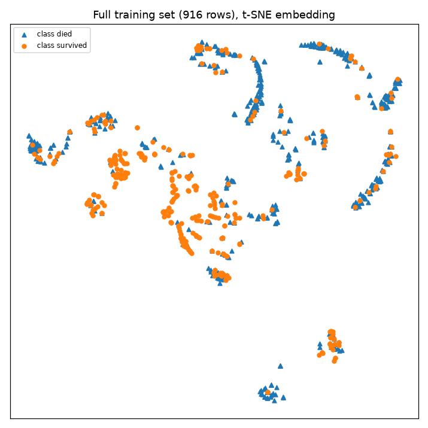

---

## Rule 1

Remaining rows entering this attempt: 350 positives / 566 negatives.

### Condition 1

Growing from: `survived(X) :- true.` (score=0.000)

Top candidates by Correlation (49 considered in total):

| refinement (Prolog) | tp | fp | Correlation |
|---|---|---|---|
| `survived(X) :- sex(X, female).` | 238 | 96 | 0.515 **<- chosen** |
| `survived(X) :- pclass(X, V1), V1 < 2.5.` | 220 | 188 | 0.290 |
| `survived(X) :- fare(X, V1), V1 >= 15.2.` | 229 | 205 | 0.284 |
| `survived(X) :- pclass(X, V1), V1 < 1.5.` | 138 | 83 | 0.281 |
| `survived(X) :- fare(X, V1), V1 >= 51.0.` | 107 | 59 | 0.254 |
| `survived(X) :- fare(X, V1), V1 >= 76.0.` | 71 | 29 | 0.236 |
| `survived(X) :- fare(X, V1), V1 >= 39.64.` | 110 | 79 | 0.210 |
| `survived(X) :- fare(X, V1), V1 >= 69.4.` | 73 | 46 | 0.184 |

Chosen: `survived(X) :- sex(X, female).` (tp=238, fp=96, Correlation=0.515) -- passes the 0.3 threshold.

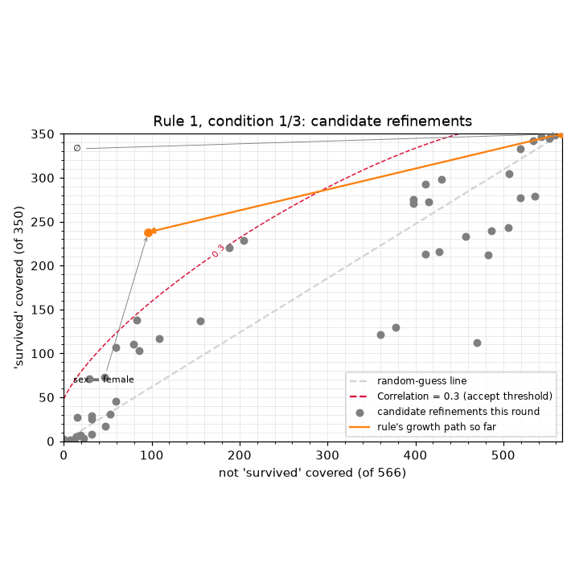
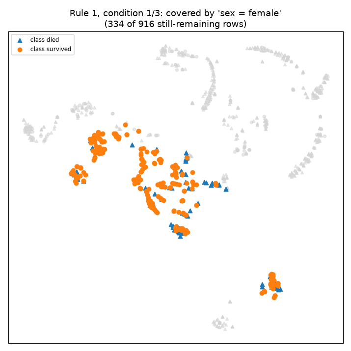

### Condition 2

Growing from: `survived(X) :- sex(X, female).` (score=0.515)

Top candidates by Correlation (47 considered in total):

| refinement (Prolog) | tp | fp | Correlation |
|---|---|---|---|
| `survived(X) :- pclass(X, V1), V1 < 2.5, sex(X, female).` | 164 | 15 | 0.542 **<- chosen** |
| `survived(X) :- sex(X, female), parch(X, V1), V1 < 3.5.` | 237 | 89 | 0.528 |
| `survived(X) :- sex(X, female), sibsp(X, V1), V1 < 2.5.` | 232 | 84 | 0.526 |
| `survived(X) :- sex(X, female), sibsp(X, V1), V1 < 3.5.` | 236 | 89 | 0.525 |
| `survived(X) :- sex(X, female), sibsp(X, V1), V1 < 4.5.` | 238 | 92 | 0.524 |
| `survived(X) :- sex(X, female), parch(X, V1), V1 < 4.5.` | 237 | 92 | 0.521 |
| `survived(X) :- sex(X, female), parch(X, V1), V1 < 2.5.` | 233 | 89 | 0.517 |
| `survived(X) :- sex(X, female), sibsp(X, V1), V1 < 1.5.` | 226 | 81 | 0.517 |

Chosen: `survived(X) :- pclass(X, V1), V1 < 2.5, sex(X, female).` (tp=164, fp=15, Correlation=0.542) -- passes the 0.3 threshold.

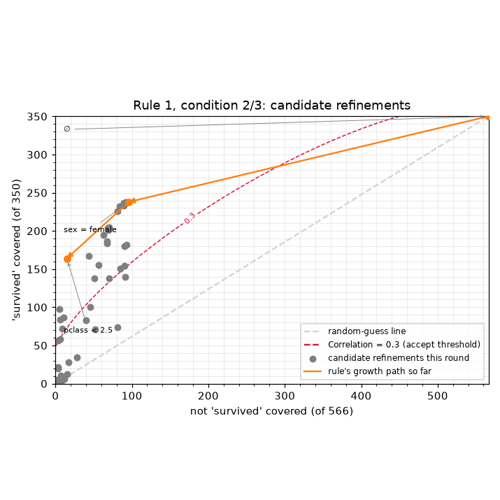


### Condition 3

Growing from: `survived(X) :- pclass(X, V1), V1 < 2.5, sex(X, female).` (score=0.542)

Top candidates by Correlation (45 considered in total):

| refinement (Prolog) | tp | fp | Correlation |
|---|---|---|---|
| `survived(X) :- pclass(X, V1), V1 < 2.5, sex(X, female), sibsp(X, V2), V2 < 3.5.` | 164 | 15 | 0.542 **<- chosen** |
| `survived(X) :- pclass(X, V1), V1 < 2.5, sex(X, female), sibsp(X, V2), V2 < 4.5.` | 164 | 15 | 0.542 |
| `survived(X) :- pclass(X, V1), V1 < 2.5, sex(X, female), parch(X, V2), V2 < 3.5.` | 164 | 15 | 0.542 |
| `survived(X) :- pclass(X, V1), V1 < 2.5, sex(X, female), parch(X, V2), V2 < 4.5.` | 164 | 15 | 0.542 |
| `survived(X) :- pclass(X, V1), V1 < 2.5, sex(X, female), sibsp(X, V2), V2 < 2.5.` | 161 | 15 | 0.535 |
| `survived(X) :- pclass(X, V1), V1 < 2.5, sex(X, female), parch(X, V2), V2 < 2.5.` | 160 | 15 | 0.532 |
| `survived(X) :- pclass(X, V1), V1 < 2.5, sex(X, female), age(X, V2), V2 < 75.0.` | 157 | 14 | 0.529 |
| `survived(X) :- pclass(X, V1), V1 < 2.5, sex(X, female), age(X, V2), V2 < 60.2.` | 154 | 13 | 0.525 |

Chosen: `survived(X) :- pclass(X, V1), V1 < 2.5, sex(X, female), sibsp(X, V2), V2 < 3.5.` (tp=164, fp=15, Correlation=0.542) -- passes the 0.3 threshold.

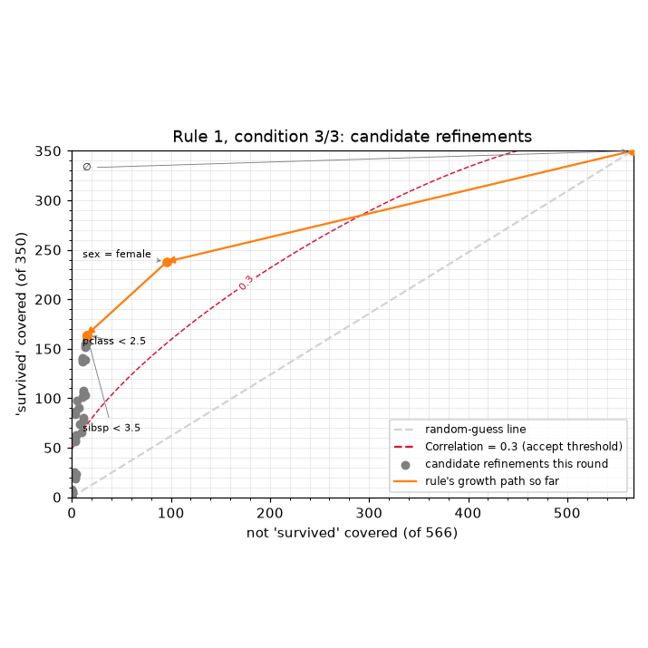
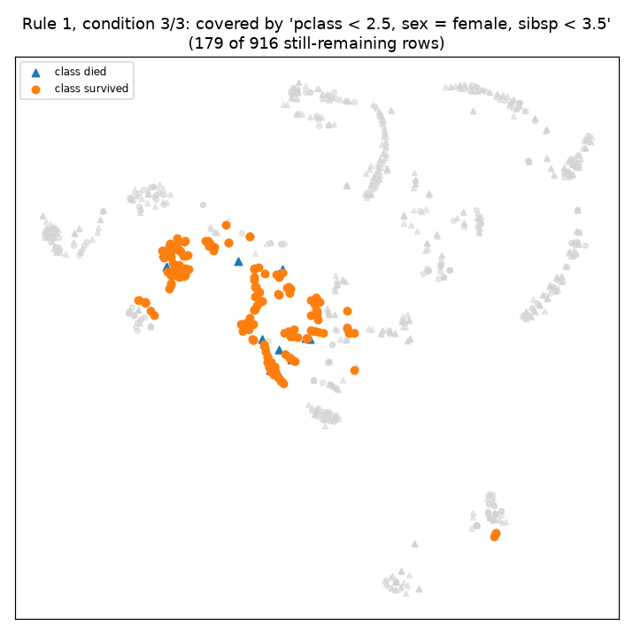

**Rule 1 accepted:** `survived(X) :- pclass(X, V1), V1 < 2.5, sex(X, female).`

Model so far (1 rule):

```prolog
survived(X) :- pclass(X, V1), V1 < 2.5, sex(X, female).  % (164/15)
```

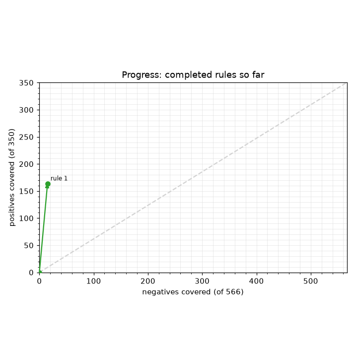

## Rule 2

Remaining rows entering this attempt: 186 positives / 551 negatives.

### Condition 1

Growing from: `survived(X) :- true.` (score=0.000)

Top candidates by Correlation (49 considered in total):

| refinement (Prolog) | tp | fp | Correlation |
|---|---|---|---|
| `survived(X) :- sex(X, female).` | 74 | 81 | 0.267 **<- chosen** |
| `survived(X) :- age(X, V1), V1 < 6.5.` | 21 | 14 | 0.179 |
| `survived(X) :- fare(X, V1), V1 >= 15.2.` | 88 | 194 | 0.108 |
| `survived(X) :- parch(X, V1), V1 >= 0.5.` | 54 | 105 | 0.105 |
| `survived(X) :- embarked(X, C).` | 45 | 84 | 0.102 |
| `survived(X) :- pclass(X, V1), V1 < 1.5.` | 40 | 78 | 0.087 |
| `survived(X) :- embarked(X, Q).` | 28 | 53 | 0.075 |
| `survived(X) :- sibsp(X, V1), V1 >= 0.5.` | 63 | 147 | 0.069 |

Chosen: `survived(X) :- sex(X, female).` (tp=74, fp=81, Correlation=0.267) -- does not (yet) pass the 0.3 threshold.

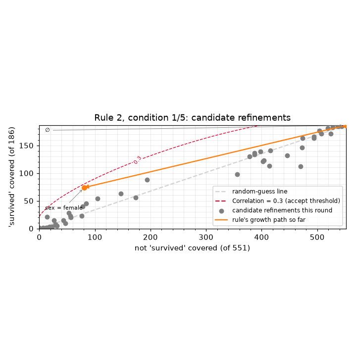
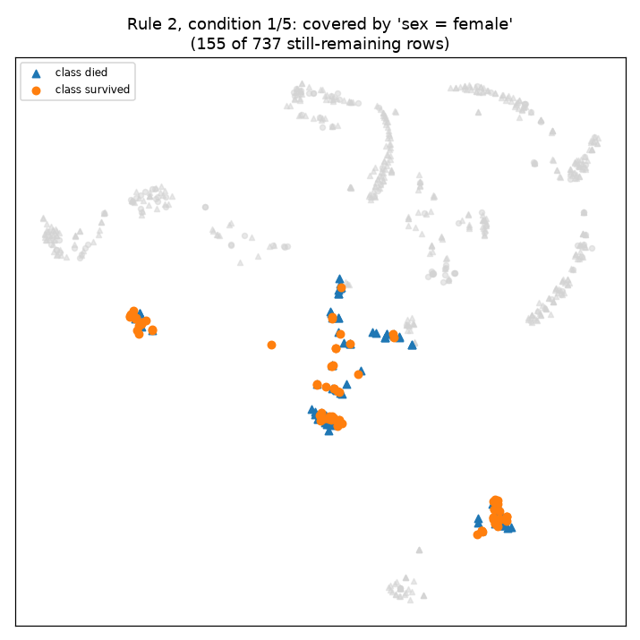

### Condition 2

Growing from: `survived(X) :- sex(X, female).` (score=0.267)

Top candidates by Correlation (47 considered in total):

| refinement (Prolog) | tp | fp | Correlation |
|---|---|---|---|
| `survived(X) :- sex(X, female), parch(X, V1), V1 < 1.5.` | 65 | 55 | 0.294 **<- chosen** |
| `survived(X) :- sex(X, female), fare(X, V1), V1 < 39.64.` | 74 | 73 | 0.288 |
| `survived(X) :- sex(X, female), sibsp(X, V1), V1 < 1.5.` | 70 | 66 | 0.287 |
| `survived(X) :- sex(X, female), sibsp(X, V1), V1 < 2.5.` | 71 | 69 | 0.284 |
| `survived(X) :- sex(X, female), parch(X, V1), V1 < 2.5.` | 73 | 74 | 0.281 |
| `survived(X) :- sex(X, female), parch(X, V1), V1 < 3.5.` | 73 | 74 | 0.281 |
| `survived(X) :- sex(X, female), sibsp(X, V1), V1 < 4.5.` | 74 | 77 | 0.278 |
| `survived(X) :- sex(X, female), sibsp(X, V1), V1 < 3.5.` | 72 | 74 | 0.276 |

Chosen: `survived(X) :- sex(X, female), parch(X, V1), V1 < 1.5.` (tp=65, fp=55, Correlation=0.294) -- does not (yet) pass the 0.3 threshold.

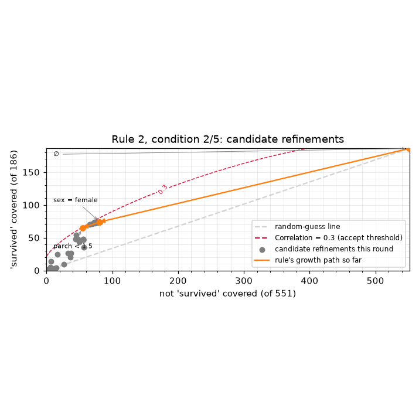
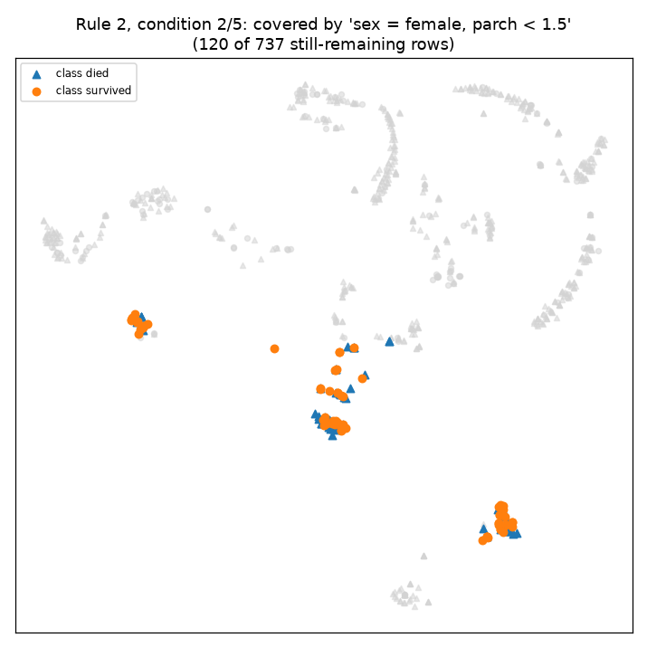

### Condition 3

Growing from: `survived(X) :- sex(X, female), parch(X, V1), V1 < 1.5.` (score=0.294)

Top candidates by Correlation (39 considered in total):

| refinement (Prolog) | tp | fp | Correlation |
|---|---|---|---|
| `survived(X) :- sex(X, female), sibsp(X, V1), V1 < 2.5, parch(X, V2), V2 < 1.5.` | 64 | 52 | 0.298 **<- chosen** |
| `survived(X) :- sex(X, female), parch(X, V1), V1 < 1.5, fare(X, V2), V2 < 39.64.` | 65 | 54 | 0.297 |
| `survived(X) :- sex(X, female), sibsp(X, V1), V1 < 1.5, parch(X, V2), V2 < 1.5.` | 63 | 51 | 0.296 |
| `survived(X) :- pclass(X, V1), V1 >= 1.5, sex(X, female), parch(X, V2), V2 < 1.5.` | 65 | 55 | 0.294 |
| `survived(X) :- pclass(X, V1), V1 >= 2.5, sex(X, female), parch(X, V2), V2 < 1.5.` | 65 | 55 | 0.294 |
| `survived(X) :- sex(X, female), sibsp(X, V1), V1 < 3.5, parch(X, V2), V2 < 1.5.` | 65 | 55 | 0.294 |
| `survived(X) :- sex(X, female), sibsp(X, V1), V1 < 4.5, parch(X, V2), V2 < 1.5.` | 65 | 55 | 0.294 |
| `survived(X) :- sex(X, female), parch(X, V1), V1 < 1.5, fare(X, V2), V2 < 51.0.` | 65 | 55 | 0.294 |

Chosen: `survived(X) :- sex(X, female), sibsp(X, V1), V1 < 2.5, parch(X, V2), V2 < 1.5.` (tp=64, fp=52, Correlation=0.298) -- does not (yet) pass the 0.3 threshold.

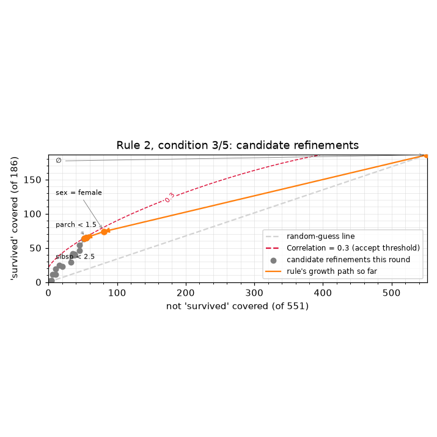
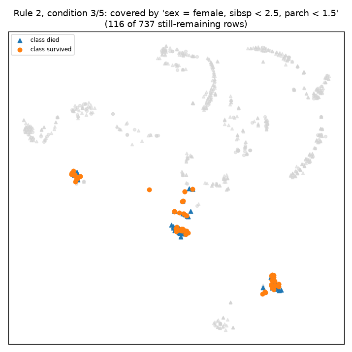

### Condition 4

Growing from: `survived(X) :- sex(X, female), sibsp(X, V1), V1 < 2.5, parch(X, V2), V2 < 1.5.` (score=0.298)

Top candidates by Correlation (33 considered in total):

| refinement (Prolog) | tp | fp | Correlation |
|---|---|---|---|
| `survived(X) :- sex(X, female), sibsp(X, V1), V1 < 2.5, parch(X, V2), V2 < 1.5, fare(X, V3), V3 < 39.64.` | 64 | 51 | 0.301 **<- chosen** |
| `survived(X) :- pclass(X, V1), V1 >= 1.5, sex(X, female), sibsp(X, V2), V2 < 2.5, parch(X, V3), V3 < 1.5.` | 64 | 52 | 0.298 |
| `survived(X) :- pclass(X, V1), V1 >= 2.5, sex(X, female), sibsp(X, V2), V2 < 2.5, parch(X, V3), V3 < 1.5.` | 64 | 52 | 0.298 |
| `survived(X) :- sex(X, female), sibsp(X, V1), V1 < 2.5, parch(X, V2), V2 < 1.5, fare(X, V3), V3 < 51.0.` | 64 | 52 | 0.298 |
| `survived(X) :- sex(X, female), sibsp(X, V1), V1 < 2.5, parch(X, V2), V2 < 1.5, fare(X, V3), V3 < 69.4.` | 64 | 52 | 0.298 |
| `survived(X) :- sex(X, female), sibsp(X, V1), V1 < 2.5, parch(X, V2), V2 < 1.5, fare(X, V3), V3 < 76.0.` | 64 | 52 | 0.298 |
| `survived(X) :- sex(X, female), sibsp(X, V1), V1 < 1.5, sibsp(X, V2), V2 < 2.5, parch(X, V3), V3 < 1.5.` | 63 | 51 | 0.296 |
| `survived(X) :- sex(X, female), sibsp(X, V1), V1 < 2.5, parch(X, V2), V2 < 0.5, parch(X, V3), V3 < 1.5.` | 53 | 45 | 0.260 |

Chosen: `survived(X) :- sex(X, female), sibsp(X, V1), V1 < 2.5, parch(X, V2), V2 < 1.5, fare(X, V3), V3 < 39.64.` (tp=64, fp=51, Correlation=0.301) -- passes the 0.3 threshold.

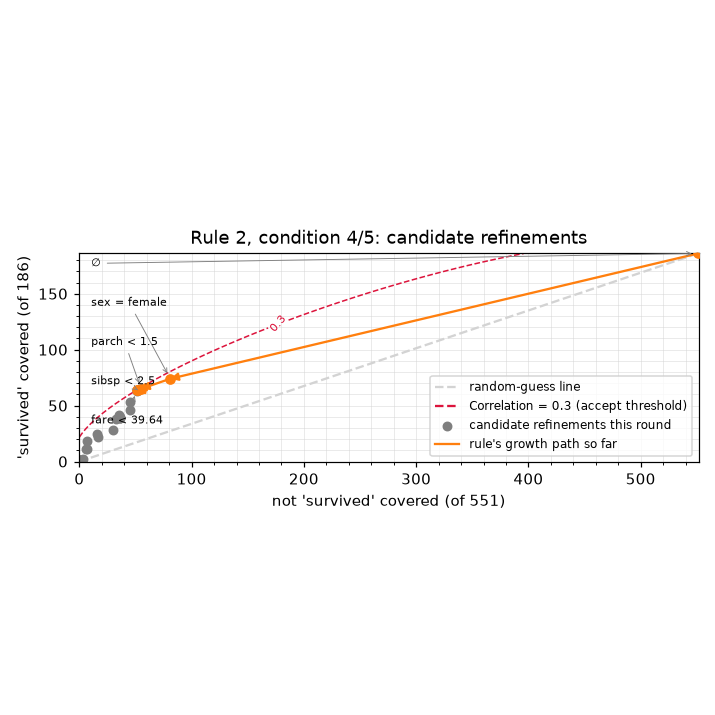
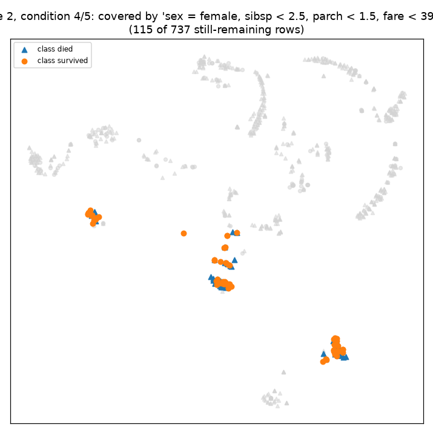

### Condition 5

Growing from: `survived(X) :- sex(X, female), sibsp(X, V1), V1 < 2.5, parch(X, V2), V2 < 1.5, fare(X, V3), V3 < 39.64.` (score=0.301)

Top candidates by Correlation (25 considered in total):

| refinement (Prolog) | tp | fp | Correlation |
|---|---|---|---|
| `survived(X) :- pclass(X, V1), V1 >= 1.5, sex(X, female), sibsp(X, V2), V2 < 2.5, parch(X, V3), V3 < 1.5, fare(X, V4), V4 < 39.64.` | 64 | 51 | 0.301 **<- chosen** |
| `survived(X) :- pclass(X, V1), V1 >= 2.5, sex(X, female), sibsp(X, V2), V2 < 2.5, parch(X, V3), V3 < 1.5, fare(X, V4), V4 < 39.64.` | 64 | 51 | 0.301 |
| `survived(X) :- sex(X, female), sibsp(X, V1), V1 < 1.5, sibsp(X, V2), V2 < 2.5, parch(X, V3), V3 < 1.5, fare(X, V4), V4 < 39.64.` | 63 | 50 | 0.299 |
| `survived(X) :- sex(X, female), sibsp(X, V1), V1 < 2.5, parch(X, V2), V2 < 0.5, parch(X, V3), V3 < 1.5, fare(X, V4), V4 < 39.64.` | 53 | 44 | 0.264 |
| `survived(X) :- sex(X, female), sibsp(X, V1), V1 < 0.5, sibsp(X, V2), V2 < 2.5, parch(X, V3), V3 < 1.5, fare(X, V4), V4 < 39.64.` | 42 | 34 | 0.234 |
| `survived(X) :- sex(X, female), sibsp(X, V1), V1 < 2.5, parch(X, V2), V2 < 1.5, fare(X, V3), V3 < 15.2, fare(X, V4), V4 < 39.64.` | 46 | 45 | 0.219 |
| `survived(X) :- sex(X, female), age(X, V1), V1 < 75.0, sibsp(X, V2), V2 < 2.5, parch(X, V3), V3 < 1.5, fare(X, V4), V4 < 39.64.` | 40 | 35 | 0.218 |
| `survived(X) :- sex(X, female), age(X, V1), V1 >= 6.5, sibsp(X, V2), V2 < 2.5, parch(X, V3), V3 < 1.5, fare(X, V4), V4 < 39.64.` | 38 | 32 | 0.217 |

Chosen: `survived(X) :- pclass(X, V1), V1 >= 1.5, sex(X, female), sibsp(X, V2), V2 < 2.5, parch(X, V3), V3 < 1.5, fare(X, V4), V4 < 39.64.` (tp=64, fp=51, Correlation=0.301) -- passes the 0.3 threshold.

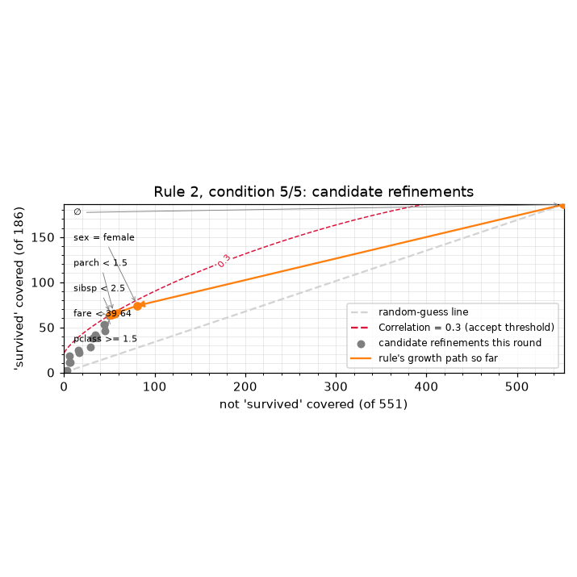
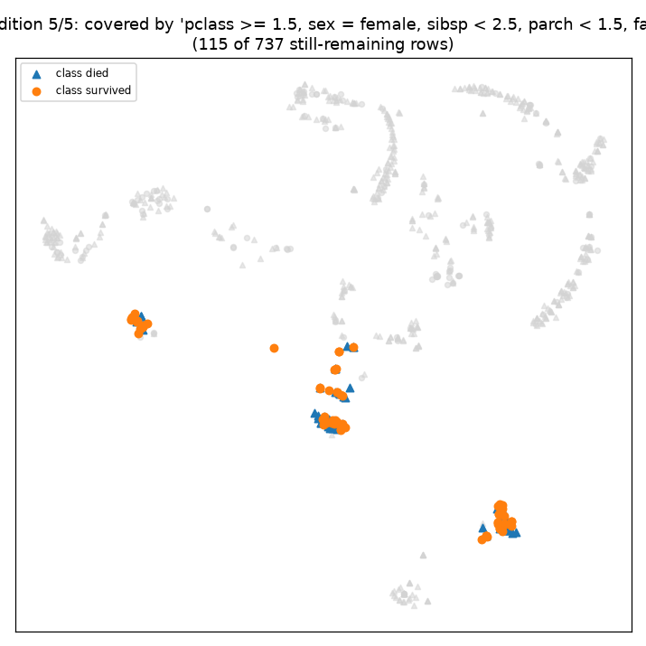

**Rule 2 accepted:** `survived(X) :- sex(X, female), sibsp(X, V1), V1 < 2.5, parch(X, V2), V2 < 1.5, fare(X, V3), V3 < 39.64.`

Model so far (2 rules):

```prolog
survived(X) :- pclass(X, V1), V1 < 2.5, sex(X, female).  % (164/15)
survived(X) :- sex(X, female), sibsp(X, V1), V1 < 2.5, parch(X, V2), V2 < 1.5, fare(X, V3), V3 < 39.64.  % (129/63)
```

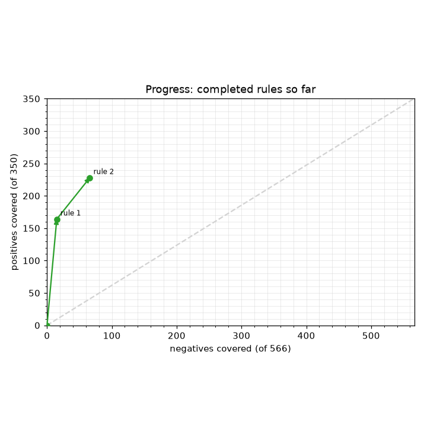

## Rule 3

Remaining rows entering this attempt: 122 positives / 500 negatives.

### Condition 1

Growing from: `survived(X) :- true.` (score=0.000)

Top candidates by Correlation (49 considered in total):

| refinement (Prolog) | tp | fp | Correlation |
|---|---|---|---|
| `survived(X) :- age(X, V1), V1 < 6.5.` | 19 | 11 | 0.248 **<- chosen** |
| `survived(X) :- pclass(X, V1), V1 < 1.5.` | 40 | 78 | 0.174 |
| `survived(X) :- fare(X, V1), V1 >= 15.2.` | 70 | 188 | 0.159 |
| `survived(X) :- parch(X, V1), V1 >= 0.5.` | 43 | 98 | 0.148 |
| `survived(X) :- embarked(X, C).` | 34 | 78 | 0.127 |
| `survived(X) :- fare(X, V1), V1 >= 76.0.` | 15 | 26 | 0.114 |
| `survived(X) :- pclass(X, V1), V1 < 2.5.` | 56 | 173 | 0.093 |
| `survived(X) :- fare(X, V1), V1 >= 51.0.` | 23 | 56 | 0.091 |

Chosen: `survived(X) :- age(X, V1), V1 < 6.5.` (tp=19, fp=11, Correlation=0.248) -- does not (yet) pass the 0.3 threshold.

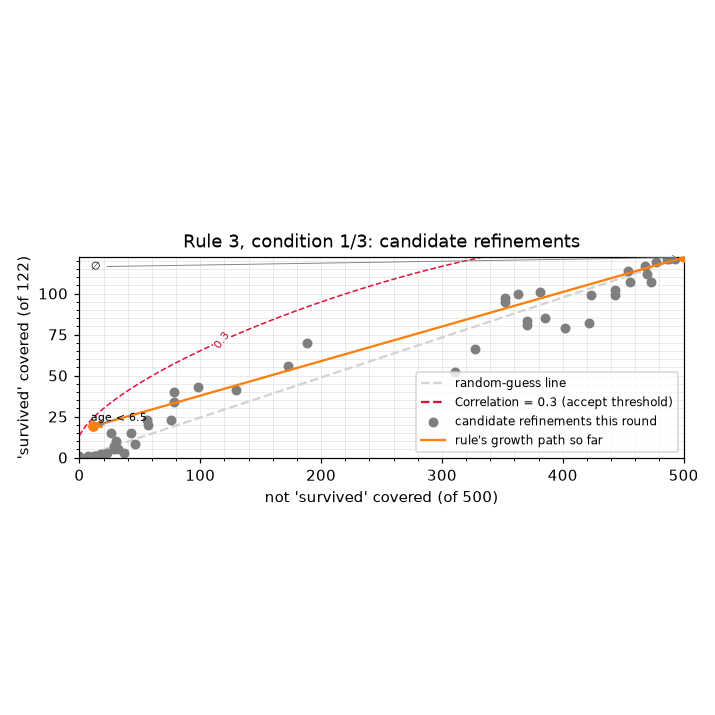
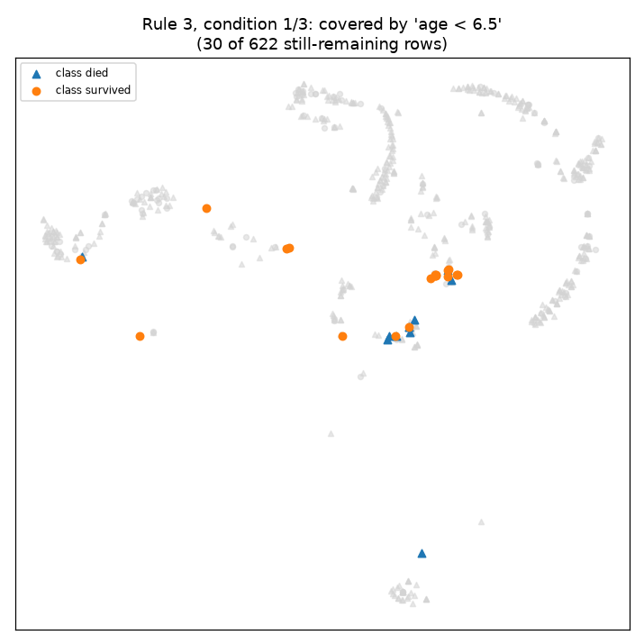

### Condition 2

Growing from: `survived(X) :- age(X, V1), V1 < 6.5.` (score=0.248)

Top candidates by Correlation (39 considered in total):

| refinement (Prolog) | tp | fp | Correlation |
|---|---|---|---|
| `survived(X) :- age(X, V1), V1 < 6.5, sibsp(X, V2), V2 < 2.5.` | 17 | 3 | 0.300 **<- chosen** |
| `survived(X) :- age(X, V1), V1 < 6.5, sibsp(X, V2), V2 < 1.5.` | 16 | 3 | 0.289 |
| `survived(X) :- age(X, V1), V1 < 6.5, sibsp(X, V2), V2 < 3.5.` | 17 | 6 | 0.268 |
| `survived(X) :- age(X, V1), V1 < 6.5, sibsp(X, V2), V2 < 4.5.` | 19 | 10 | 0.256 |
| `survived(X) :- age(X, V1), V1 < 6.5, parch(X, V2), V2 >= 0.5.` | 19 | 11 | 0.248 |
| `survived(X) :- age(X, V1), V1 < 6.5, parch(X, V2), V2 < 2.5.` | 19 | 11 | 0.248 |
| `survived(X) :- age(X, V1), V1 < 6.5, parch(X, V2), V2 < 3.5.` | 19 | 11 | 0.248 |
| `survived(X) :- age(X, V1), V1 < 6.5, parch(X, V2), V2 < 4.5.` | 19 | 11 | 0.248 |

Chosen: `survived(X) :- age(X, V1), V1 < 6.5, sibsp(X, V2), V2 < 2.5.` (tp=17, fp=3, Correlation=0.300) -- passes the 0.3 threshold.

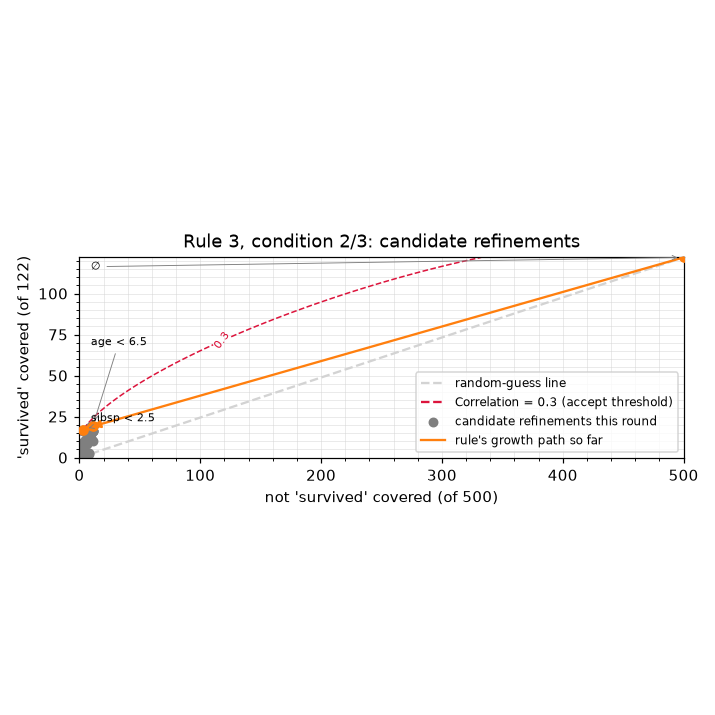
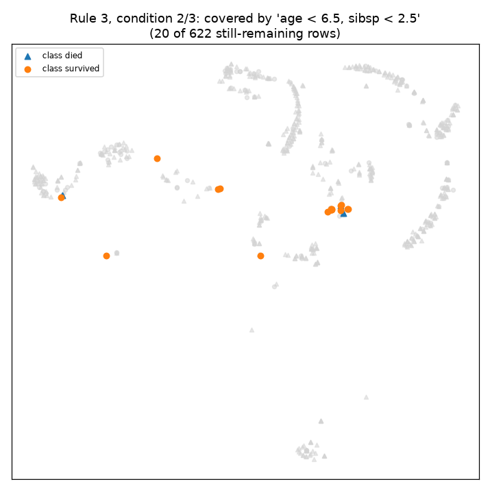

### Condition 3

Growing from: `survived(X) :- age(X, V1), V1 < 6.5, sibsp(X, V2), V2 < 2.5.` (score=0.300)

Top candidates by Correlation (33 considered in total):

| refinement (Prolog) | tp | fp | Correlation |
|---|---|---|---|
| `survived(X) :- age(X, V1), V1 < 6.5, sibsp(X, V2), V2 < 2.5, parch(X, V3), V3 >= 0.5.` | 17 | 3 | 0.300 **<- chosen** |
| `survived(X) :- age(X, V1), V1 < 6.5, sibsp(X, V2), V2 < 2.5, parch(X, V3), V3 < 2.5.` | 17 | 3 | 0.300 |
| `survived(X) :- age(X, V1), V1 < 6.5, sibsp(X, V2), V2 < 2.5, parch(X, V3), V3 < 3.5.` | 17 | 3 | 0.300 |
| `survived(X) :- age(X, V1), V1 < 6.5, sibsp(X, V2), V2 < 2.5, parch(X, V3), V3 < 4.5.` | 17 | 3 | 0.300 |
| `survived(X) :- age(X, V1), V1 < 6.5, sibsp(X, V2), V2 < 1.5, sibsp(X, V3), V3 < 2.5.` | 16 | 3 | 0.289 |
| `survived(X) :- age(X, V1), V1 < 6.5, sibsp(X, V2), V2 < 2.5, embarked(X, S).` | 14 | 2 | 0.278 |
| `survived(X) :- sex(X, male), age(X, V1), V1 < 6.5, sibsp(X, V2), V2 < 2.5.` | 15 | 3 | 0.277 |
| `survived(X) :- age(X, V1), V1 < 6.5, sibsp(X, V2), V2 < 2.5, fare(X, V3), V3 >= 15.2.` | 12 | 1 | 0.267 |

Chosen: `survived(X) :- age(X, V1), V1 < 6.5, sibsp(X, V2), V2 < 2.5, parch(X, V3), V3 >= 0.5.` (tp=17, fp=3, Correlation=0.300) -- passes the 0.3 threshold.

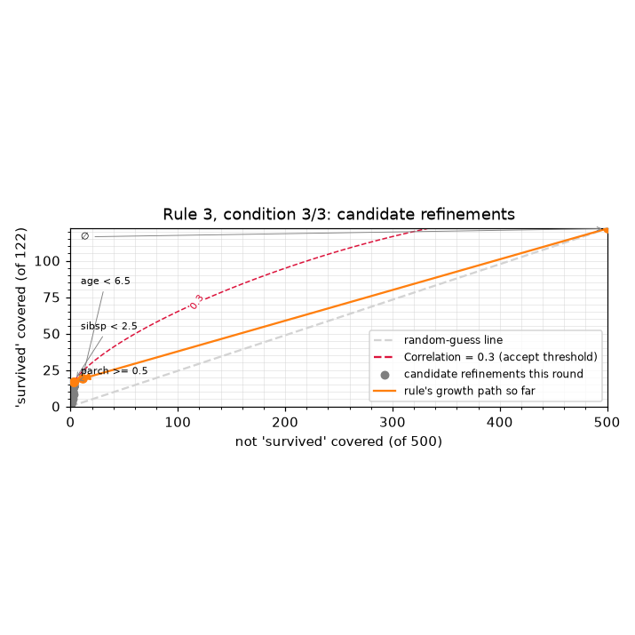


**Rule 3 accepted:** `survived(X) :- age(X, V1), V1 < 6.5, sibsp(X, V2), V2 < 2.5.`

Model so far (3 rules):

```prolog
survived(X) :- pclass(X, V1), V1 < 2.5, sex(X, female).  % (164/15)
survived(X) :- sex(X, female), sibsp(X, V1), V1 < 2.5, parch(X, V2), V2 < 1.5, fare(X, V3), V3 < 39.64.  % (129/63)
survived(X) :- age(X, V1), V1 < 6.5, sibsp(X, V2), V2 < 2.5.  % (25/7)
```


## Rejected attempt

Remaining rows entering this attempt: 105 positives / 497 negatives.

### Condition 1

Growing from: `survived(X) :- true.` (score=0.000)

Top candidates by Correlation (49 considered in total):

| refinement (Prolog) | tp | fp | Correlation |
|---|---|---|---|
| `survived(X) :- pclass(X, V1), V1 < 1.5.` | 37 | 78 | 0.189 **<- chosen** |
| `survived(X) :- embarked(X, C).` | 31 | 77 | 0.139 |
| `survived(X) :- fare(X, V1), V1 >= 15.2.` | 58 | 187 | 0.136 |
| `survived(X) :- fare(X, V1), V1 >= 76.0.` | 12 | 26 | 0.097 |
| `survived(X) :- fare(X, V1), V1 >= 51.0.` | 20 | 56 | 0.089 |
| `survived(X) :- age(X, V1), V1 >= 75.0.` | 1 | 0 | 0.089 |
| `survived(X) :- pclass(X, V1), V1 < 2.5.` | 47 | 173 | 0.078 |
| `survived(X) :- age(X, V1), V1 < 60.2.` | 83 | 360 | 0.057 |

Chosen: `survived(X) :- pclass(X, V1), V1 < 1.5.` (tp=37, fp=78, Correlation=0.189) -- does not (yet) pass the 0.3 threshold.

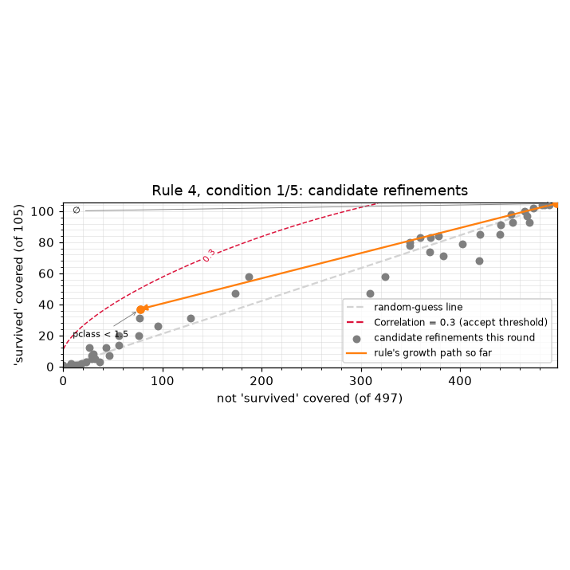
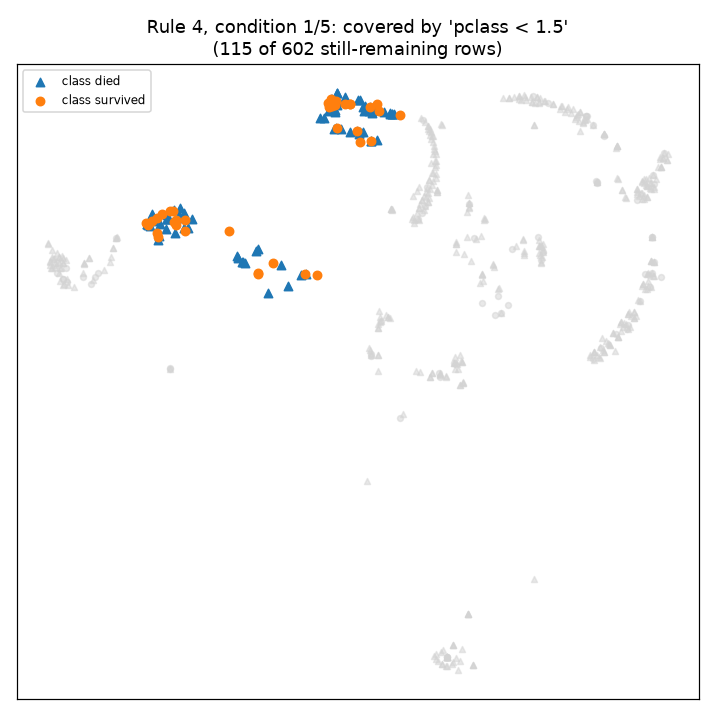

### Condition 2

Growing from: `survived(X) :- pclass(X, V1), V1 < 1.5.` (score=0.189)

Top candidates by Correlation (45 considered in total):

| refinement (Prolog) | tp | fp | Correlation |
|---|---|---|---|
| `survived(X) :- pclass(X, V1), V1 < 1.5, parch(X, V2), V2 < 2.5.` | 37 | 76 | 0.194 **<- chosen** |
| `survived(X) :- pclass(X, V1), V1 < 1.5, fare(X, V2), V2 >= 15.2.` | 36 | 73 | 0.193 |
| `survived(X) :- pclass(X, V1), V1 < 1.5, sibsp(X, V2), V2 < 2.5.` | 37 | 77 | 0.191 |
| `survived(X) :- pclass(X, V1), V1 < 1.5, parch(X, V2), V2 < 3.5.` | 37 | 77 | 0.191 |
| `survived(X) :- pclass(X, V1), V1 < 1.5, sex(X, male).` | 37 | 78 | 0.189 |
| `survived(X) :- pclass(X, V1), V1 < 1.5, sibsp(X, V2), V2 < 3.5.` | 37 | 78 | 0.189 |
| `survived(X) :- pclass(X, V1), V1 < 1.5, sibsp(X, V2), V2 < 4.5.` | 37 | 78 | 0.189 |
| `survived(X) :- pclass(X, V1), V1 < 1.5, parch(X, V2), V2 < 4.5.` | 37 | 78 | 0.189 |

Chosen: `survived(X) :- pclass(X, V1), V1 < 1.5, parch(X, V2), V2 < 2.5.` (tp=37, fp=76, Correlation=0.194) -- does not (yet) pass the 0.3 threshold.

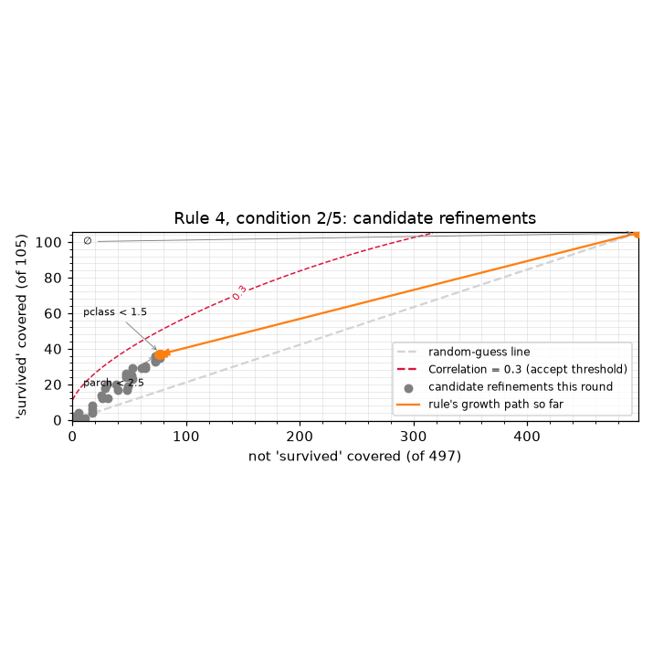
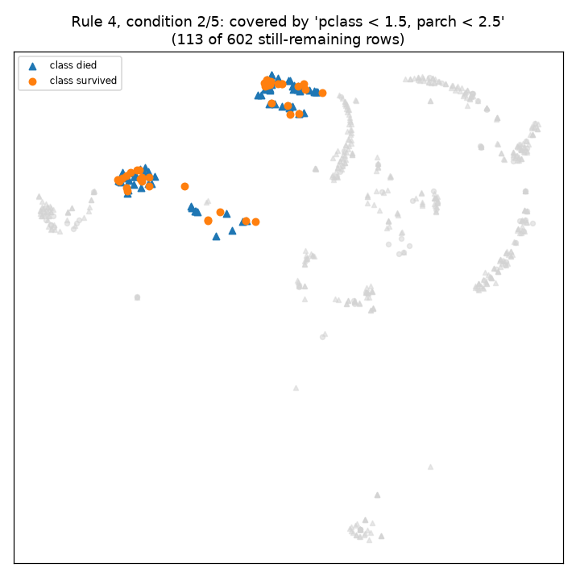

### Condition 3

Growing from: `survived(X) :- pclass(X, V1), V1 < 1.5, parch(X, V2), V2 < 2.5.` (score=0.194)

Top candidates by Correlation (39 considered in total):

| refinement (Prolog) | tp | fp | Correlation |
|---|---|---|---|
| `survived(X) :- pclass(X, V1), V1 < 1.5, parch(X, V2), V2 < 2.5, fare(X, V3), V3 >= 15.2.` | 36 | 71 | 0.199 **<- chosen** |
| `survived(X) :- pclass(X, V1), V1 < 1.5, sibsp(X, V2), V2 < 2.5, parch(X, V3), V3 < 2.5.` | 37 | 75 | 0.196 |
| `survived(X) :- pclass(X, V1), V1 < 1.5, sex(X, male), parch(X, V2), V2 < 2.5.` | 37 | 76 | 0.194 |
| `survived(X) :- pclass(X, V1), V1 < 1.5, sibsp(X, V2), V2 < 3.5, parch(X, V3), V3 < 2.5.` | 37 | 76 | 0.194 |
| `survived(X) :- pclass(X, V1), V1 < 1.5, sibsp(X, V2), V2 < 4.5, parch(X, V3), V3 < 2.5.` | 37 | 76 | 0.194 |
| `survived(X) :- pclass(X, V1), V1 < 1.5, age(X, V2), V2 < 60.2, parch(X, V3), V3 < 2.5.` | 29 | 53 | 0.188 |
| `survived(X) :- pclass(X, V1), V1 < 1.5, sibsp(X, V2), V2 < 1.5, parch(X, V3), V3 < 2.5.` | 35 | 75 | 0.179 |
| `survived(X) :- pclass(X, V1), V1 < 1.5, parch(X, V2), V2 < 2.5, fare(X, V3), V3 < 39.64.` | 20 | 30 | 0.179 |

Chosen: `survived(X) :- pclass(X, V1), V1 < 1.5, parch(X, V2), V2 < 2.5, fare(X, V3), V3 >= 15.2.` (tp=36, fp=71, Correlation=0.199) -- does not (yet) pass the 0.3 threshold.

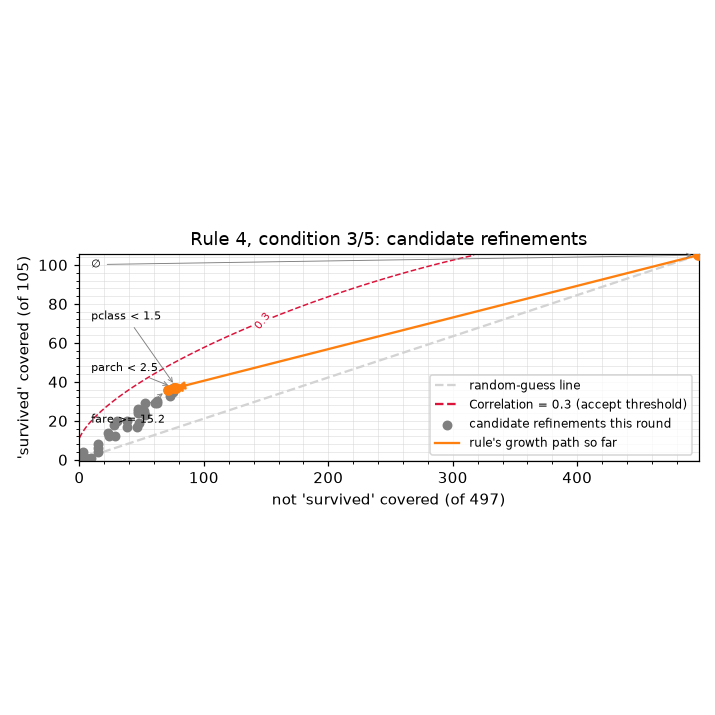
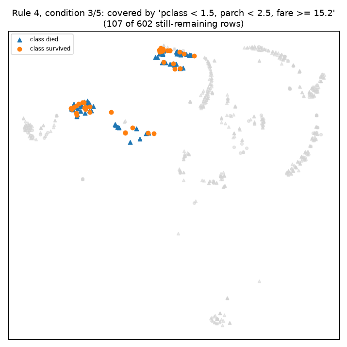

### Condition 4

Growing from: `survived(X) :- pclass(X, V1), V1 < 1.5, parch(X, V2), V2 < 2.5, fare(X, V3), V3 >= 15.2.` (score=0.199)

Top candidates by Correlation (37 considered in total):

| refinement (Prolog) | tp | fp | Correlation |
|---|---|---|---|
| `survived(X) :- pclass(X, V1), V1 < 1.5, sibsp(X, V2), V2 < 2.5, parch(X, V3), V3 < 2.5, fare(X, V4), V4 >= 15.2.` | 36 | 70 | 0.201 **<- chosen** |
| `survived(X) :- pclass(X, V1), V1 < 1.5, sex(X, male), parch(X, V2), V2 < 2.5, fare(X, V3), V3 >= 15.2.` | 36 | 71 | 0.199 |
| `survived(X) :- pclass(X, V1), V1 < 1.5, sibsp(X, V2), V2 < 3.5, parch(X, V3), V3 < 2.5, fare(X, V4), V4 >= 15.2.` | 36 | 71 | 0.199 |
| `survived(X) :- pclass(X, V1), V1 < 1.5, sibsp(X, V2), V2 < 4.5, parch(X, V3), V3 < 2.5, fare(X, V4), V4 >= 15.2.` | 36 | 71 | 0.199 |
| `survived(X) :- pclass(X, V1), V1 < 1.5, parch(X, V2), V2 < 2.5, fare(X, V3), V3 >= 15.2, fare(X, V4), V4 < 39.64.` | 19 | 25 | 0.190 |
| `survived(X) :- pclass(X, V1), V1 < 1.5, age(X, V2), V2 < 60.2, parch(X, V3), V3 < 2.5, fare(X, V4), V4 >= 15.2.` | 28 | 50 | 0.188 |
| `survived(X) :- pclass(X, V1), V1 < 1.5, sibsp(X, V2), V2 < 1.5, parch(X, V3), V3 < 2.5, fare(X, V4), V4 >= 15.2.` | 34 | 70 | 0.184 |
| `survived(X) :- pclass(X, V1), V1 < 1.5, age(X, V2), V2 < 53.5, parch(X, V3), V3 < 2.5, fare(X, V4), V4 >= 15.2.` | 25 | 44 | 0.178 |

Chosen: `survived(X) :- pclass(X, V1), V1 < 1.5, sibsp(X, V2), V2 < 2.5, parch(X, V3), V3 < 2.5, fare(X, V4), V4 >= 15.2.` (tp=36, fp=70, Correlation=0.201) -- does not (yet) pass the 0.3 threshold.


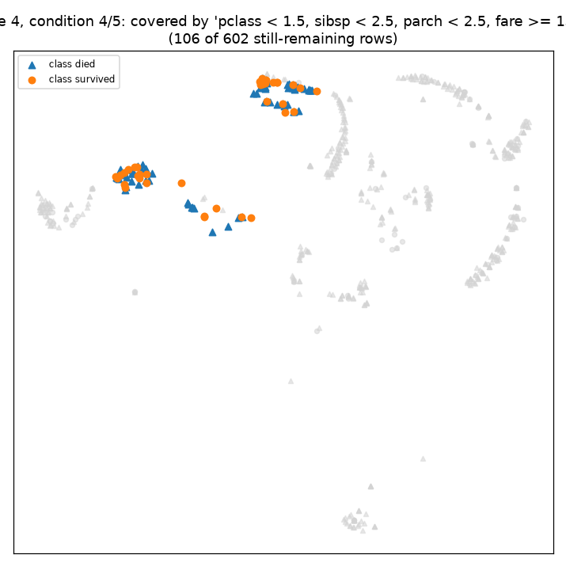

### Condition 5

Growing from: `survived(X) :- pclass(X, V1), V1 < 1.5, sibsp(X, V2), V2 < 2.5, parch(X, V3), V3 < 2.5, fare(X, V4), V4 >= 15.2.` (score=0.201)

Top candidates by Correlation (31 considered in total):

| refinement (Prolog) | tp | fp | Correlation |
|---|---|---|---|
| `survived(X) :- pclass(X, V1), V1 < 1.5, sex(X, male), sibsp(X, V2), V2 < 2.5, parch(X, V3), V3 < 2.5, fare(X, V4), V4 >= 15.2.` | 36 | 70 | 0.201 **<- chosen** |
| `survived(X) :- pclass(X, V1), V1 < 1.5, age(X, V2), V2 < 60.2, sibsp(X, V3), V3 < 2.5, parch(X, V4), V4 < 2.5, fare(X, V5), V5 >= 15.2.` | 28 | 49 | 0.191 |
| `survived(X) :- pclass(X, V1), V1 < 1.5, sibsp(X, V2), V2 < 2.5, parch(X, V3), V3 < 2.5, fare(X, V4), V4 >= 15.2, fare(X, V5), V5 < 39.64.` | 19 | 25 | 0.190 |
| `survived(X) :- pclass(X, V1), V1 < 1.5, sibsp(X, V2), V2 < 1.5, sibsp(X, V3), V3 < 2.5, parch(X, V4), V4 < 2.5, fare(X, V5), V5 >= 15.2.` | 34 | 70 | 0.184 |
| `survived(X) :- pclass(X, V1), V1 < 1.5, age(X, V2), V2 < 53.5, sibsp(X, V3), V3 < 2.5, parch(X, V4), V4 < 2.5, fare(X, V5), V5 >= 15.2.` | 25 | 43 | 0.182 |
| `survived(X) :- pclass(X, V1), V1 < 1.5, sibsp(X, V2), V2 < 2.5, parch(X, V3), V3 < 2.5, fare(X, V4), V4 >= 15.2, fare(X, V5), V5 < 69.4.` | 24 | 42 | 0.175 |
| `survived(X) :- pclass(X, V1), V1 < 1.5, age(X, V2), V2 >= 6.5, sibsp(X, V3), V3 < 2.5, parch(X, V4), V4 < 2.5, fare(X, V5), V5 >= 15.2.` | 29 | 58 | 0.172 |
| `survived(X) :- pclass(X, V1), V1 < 1.5, sibsp(X, V2), V2 < 2.5, parch(X, V3), V3 < 1.5, parch(X, V4), V4 < 2.5, fare(X, V5), V5 >= 15.2.` | 32 | 68 | 0.171 |

Chosen: `survived(X) :- pclass(X, V1), V1 < 1.5, sex(X, male), sibsp(X, V2), V2 < 2.5, parch(X, V3), V3 < 2.5, fare(X, V4), V4 >= 15.2.` (tp=36, fp=70, Correlation=0.201) -- does not (yet) pass the 0.3 threshold.

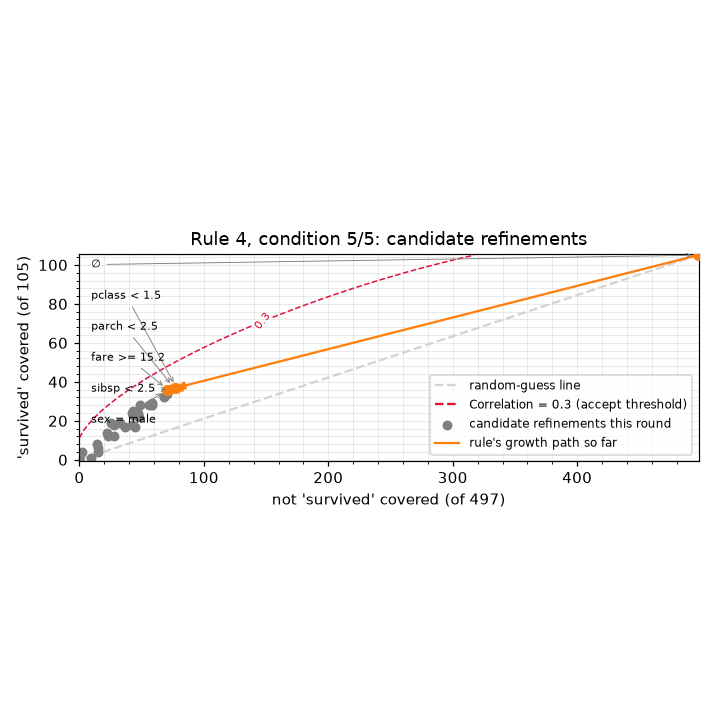


**No rule accepted from this attempt.** Hill climbing reached a local optimum whose Correlation never reaches 0.3; the covering loop stops here rather than keeping a rule that fails the filter.

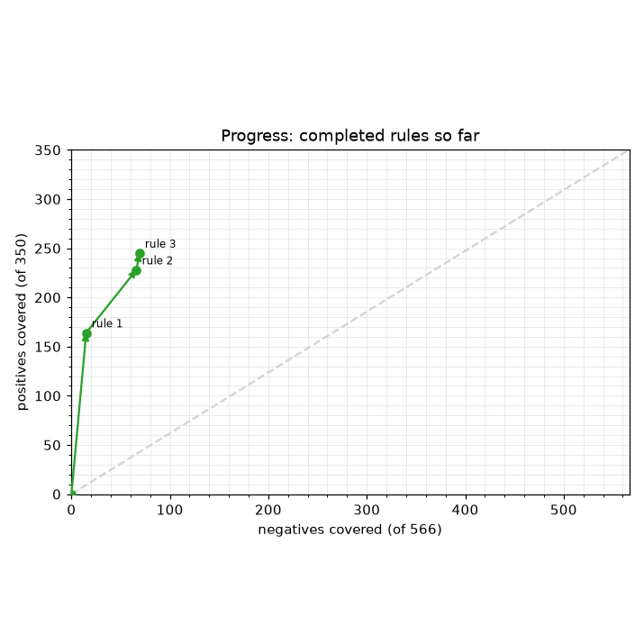

---

## Final rule set

- `survived(X) :- pclass(X, V1), V1 < 2.5, sex(X, female).`
- `survived(X) :- sex(X, female), sibsp(X, V1), V1 < 2.5, parch(X, V2), V2 < 1.5, fare(X, V3), V3 < 39.64.`
- `survived(X) :- age(X, V1), V1 < 6.5, sibsp(X, V2), V2 < 2.5.`

---

## Default rule

105 positives / 497 negatives are covered by none of the 3 rules above -- the majority class among them, `died`, is what a decision list built from this ruleset would fall back to for any of these rows.

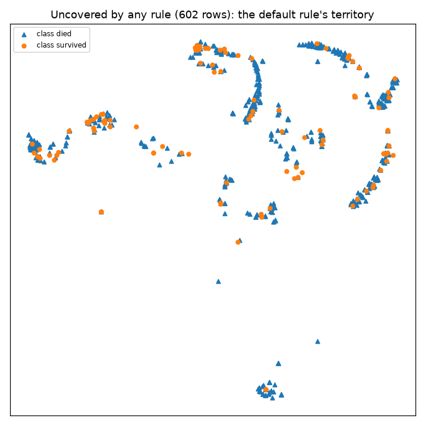
