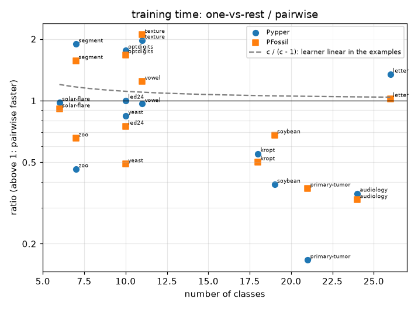
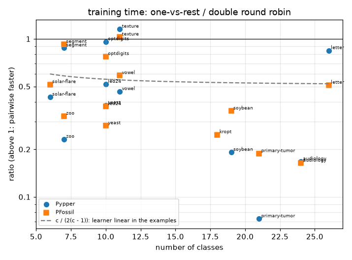
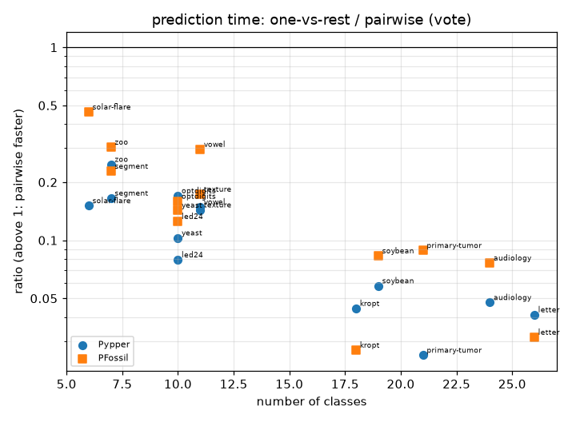

# Multi-class decomposition: one-vs-rest vs. pairwise

## Setup

**Full run.** Quick sanity check instead: `python examples/demo_multiclass_decomposition.py`.

A rule learner that learns rules for one class against the rest has to
decompose a problem with several classes into two-class problems. This
demo compares the ways of doing that in pyrulearn, with Pypper
(pyrulearn's RIPPER) and PFossil as base learners -- in essence the
experiments of Fürnkranz, *Round Robin Classification* (JMLR 2002), with
Pypper standing in for Ripper:

- **ovr** -- one-vs-rest: one model per class, "this class vs. all
  others", every model trained on all examples; conflicts resolved by the
  best rule.
- **ordered** -- ordered one-vs-rest: classes from least to most frequent,
  each learned against the classes not yet handled; the most frequent
  class is the default. This is Ripper's (and Pypper's) own strategy.
- **pw_smaller / pw_larger** -- pairwise (round robin): one model per pair
  of classes, trained on those two classes' examples only, with the
  pair's smaller (larger) class as the target.
- **pw_both** -- the double round robin: for every pair, a model for each
  of its two classes.

A pairwise model is scored with three vote schemes on the same fitted
model: **vote** (each pair model votes for one class), **weighted_vote**
(the vote is split by the reliability of the rule that decided it) and
**accuracy_vote** (the vote is split by the pair model's accuracy on its
own two classes). Only prediction changes, so the three share their
training.

**Why training time is interesting.** Pairwise learns many more models --
c(c-1)/2 for c classes -- but each on few examples: every example is used
in c - 1 pair models, so pairwise learns from (c - 1) * n examples in
total, against c * n for one-vs-rest. For a learner whose time grows
linearly with the examples, one-vs-rest therefore takes about c / (c - 1)
times as long; for one that grows faster, pairwise gains more with every
class. Prediction goes the other way: every pair model has to be asked.

Datasets, with their numbers of classes: `letter` (26), `audiology` (24), `primary-tumor` (21), `soybean` (19), `kropt` (18), `vowel` (11), `texture` (11), `yeast` (10), `led24` (10), `optdigits` (10), `zoo` (7), `segment` (7), `solar-flare` (6). Protocol: 10-fold stratified cross-validation (5-fold for the large kropt, letter), one
`DataSpec` per training fold (`build_dataspec(max_intervals=8)`).
Each fit is capped at 300s; a time-out counts as a failure.
Training time is measured inside the worker process, so it excludes
shipping data and models between processes.

## Pypper

| variant | accuracy | mean rank | rules | conditions | train (s) | predict (s) | failures |
|---|--:|--:|--:|--:|--:|--:|--:|
| pw_both:accuracy_vote | 0.797 | 2.88 | 321.3 | 677.4 | 27.59 | 0.176 | 5 |
| pw_both:vote | 0.784 | 3.65 | 321.3 | 677.4 | 27.59 | 0.125 | 5 |
| pw_smaller:accuracy_vote | 0.779 | 4.12 | 209.2 | 547.5 | 22.30 | 0.160 | 0 |
| pw_larger:accuracy_vote | 0.782 | 4.65 | 210.0 | 548.7 | 22.33 | 0.142 | 1 |
| pw_smaller:vote | 0.781 | 5.04 | 209.2 | 547.5 | 22.30 | 0.119 | 0 |
| ordered | 0.761 | 6.19 | 39.1 | 172.4 | 17.39 | 0.003 | 0 |
| pw_both:weighted_vote | 0.718 | 6.19 | 321.3 | 677.4 | 27.59 | 1.242 | 5 |
| pw_larger:vote | 0.691 | 6.77 | 210.0 | 548.7 | 22.33 | 0.104 | 1 |
| ovr | 0.729 | 7.58 | 40.6 | 215.5 | 26.65 | 0.006 | 0 |
| pw_smaller:weighted_vote | 0.514 | 8.54 | 209.2 | 547.5 | 22.30 | 1.048 | 0 |
| pw_larger:weighted_vote | 0.402 | 10.38 | 210.0 | 548.7 | 22.33 | 1.056 | 1 |

Sorted by mean rank (accuracy rank across datasets, failures last). Rules and conditions: all of a decomposition's models together. The three vote schemes of a pairwise decomposition share its models and training time.

## PFossil

| variant | accuracy | mean rank | rules | conditions | train (s) | predict (s) | failures |
|---|--:|--:|--:|--:|--:|--:|--:|
| pw_both:accuracy_vote | 0.792 | 2.77 | 569.5 | 1376.2 | 10.54 | 0.276 | 0 |
| pw_both:vote | 0.783 | 3.62 | 569.5 | 1376.2 | 10.54 | 0.203 | 0 |
| pw_smaller:accuracy_vote | 0.775 | 4.96 | 283.7 | 716.2 | 5.13 | 0.138 | 0 |
| pw_larger:accuracy_vote | 0.774 | 5.19 | 283.2 | 659.0 | 5.30 | 0.140 | 0 |
| pw_both:weighted_vote | 0.715 | 5.27 | 569.5 | 1376.2 | 10.54 | 1.871 | 0 |
| pw_smaller:vote | 0.771 | 5.65 | 283.7 | 716.2 | 5.13 | 0.100 | 0 |
| pw_larger:vote | 0.762 | 6.35 | 283.2 | 659.0 | 5.30 | 0.102 | 0 |
| ovr | 0.761 | 6.46 | 52.4 | 274.4 | 6.55 | 0.004 | 0 |
| ordered | 0.760 | 6.92 | 46.6 | 214.8 | 3.72 | 0.002 | 0 |
| pw_smaller:weighted_vote | 0.508 | 8.04 | 283.7 | 716.2 | 5.13 | 0.869 | 0 |
| pw_larger:weighted_vote | 0.386 | 10.77 | 283.2 | 659.0 | 5.30 | 0.976 | 0 |

Sorted by mean rank (accuracy rank across datasets, failures last). Rules and conditions: all of a decomposition's models together. The three vote schemes of a pairwise decomposition share its models and training time.

## Training and prediction time over the number of classes

One point per dataset and base learner: the mean one-vs-rest time divided by the mean pairwise time. Above 1, pairwise is faster. The dashed line is what a learner whose time grows linearly with the number of examples would give.

## Per dataset (mean across folds)

| dataset | learner | accuracy | n_conditions | train_time | predict_time |
|---|---|---|---|---|---|
| audiology | PFossil:ordered | 0.841 | 72.500 | 0.380 | 0.001 |
| audiology | PFossil:ovr | 0.779 | 115.200 | 0.501 | 0.001 |
| audiology | PFossil:pw_both:accuracy_vote | 0.814 | 586.000 | 3.066 | 0.031 |
| audiology | PFossil:pw_both:vote | 0.814 | 586.000 | 3.066 | 0.030 |
| audiology | PFossil:pw_both:weighted_vote | 0.465 | 586.000 | 3.066 | 0.143 |
| audiology | PFossil:pw_larger:accuracy_vote | 0.805 | 292.000 | 1.536 | 0.019 |
| audiology | PFossil:pw_larger:vote | 0.814 | 292.000 | 1.536 | 0.014 |
| audiology | PFossil:pw_larger:weighted_vote | 0.465 | 292.000 | 1.536 | 0.075 |
| audiology | PFossil:pw_smaller:accuracy_vote | 0.809 | 294.000 | 1.530 | 0.015 |
| audiology | PFossil:pw_smaller:vote | 0.814 | 294.000 | 1.530 | 0.012 |
| audiology | PFossil:pw_smaller:weighted_vote | 0.549 | 294.000 | 1.530 | 0.068 |
| audiology | Pypper:ordered | 0.753 | 16.000 | 0.541 | 0.000 |
| audiology | Pypper:ovr | 0.646 | 26.900 | 0.850 | 0.000 |
| audiology | Pypper:pw_both:accuracy_vote | 0.682 | 142.900 | 5.079 | 0.020 |
| audiology | Pypper:pw_both:vote | 0.570 | 142.900 | 5.079 | 0.013 |
| audiology | Pypper:pw_both:weighted_vote | 0.465 | 142.900 | 5.079 | 0.099 |
| audiology | Pypper:pw_larger:accuracy_vote | 0.695 | 87.700 | 2.836 | 0.012 |
| audiology | Pypper:pw_larger:vote | 0.079 | 87.700 | 2.836 | 0.007 |
| audiology | Pypper:pw_larger:weighted_vote | 0.465 | 87.700 | 2.836 | 0.057 |
| audiology | Pypper:pw_smaller:accuracy_vote | 0.655 | 55.400 | 2.415 | 0.009 |
| audiology | Pypper:pw_smaller:vote | 0.708 | 55.400 | 2.415 | 0.007 |
| audiology | Pypper:pw_smaller:weighted_vote | 0.486 | 55.400 | 2.415 | 0.047 |
| kropt | PFossil:ordered | 0.355 | 420.600 | 5.155 | 0.006 |
| kropt | PFossil:ovr | 0.250 | 342.600 | 5.216 | 0.020 |
| kropt | PFossil:pw_both:accuracy_vote | 0.407 | 5670.400 | 21.066 | 2.181 |
| kropt | PFossil:pw_both:vote | 0.394 | 5670.400 | 21.066 | 1.565 |
| kropt | PFossil:pw_both:weighted_vote | 0.322 | 5670.400 | 21.066 | 14.721 |
| kropt | PFossil:pw_larger:accuracy_vote | 0.367 | 2446.200 | 10.536 | 1.115 |
| kropt | PFossil:pw_larger:vote | 0.348 | 2446.200 | 10.536 | 0.791 |
| kropt | PFossil:pw_larger:weighted_vote | 0.228 | 2446.200 | 10.536 | 8.718 |
| kropt | PFossil:pw_smaller:accuracy_vote | 0.396 | 3224.200 | 10.403 | 1.067 |
| kropt | PFossil:pw_smaller:vote | 0.363 | 3224.200 | 10.403 | 0.759 |
| kropt | PFossil:pw_smaller:weighted_vote | 0.400 | 3224.200 | 10.403 | 5.897 |
| kropt | Pypper:ordered | 0.546 | 1299.200 | 109.168 | 0.026 |
| kropt | Pypper:ovr | 0.336 | 1130.000 | 93.233 | 0.041 |
| kropt | Pypper:pw_both:accuracy_vote | n/a | n/a | n/a | n/a |
| kropt | Pypper:pw_both:vote | n/a | n/a | n/a | n/a |
| kropt | Pypper:pw_both:weighted_vote | n/a | n/a | n/a | n/a |
| kropt | Pypper:pw_larger:accuracy_vote | 0.628 | 6472.500 | 217.424 | 1.302 |
| kropt | Pypper:pw_larger:vote | 0.633 | 6472.500 | 217.424 | 1.011 |
| kropt | Pypper:pw_larger:weighted_vote | 0.308 | 6472.500 | 217.424 | 10.863 |
| kropt | Pypper:pw_smaller:accuracy_vote | 0.623 | 5402.400 | 169.297 | 1.219 |
| kropt | Pypper:pw_smaller:vote | 0.621 | 5402.400 | 169.297 | 0.930 |
| kropt | Pypper:pw_smaller:weighted_vote | 0.600 | 5402.400 | 169.297 | 6.248 |
| led24 | PFossil:ordered | 0.700 | 250.200 | 0.518 | 0.001 |
| led24 | PFossil:ovr | 0.700 | 272.800 | 0.773 | 0.002 |
| led24 | PFossil:pw_both:accuracy_vote | 0.709 | 1698.100 | 2.070 | 0.044 |
| led24 | PFossil:pw_both:vote | 0.715 | 1698.100 | 2.070 | 0.033 |
| led24 | PFossil:pw_both:weighted_vote | 0.714 | 1698.100 | 2.070 | 0.287 |
| led24 | PFossil:pw_larger:accuracy_vote | 0.664 | 891.400 | 1.113 | 0.024 |
| led24 | PFossil:pw_larger:vote | 0.668 | 891.400 | 1.113 | 0.018 |
| led24 | PFossil:pw_larger:weighted_vote | 0.286 | 891.400 | 1.113 | 0.148 |
| led24 | PFossil:pw_smaller:accuracy_vote | 0.673 | 812.800 | 1.033 | 0.023 |
| led24 | PFossil:pw_smaller:vote | 0.673 | 812.800 | 1.033 | 0.017 |
| led24 | PFossil:pw_smaller:weighted_vote | 0.307 | 812.800 | 1.033 | 0.139 |
| led24 | Pypper:ordered | 0.715 | 88.700 | 1.475 | 0.000 |
| led24 | Pypper:ovr | 0.680 | 124.000 | 2.459 | 0.001 |
| led24 | Pypper:pw_both:accuracy_vote | 0.723 | 500.900 | 4.762 | 0.034 |
| led24 | Pypper:pw_both:vote | 0.722 | 500.900 | 4.762 | 0.024 |
| led24 | Pypper:pw_both:weighted_vote | 0.723 | 500.900 | 4.762 | 0.232 |
| led24 | Pypper:pw_larger:accuracy_vote | 0.715 | 250.700 | 2.402 | 0.018 |
| led24 | Pypper:pw_larger:vote | 0.712 | 250.700 | 2.402 | 0.013 |
| led24 | Pypper:pw_larger:weighted_vote | 0.319 | 250.700 | 2.402 | 0.122 |
| led24 | Pypper:pw_smaller:accuracy_vote | 0.721 | 251.500 | 2.454 | 0.018 |
| led24 | Pypper:pw_smaller:vote | 0.720 | 251.500 | 2.454 | 0.013 |
| led24 | Pypper:pw_smaller:weighted_vote | 0.344 | 251.500 | 2.454 | 0.120 |
| letter | PFossil:ordered | 0.773 | 1170.600 | 25.414 | 0.021 |
| letter | PFossil:ovr | 0.757 | 1249.600 | 42.647 | 0.042 |
| letter | PFossil:pw_both:accuracy_vote | 0.860 | 11414.600 | 83.787 | 3.678 |
| letter | PFossil:pw_both:vote | 0.860 | 11414.600 | 83.787 | 2.719 |
| letter | PFossil:pw_both:weighted_vote | 0.863 | 11414.600 | 83.787 | 25.636 |
| letter | PFossil:pw_larger:accuracy_vote | 0.840 | 5755.200 | 42.609 | 1.815 |
| letter | PFossil:pw_larger:vote | 0.833 | 5755.200 | 42.609 | 1.340 |
| letter | PFossil:pw_larger:weighted_vote | 0.266 | 5755.200 | 42.609 | 12.345 |
| letter | PFossil:pw_smaller:accuracy_vote | 0.831 | 5675.000 | 41.730 | 1.841 |
| letter | PFossil:pw_smaller:vote | 0.828 | 5675.000 | 41.730 | 1.348 |
| letter | PFossil:pw_smaller:weighted_vote | 0.200 | 5675.000 | 41.730 | 12.730 |
| letter | Pypper:ordered | 0.814 | 1272.400 | 133.620 | 0.035 |
| letter | Pypper:ovr | 0.770 | 1662.000 | 227.294 | 0.070 |
| letter | Pypper:pw_both:accuracy_vote | 0.900 | 8894.400 | 269.509 | 3.406 |
| letter | Pypper:pw_both:vote | 0.900 | 8894.400 | 269.509 | 2.420 |
| letter | Pypper:pw_both:weighted_vote | 0.897 | 8894.400 | 269.509 | 24.515 |
| letter | Pypper:pw_larger:accuracy_vote | 0.883 | 4482.000 | 158.887 | 1.999 |
| letter | Pypper:pw_larger:vote | 0.883 | 4482.000 | 158.887 | 1.414 |
| letter | Pypper:pw_larger:weighted_vote | 0.279 | 4482.000 | 158.887 | 14.379 |
| letter | Pypper:pw_smaller:accuracy_vote | 0.879 | 4411.200 | 169.056 | 2.267 |
| letter | Pypper:pw_smaller:vote | 0.879 | 4411.200 | 169.056 | 1.693 |
| letter | Pypper:pw_smaller:weighted_vote | 0.222 | 4411.200 | 169.056 | 16.821 |
| optdigits | PFossil:ordered | 0.907 | 300.100 | 17.427 | 0.003 |
| optdigits | PFossil:ovr | 0.903 | 460.000 | 33.075 | 0.006 |
| optdigits | PFossil:pw_both:accuracy_vote | 0.957 | 1097.100 | 42.710 | 0.089 |
| optdigits | PFossil:pw_both:vote | 0.955 | 1097.100 | 42.710 | 0.065 |
| optdigits | PFossil:pw_both:weighted_vote | 0.959 | 1097.100 | 42.710 | 0.551 |
| optdigits | PFossil:pw_larger:accuracy_vote | 0.939 | 540.300 | 21.488 | 0.047 |
| optdigits | PFossil:pw_larger:vote | 0.939 | 540.300 | 21.488 | 0.035 |
| optdigits | PFossil:pw_larger:weighted_vote | 0.330 | 540.300 | 21.488 | 0.267 |
| optdigits | PFossil:pw_smaller:accuracy_vote | 0.939 | 558.900 | 19.777 | 0.045 |
| optdigits | PFossil:pw_smaller:vote | 0.940 | 558.900 | 19.777 | 0.036 |
| optdigits | PFossil:pw_smaller:weighted_vote | 0.402 | 558.900 | 19.777 | 0.279 |
| optdigits | Pypper:ordered | 0.909 | 199.500 | 49.456 | 0.002 |
| optdigits | Pypper:ovr | 0.902 | 301.100 | 93.009 | 0.005 |
| optdigits | Pypper:pw_both:accuracy_vote | 0.959 | 625.800 | 96.884 | 0.068 |
| optdigits | Pypper:pw_both:vote | 0.960 | 625.800 | 96.884 | 0.051 |
| optdigits | Pypper:pw_both:weighted_vote | 0.958 | 625.800 | 96.884 | 0.468 |
| optdigits | Pypper:pw_larger:accuracy_vote | 0.944 | 310.000 | 52.164 | 0.035 |
| optdigits | Pypper:pw_larger:vote | 0.941 | 310.000 | 52.164 | 0.027 |
| optdigits | Pypper:pw_larger:weighted_vote | 0.330 | 310.000 | 52.164 | 0.230 |
| optdigits | Pypper:pw_smaller:accuracy_vote | 0.946 | 315.900 | 52.813 | 0.037 |
| optdigits | Pypper:pw_smaller:vote | 0.945 | 315.900 | 52.813 | 0.028 |
| optdigits | Pypper:pw_smaller:weighted_vote | 0.443 | 315.900 | 52.813 | 0.260 |
| primary-tumor | PFossil:ordered | 0.324 | 330.700 | 0.346 | 0.002 |
| primary-tumor | PFossil:ovr | 0.434 | 341.100 | 0.347 | 0.002 |
| primary-tumor | PFossil:pw_both:accuracy_vote | 0.460 | 1464.900 | 1.849 | 0.036 |
| primary-tumor | PFossil:pw_both:vote | 0.372 | 1464.900 | 1.849 | 0.030 |
| primary-tumor | PFossil:pw_both:weighted_vote | 0.351 | 1464.900 | 1.849 | 0.177 |
| primary-tumor | PFossil:pw_larger:accuracy_vote | 0.398 | 652.700 | 0.963 | 0.019 |
| primary-tumor | PFossil:pw_larger:vote | 0.286 | 652.700 | 0.963 | 0.015 |
| primary-tumor | PFossil:pw_larger:weighted_vote | 0.248 | 652.700 | 0.963 | 0.105 |
| primary-tumor | PFossil:pw_smaller:accuracy_vote | 0.392 | 813.100 | 0.931 | 0.019 |
| primary-tumor | PFossil:pw_smaller:vote | 0.386 | 813.100 | 0.931 | 0.017 |
| primary-tumor | PFossil:pw_smaller:weighted_vote | 0.416 | 813.100 | 0.931 | 0.080 |
| primary-tumor | Pypper:ordered | 0.393 | 20.500 | 0.254 | 0.000 |
| primary-tumor | Pypper:ovr | 0.387 | 21.900 | 0.264 | 0.000 |
| primary-tumor | Pypper:pw_both:accuracy_vote | 0.472 | 260.000 | 3.635 | 0.024 |
| primary-tumor | Pypper:pw_both:vote | 0.446 | 260.000 | 3.635 | 0.015 |
| primary-tumor | Pypper:pw_both:weighted_vote | 0.271 | 260.000 | 3.635 | 0.129 |
| primary-tumor | Pypper:pw_larger:accuracy_vote | 0.440 | 139.700 | 2.213 | 0.012 |
| primary-tumor | Pypper:pw_larger:vote | 0.000 | 139.700 | 2.213 | 0.009 |
| primary-tumor | Pypper:pw_larger:weighted_vote | 0.248 | 139.700 | 2.213 | 0.066 |
| primary-tumor | Pypper:pw_smaller:accuracy_vote | 0.440 | 120.900 | 1.587 | 0.011 |
| primary-tumor | Pypper:pw_smaller:vote | 0.431 | 120.900 | 1.587 | 0.008 |
| primary-tumor | Pypper:pw_smaller:weighted_vote | 0.331 | 120.900 | 1.587 | 0.056 |
| segment | PFossil:ordered | 0.948 | 75.500 | 0.718 | 0.001 |
| segment | PFossil:ovr | 0.933 | 121.800 | 1.173 | 0.001 |
| segment | PFossil:pw_both:accuracy_vote | 0.952 | 180.800 | 1.269 | 0.013 |
| segment | PFossil:pw_both:vote | 0.953 | 180.800 | 1.269 | 0.009 |
| segment | PFossil:pw_both:weighted_vote | 0.955 | 180.800 | 1.269 | 0.078 |
| segment | PFossil:pw_larger:accuracy_vote | 0.948 | 103.400 | 0.722 | 0.007 |
| segment | PFossil:pw_larger:vote | 0.945 | 103.400 | 0.722 | 0.005 |
| segment | PFossil:pw_larger:weighted_vote | 0.471 | 103.400 | 0.722 | 0.039 |
| segment | PFossil:pw_smaller:accuracy_vote | 0.948 | 103.400 | 0.749 | 0.008 |
| segment | PFossil:pw_smaller:vote | 0.945 | 103.400 | 0.749 | 0.005 |
| segment | PFossil:pw_smaller:weighted_vote | 0.471 | 103.400 | 0.749 | 0.042 |
| segment | Pypper:ordered | 0.947 | 45.600 | 1.710 | 0.000 |
| segment | Pypper:ovr | 0.935 | 77.900 | 3.350 | 0.001 |
| segment | Pypper:pw_both:accuracy_vote | 0.954 | 127.300 | 3.820 | 0.012 |
| segment | Pypper:pw_both:vote | 0.955 | 127.300 | 3.820 | 0.008 |
| segment | Pypper:pw_both:weighted_vote | 0.954 | 127.300 | 3.820 | 0.076 |
| segment | Pypper:pw_larger:accuracy_vote | 0.948 | 62.800 | 1.779 | 0.007 |
| segment | Pypper:pw_larger:vote | 0.947 | 62.800 | 1.779 | 0.004 |
| segment | Pypper:pw_larger:weighted_vote | 0.527 | 62.800 | 1.779 | 0.038 |
| segment | Pypper:pw_smaller:accuracy_vote | 0.948 | 62.800 | 1.774 | 0.007 |
| segment | Pypper:pw_smaller:vote | 0.947 | 62.800 | 1.774 | 0.005 |
| segment | Pypper:pw_smaller:weighted_vote | 0.527 | 62.800 | 1.774 | 0.036 |
| solar-flare | PFossil:ordered | 0.706 | 50.000 | 0.119 | 0.000 |
| solar-flare | PFossil:ovr | 0.740 | 62.500 | 0.165 | 0.001 |
| solar-flare | PFossil:pw_both:accuracy_vote | 0.738 | 161.900 | 0.321 | 0.005 |
| solar-flare | PFossil:pw_both:vote | 0.743 | 161.900 | 0.321 | 0.003 |
| solar-flare | PFossil:pw_both:weighted_vote | 0.748 | 161.900 | 0.321 | 0.025 |
| solar-flare | PFossil:pw_larger:accuracy_vote | 0.748 | 73.000 | 0.139 | 0.003 |
| solar-flare | PFossil:pw_larger:vote | 0.739 | 73.000 | 0.139 | 0.002 |
| solar-flare | PFossil:pw_larger:weighted_vote | 0.588 | 73.000 | 0.139 | 0.013 |
| solar-flare | PFossil:pw_smaller:accuracy_vote | 0.722 | 88.900 | 0.181 | 0.003 |
| solar-flare | PFossil:pw_smaller:vote | 0.723 | 88.900 | 0.181 | 0.002 |
| solar-flare | PFossil:pw_smaller:weighted_vote | 0.714 | 88.900 | 0.181 | 0.012 |
| solar-flare | Pypper:ordered | 0.748 | 8.300 | 0.243 | 0.000 |
| solar-flare | Pypper:ovr | 0.694 | 21.400 | 0.457 | 0.000 |
| solar-flare | Pypper:pw_both:accuracy_vote | 0.739 | 54.300 | 1.068 | 0.004 |
| solar-flare | Pypper:pw_both:vote | 0.744 | 54.300 | 1.068 | 0.003 |
| solar-flare | Pypper:pw_both:weighted_vote | 0.744 | 54.300 | 1.068 | 0.025 |
| solar-flare | Pypper:pw_larger:accuracy_vote | 0.729 | 27.500 | 0.607 | 0.002 |
| solar-flare | Pypper:pw_larger:vote | 0.727 | 27.500 | 0.607 | 0.002 |
| solar-flare | Pypper:pw_larger:weighted_vote | 0.559 | 27.500 | 0.607 | 0.013 |
| solar-flare | Pypper:pw_smaller:accuracy_vote | 0.747 | 26.800 | 0.468 | 0.002 |
| solar-flare | Pypper:pw_smaller:vote | 0.748 | 26.800 | 0.468 | 0.002 |
| solar-flare | Pypper:pw_smaller:weighted_vote | 0.711 | 26.800 | 0.468 | 0.011 |
| soybean | PFossil:ordered | 0.930 | 70.200 | 0.371 | 0.001 |
| soybean | PFossil:ovr | 0.922 | 135.400 | 0.753 | 0.001 |
| soybean | PFossil:pw_both:accuracy_vote | 0.924 | 418.900 | 2.153 | 0.040 |
| soybean | PFossil:pw_both:vote | 0.931 | 418.900 | 2.153 | 0.031 |
| soybean | PFossil:pw_both:weighted_vote | 0.616 | 418.900 | 2.153 | 0.239 |
| soybean | PFossil:pw_larger:accuracy_vote | 0.933 | 207.000 | 1.118 | 0.022 |
| soybean | PFossil:pw_larger:vote | 0.937 | 207.000 | 1.118 | 0.015 |
| soybean | PFossil:pw_larger:weighted_vote | 0.370 | 207.000 | 1.118 | 0.128 |
| soybean | PFossil:pw_smaller:accuracy_vote | 0.934 | 201.500 | 1.109 | 0.021 |
| soybean | PFossil:pw_smaller:vote | 0.933 | 201.500 | 1.109 | 0.015 |
| soybean | PFossil:pw_smaller:weighted_vote | 0.752 | 201.500 | 1.109 | 0.116 |
| soybean | Pypper:ordered | 0.909 | 45.900 | 0.975 | 0.001 |
| soybean | Pypper:ovr | 0.899 | 58.800 | 1.402 | 0.001 |
| soybean | Pypper:pw_both:accuracy_vote | 0.931 | 373.400 | 7.324 | 0.042 |
| soybean | Pypper:pw_both:vote | 0.928 | 373.400 | 7.324 | 0.031 |
| soybean | Pypper:pw_both:weighted_vote | 0.618 | 373.400 | 7.324 | 0.261 |
| soybean | Pypper:pw_larger:accuracy_vote | 0.934 | 185.400 | 3.736 | 0.024 |
| soybean | Pypper:pw_larger:vote | 0.909 | 185.400 | 3.736 | 0.016 |
| soybean | Pypper:pw_larger:weighted_vote | 0.406 | 185.400 | 3.736 | 0.120 |
| soybean | Pypper:pw_smaller:accuracy_vote | 0.919 | 188.000 | 3.600 | 0.022 |
| soybean | Pypper:pw_smaller:vote | 0.918 | 188.000 | 3.600 | 0.015 |
| soybean | Pypper:pw_smaller:weighted_vote | 0.738 | 188.000 | 3.600 | 0.122 |
| texture | PFossil:ordered | 0.905 | 219.700 | 7.585 | 0.002 |
| texture | PFossil:ovr | 0.922 | 385.600 | 14.930 | 0.005 |
| texture | PFossil:pw_both:accuracy_vote | 0.941 | 674.900 | 14.532 | 0.082 |
| texture | PFossil:pw_both:vote | 0.936 | 674.900 | 14.532 | 0.060 |
| texture | PFossil:pw_both:weighted_vote | 0.946 | 674.900 | 14.532 | 0.519 |
| texture | PFossil:pw_larger:accuracy_vote | 0.923 | 315.600 | 7.068 | 0.043 |
| texture | PFossil:pw_larger:vote | 0.917 | 315.600 | 7.068 | 0.032 |
| texture | PFossil:pw_larger:weighted_vote | 0.306 | 315.600 | 7.068 | 0.265 |
| texture | PFossil:pw_smaller:accuracy_vote | 0.923 | 315.600 | 7.108 | 0.042 |
| texture | PFossil:pw_smaller:vote | 0.917 | 315.600 | 7.108 | 0.030 |
| texture | PFossil:pw_smaller:weighted_vote | 0.306 | 315.600 | 7.108 | 0.263 |
| texture | Pypper:ordered | 0.916 | 188.500 | 28.458 | 0.002 |
| texture | Pypper:ovr | 0.918 | 309.900 | 50.938 | 0.004 |
| texture | Pypper:pw_both:accuracy_vote | 0.953 | 486.800 | 44.206 | 0.078 |
| texture | Pypper:pw_both:vote | 0.949 | 486.800 | 44.206 | 0.054 |
| texture | Pypper:pw_both:weighted_vote | 0.951 | 486.800 | 44.206 | 0.517 |
| texture | Pypper:pw_larger:accuracy_vote | 0.945 | 252.700 | 25.505 | 0.042 |
| texture | Pypper:pw_larger:vote | 0.944 | 252.700 | 25.505 | 0.028 |
| texture | Pypper:pw_larger:weighted_vote | 0.327 | 252.700 | 25.505 | 0.255 |
| texture | Pypper:pw_smaller:accuracy_vote | 0.945 | 252.700 | 25.841 | 0.046 |
| texture | Pypper:pw_smaller:vote | 0.944 | 252.700 | 25.841 | 0.030 |
| texture | Pypper:pw_smaller:weighted_vote | 0.327 | 252.700 | 25.841 | 0.288 |
| vowel | PFossil:ordered | 0.804 | 247.700 | 1.361 | 0.001 |
| vowel | PFossil:ovr | 0.773 | 401.300 | 2.364 | 0.002 |
| vowel | PFossil:pw_both:accuracy_vote | 0.835 | 744.600 | 4.031 | 0.023 |
| vowel | PFossil:pw_both:vote | 0.818 | 744.600 | 4.031 | 0.018 |
| vowel | PFossil:pw_both:weighted_vote | 0.822 | 744.600 | 4.031 | 0.128 |
| vowel | PFossil:pw_larger:accuracy_vote | 0.827 | 372.100 | 2.040 | 0.014 |
| vowel | PFossil:pw_larger:vote | 0.813 | 372.100 | 2.040 | 0.009 |
| vowel | PFossil:pw_larger:weighted_vote | 0.360 | 372.100 | 2.040 | 0.061 |
| vowel | PFossil:pw_smaller:accuracy_vote | 0.827 | 372.100 | 1.903 | 0.011 |
| vowel | PFossil:pw_smaller:vote | 0.813 | 372.100 | 1.903 | 0.008 |
| vowel | PFossil:pw_smaller:weighted_vote | 0.360 | 372.100 | 1.903 | 0.057 |
| vowel | Pypper:ordered | 0.697 | 123.400 | 3.020 | 0.001 |
| vowel | Pypper:ovr | 0.638 | 171.500 | 4.944 | 0.001 |
| vowel | Pypper:pw_both:accuracy_vote | 0.797 | 509.100 | 10.648 | 0.019 |
| vowel | Pypper:pw_both:vote | 0.790 | 509.100 | 10.648 | 0.014 |
| vowel | Pypper:pw_both:weighted_vote | 0.785 | 509.100 | 10.648 | 0.113 |
| vowel | Pypper:pw_larger:accuracy_vote | 0.779 | 254.800 | 5.163 | 0.009 |
| vowel | Pypper:pw_larger:vote | 0.786 | 254.800 | 5.163 | 0.009 |
| vowel | Pypper:pw_larger:weighted_vote | 0.371 | 254.800 | 5.163 | 0.061 |
| vowel | Pypper:pw_smaller:accuracy_vote | 0.779 | 254.800 | 5.121 | 0.010 |
| vowel | Pypper:pw_smaller:vote | 0.786 | 254.800 | 5.121 | 0.007 |
| vowel | Pypper:pw_smaller:weighted_vote | 0.371 | 254.800 | 5.121 | 0.059 |
| yeast | PFossil:ordered | 0.561 | 148.800 | 0.466 | 0.001 |
| yeast | PFossil:ovr | 0.575 | 180.500 | 0.551 | 0.001 |
| yeast | PFossil:pw_both:accuracy_vote | 0.596 | 898.500 | 1.953 | 0.020 |
| yeast | PFossil:pw_both:vote | 0.598 | 898.500 | 1.953 | 0.016 |
| yeast | PFossil:pw_both:weighted_vote | 0.518 | 898.500 | 1.953 | 0.127 |
| yeast | PFossil:pw_larger:accuracy_vote | 0.573 | 337.300 | 0.842 | 0.011 |
| yeast | PFossil:pw_larger:vote | 0.565 | 337.300 | 0.842 | 0.008 |
| yeast | PFossil:pw_larger:weighted_vote | 0.354 | 337.300 | 0.842 | 0.075 |
| yeast | PFossil:pw_smaller:accuracy_vote | 0.573 | 561.200 | 1.124 | 0.011 |
| yeast | PFossil:pw_smaller:vote | 0.575 | 561.200 | 1.124 | 0.008 |
| yeast | PFossil:pw_smaller:weighted_vote | 0.585 | 561.200 | 1.124 | 0.053 |
| yeast | Pypper:ordered | 0.590 | 38.700 | 1.137 | 0.000 |
| yeast | Pypper:ovr | 0.593 | 66.800 | 1.846 | 0.001 |
| yeast | Pypper:pw_both:accuracy_vote | 0.592 | 222.100 | 4.869 | 0.016 |
| yeast | Pypper:pw_both:vote | 0.589 | 222.100 | 4.869 | 0.011 |
| yeast | Pypper:pw_both:weighted_vote | 0.497 | 222.100 | 4.869 | 0.104 |
| yeast | Pypper:pw_larger:accuracy_vote | 0.577 | 108.300 | 2.839 | 0.009 |
| yeast | Pypper:pw_larger:vote | 0.582 | 108.300 | 2.839 | 0.006 |
| yeast | Pypper:pw_larger:weighted_vote | 0.365 | 108.300 | 2.839 | 0.061 |
| yeast | Pypper:pw_smaller:accuracy_vote | 0.592 | 113.800 | 2.190 | 0.008 |
| yeast | Pypper:pw_smaller:vote | 0.584 | 113.800 | 2.190 | 0.005 |
| yeast | Pypper:pw_smaller:weighted_vote | 0.593 | 113.800 | 2.190 | 0.047 |
| zoo | PFossil:ordered | 0.930 | 16.700 | 0.012 | 0.000 |
| zoo | PFossil:ovr | 0.950 | 21.000 | 0.017 | 0.000 |
| zoo | PFossil:pw_both:accuracy_vote | 0.940 | 45.600 | 0.051 | 0.001 |
| zoo | PFossil:pw_both:vote | 0.930 | 45.600 | 0.051 | 0.001 |
| zoo | PFossil:pw_both:weighted_vote | 0.900 | 45.600 | 0.051 | 0.004 |
| zoo | PFossil:pw_larger:accuracy_vote | 0.930 | 22.700 | 0.027 | 0.001 |
| zoo | PFossil:pw_larger:vote | 0.930 | 22.700 | 0.027 | 0.001 |
| zoo | PFossil:pw_larger:weighted_vote | 0.604 | 22.700 | 0.027 | 0.002 |
| zoo | PFossil:pw_smaller:accuracy_vote | 0.940 | 22.900 | 0.025 | 0.001 |
| zoo | PFossil:pw_smaller:vote | 0.940 | 22.900 | 0.025 | 0.001 |
| zoo | PFossil:pw_smaller:weighted_vote | 0.930 | 22.900 | 0.025 | 0.002 |
| zoo | Pypper:ordered | 0.881 | 8.000 | 0.046 | 0.000 |
| zoo | Pypper:ovr | 0.901 | 10.300 | 0.049 | 0.000 |
| zoo | Pypper:pw_both:accuracy_vote | 0.910 | 39.800 | 0.213 | 0.001 |
| zoo | Pypper:pw_both:vote | 0.910 | 39.800 | 0.213 | 0.001 |
| zoo | Pypper:pw_both:weighted_vote | 0.842 | 39.800 | 0.213 | 0.004 |
| zoo | Pypper:pw_larger:accuracy_vote | 0.910 | 19.800 | 0.108 | 0.001 |
| zoo | Pypper:pw_larger:vote | 0.901 | 19.800 | 0.108 | 0.001 |
| zoo | Pypper:pw_larger:weighted_vote | 0.604 | 19.800 | 0.108 | 0.002 |
| zoo | Pypper:pw_smaller:accuracy_vote | 0.910 | 20.000 | 0.107 | 0.001 |
| zoo | Pypper:pw_smaller:vote | 0.891 | 20.000 | 0.107 | 0.001 |
| zoo | Pypper:pw_smaller:weighted_vote | 0.881 | 20.000 | 0.107 | 0.002 |

