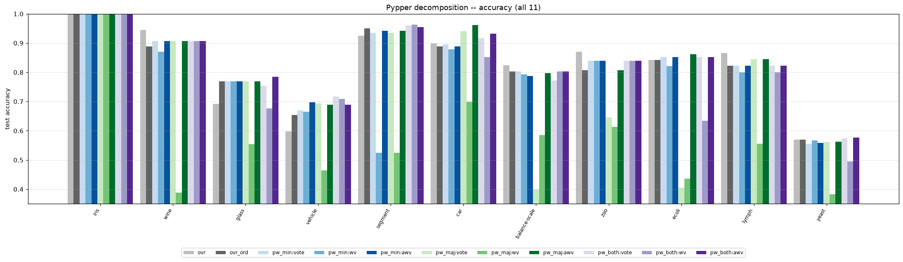
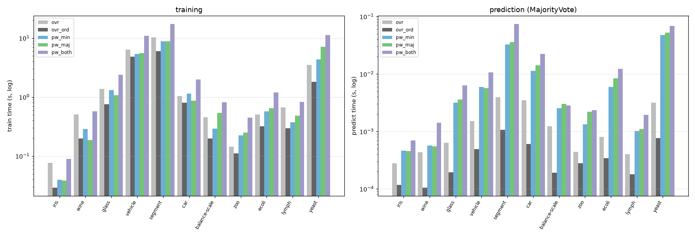
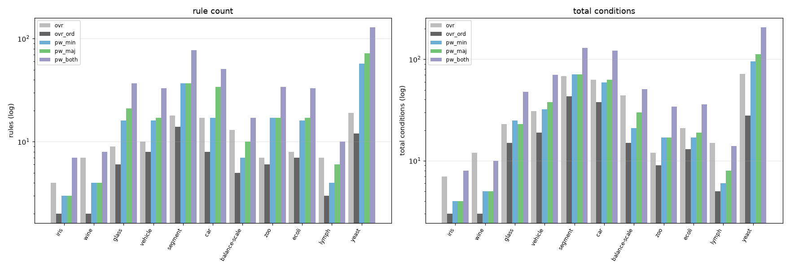

# Pairwise vs. one-vs-rest decomposition for Pypper

One inner learner (`Pypper._stage_learner()`), shared binarized features, 70/30 stratified split, seed 0. 5 fitted models; the 3 pairwise ones are each scored under `MajorityVote` (`:vote`), `WeightedVote` (`:wv`), `AccuracyWeightedVote` (`:awv`) on the *same fit* -- their `train s` is 0 (shared). `pw_min`/`pw_maj`/`pw_both` = `Pairwise(positive=)` `smaller`/`larger`/`both`.

## Excluded datasets

- **letter**: 26 classes -> hundreds of pairwise Pypper fits; pw_both alone measured ~1050s train time. Re-run with --include-large to include it.

## Accuracy -- all 11 results

| dataset | n | classes | ovr | ovr_ord | pw_min:vote | pw_min:wv | pw_min:awv | pw_maj:vote | pw_maj:wv | pw_maj:awv | pw_both:vote | pw_both:wv | pw_both:awv |
|---|--:|--:|--:|--:|--:|--:|--:|--:|--:|--:|--:|--:|--:|
| iris | 150 | 3 | 1.000 | 1.000 | 1.000 | 1.000 | 1.000 | 1.000 | 1.000 | 1.000 | 1.000 | 1.000 | 1.000 |
| wine | 178 | 3 | 0.944 | 0.889 | 0.907 | 0.870 | 0.907 | 0.907 | 0.389 | 0.907 | 0.907 | 0.907 | 0.907 |
| glass | 214 | 6 | 0.692 | 0.769 | 0.769 | 0.769 | 0.769 | 0.769 | 0.554 | 0.769 | 0.754 | 0.677 | 0.785 |
| vehicle | 846 | 4 | 0.598 | 0.654 | 0.669 | 0.665 | 0.697 | 0.693 | 0.465 | 0.689 | 0.717 | 0.709 | 0.689 |
| segment | 2310 | 7 | 0.925 | 0.951 | 0.935 | 0.525 | 0.942 | 0.935 | 0.525 | 0.942 | 0.960 | 0.962 | 0.955 |
| car | 1728 | 4 | 0.898 | 0.888 | 0.896 | 0.879 | 0.888 | 0.940 | 0.699 | 0.961 | 0.917 | 0.852 | 0.933 |
| balance-scale | 625 | 3 | 0.824 | 0.803 | 0.803 | 0.793 | 0.787 | 0.399 | 0.585 | 0.798 | 0.771 | 0.803 | 0.803 |
| zoo | 101 | 7 | 0.871 | 0.806 | 0.839 | 0.839 | 0.839 | 0.645 | 0.613 | 0.806 | 0.839 | 0.839 | 0.839 |
| ecoli | 336 | 8 | 0.842 | 0.842 | 0.851 | 0.822 | 0.851 | 0.406 | 0.436 | 0.861 | 0.851 | 0.634 | 0.851 |
| lymph | 148 | 4 | 0.867 | 0.822 | 0.822 | 0.800 | 0.822 | 0.844 | 0.556 | 0.844 | 0.822 | 0.800 | 0.822 |
| yeast | 1484 | 10 | 0.570 | 0.570 | 0.556 | 0.567 | 0.558 | 0.561 | 0.383 | 0.563 | 0.574 | 0.496 | 0.576 |

| result | datasets | mean acc | mean predict s |
|---|--:|--:|--:|
| ovr | 11 | 0.821 | 0.00 |
| ovr_ord | 11 | 0.818 | 0.00 |
| pw_min:vote | 11 | 0.823 | 0.01 |
| pw_min:wv | 11 | 0.775 | 0.07 |
| pw_min:awv | 11 | 0.824 | 0.01 |
| pw_maj:vote | 11 | 0.736 | 0.01 |
| pw_maj:wv | 11 | 0.564 | 0.08 |
| pw_maj:awv | 11 | 0.831 | 0.02 |
| pw_both:vote | 11 | 0.828 | 0.02 |
| pw_both:wv | 11 | 0.789 | 0.14 |
| pw_both:awv | 11 | 0.833 | 0.03 |

### predict time (s) -- all 11 results

| dataset | ovr | ovr_ord | pw_min:vote | pw_min:wv | pw_min:awv | pw_maj:vote | pw_maj:wv | pw_maj:awv | pw_both:vote | pw_both:wv | pw_both:awv |
|---|--:|--:|--:|--:|--:|--:|--:|--:|--:|--:|--:|
| iris | 0.00 | 0.00 | 0.00 | 0.00 | 0.00 | 0.00 | 0.00 | 0.00 | 0.00 | 0.00 | 0.00 |
| wine | 0.00 | 0.00 | 0.00 | 0.00 | 0.00 | 0.00 | 0.00 | 0.00 | 0.00 | 0.01 | 0.00 |
| glass | 0.00 | 0.00 | 0.00 | 0.01 | 0.00 | 0.00 | 0.02 | 0.00 | 0.01 | 0.04 | 0.01 |
| vehicle | 0.00 | 0.00 | 0.01 | 0.03 | 0.01 | 0.01 | 0.03 | 0.01 | 0.01 | 0.05 | 0.01 |
| segment | 0.00 | 0.00 | 0.03 | 0.26 | 0.04 | 0.04 | 0.24 | 0.05 | 0.07 | 0.49 | 0.10 |
| car | 0.00 | 0.00 | 0.01 | 0.05 | 0.01 | 0.01 | 0.10 | 0.02 | 0.02 | 0.15 | 0.02 |
| balance-scale | 0.00 | 0.00 | 0.00 | 0.01 | 0.00 | 0.00 | 0.01 | 0.00 | 0.00 | 0.02 | 0.01 |
| zoo | 0.00 | 0.00 | 0.00 | 0.01 | 0.00 | 0.00 | 0.01 | 0.00 | 0.00 | 0.01 | 0.01 |
| ecoli | 0.00 | 0.00 | 0.01 | 0.04 | 0.01 | 0.01 | 0.04 | 0.01 | 0.01 | 0.08 | 0.02 |
| lymph | 0.00 | 0.00 | 0.00 | 0.00 | 0.00 | 0.00 | 0.00 | 0.00 | 0.00 | 0.01 | 0.00 |
| yeast | 0.00 | 0.00 | 0.05 | 0.31 | 0.06 | 0.05 | 0.39 | 0.07 | 0.07 | 0.64 | 0.13 |

## Train vs. predict time (s) -- the 5 fitted models

| dataset | ovr train / pred | ovr_ord train / pred | pw_min train / pred | pw_maj train / pred | pw_both train / pred |
|---|--:|--:|--:|--:|--:|
| iris | 0.1 / 0.00 | 0.0 / 0.00 | 0.0 / 0.00 | 0.0 / 0.00 | 0.1 / 0.00 |
| wine | 0.5 / 0.00 | 0.2 / 0.00 | 0.3 / 0.00 | 0.2 / 0.00 | 0.6 / 0.00 |
| glass | 1.4 / 0.00 | 0.8 / 0.00 | 1.3 / 0.00 | 1.1 / 0.00 | 2.4 / 0.01 |
| vehicle | 6.3 / 0.00 | 4.9 / 0.00 | 5.4 / 0.01 | 5.5 / 0.01 | 11.0 / 0.01 |
| segment | 10.3 / 0.00 | 6.0 / 0.00 | 8.9 / 0.03 | 8.8 / 0.04 | 17.4 / 0.07 |
| car | 1.0 / 0.00 | 0.8 / 0.00 | 1.1 / 0.01 | 0.9 / 0.01 | 2.0 / 0.02 |
| balance-scale | 0.5 / 0.00 | 0.2 / 0.00 | 0.3 / 0.00 | 0.5 / 0.00 | 0.8 / 0.00 |
| zoo | 0.1 / 0.00 | 0.1 / 0.00 | 0.2 / 0.00 | 0.3 / 0.00 | 0.4 / 0.00 |
| ecoli | 0.5 / 0.00 | 0.3 / 0.00 | 0.6 / 0.01 | 0.6 / 0.01 | 1.2 / 0.01 |
| lymph | 0.7 / 0.00 | 0.3 / 0.00 | 0.4 / 0.00 | 0.5 / 0.00 | 0.8 / 0.00 |
| yeast | 3.5 / 0.00 | 1.8 / 0.00 | 4.3 / 0.05 | 7.1 / 0.05 | 11.3 / 0.07 |

| model | mean train s | mean predict s (vote) |
|---|--:|--:|
| ovr | 2.26 | 0.00 |
| ovr_ord | 1.39 | 0.00 |
| pw_min | 2.08 | 0.01 |
| pw_maj | 2.32 | 0.01 |
| pw_both | 4.36 | 0.02 |

*(train time for `:wv` / `:awv` is 0 -- same fit as `:vote`. `:wv` roughly doubles predict time -- it re-resolves every member's covering rules; `:awv` is as cheap as `:vote`. Per-result predict times are in the section above.)*

## Rule complexity -- the 5 fitted models

| dataset | ovr models/rules/conds | ovr_ord models/rules/conds | pw_min models/rules/conds | pw_maj models/rules/conds | pw_both models/rules/conds |
|---|--:|--:|--:|--:|--:|
| iris | 3/4/7 | 2/2/3 | 3/3/4 | 3/3/4 | 6/7/8 |
| wine | 3/7/12 | 2/2/3 | 3/4/5 | 3/4/5 | 6/8/10 |
| glass | 6/9/23 | 5/6/15 | 15/16/25 | 15/21/23 | 30/37/48 |
| vehicle | 4/10/31 | 3/8/19 | 6/16/32 | 6/17/38 | 12/33/70 |
| segment | 7/18/68 | 6/14/43 | 21/37/71 | 21/37/71 | 42/77/130 |
| car | 4/17/63 | 3/8/38 | 6/17/59 | 6/34/63 | 12/51/122 |
| balance-scale | 3/13/44 | 2/5/15 | 3/7/21 | 3/10/30 | 6/17/51 |
| zoo | 7/7/12 | 6/6/9 | 21/17/17 | 21/17/17 | 42/34/34 |
| ecoli | 8/8/21 | 7/7/13 | 28/16/17 | 28/17/19 | 56/33/36 |
| lymph | 4/7/15 | 3/3/5 | 6/4/6 | 6/6/8 | 12/10/14 |
| yeast | 10/19/72 | 9/12/28 | 45/57/95 | 45/72/112 | 90/129/207 |

| model | mean models | mean rules | mean conds |
|---|--:|--:|--:|
| ovr | 5.4 | 10.8 | 33.5 |
| ovr_ord | 4.4 | 6.6 | 17.4 |
| pw_min | 14.3 | 17.6 | 32.0 |
| pw_maj | 14.3 | 21.6 | 35.5 |
| pw_both | 28.5 | 39.6 | 66.4 |
