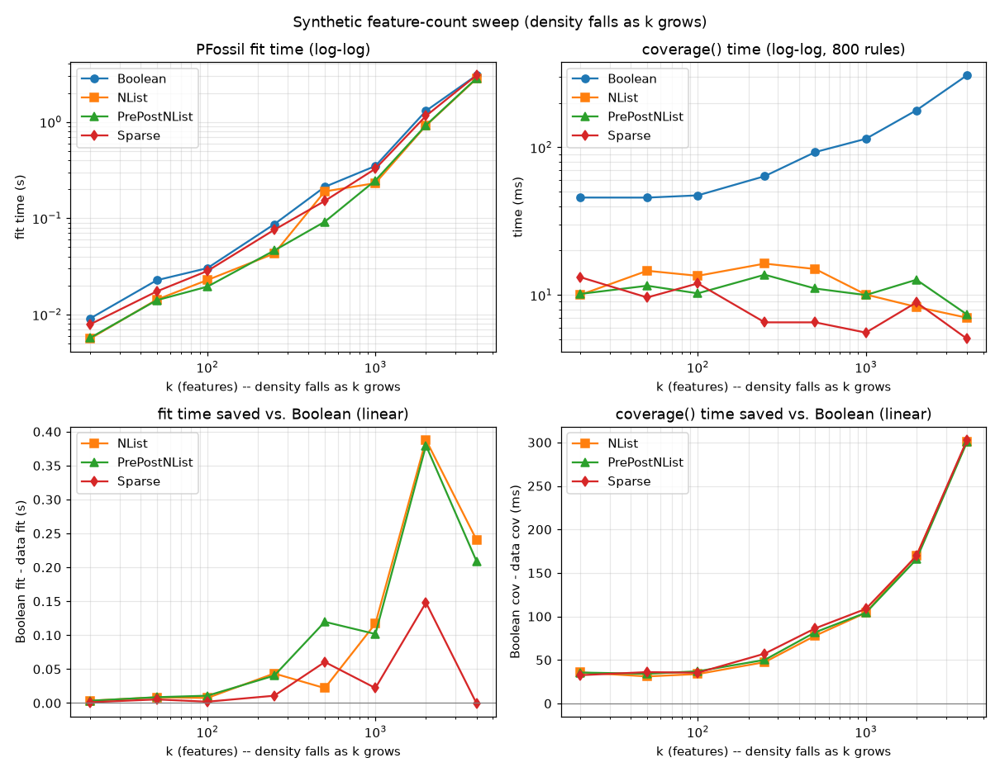
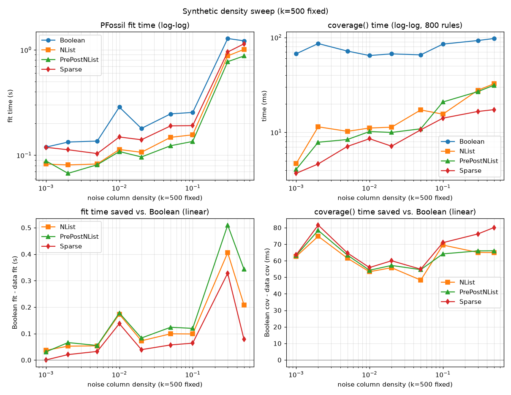

# Four `DataRepresentation` encodings -- same rules, with & without negation

Generated 2026-09-21 13:55:25. Single stratified 67/33 split, `random_state=0`. Each learner is fit on all four representations (Boolean = packed bit-matrix, NList = PPC-tree / N-list, PrePostNList = NList + pre/post visit codes on its search fast path, Sparse = scipy CSR/CSC = the N-list without the prefix tree) and the rule sets / prediction vectors are compared to the Boolean baseline exactly. Every dataset is run in two feature encodings: **with negation** (paired negation features) and **without** (positive tests only). `coverage` timing is 1000 random rules (length 1-4).

CN2 / PFoil / PFossil run everywhere; AQR / PyLORD only on vote & tic-tac-toe. PrePostNList is included to *demonstrate* it stays correct, not because it's expected to be faster here -- see `PrePostNListRepresentation`'s own docstring for why it measured out roughly break-even to slightly worse than plain NList at these data sizes.

---

## vote

### vote -- with negation

train n=291, features=96. Vertical index build: NList 81 ms (6863 tree nodes), PrePostNList 131 ms (6863 tree nodes), Sparse 26 ms (nnz=13968, density 0.50).

| learner | data | rules == | preds == | acc | fit | 1k coverage |
|---|---|---|---|---|---|---|
| CN2 | Boolean | (ref) | (ref) | 0.611 | 0.17s | 78 ms |
| CN2 | NList | yes | yes | 0.611 | 0.15s | 24 ms |
| CN2 | PrePostNList | yes | yes | 0.611 | 0.14s | 29 ms |
| CN2 | Sparse | yes | yes | 0.611 | 0.12s | 21 ms |
| PFoil | Boolean | (ref) | (ref) | 0.611 | 0.15s | 78 ms |
| PFoil | NList | yes | yes | 0.611 | 0.14s | 24 ms |
| PFoil | PrePostNList | yes | yes | 0.611 | 0.14s | 29 ms |
| PFoil | Sparse | yes | yes | 0.611 | 0.16s | 21 ms |
| PFossil | Boolean | (ref) | (ref) | 0.611 | 0.27s | 78 ms |
| PFossil | NList | yes | yes | 0.611 | 0.26s | 24 ms |
| PFossil | PrePostNList | yes | yes | 0.611 | 0.26s | 29 ms |
| PFossil | Sparse | yes | yes | 0.611 | 0.29s | 21 ms |
| AQR | Boolean | (ref) | (ref) | 0.611 | 2.73s | 78 ms |
| AQR | NList | yes | yes | 0.611 | 2.45s | 24 ms |
| AQR | PrePostNList | yes | yes | 0.611 | 2.38s | 29 ms |
| AQR | Sparse | yes | yes | 0.611 | 2.56s | 21 ms |
| PyLORD | Boolean | (ref) | (ref) | 0.944 | 3.27s | 78 ms |
| PyLORD | NList | yes | yes | 0.944 | 2.87s | 24 ms |
| PyLORD | PrePostNList | yes | yes | 0.944 | 2.97s | 29 ms |
| PyLORD | Sparse | yes | yes | 0.944 | 3.30s | 21 ms |

### vote -- without negation

train n=291, features=48. Vertical index build: NList 30 ms (2415 tree nodes), PrePostNList 35 ms (2415 tree nodes), Sparse 11 ms (nnz=4656, density 0.33).

`.without_negations()` on the negated representations matches this from-scratch build: **yes**.

| learner | data | rules == | preds == | acc | fit | 1k coverage |
|---|---|---|---|---|---|---|
| CN2 | Boolean | (ref) | (ref) | 0.611 | 0.04s | 34 ms |
| CN2 | NList | yes | yes | 0.611 | 0.04s | 15 ms |
| CN2 | PrePostNList | yes | yes | 0.611 | 0.04s | 12 ms |
| CN2 | Sparse | yes | yes | 0.611 | 0.04s | 13 ms |
| PFoil | Boolean | (ref) | (ref) | 0.611 | 0.06s | 34 ms |
| PFoil | NList | yes | yes | 0.611 | 0.07s | 15 ms |
| PFoil | PrePostNList | yes | yes | 0.611 | 0.05s | 12 ms |
| PFoil | Sparse | yes | yes | 0.611 | 0.06s | 13 ms |
| PFossil | Boolean | (ref) | (ref) | 0.611 | 0.08s | 34 ms |
| PFossil | NList | yes | yes | 0.611 | 0.09s | 15 ms |
| PFossil | PrePostNList | yes | yes | 0.611 | 0.08s | 12 ms |
| PFossil | Sparse | yes | yes | 0.611 | 0.08s | 13 ms |
| AQR | Boolean | (ref) | (ref) | 0.611 | 0.27s | 34 ms |
| AQR | NList | yes | yes | 0.611 | 0.23s | 15 ms |
| AQR | PrePostNList | yes | yes | 0.611 | 0.23s | 12 ms |
| AQR | Sparse | yes | yes | 0.611 | 0.25s | 13 ms |
| PyLORD | Boolean | (ref) | (ref) | 0.951 | 0.72s | 34 ms |
| PyLORD | NList | yes | yes | 0.951 | 0.61s | 15 ms |
| PyLORD | PrePostNList | yes | yes | 0.951 | 0.69s | 12 ms |
| PyLORD | Sparse | yes | yes | 0.951 | 0.95s | 13 ms |

*Encoding effect:* with negation 96 features (acc 0.944); without, 48 features (acc 0.951), sparse density 0.50 -> 0.33.

---

## tic-tac-toe

### tic-tac-toe -- with negation

train n=641, features=54. Vertical index build: NList 118 ms (12190 tree nodes), PrePostNList 147 ms (12190 tree nodes), Sparse 13 ms (nnz=17307, density 0.50).

| learner | data | rules == | preds == | acc | fit | 1k coverage |
|---|---|---|---|---|---|---|
| CN2 | Boolean | (ref) | (ref) | 0.981 | 0.54s | 50 ms |
| CN2 | NList | yes | yes | 0.981 | 0.55s | 19 ms |
| CN2 | PrePostNList | yes | yes | 0.981 | 0.45s | 22 ms |
| CN2 | Sparse | yes | yes | 0.981 | 0.55s | 25 ms |
| PFoil | Boolean | (ref) | (ref) | 0.890 | 0.32s | 50 ms |
| PFoil | NList | yes | yes | 0.890 | 0.26s | 19 ms |
| PFoil | PrePostNList | yes | yes | 0.890 | 0.30s | 22 ms |
| PFoil | Sparse | yes | yes | 0.890 | 0.34s | 25 ms |
| PFossil | Boolean | (ref) | (ref) | 0.830 | 0.20s | 50 ms |
| PFossil | NList | yes | yes | 0.830 | 0.20s | 19 ms |
| PFossil | PrePostNList | yes | yes | 0.830 | 0.17s | 22 ms |
| PFossil | Sparse | yes | yes | 0.830 | 0.18s | 25 ms |
| AQR | Boolean | (ref) | (ref) | 0.861 | 5.46s | 50 ms |
| AQR | NList | yes | yes | 0.861 | 4.73s | 19 ms |
| AQR | PrePostNList | yes | yes | 0.861 | 5.02s | 22 ms |
| AQR | Sparse | yes | yes | 0.861 | 5.44s | 25 ms |
| PyLORD | Boolean | (ref) | (ref) | 0.965 | 7.72s | 50 ms |
| PyLORD | NList | yes | yes | 0.965 | 5.95s | 19 ms |
| PyLORD | PrePostNList | yes | yes | 0.965 | 6.14s | 22 ms |
| PyLORD | Sparse | yes | yes | 0.965 | 7.62s | 25 ms |

### tic-tac-toe -- without negation

train n=641, features=27. Vertical index build: NList 39 ms (3249 tree nodes), PrePostNList 45 ms (3249 tree nodes), Sparse 7 ms (nnz=5769, density 0.33).

`.without_negations()` on the negated representations matches this from-scratch build: **yes**.

| learner | data | rules == | preds == | acc | fit | 1k coverage |
|---|---|---|---|---|---|---|
| CN2 | Boolean | (ref) | (ref) | 0.981 | 0.17s | 58 ms |
| CN2 | NList | yes | yes | 0.981 | 0.14s | 20 ms |
| CN2 | PrePostNList | yes | yes | 0.981 | 0.16s | 20 ms |
| CN2 | Sparse | yes | yes | 0.981 | 0.16s | 18 ms |
| PFoil | Boolean | (ref) | (ref) | 0.950 | 0.12s | 58 ms |
| PFoil | NList | yes | yes | 0.950 | 0.09s | 20 ms |
| PFoil | PrePostNList | yes | yes | 0.950 | 0.09s | 20 ms |
| PFoil | Sparse | yes | yes | 0.950 | 0.12s | 18 ms |
| PFossil | Boolean | (ref) | (ref) | 0.830 | 0.06s | 58 ms |
| PFossil | NList | yes | yes | 0.830 | 0.04s | 20 ms |
| PFossil | PrePostNList | yes | yes | 0.830 | 0.04s | 20 ms |
| PFossil | Sparse | yes | yes | 0.830 | 0.06s | 18 ms |
| AQR | Boolean | (ref) | (ref) | 0.962 | 0.21s | 58 ms |
| AQR | NList | yes | yes | 0.962 | 0.15s | 20 ms |
| AQR | PrePostNList | yes | yes | 0.962 | 0.17s | 20 ms |
| AQR | Sparse | yes | yes | 0.962 | 0.19s | 18 ms |
| PyLORD | Boolean | (ref) | (ref) | 0.972 | 2.12s | 58 ms |
| PyLORD | NList | yes | yes | 0.972 | 1.59s | 20 ms |
| PyLORD | PrePostNList | yes | yes | 0.972 | 1.52s | 20 ms |
| PyLORD | Sparse | yes | yes | 0.972 | 1.96s | 18 ms |

*Encoding effect:* with negation 54 features (acc 0.965); without, 27 features (acc 0.972), sparse density 0.50 -> 0.33.

---

## breast-w

### breast-w -- with negation

train n=468, features=178. Vertical index build: NList 228 ms (14185 tree nodes), PrePostNList 287 ms (14185 tree nodes), Sparse 60 ms (nnz=41652, density 0.50).

| learner | data | rules == | preds == | acc | fit | 1k coverage |
|---|---|---|---|---|---|---|
| CN2 | Boolean | (ref) | (ref) | 0.654 | 0.96s | 63 ms |
| CN2 | NList | yes | yes | 0.654 | 0.86s | 25 ms |
| CN2 | PrePostNList | yes | yes | 0.654 | 0.87s | 23 ms |
| CN2 | Sparse | yes | yes | 0.654 | 0.91s | 17 ms |
| PFoil | Boolean | (ref) | (ref) | 0.654 | 0.79s | 63 ms |
| PFoil | NList | yes | yes | 0.654 | 0.82s | 25 ms |
| PFoil | PrePostNList | yes | yes | 0.654 | 0.75s | 23 ms |
| PFoil | Sparse | yes | yes | 0.654 | 0.68s | 17 ms |
| PFossil | Boolean | (ref) | (ref) | 0.654 | 0.68s | 63 ms |
| PFossil | NList | yes | yes | 0.654 | 0.61s | 25 ms |
| PFossil | PrePostNList | yes | yes | 0.654 | 0.60s | 23 ms |
| PFossil | Sparse | yes | yes | 0.654 | 0.67s | 17 ms |

### breast-w -- without negation

train n=468, features=89. Vertical index build: NList 45 ms (1676 tree nodes), PrePostNList 49 ms (1676 tree nodes), Sparse 23 ms (nnz=4212, density 0.10).

`.without_negations()` on the negated representations matches this from-scratch build: **yes**.

| learner | data | rules == | preds == | acc | fit | 1k coverage |
|---|---|---|---|---|---|---|
| CN2 | Boolean | (ref) | (ref) | 0.654 | 0.45s | 49 ms |
| CN2 | NList | yes | yes | 0.654 | 0.42s | 14 ms |
| CN2 | PrePostNList | yes | yes | 0.654 | 0.49s | 13 ms |
| CN2 | Sparse | yes | yes | 0.654 | 0.48s | 9 ms |
| PFoil | Boolean | (ref) | (ref) | 0.654 | 0.23s | 49 ms |
| PFoil | NList | yes | yes | 0.654 | 0.23s | 14 ms |
| PFoil | PrePostNList | yes | yes | 0.654 | 0.20s | 13 ms |
| PFoil | Sparse | yes | yes | 0.654 | 0.21s | 9 ms |
| PFossil | Boolean | (ref) | (ref) | 0.654 | 0.18s | 49 ms |
| PFossil | NList | yes | yes | 0.654 | 0.15s | 14 ms |
| PFossil | PrePostNList | yes | yes | 0.654 | 0.16s | 13 ms |
| PFossil | Sparse | yes | yes | 0.654 | 0.15s | 9 ms |

*Encoding effect:* with negation 178 features (acc 0.654); without, 89 features (acc 0.654), sparse density 0.50 -> 0.10.

---

## diabetes

### diabetes -- with negation

train n=514, features=112. Vertical index build: NList 164 ms (13114 tree nodes), PrePostNList 211 ms (13114 tree nodes), Sparse 38 ms (nnz=28784, density 0.50).

| learner | data | rules == | preds == | acc | fit | 1k coverage |
|---|---|---|---|---|---|---|
| CN2 | Boolean | (ref) | (ref) | 0.650 | 0.81s | 60 ms |
| CN2 | NList | yes | yes | 0.650 | 0.75s | 16 ms |
| CN2 | PrePostNList | yes | yes | 0.650 | 0.73s | 16 ms |
| CN2 | Sparse | yes | yes | 0.650 | 0.88s | 14 ms |
| PFoil | Boolean | (ref) | (ref) | 0.650 | 2.33s | 60 ms |
| PFoil | NList | yes | yes | 0.650 | 2.32s | 16 ms |
| PFoil | PrePostNList | yes | yes | 0.650 | 2.31s | 16 ms |
| PFoil | Sparse | yes | yes | 0.650 | 2.35s | 14 ms |
| PFossil | Boolean | (ref) | (ref) | 0.650 | 0.71s | 60 ms |
| PFossil | NList | yes | yes | 0.650 | 0.66s | 16 ms |
| PFossil | PrePostNList | yes | yes | 0.650 | 0.61s | 16 ms |
| PFossil | Sparse | yes | yes | 0.650 | 0.60s | 14 ms |

### diabetes -- without negation

train n=514, features=56. Vertical index build: NList 46 ms (3173 tree nodes), PrePostNList 54 ms (3173 tree nodes), Sparse 26 ms (nnz=11876, density 0.41).

`.without_negations()` on the negated representations matches this from-scratch build: **yes**.

| learner | data | rules == | preds == | acc | fit | 1k coverage |
|---|---|---|---|---|---|---|
| CN2 | Boolean | (ref) | (ref) | 0.650 | 0.00s | 40 ms |
| CN2 | NList | yes | yes | 0.650 | 0.00s | 14 ms |
| CN2 | PrePostNList | yes | yes | 0.650 | 0.00s | 13 ms |
| CN2 | Sparse | yes | yes | 0.650 | 0.00s | 20 ms |
| PFoil | Boolean | (ref) | (ref) | 0.650 | 0.23s | 40 ms |
| PFoil | NList | yes | yes | 0.650 | 0.18s | 14 ms |
| PFoil | PrePostNList | yes | yes | 0.650 | 0.18s | 13 ms |
| PFoil | Sparse | yes | yes | 0.650 | 0.23s | 20 ms |
| PFossil | Boolean | (ref) | (ref) | 0.650 | 0.02s | 40 ms |
| PFossil | NList | yes | yes | 0.650 | 0.02s | 14 ms |
| PFossil | PrePostNList | yes | yes | 0.650 | 0.02s | 13 ms |
| PFossil | Sparse | yes | yes | 0.650 | 0.02s | 20 ms |

*Encoding effect:* with negation 112 features (acc 0.650); without, 56 features (acc 0.650), sparse density 0.50 -> 0.41.

---

## kr-vs-kp

### kr-vs-kp -- with negation

train n=2141, features=146. Vertical index build: NList 698 ms (51937 tree nodes), PrePostNList 790 ms (51937 tree nodes), Sparse 45 ms (nnz=156293, density 0.50).

| learner | data | rules == | preds == | acc | fit | 1k coverage |
|---|---|---|---|---|---|---|
| CN2 | Boolean | (ref) | (ref) | 0.915 | 1.08s | 131 ms |
| CN2 | NList | yes | yes | 0.915 | 0.91s | 29 ms |
| CN2 | PrePostNList | yes | yes | 0.915 | 0.89s | 29 ms |
| CN2 | Sparse | yes | yes | 0.915 | 1.13s | 39 ms |
| PFoil | Boolean | (ref) | (ref) | 0.979 | 2.81s | 131 ms |
| PFoil | NList | yes | yes | 0.979 | 2.34s | 29 ms |
| PFoil | PrePostNList | yes | yes | 0.979 | 2.37s | 29 ms |
| PFoil | Sparse | yes | yes | 0.979 | 2.62s | 39 ms |
| PFossil | Boolean | (ref) | (ref) | 0.989 | 1.15s | 131 ms |
| PFossil | NList | yes | yes | 0.989 | 1.02s | 29 ms |
| PFossil | PrePostNList | yes | yes | 0.989 | 0.99s | 29 ms |
| PFossil | Sparse | yes | yes | 0.989 | 1.17s | 39 ms |

### kr-vs-kp -- without negation

train n=2141, features=73. Vertical index build: NList 337 ms (25575 tree nodes), PrePostNList 347 ms (25575 tree nodes), Sparse 21 ms (nnz=77076, density 0.49).

`.without_negations()` on the negated representations matches this from-scratch build: **yes**.

| learner | data | rules == | preds == | acc | fit | 1k coverage |
|---|---|---|---|---|---|---|
| CN2 | Boolean | (ref) | (ref) | 0.974 | 0.94s | 109 ms |
| CN2 | NList | yes | yes | 0.974 | 0.73s | 29 ms |
| CN2 | PrePostNList | yes | yes | 0.974 | 0.68s | 30 ms |
| CN2 | Sparse | yes | yes | 0.974 | 0.92s | 36 ms |
| PFoil | Boolean | (ref) | (ref) | 0.998 | 0.96s | 109 ms |
| PFoil | NList | yes | yes | 0.998 | 0.83s | 29 ms |
| PFoil | PrePostNList | yes | yes | 0.998 | 0.75s | 30 ms |
| PFoil | Sparse | yes | yes | 0.998 | 0.96s | 36 ms |
| PFossil | Boolean | (ref) | (ref) | 0.989 | 0.40s | 109 ms |
| PFossil | NList | yes | yes | 0.989 | 0.34s | 29 ms |
| PFossil | PrePostNList | yes | yes | 0.989 | 0.32s | 30 ms |
| PFossil | Sparse | yes | yes | 0.989 | 0.39s | 36 ms |

*Encoding effect:* with negation 146 features (acc 0.989); without, 73 features (acc 0.989), sparse density 0.50 -> 0.49.

---

## mushroom

### mushroom -- with negation

train n=5443, features=232. Vertical index build: NList 2715 ms (186374 tree nodes), PrePostNList 3264 ms (186374 tree nodes), Sparse 134 ms (nnz=631388, density 0.50).

| learner | data | rules == | preds == | acc | fit | 1k coverage |
|---|---|---|---|---|---|---|
| CN2 | Boolean | (ref) | (ref) | 0.518 | 1.68s | 360 ms |
| CN2 | NList | yes | yes | 0.518 | 1.37s | 60 ms |
| CN2 | PrePostNList | yes | yes | 0.518 | 1.29s | 59 ms |
| CN2 | Sparse | yes | yes | 0.518 | 1.98s | 69 ms |
| PFoil | Boolean | (ref) | (ref) | 0.518 | 1.23s | 360 ms |
| PFoil | NList | yes | yes | 0.518 | 0.88s | 60 ms |
| PFoil | PrePostNList | yes | yes | 0.518 | 0.87s | 59 ms |
| PFoil | Sparse | yes | yes | 0.518 | 1.25s | 69 ms |
| PFossil | Boolean | (ref) | (ref) | 0.518 | 0.99s | 360 ms |
| PFossil | NList | yes | yes | 0.518 | 0.92s | 60 ms |
| PFossil | PrePostNList | yes | yes | 0.518 | 0.79s | 59 ms |
| PFossil | Sparse | yes | yes | 0.518 | 1.15s | 69 ms |

### mushroom -- without negation

train n=5443, features=116. Vertical index build: NList 330 ms (21429 tree nodes), PrePostNList 421 ms (21429 tree nodes), Sparse 59 ms (nnz=114303, density 0.18).

`.without_negations()` on the negated representations matches this from-scratch build: **yes**.

| learner | data | rules == | preds == | acc | fit | 1k coverage |
|---|---|---|---|---|---|---|
| CN2 | Boolean | (ref) | (ref) | 0.518 | 0.70s | 223 ms |
| CN2 | NList | yes | yes | 0.518 | 0.44s | 21 ms |
| CN2 | PrePostNList | yes | yes | 0.518 | 0.37s | 22 ms |
| CN2 | Sparse | yes | yes | 0.518 | 0.67s | 16 ms |
| PFoil | Boolean | (ref) | (ref) | 0.518 | 0.57s | 223 ms |
| PFoil | NList | yes | yes | 0.518 | 0.30s | 21 ms |
| PFoil | PrePostNList | yes | yes | 0.518 | 0.33s | 22 ms |
| PFoil | Sparse | yes | yes | 0.518 | 0.56s | 16 ms |
| PFossil | Boolean | (ref) | (ref) | 0.518 | 0.26s | 223 ms |
| PFossil | NList | yes | yes | 0.518 | 0.14s | 21 ms |
| PFossil | PrePostNList | yes | yes | 0.518 | 0.14s | 22 ms |
| PFossil | Sparse | yes | yes | 0.518 | 0.27s | 16 ms |

*Encoding effect:* with negation 232 features (acc 0.518); without, 116 features (acc 0.518), sparse density 0.50 -> 0.18.

---

## Summary -- average relative fit time (Boolean = 100%)

Mean of (data fit time / Boolean fit time) over every learner x dataset x encoding comparison whose Boolean fit took at least 0.02s (below that, rounding noise swamps the ratio). 100% = as fast as Boolean; under 100% is faster.

| data | with negation | without negation | overall | n |
|---|---|---|---|---|
| NList | 90% | 83% | 86% | 43 |
| PrePostNList | 87% | 80% | 84% | 43 |
| Sparse | 99% | 99% | 99% | 43 |

---

**Every data agreed with the Boolean baseline on every learner, dataset and encoding: yes.**

Fixed concept (4 signal columns, density 0.4) plus a growing number of pure-noise columns whose *own* density shrinks as more are added (`5 / n_noise`, capped at 0.5) -- so overall density falls purely as a side effect of adding columns, n=1000 fixed. Coverage timing is 800 random rules (length 1-4); fit is one PFossil fit per point, rules/predictions checked against Boolean.

**Fit-time gap vs. coverage-time gap**: the coverage-time gap (bottom right) grows cleanly and monotonically the whole way -- it isolates exactly the data-dependent computation. The fit-time gap (bottom left) does *not* stay monotonic, and goes slightly negative at the largest k -- because `k` also controls how many candidates the search itself has to score each round (`O(k)`, the same for every data), and that shared, data-agnostic cost grows right alongside the feature count. At extreme sparsity the actual coverage computation is already nearly free for everyone, so what's left is that per-candidate bookkeeping overhead -- and `NList`'s handle (`anchor_item`/`active`/`mask_words`/`ctx`) carries a bit more of it per call than Boolean's plain `(cov, scope)` pair. Not a data regression; a reminder that fit time bundles search overhead in with coverage cost, and only the latter is what these representations actually compete on.

## Synthetic feature-count sweep (density falls as k grows)

| k | density | rules == | Boolean fit | NList fit | PrePostNList fit | Sparse fit | Boolean cov | NList cov | PrePostNList cov | Sparse cov |
|---|---|---|---|---|---|---|---|---|---|---|
| 20 | 0.3231 | yes | 0.009s | 0.006s | 0.006s | 0.008s | 46 ms | 10 ms | 10 ms | 13 ms |
| 50 | 0.1336 | yes | 0.023s | 0.014s | 0.014s | 0.017s | 46 ms | 15 ms | 12 ms | 10 ms |
| 100 | 0.0658 | yes | 0.030s | 0.023s | 0.019s | 0.028s | 47 ms | 13 ms | 10 ms | 12 ms |
| 250 | 0.0262 | yes | 0.087s | 0.043s | 0.046s | 0.076s | 64 ms | 16 ms | 14 ms | 7 ms |
| 500 | 0.0132 | yes | 0.212s | 0.190s | 0.092s | 0.151s | 93 ms | 15 ms | 11 ms | 7 ms |
| 1000 | 0.0066 | yes | 0.349s | 0.231s | 0.247s | 0.326s | 114 ms | 10 ms | 10 ms | 6 ms |
| 2000 | 0.0033 | yes | 1.304s | 0.916s | 0.924s | 1.155s | 178 ms | 8 ms | 13 ms | 9 ms |
| 4000 | 0.0016 | yes | 3.052s | 2.812s | 2.843s | 3.053s | 308 ms | 7 ms | 7 ms | 5 ms |

**PFossil agreed with Boolean at every point: yes.**

---

Fixed feature count (k=500, 4 of them a fixed-density (0.4) learnable concept) with every *other* column's own density swept directly -- isolates density from feature count, unlike the feature-count sweep above where density only fell as a side effect of adding columns. n=1000 fixed. Coverage timing is 800 random rules (length 1-4); fit is one PFossil fit per point, rules/predictions checked against Boolean.

## Synthetic density sweep (k=500 fixed)

| noise density | density | rules == | Boolean fit | NList fit | PrePostNList fit | Sparse fit | Boolean cov | NList cov | PrePostNList cov | Sparse cov |
|---|---|---|---|---|---|---|---|---|---|---|
| 0.5 | 0.4995 | yes | 1.219s | 1.010s | 0.875s | 1.141s | 97 ms | 32 ms | 31 ms | 17 ms |
| 0.3 | 0.3007 | yes | 1.282s | 0.877s | 0.772s | 0.954s | 93 ms | 28 ms | 27 ms | 17 ms |
| 0.1 | 0.1027 | yes | 0.255s | 0.156s | 0.135s | 0.191s | 85 ms | 16 ms | 21 ms | 14 ms |
| 0.05 | 0.0525 | yes | 0.247s | 0.148s | 0.123s | 0.190s | 65 ms | 17 ms | 11 ms | 11 ms |
| 0.02 | 0.0228 | yes | 0.179s | 0.107s | 0.096s | 0.140s | 67 ms | 11 ms | 10 ms | 7 ms |
| 0.01 | 0.0131 | yes | 0.286s | 0.113s | 0.108s | 0.149s | 64 ms | 11 ms | 10 ms | 9 ms |
| 0.005 | 0.0082 | yes | 0.136s | 0.083s | 0.081s | 0.104s | 72 ms | 10 ms | 8 ms | 7 ms |
| 0.002 | 0.0053 | yes | 0.133s | 0.081s | 0.067s | 0.113s | 86 ms | 11 ms | 8 ms | 5 ms |
| 0.001 | 0.0043 | yes | 0.119s | 0.082s | 0.088s | 0.119s | 67 ms | 5 ms | 4 ms | 4 ms |

**PFossil agreed with Boolean at every point: yes.**

---

