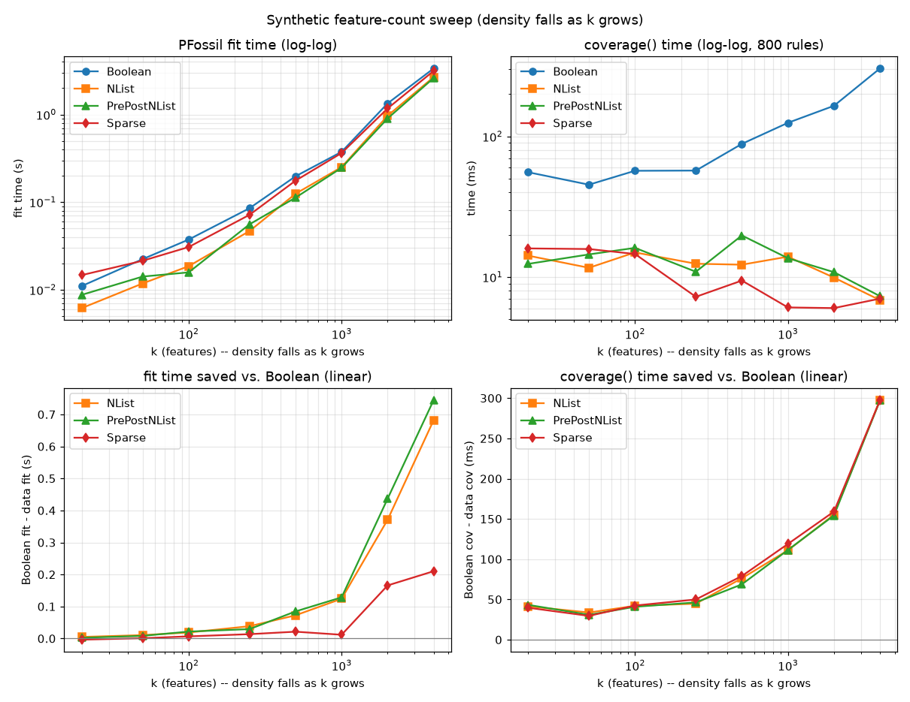
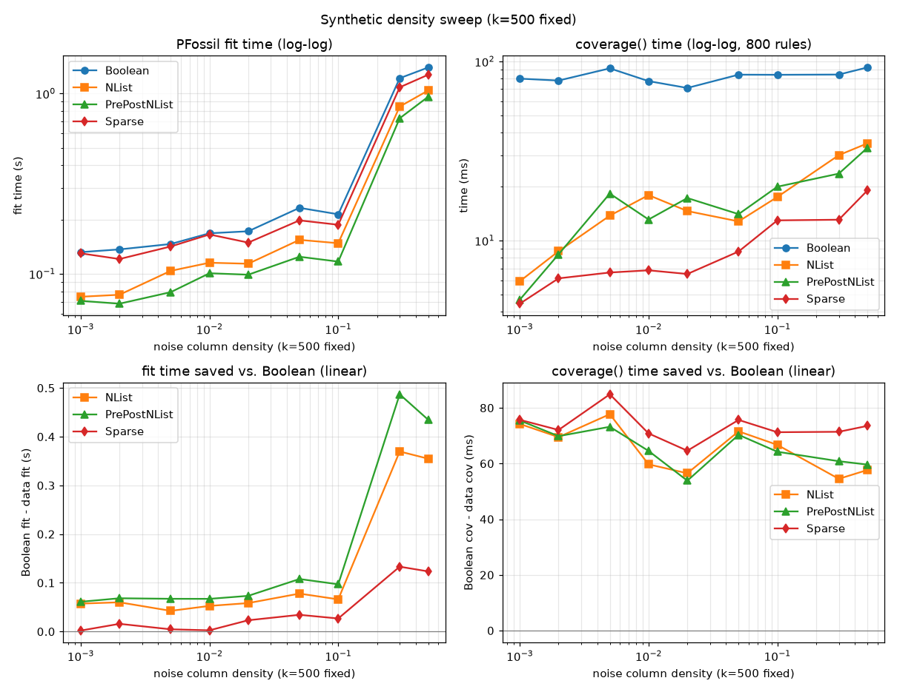

# Four `DataRepresentation` encodings -- same rules, with & without negation

Generated 2026-09-27 16:39:30. Single stratified 67/33 split, `random_state=0`. Each learner is fit on all four representations (Boolean = packed bit-matrix, NList = PPC-tree / N-list, PrePostNList = NList + pre/post visit codes on its search fast path, Sparse = scipy CSR/CSC = the N-list without the prefix tree) and the rule sets / prediction vectors are compared to the Boolean baseline exactly. Every dataset is run in two feature encodings: **with negation** (paired negation features) and **without** (positive tests only). `coverage` timing is 1000 random rules (length 1-4).

CN2 / PFoil / PFossil run everywhere; AQR / PyLORD only on vote & tic-tac-toe. PrePostNList is included to *demonstrate* it stays correct, not because it's expected to be faster here -- see `PrePostNListRepresentation`'s own docstring for why it measured out roughly break-even to slightly worse than plain NList at these data sizes.

---

## vote

### vote -- with negation

train n=291, features=96. Vertical index build: NList 49 ms (6863 tree nodes), PrePostNList 56 ms (6863 tree nodes), Sparse 12 ms (nnz=13968, density 0.50).

| learner | data | rules == | preds == | acc | fit | 1k coverage |
|---|---|---|---|---|---|---|
| CN2 | Boolean | (ref) | (ref) | 0.611 | 0.09s | 24 ms |
| CN2 | NList | yes | yes | 0.611 | 0.09s | 39 ms |
| CN2 | PrePostNList | yes | yes | 0.611 | 0.09s | 12 ms |
| CN2 | Sparse | yes | yes | 0.611 | 0.10s | 11 ms |
| PFoil | Boolean | (ref) | (ref) | 0.611 | 0.12s | 24 ms |
| PFoil | NList | yes | yes | 0.611 | 0.12s | 39 ms |
| PFoil | PrePostNList | yes | yes | 0.611 | 0.11s | 12 ms |
| PFoil | Sparse | yes | yes | 0.611 | 0.11s | 11 ms |
| PFossil | Boolean | (ref) | (ref) | 0.611 | 0.15s | 24 ms |
| PFossil | NList | yes | yes | 0.611 | 0.14s | 39 ms |
| PFossil | PrePostNList | yes | yes | 0.611 | 0.14s | 12 ms |
| PFossil | Sparse | yes | yes | 0.611 | 0.14s | 11 ms |
| AQR | Boolean | (ref) | (ref) | 0.611 | 1.67s | 24 ms |
| AQR | NList | yes | yes | 0.611 | 1.62s | 39 ms |
| AQR | PrePostNList | yes | yes | 0.611 | 1.63s | 12 ms |
| AQR | Sparse | yes | yes | 0.611 | 1.86s | 11 ms |
| PyLORD | Boolean | (ref) | (ref) | 0.944 | 2.39s | 24 ms |
| PyLORD | NList | yes | yes | 0.944 | 2.08s | 39 ms |
| PyLORD | PrePostNList | yes | yes | 0.944 | 1.94s | 12 ms |
| PyLORD | Sparse | yes | yes | 0.944 | 2.29s | 11 ms |

### vote -- without negation

train n=291, features=48. Vertical index build: NList 17 ms (2415 tree nodes), PrePostNList 68 ms (2415 tree nodes), Sparse 6 ms (nnz=4656, density 0.33).

`.without_negations()` on the negated representations matches this from-scratch build: **yes**.

| learner | data | rules == | preds == | acc | fit | 1k coverage |
|---|---|---|---|---|---|---|
| CN2 | Boolean | (ref) | (ref) | 0.611 | 0.03s | 22 ms |
| CN2 | NList | yes | yes | 0.611 | 0.03s | 10 ms |
| CN2 | PrePostNList | yes | yes | 0.611 | 0.03s | 9 ms |
| CN2 | Sparse | yes | yes | 0.611 | 0.03s | 10 ms |
| PFoil | Boolean | (ref) | (ref) | 0.611 | 0.05s | 22 ms |
| PFoil | NList | yes | yes | 0.611 | 0.05s | 10 ms |
| PFoil | PrePostNList | yes | yes | 0.611 | 0.04s | 9 ms |
| PFoil | Sparse | yes | yes | 0.611 | 0.04s | 10 ms |
| PFossil | Boolean | (ref) | (ref) | 0.611 | 0.05s | 22 ms |
| PFossil | NList | yes | yes | 0.611 | 0.05s | 10 ms |
| PFossil | PrePostNList | yes | yes | 0.611 | 0.05s | 9 ms |
| PFossil | Sparse | yes | yes | 0.611 | 0.05s | 10 ms |
| AQR | Boolean | (ref) | (ref) | 0.611 | 0.20s | 22 ms |
| AQR | NList | yes | yes | 0.611 | 0.19s | 10 ms |
| AQR | PrePostNList | yes | yes | 0.611 | 0.19s | 9 ms |
| AQR | Sparse | yes | yes | 0.611 | 0.18s | 10 ms |
| PyLORD | Boolean | (ref) | (ref) | 0.951 | 0.51s | 22 ms |
| PyLORD | NList | yes | yes | 0.951 | 0.43s | 10 ms |
| PyLORD | PrePostNList | yes | yes | 0.951 | 0.39s | 9 ms |
| PyLORD | Sparse | yes | yes | 0.951 | 0.48s | 10 ms |

*Encoding effect:* with negation 96 features (acc 0.944); without, 48 features (acc 0.951), sparse density 0.50 -> 0.33.

---

## tic-tac-toe

### tic-tac-toe -- with negation

train n=641, features=54. Vertical index build: NList 74 ms (12190 tree nodes), PrePostNList 82 ms (12190 tree nodes), Sparse 8 ms (nnz=17307, density 0.50).

| learner | data | rules == | preds == | acc | fit | 1k coverage |
|---|---|---|---|---|---|---|
| CN2 | Boolean | (ref) | (ref) | 0.981 | 0.30s | 31 ms |
| CN2 | NList | yes | yes | 0.981 | 0.27s | 11 ms |
| CN2 | PrePostNList | yes | yes | 0.981 | 0.25s | 10 ms |
| CN2 | Sparse | yes | yes | 0.981 | 0.35s | 12 ms |
| PFoil | Boolean | (ref) | (ref) | 0.890 | 0.16s | 31 ms |
| PFoil | NList | yes | yes | 0.890 | 0.16s | 11 ms |
| PFoil | PrePostNList | yes | yes | 0.890 | 0.15s | 10 ms |
| PFoil | Sparse | yes | yes | 0.890 | 0.17s | 12 ms |
| PFossil | Boolean | (ref) | (ref) | 0.830 | 0.11s | 31 ms |
| PFossil | NList | yes | yes | 0.830 | 0.09s | 11 ms |
| PFossil | PrePostNList | yes | yes | 0.830 | 0.10s | 10 ms |
| PFossil | Sparse | yes | yes | 0.830 | 0.10s | 12 ms |
| AQR | Boolean | (ref) | (ref) | 0.861 | 3.03s | 31 ms |
| AQR | NList | yes | yes | 0.861 | 2.48s | 11 ms |
| AQR | PrePostNList | yes | yes | 0.861 | 2.74s | 10 ms |
| AQR | Sparse | yes | yes | 0.861 | 3.02s | 12 ms |
| PyLORD | Boolean | (ref) | (ref) | 0.965 | 4.18s | 31 ms |
| PyLORD | NList | yes | yes | 0.965 | 3.40s | 11 ms |
| PyLORD | PrePostNList | yes | yes | 0.965 | 3.58s | 10 ms |
| PyLORD | Sparse | yes | yes | 0.965 | 4.51s | 12 ms |

### tic-tac-toe -- without negation

train n=641, features=27. Vertical index build: NList 18 ms (3249 tree nodes), PrePostNList 22 ms (3249 tree nodes), Sparse 4 ms (nnz=5769, density 0.33).

`.without_negations()` on the negated representations matches this from-scratch build: **yes**.

| learner | data | rules == | preds == | acc | fit | 1k coverage |
|---|---|---|---|---|---|---|
| CN2 | Boolean | (ref) | (ref) | 0.981 | 0.10s | 27 ms |
| CN2 | NList | yes | yes | 0.981 | 0.08s | 9 ms |
| CN2 | PrePostNList | yes | yes | 0.981 | 0.08s | 9 ms |
| CN2 | Sparse | yes | yes | 0.981 | 0.10s | 9 ms |
| PFoil | Boolean | (ref) | (ref) | 0.950 | 0.07s | 27 ms |
| PFoil | NList | yes | yes | 0.950 | 0.05s | 9 ms |
| PFoil | PrePostNList | yes | yes | 0.950 | 0.05s | 9 ms |
| PFoil | Sparse | yes | yes | 0.950 | 0.06s | 9 ms |
| PFossil | Boolean | (ref) | (ref) | 0.830 | 0.03s | 27 ms |
| PFossil | NList | yes | yes | 0.830 | 0.03s | 9 ms |
| PFossil | PrePostNList | yes | yes | 0.830 | 0.03s | 9 ms |
| PFossil | Sparse | yes | yes | 0.830 | 0.03s | 9 ms |
| AQR | Boolean | (ref) | (ref) | 0.962 | 0.11s | 27 ms |
| AQR | NList | yes | yes | 0.962 | 0.09s | 9 ms |
| AQR | PrePostNList | yes | yes | 0.962 | 0.10s | 9 ms |
| AQR | Sparse | yes | yes | 0.962 | 0.11s | 9 ms |
| PyLORD | Boolean | (ref) | (ref) | 0.972 | 1.13s | 27 ms |
| PyLORD | NList | yes | yes | 0.972 | 0.90s | 9 ms |
| PyLORD | PrePostNList | yes | yes | 0.972 | 0.86s | 9 ms |
| PyLORD | Sparse | yes | yes | 0.972 | 1.09s | 9 ms |

*Encoding effect:* with negation 54 features (acc 0.965); without, 27 features (acc 0.972), sparse density 0.50 -> 0.33.

---

## breast-w

### breast-w -- with negation

train n=468, features=178. Vertical index build: NList 120 ms (14185 tree nodes), PrePostNList 141 ms (14185 tree nodes), Sparse 34 ms (nnz=41652, density 0.50).

| learner | data | rules == | preds == | acc | fit | 1k coverage |
|---|---|---|---|---|---|---|
| CN2 | Boolean | (ref) | (ref) | 0.654 | 0.54s | 30 ms |
| CN2 | NList | yes | yes | 0.654 | 0.59s | 13 ms |
| CN2 | PrePostNList | yes | yes | 0.654 | 0.53s | 13 ms |
| CN2 | Sparse | yes | yes | 0.654 | 0.54s | 9 ms |
| PFoil | Boolean | (ref) | (ref) | 0.654 | 0.48s | 30 ms |
| PFoil | NList | yes | yes | 0.654 | 0.47s | 13 ms |
| PFoil | PrePostNList | yes | yes | 0.654 | 0.44s | 13 ms |
| PFoil | Sparse | yes | yes | 0.654 | 0.45s | 9 ms |
| PFossil | Boolean | (ref) | (ref) | 0.654 | 0.42s | 30 ms |
| PFossil | NList | yes | yes | 0.654 | 0.40s | 13 ms |
| PFossil | PrePostNList | yes | yes | 0.654 | 0.38s | 13 ms |
| PFossil | Sparse | yes | yes | 0.654 | 0.42s | 9 ms |

### breast-w -- without negation

train n=468, features=89. Vertical index build: NList 25 ms (1676 tree nodes), PrePostNList 27 ms (1676 tree nodes), Sparse 15 ms (nnz=4212, density 0.10).

`.without_negations()` on the negated representations matches this from-scratch build: **yes**.

| learner | data | rules == | preds == | acc | fit | 1k coverage |
|---|---|---|---|---|---|---|
| CN2 | Boolean | (ref) | (ref) | 0.654 | 0.29s | 25 ms |
| CN2 | NList | yes | yes | 0.654 | 0.25s | 10 ms |
| CN2 | PrePostNList | yes | yes | 0.654 | 0.26s | 9 ms |
| CN2 | Sparse | yes | yes | 0.654 | 0.26s | 6 ms |
| PFoil | Boolean | (ref) | (ref) | 0.654 | 0.14s | 25 ms |
| PFoil | NList | yes | yes | 0.654 | 0.13s | 10 ms |
| PFoil | PrePostNList | yes | yes | 0.654 | 0.13s | 9 ms |
| PFoil | Sparse | yes | yes | 0.654 | 0.13s | 6 ms |
| PFossil | Boolean | (ref) | (ref) | 0.654 | 0.11s | 25 ms |
| PFossil | NList | yes | yes | 0.654 | 0.10s | 10 ms |
| PFossil | PrePostNList | yes | yes | 0.654 | 0.09s | 9 ms |
| PFossil | Sparse | yes | yes | 0.654 | 0.10s | 6 ms |

*Encoding effect:* with negation 178 features (acc 0.654); without, 89 features (acc 0.654), sparse density 0.50 -> 0.10.

---

## diabetes

### diabetes -- with negation

train n=514, features=112. Vertical index build: NList 112 ms (12167 tree nodes), PrePostNList 129 ms (12167 tree nodes), Sparse 34 ms (nnz=28784, density 0.50).

| learner | data | rules == | preds == | acc | fit | 1k coverage |
|---|---|---|---|---|---|---|
| CN2 | Boolean | (ref) | (ref) | 0.650 | 1.04s | 40 ms |
| CN2 | NList | yes | yes | 0.650 | 0.80s | 15 ms |
| CN2 | PrePostNList | yes | yes | 0.650 | 0.80s | 16 ms |
| CN2 | Sparse | yes | yes | 0.650 | 0.95s | 14 ms |
| PFoil | Boolean | (ref) | (ref) | 0.650 | 1.36s | 40 ms |
| PFoil | NList | yes | yes | 0.650 | 1.35s | 15 ms |
| PFoil | PrePostNList | yes | yes | 0.650 | 1.32s | 16 ms |
| PFoil | Sparse | yes | yes | 0.650 | 1.36s | 14 ms |
| PFossil | Boolean | (ref) | (ref) | 0.650 | 0.44s | 40 ms |
| PFossil | NList | yes | yes | 0.650 | 0.38s | 15 ms |
| PFossil | PrePostNList | yes | yes | 0.650 | 0.38s | 16 ms |
| PFossil | Sparse | yes | yes | 0.650 | 0.44s | 14 ms |

### diabetes -- without negation

train n=514, features=56. Vertical index build: NList 47 ms (2967 tree nodes), PrePostNList 55 ms (2967 tree nodes), Sparse 21 ms (nnz=12692, density 0.44).

`.without_negations()` on the negated representations matches this from-scratch build: **yes**.

| learner | data | rules == | preds == | acc | fit | 1k coverage |
|---|---|---|---|---|---|---|
| CN2 | Boolean | (ref) | (ref) | 0.650 | 0.01s | 51 ms |
| CN2 | NList | yes | yes | 0.650 | 0.01s | 15 ms |
| CN2 | PrePostNList | yes | yes | 0.650 | 0.01s | 16 ms |
| CN2 | Sparse | yes | yes | 0.650 | 0.01s | 22 ms |
| PFoil | Boolean | (ref) | (ref) | 0.650 | 0.07s | 51 ms |
| PFoil | NList | yes | yes | 0.650 | 0.05s | 15 ms |
| PFoil | PrePostNList | yes | yes | 0.650 | 0.05s | 16 ms |
| PFoil | Sparse | yes | yes | 0.650 | 0.07s | 22 ms |
| PFossil | Boolean | (ref) | (ref) | 0.650 | 0.01s | 51 ms |
| PFossil | NList | yes | yes | 0.650 | 0.01s | 15 ms |
| PFossil | PrePostNList | yes | yes | 0.650 | 0.01s | 16 ms |
| PFossil | Sparse | yes | yes | 0.650 | 0.01s | 22 ms |

*Encoding effect:* with negation 112 features (acc 0.650); without, 56 features (acc 0.650), sparse density 0.50 -> 0.44.

---

## kr-vs-kp

### kr-vs-kp -- with negation

train n=2141, features=76. Vertical index build: NList 281 ms (26555 tree nodes), PrePostNList 355 ms (26555 tree nodes), Sparse 29 ms (nnz=81358, density 0.50).

| learner | data | rules == | preds == | acc | fit | 1k coverage |
|---|---|---|---|---|---|---|
| CN2 | Boolean | (ref) | (ref) | 0.972 | 0.64s | 116 ms |
| CN2 | NList | yes | yes | 0.972 | 0.45s | 33 ms |
| CN2 | PrePostNList | yes | yes | 0.972 | 0.43s | 28 ms |
| CN2 | Sparse | yes | yes | 0.972 | 0.70s | 46 ms |
| PFoil | Boolean | (ref) | (ref) | 0.998 | 0.96s | 116 ms |
| PFoil | NList | yes | yes | 0.998 | 1.29s | 33 ms |
| PFoil | PrePostNList | yes | yes | 0.998 | 1.17s | 28 ms |
| PFoil | Sparse | yes | yes | 0.998 | 2.18s | 46 ms |
| PFossil | Boolean | (ref) | (ref) | 0.989 | 0.80s | 116 ms |
| PFossil | NList | yes | yes | 0.989 | 0.43s | 33 ms |
| PFossil | PrePostNList | yes | yes | 0.989 | 0.64s | 28 ms |
| PFossil | Sparse | yes | yes | 0.989 | 0.95s | 46 ms |

### kr-vs-kp -- without negation

train n=2141, features=73. Vertical index build: NList 547 ms (25575 tree nodes), PrePostNList 539 ms (25575 tree nodes), Sparse 39 ms (nnz=77076, density 0.49).

`.without_negations()` on the negated representations matches this from-scratch build: **yes**.

| learner | data | rules == | preds == | acc | fit | 1k coverage |
|---|---|---|---|---|---|---|
| CN2 | Boolean | (ref) | (ref) | 0.974 | 0.74s | 96 ms |
| CN2 | NList | yes | yes | 0.974 | 0.92s | 28 ms |
| CN2 | PrePostNList | yes | yes | 0.974 | 2.40s | 31 ms |
| CN2 | Sparse | yes | yes | 0.974 | 1.70s | 40 ms |
| PFoil | Boolean | (ref) | (ref) | 0.998 | 1.62s | 96 ms |
| PFoil | NList | yes | yes | 0.998 | 1.07s | 28 ms |
| PFoil | PrePostNList | yes | yes | 0.998 | 1.08s | 31 ms |
| PFoil | Sparse | yes | yes | 0.998 | 2.19s | 40 ms |
| PFossil | Boolean | (ref) | (ref) | 0.989 | 0.45s | 96 ms |
| PFossil | NList | yes | yes | 0.989 | 0.33s | 28 ms |
| PFossil | PrePostNList | yes | yes | 0.989 | 0.25s | 31 ms |
| PFossil | Sparse | yes | yes | 0.989 | 0.38s | 40 ms |

*Encoding effect:* with negation 76 features (acc 0.989); without, 73 features (acc 0.989), sparse density 0.50 -> 0.49.

---

## mushroom

### mushroom -- with negation

train n=5443, features=222. Vertical index build: NList 3398 ms (169429 tree nodes), PrePostNList 4484 ms (169429 tree nodes), Sparse 175 ms (nnz=604173, density 0.50).

| learner | data | rules == | preds == | acc | fit | 1k coverage |
|---|---|---|---|---|---|---|
| CN2 | Boolean | (ref) | (ref) | 0.518 | 1.78s | 323 ms |
| CN2 | NList | yes | yes | 0.518 | 1.35s | 61 ms |
| CN2 | PrePostNList | yes | yes | 0.518 | 1.11s | 66 ms |
| CN2 | Sparse | yes | yes | 0.518 | 2.10s | 128 ms |
| PFoil | Boolean | (ref) | (ref) | 0.518 | 1.13s | 323 ms |
| PFoil | NList | yes | yes | 0.518 | 0.80s | 61 ms |
| PFoil | PrePostNList | yes | yes | 0.518 | 0.72s | 66 ms |
| PFoil | Sparse | yes | yes | 0.518 | 1.34s | 128 ms |
| PFossil | Boolean | (ref) | (ref) | 0.518 | 0.87s | 323 ms |
| PFossil | NList | yes | yes | 0.518 | 0.70s | 61 ms |
| PFossil | PrePostNList | yes | yes | 0.518 | 0.67s | 66 ms |
| PFossil | Sparse | yes | yes | 0.518 | 1.52s | 128 ms |

### mushroom -- without negation

train n=5443, features=116. Vertical index build: NList 343 ms (21429 tree nodes), PrePostNList 501 ms (21429 tree nodes), Sparse 70 ms (nnz=114303, density 0.18).

`.without_negations()` on the negated representations matches this from-scratch build: **yes**.

| learner | data | rules == | preds == | acc | fit | 1k coverage |
|---|---|---|---|---|---|---|
| CN2 | Boolean | (ref) | (ref) | 0.518 | 0.63s | 245 ms |
| CN2 | NList | yes | yes | 0.518 | 0.44s | 23 ms |
| CN2 | PrePostNList | yes | yes | 0.518 | 0.44s | 21 ms |
| CN2 | Sparse | yes | yes | 0.518 | 0.85s | 31 ms |
| PFoil | Boolean | (ref) | (ref) | 0.518 | 0.55s | 245 ms |
| PFoil | NList | yes | yes | 0.518 | 0.34s | 23 ms |
| PFoil | PrePostNList | yes | yes | 0.518 | 0.32s | 21 ms |
| PFoil | Sparse | yes | yes | 0.518 | 0.71s | 31 ms |
| PFossil | Boolean | (ref) | (ref) | 0.518 | 0.26s | 245 ms |
| PFossil | NList | yes | yes | 0.518 | 0.16s | 23 ms |
| PFossil | PrePostNList | yes | yes | 0.518 | 0.15s | 21 ms |
| PFossil | Sparse | yes | yes | 0.518 | 0.34s | 31 ms |

*Encoding effect:* with negation 222 features (acc 0.518); without, 116 features (acc 0.518), sparse density 0.50 -> 0.18.

---

## Summary -- average relative fit time (Boolean = 100%)

Mean of (data fit time / Boolean fit time) over every learner x dataset x encoding comparison whose Boolean fit took at least 0.02s (below that, rounding noise swamps the ratio). 100% = as fast as Boolean; under 100% is faster.

| data | with negation | without negation | overall | n |
|---|---|---|---|---|
| NList | 89% | 83% | 86% | 42 |
| PrePostNList | 87% | 91% | 89% | 42 |
| Sparse | 113% | 107% | 110% | 42 |

---

**Every data agreed with the Boolean baseline on every learner, dataset and encoding: yes.**

Fixed concept (4 signal columns, density 0.4) plus a growing number of pure-noise columns whose *own* density shrinks as more are added (`5 / n_noise`, capped at 0.5) -- so overall density falls purely as a side effect of adding columns, n=1000 fixed. Coverage timing is 800 random rules (length 1-4); fit is one PFossil fit per point, rules/predictions checked against Boolean.

**Fit-time gap vs. coverage-time gap**: the coverage-time gap (bottom right) grows cleanly and monotonically the whole way -- it isolates exactly the data-dependent computation. The fit-time gap (bottom left) does *not* stay monotonic, and goes slightly negative at the largest k -- because `k` also controls how many candidates the search itself has to score each round (`O(k)`, the same for every data), and that shared, data-agnostic cost grows right alongside the feature count. At extreme sparsity the actual coverage computation is already nearly free for everyone, so what's left is that per-candidate bookkeeping overhead -- and `NList`'s handle (`anchor_item`/`active`/`mask_words`/`ctx`) carries a bit more of it per call than Boolean's plain `(cov, scope)` pair. Not a data regression; a reminder that fit time bundles search overhead in with coverage cost, and only the latter is what these representations actually compete on.

## Synthetic feature-count sweep (density falls as k grows)

| k | density | rules == | Boolean fit | NList fit | PrePostNList fit | Sparse fit | Boolean cov | NList cov | PrePostNList cov | Sparse cov |
|---|---|---|---|---|---|---|---|---|---|---|
| 20 | 0.3231 | yes | 0.011s | 0.006s | 0.009s | 0.015s | 56 ms | 14 ms | 12 ms | 16 ms |
| 50 | 0.1336 | yes | 0.022s | 0.012s | 0.014s | 0.021s | 45 ms | 12 ms | 14 ms | 16 ms |
| 100 | 0.0658 | yes | 0.037s | 0.019s | 0.016s | 0.031s | 57 ms | 15 ms | 16 ms | 15 ms |
| 250 | 0.0262 | yes | 0.085s | 0.047s | 0.056s | 0.072s | 57 ms | 12 ms | 11 ms | 7 ms |
| 500 | 0.0132 | yes | 0.197s | 0.125s | 0.113s | 0.176s | 89 ms | 12 ms | 20 ms | 9 ms |
| 1000 | 0.0066 | yes | 0.375s | 0.251s | 0.247s | 0.363s | 125 ms | 14 ms | 14 ms | 6 ms |
| 2000 | 0.0033 | yes | 1.340s | 0.969s | 0.903s | 1.174s | 165 ms | 10 ms | 11 ms | 6 ms |
| 4000 | 0.0016 | yes | 3.358s | 2.676s | 2.613s | 3.148s | 305 ms | 7 ms | 7 ms | 7 ms |

**PFossil agreed with Boolean at every point: yes.**

---

Fixed feature count (k=500, 4 of them a fixed-density (0.4) learnable concept) with every *other* column's own density swept directly -- isolates density from feature count, unlike the feature-count sweep above where density only fell as a side effect of adding columns. n=1000 fixed. Coverage timing is 800 random rules (length 1-4); fit is one PFossil fit per point, rules/predictions checked against Boolean.

## Synthetic density sweep (k=500 fixed)

| noise density | density | rules == | Boolean fit | NList fit | PrePostNList fit | Sparse fit | Boolean cov | NList cov | PrePostNList cov | Sparse cov |
|---|---|---|---|---|---|---|---|---|---|---|
| 0.5 | 0.4995 | yes | 1.395s | 1.040s | 0.960s | 1.271s | 93 ms | 35 ms | 33 ms | 19 ms |
| 0.3 | 0.3007 | yes | 1.216s | 0.846s | 0.729s | 1.083s | 84 ms | 30 ms | 24 ms | 13 ms |
| 0.1 | 0.1027 | yes | 0.214s | 0.148s | 0.117s | 0.187s | 84 ms | 18 ms | 20 ms | 13 ms |
| 0.05 | 0.0525 | yes | 0.232s | 0.154s | 0.124s | 0.198s | 84 ms | 13 ms | 14 ms | 9 ms |
| 0.02 | 0.0228 | yes | 0.172s | 0.114s | 0.099s | 0.149s | 71 ms | 15 ms | 17 ms | 7 ms |
| 0.01 | 0.0131 | yes | 0.168s | 0.115s | 0.101s | 0.165s | 78 ms | 18 ms | 13 ms | 7 ms |
| 0.005 | 0.0082 | yes | 0.146s | 0.104s | 0.079s | 0.142s | 91 ms | 14 ms | 18 ms | 7 ms |
| 0.002 | 0.0053 | yes | 0.137s | 0.077s | 0.068s | 0.121s | 78 ms | 9 ms | 8 ms | 6 ms |
| 0.001 | 0.0043 | yes | 0.132s | 0.075s | 0.071s | 0.130s | 80 ms | 6 ms | 5 ms | 4 ms |

**PFossil agreed with Boolean at every point: yes.**

---

