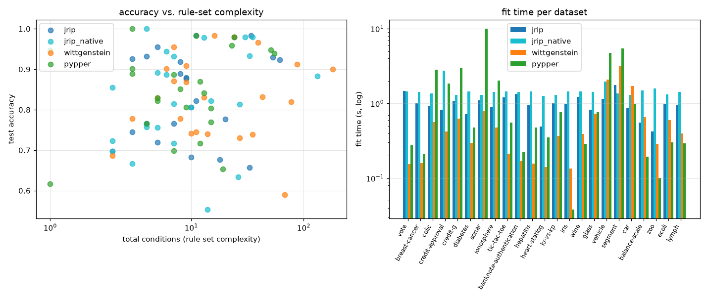

# RIPPER comparison: jrip / jrip_native / wittgenstein / pypper

`jrip`, `wittgenstein` and `pypper` share one binarized feature set (`build_dataspec` + `binarize`, one DataSpec per dataset); `jrip_native` is the same Weka JRip run on the raw columns instead (its own discretization). 70/30 stratified split, seed 0, datasets capped at 1600 rows. wittgenstein on multi-class = manual one-vs-rest (one fit per class, rules pooled). `bin.feat` is the shared binary feature count -- not what `jrip_native` used.

| dataset | n | bin.feat | classes | algo | acc | rules | conds | conds/rule | fit s |
|---|--:|--:|--:|---|--:|--:|--:|--:|--:|
| vote | 435 | 96 | 2 | jrip | 0.931 | 2 | 4 | 2.0 | 1.5 |
| vote | 435 | 96 | 2 | jrip_native | 0.931 | 3 | 7 | 2.3 | 1.4 |
| vote | 435 | 96 | 2 | wittgenstein | 0.908 | 3 | 9 | 3.0 | 0.2 |
| vote | 435 | 96 | 2 | pypper | 0.947 | 1 | 1 | 1.0 | 0.3 |
| breast-cancer | 286 | 78 | 2 | jrip | 0.698 | 1 | 2 | 2.0 | 1.0 |
| breast-cancer | 286 | 78 | 2 | jrip_native | 0.698 | 1 | 2 | 2.0 | 1.4 |
| breast-cancer | 286 | 78 | 2 | wittgenstein | 0.686 | 1 | 2 | 2.0 | 0.2 |
| breast-cancer | 286 | 78 | 2 | pypper | 0.616 | 1 | 1 | 1.0 | 0.2 |
| colic | 368 | 340 | 2 | jrip | 0.919 | 4 | 8 | 2.0 | 0.9 |
| colic | 368 | 340 | 2 | jrip_native | 0.892 | 3 | 5 | 1.7 | 1.4 |
| colic | 368 | 340 | 2 | wittgenstein | 0.901 | 3 | 6 | 2.0 | 0.6 |
| colic | 368 | 340 | 2 | pypper | 0.901 | 2 | 3 | 1.5 | 2.8 |
| credit-approval | 690 | 144 | 2 | jrip | 0.879 | 4 | 9 | 2.2 | 0.8 |
| credit-approval | 690 | 144 | 2 | jrip_native | 0.855 | 2 | 2 | 1.0 | 2.8 |
| credit-approval | 690 | 144 | 2 | wittgenstein | 0.831 | 5 | 13 | 2.6 | 0.4 |
| credit-approval | 690 | 144 | 2 | pypper | 0.870 | 5 | 12 | 2.4 | 1.9 |
| credit-g | 1000 | 154 | 2 | jrip | 0.720 | 2 | 5 | 2.5 | 1.1 |
| credit-g | 1000 | 154 | 2 | jrip_native | 0.717 | 4 | 7 | 1.8 | 1.3 |
| credit-g | 1000 | 154 | 2 | wittgenstein | 0.730 | 6 | 27 | 4.5 | 0.6 |
| credit-g | 1000 | 154 | 2 | pypper | 0.717 | 3 | 12 | 4.0 | 2.9 |
| diabetes | 768 | 80 | 2 | jrip | 0.766 | 2 | 4 | 2.0 | 0.7 |
| diabetes | 768 | 80 | 2 | jrip_native | 0.758 | 2 | 4 | 2.0 | 1.5 |
| diabetes | 768 | 80 | 2 | wittgenstein | 0.745 | 3 | 11 | 3.7 | 0.3 |
| diabetes | 768 | 80 | 2 | pypper | 0.766 | 2 | 4 | 2.0 | 0.5 |
| sonar | 208 | 600 | 2 | jrip | 0.683 | 4 | 10 | 2.5 | 1.1 |
| sonar | 208 | 600 | 2 | jrip_native | 0.667 | 2 | 3 | 1.5 | 1.3 |
| sonar | 208 | 600 | 2 | wittgenstein | 0.778 | 2 | 3 | 1.5 | 0.8 |
| sonar | 208 | 600 | 2 | pypper | 0.698 | 3 | 7 | 2.3 | 10.0 |
| ionosphere | 351 | 322 | 2 | jrip | 0.877 | 6 | 9 | 1.5 | 0.9 |
| ionosphere | 351 | 322 | 2 | jrip_native | 0.887 | 4 | 6 | 1.5 | 1.4 |
| ionosphere | 351 | 322 | 2 | wittgenstein | 0.868 | 6 | 9 | 1.5 | 0.5 |
| ionosphere | 351 | 322 | 2 | pypper | 0.887 | 4 | 7 | 1.8 | 2.0 |
| tic-tac-toe | 958 | 54 | 2 | jrip | 0.979 | 8 | 24 | 3.0 | 1.2 |
| tic-tac-toe | 958 | 54 | 2 | jrip_native | 0.979 | 10 | 35 | 3.5 | 1.4 |
| tic-tac-toe | 958 | 54 | 2 | wittgenstein | 0.979 | 8 | 24 | 3.0 | 0.2 |
| tic-tac-toe | 958 | 54 | 2 | pypper | 0.979 | 8 | 24 | 3.0 | 0.6 |
| banknote-authentication | 1372 | 40 | 2 | jrip | 0.983 | 5 | 11 | 2.2 | 1.3 |
| banknote-authentication | 1372 | 40 | 2 | jrip_native | 0.978 | 6 | 13 | 2.2 | 1.4 |
| banknote-authentication | 1372 | 40 | 2 | wittgenstein | 0.983 | 6 | 16 | 2.7 | 0.2 |
| banknote-authentication | 1372 | 40 | 2 | pypper | 0.983 | 5 | 11 | 2.2 | 0.2 |
| hepatitis | 155 | 126 | 2 | jrip | 0.745 | 2 | 3 | 1.5 | 1.0 |
| hepatitis | 155 | 126 | 2 | jrip_native | 0.723 | 1 | 2 | 2.0 | 1.4 |
| hepatitis | 155 | 126 | 2 | wittgenstein | 0.830 | 3 | 5 | 1.7 | 0.2 |
| hepatitis | 155 | 126 | 2 | pypper | 0.830 | 3 | 5 | 1.7 | 0.5 |
| heart-statlog | 270 | 80 | 2 | jrip | 0.765 | 3 | 7 | 2.3 | 0.5 |
| heart-statlog | 270 | 80 | 2 | jrip_native | 0.815 | 3 | 7 | 2.3 | 1.3 |
| heart-statlog | 270 | 80 | 2 | wittgenstein | 0.741 | 5 | 14 | 2.8 | 0.1 |
| heart-statlog | 270 | 80 | 2 | pypper | 0.852 | 3 | 8 | 2.7 | 0.4 |
| kr-vs-kp | 1600 | 76 | 2 | jrip | 0.983 | 12 | 34 | 2.8 | 1.0 |
| kr-vs-kp | 1600 | 76 | 2 | jrip_native | 0.979 | 11 | 30 | 2.7 | 1.3 |
| kr-vs-kp | 1600 | 76 | 2 | wittgenstein | 0.967 | 14 | 39 | 2.8 | 0.4 |
| kr-vs-kp | 1600 | 76 | 2 | pypper | 0.958 | 7 | 23 | 3.3 | 0.8 |
| iris | 150 | 40 | 3 | jrip | 0.956 | 3 | 5 | 1.7 | 1.0 |
| iris | 150 | 40 | 3 | jrip_native | 1.000 | 2 | 4 | 2.0 | 1.4 |
| iris | 150 | 40 | 3 | wittgenstein | 0.956 | 5 | 7 | 1.4 | 0.1 |
| iris | 150 | 40 | 3 | pypper | 1.000 | 2 | 3 | 1.5 | 0.0 |
| wine | 178 | 130 | 3 | jrip | 0.926 | 2 | 3 | 1.5 | 1.2 |
| wine | 178 | 130 | 3 | jrip_native | 0.944 | 3 | 6 | 2.0 | 1.4 |
| wine | 178 | 130 | 3 | wittgenstein | 0.870 | 5 | 7 | 1.4 | 0.4 |
| wine | 178 | 130 | 3 | pypper | 0.889 | 2 | 3 | 1.5 | 0.3 |
| glass | 214 | 90 | 6 | jrip | 0.677 | 6 | 18 | 3.0 | 0.8 |
| glass | 214 | 90 | 6 | jrip_native | 0.554 | 6 | 14 | 2.3 | 1.4 |
| glass | 214 | 90 | 6 | wittgenstein | 0.738 | 14 | 35 | 2.5 | 0.7 |
| glass | 214 | 90 | 6 | pypper | 0.769 | 6 | 15 | 2.5 | 0.8 |
| vehicle | 846 | 180 | 4 | jrip | 0.657 | 12 | 33 | 2.8 | 1.2 |
| vehicle | 846 | 180 | 4 | jrip_native | 0.634 | 11 | 26 | 2.4 | 2.0 |
| vehicle | 846 | 180 | 4 | wittgenstein | 0.591 | 20 | 68 | 3.4 | 2.1 |
| vehicle | 846 | 180 | 4 | pypper | 0.654 | 8 | 19 | 2.4 | 4.7 |
| segment | 1600 | 168 | 7 | jrip | 0.929 | 17 | 53 | 3.1 | 1.8 |
| segment | 1600 | 168 | 7 | jrip_native | 0.933 | 14 | 33 | 2.4 | 1.4 |
| segment | 1600 | 168 | 7 | wittgenstein | 0.912 | 27 | 87 | 3.2 | 3.2 |
| segment | 1600 | 168 | 7 | pypper | 0.948 | 16 | 51 | 3.2 | 5.4 |
| car | 1600 | 42 | 4 | jrip | 0.923 | 13 | 61 | 4.7 | 0.9 |
| car | 1600 | 42 | 4 | jrip_native | 0.883 | 35 | 132 | 3.8 | 1.3 |
| car | 1600 | 42 | 4 | wittgenstein | 0.900 | 39 | 181 | 4.6 | 1.7 |
| car | 1600 | 42 | 4 | pypper | 0.940 | 12 | 55 | 4.6 | 1.0 |
| balance-scale | 625 | 32 | 3 | jrip | 0.777 | 6 | 20 | 3.3 | 0.6 |
| balance-scale | 625 | 32 | 3 | jrip_native | 0.814 | 9 | 27 | 3.0 | 1.5 |
| balance-scale | 625 | 32 | 3 | wittgenstein | 0.819 | 24 | 77 | 3.2 | 0.7 |
| balance-scale | 625 | 32 | 3 | pypper | 0.803 | 5 | 15 | 3.0 | 0.2 |
| zoo | 101 | 40 | 7 | jrip | 0.806 | 6 | 10 | 1.7 | 0.4 |
| zoo | 101 | 40 | 7 | jrip_native | 0.806 | 6 | 10 | 1.7 | 1.6 |
| zoo | 101 | 40 | 7 | wittgenstein | 0.742 | 7 | 10 | 1.4 | 0.3 |
| zoo | 101 | 40 | 7 | pypper | 0.806 | 6 | 9 | 1.5 | 0.1 |
| ecoli | 336 | 54 | 8 | jrip | 0.822 | 7 | 11 | 1.6 | 1.0 |
| ecoli | 336 | 54 | 8 | jrip_native | 0.822 | 8 | 15 | 1.9 | 1.3 |
| ecoli | 336 | 54 | 8 | wittgenstein | 0.832 | 16 | 43 | 2.7 | 0.6 |
| ecoli | 336 | 54 | 8 | pypper | 0.842 | 7 | 13 | 1.9 | 0.3 |
| lymph | 148 | 90 | 4 | jrip | 0.889 | 3 | 8 | 2.7 | 0.9 |
| lymph | 148 | 90 | 4 | jrip_native | 0.756 | 3 | 5 | 1.7 | 1.4 |
| lymph | 148 | 90 | 4 | wittgenstein | 0.778 | 5 | 8 | 1.6 | 0.4 |
| lymph | 148 | 90 | 4 | pypper | 0.822 | 3 | 5 | 1.7 | 0.3 |

## Means (successful fits only)

| algo | datasets | mean acc | mean rules | mean conds | mean conds/rule | mean fit s |
|---|--:|--:|--:|--:|--:|--:|
| jrip | 23 | 0.839 | 5.7 | 15.3 | 2.37 | 0.99 |
| jrip_native | 23 | 0.827 | 6.5 | 17.2 | 2.15 | 1.48 |
| wittgenstein | 23 | 0.830 | 9.9 | 30.5 | 2.57 | 0.64 |
| pypper | 23 | 0.847 | 5.0 | 13.3 | 2.28 | 1.57 |

## Mean accuracy by target type

| algo | binary | multi-class |
|---|--:|--:|
| jrip | 0.841 | 0.836 |
| jrip_native | 0.837 | 0.815 |
| wittgenstein | 0.842 | 0.814 |
| pypper | 0.846 | 0.847 |
