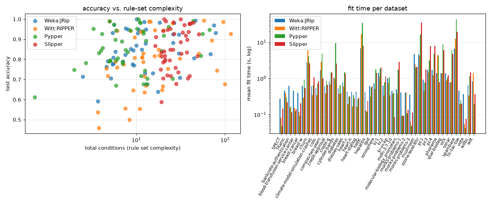
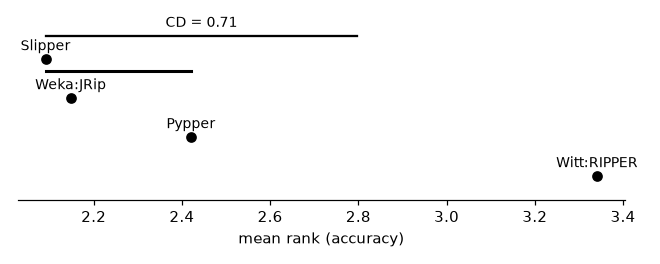

# RIPPER-family comparison: Weka:JRip / Witt:RIPPER / Pypper / Slipper

## Setup

Four RIPPER-family rule learners -- Weka:JRip, Witt:RIPPER,
Pypper, Slipper -- compared on 44 binary datasets from
`pyrulearn.experiments.catalog`
(default: 'binary,small,medium'; `--datasets` overrides the selection,
e.g. 'small,medium' or 'all' -- see the module docstring for what those add).

A fifth, IMod:Slipper (`imodels`' SlipperClassifier), is checked
separately first against the native Slipper on a handful of small,
low-feature-count datasets, then left out of the main comparison below --
see "Why IMod:Slipper isn't in the main comparison". Across 4 datasets (3-fold), IMod:Slipper was no more accurate than Slipper (mean accuracy 0.690 vs. 0.804) while taking 14x as long per fit (3.27s vs. 0.23s, mean) -- not worth its cost at the scale of the main comparison below.

Protocol: `10`-fold stratified cross-validation
(`pyrulearn.experiments.runner.run_cv`), one `DataSpec` per training fold
(`build_dataspec(max_intervals=6)`), the test fold binarized
against that same `DataSpec` -- every learner sees the identical
Boolean feature matrix per fold, so differences reflect the algorithms,
not the data preparation. Each fit is capped at 180s; a
timeout or an exception is recorded as a failure, not fatal to the run.

Measures: test accuracy, rule count, total condition count, fit time
(seconds, JVM startup included for Weka:JRip). Witt:RIPPER auto-dispatches
one-vs-rest for multi-class (see the module docstring); every other
learner handles multi-class natively.

## Why IMod:Slipper isn't in the main comparison

Across 4 datasets (3-fold), IMod:Slipper was no more accurate than Slipper (mean accuracy 0.690 vs. 0.804) while taking 14x as long per fit (3.27s vs. 0.23s, mean) -- not worth its cost at the scale of the main comparison below.

| learner | accuracy | fit_time |
|---|---|---|
| IMod:Slipper | 0.690 | 3.271 |
| Slipper | 0.804 | 0.233 |
| overall | 0.747 | 1.752 |

## Per-dataset results (mean across folds)

| dataset | accuracy | n_rules | n_conditions | conds_per_rule | fit_time |
|---|---|---|---|---|---|
| SPECT | 0.803 | 3.700 | 13.675 | 5.329 | 0.139 |
| Titanic | 0.782 | 6.125 | 14.700 | 2.397 | 0.346 |
| banknote-authentication | 0.986 | 7.125 | 15.925 | 2.297 | 0.267 |
| blood-transfusion-service-center | 0.754 | 4.825 | 9.800 | 2.348 | 0.220 |
| breast-cancer | 0.680 | 4.425 | 7.625 | 2.056 | 0.206 |
| breast-w | 0.943 | 7.150 | 13.375 | 2.150 | 0.601 |
| churn | 0.914 | 11.400 | 39.375 | 3.435 | 3.904 |
| climate-model-simulation-crashes | 0.941 | 5.475 | 14.625 | 2.990 | 0.673 |
| colic | 0.832 | 5.875 | 11.525 | 2.264 | 0.610 |
| compas-two-years | 0.670 | 6.800 | 18.175 | 2.821 | 2.626 |
| credit-approval | 0.846 | 6.700 | 14.700 | 2.229 | 0.629 |
| credit-g | 0.725 | 6.075 | 17.200 | 3.553 | 1.130 |
| cylinder-bands | 0.664 | 8.325 | 15.850 | 2.365 | 3.531 |
| diabetes | 0.725 | 6.650 | 18.125 | 2.981 | 0.488 |
| dresses-sales | 0.562 | 5.175 | 6.975 | 1.812 | 1.056 |
| heart-c | 0.796 | 5.900 | 11.975 | 2.292 | 0.316 |
| heart-h | 0.717 | 5.700 | 10.525 | 2.116 | 0.308 |
| heart-statlog | 0.810 | 5.700 | 10.575 | 2.164 | 0.290 |
| heloc | 0.699 | 11.325 | 48.675 | 4.082 | 16.763 |
| hepatitis | 0.793 | 4.875 | 8.425 | 1.837 | 0.229 |
| ilpd | 0.662 | 4.625 | 10.775 | 2.849 | 0.534 |
| ionosphere | 0.897 | 7.425 | 10.525 | 1.490 | 1.118 |
| kc1 | 0.774 | 5.350 | 13.975 | 3.113 | 1.619 |
| kc2 | 0.819 | 4.975 | 8.775 | 2.116 | 0.733 |
| kr-vs-kp | 0.988 | 15.075 | 46.925 | 3.103 | 0.794 |
| mofn-3-7-10 | 0.971 | 15.750 | 69.775 | 4.351 | 0.326 |
| molecular-biology_promoters | 0.807 | 4.850 | 7.525 | 1.810 | 1.386 |
| monks-problems-1 | 0.957 | 6.175 | 17.100 | 2.737 | 0.173 |
| monks-problems-2 | 0.764 | 9.250 | 37.100 | 4.433 | 0.267 |
| monks-problems-3 | 0.989 | 4.850 | 9.125 | 1.767 | 0.146 |
| mushroom | 0.997 | 7.150 | 13.800 | 1.933 | 2.872 |
| ozone-level-8hr | 0.902 | 7.100 | 23.200 | 3.561 | 15.221 |
| pc1 | 0.875 | 4.700 | 10.250 | 2.526 | 0.987 |
| pc3 | 0.831 | 5.400 | 16.025 | 3.477 | 3.576 |
| pc4 | 0.875 | 6.450 | 22.075 | 3.625 | 3.996 |
| phoneme | 0.801 | 13.250 | 63.050 | 4.793 | 2.752 |
| qsar-biodeg | 0.827 | 9.250 | 29.400 | 3.389 | 4.500 |
| sick | 0.940 | 7.375 | 21.925 | 3.016 | 1.141 |
| sonar | 0.768 | 6.600 | 10.600 | 1.902 | 3.109 |
| spambase | 0.928 | 17.150 | 75.300 | 4.312 | 20.885 |
| tic-tac-toe | 0.977 | 9.825 | 29.825 | 3.049 | 0.280 |
| vote | 0.949 | 4.675 | 9.900 | 2.002 | 0.137 |
| wdbc | 0.945 | 6.825 | 13.800 | 2.155 | 0.901 |
| wilt | 0.965 | 6.200 | 16.600 | 2.607 | 0.701 |
| overall | 0.838 | 7.264 | 20.663 | 2.805 | 2.329 |

## Mean ranks (accuracy, failures tied for last)

| learner | mean rank |
|---|--:|
| Slipper | 2.09 |
| Weka:JRip | 2.15 |
| Pypper | 2.42 |
| Witt:RIPPER | 3.34 |

